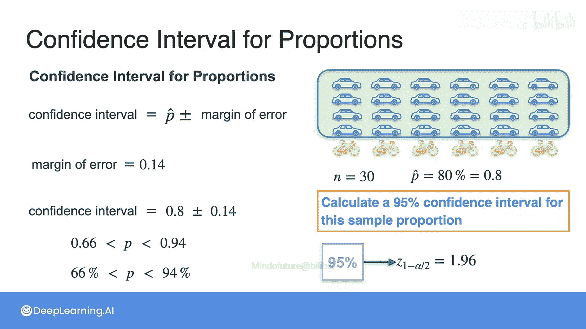

# 086：比例的置信区间 📊

在本节课中，我们将要学习如何为**比例**构建置信区间。上一节我们介绍了如何为样本均值计算置信区间，本节中我们来看看当数据是比例（例如，拥有某物的人数比例）时，方法有何不同。

## 从均值到比例

上一节我们学习了在已知样本均值的情况下如何计算置信区间。那时我们处理的是像人口平均身高这样的连续数值。其置信区间公式为：

**样本均值 ± 边际误差**

其中，边际误差 = **z值 × (标准差 / √样本量)**。

现在，我们的问题变成了估计一个**比例**。例如，我们想了解Statopia地区成年人拥有汽车的比例。

## 比例问题的示例

假设我们进行了一项抽样调查。

以下是具体步骤：
1.  我们抽取了30人作为样本（n = 30）。
2.  调查发现，其中24人拥有汽车（x = 24）。
3.  因此，样本比例 **P̂** = 24 / 30 = 0.8 或 80%。

这个80%是我们的样本比例，但它很可能不是真实的总体比例。我们需要围绕这个点估计构建一个置信区间。

## 比例的置信区间公式

与均值的置信区间类似，比例的置信区间也由点估计加减一个边际误差构成。

其通用公式为：
**置信区间 = P̂ ± 边际误差**

关键的区别在于**边际误差的计算方法**。对于比例，边际误差的公式是：

**边际误差 = 临界值 × √[ P̂ × (1 - P̂) / n ]**

*   **P̂**：样本比例
*   **n**：样本量
*   **临界值**：取决于所选的置信水平（如95%对应1.96）

这个公式中的 **√[ P̂ × (1 - P̂) / n ]** 被称为**比例的标准误差**，它类似于均值分布中的 **σ / √n**，衡量的是样本比例估计的波动性。

## 计算示例：汽车拥有率的95%置信区间

让我们将公式应用到之前的例子中。我们已经知道：
*   样本比例 **P̂ = 0.8**
*   样本量 **n = 30**
*   对于95%的置信水平，**临界值 = 1.96**

现在，计算边际误差：

1.  计算标准误差部分：P̂ × (1 - P̂) = 0.8 × 0.2 = 0.16
2.  除以n：0.16 / 30 ≈ 0.00533
3.  取平方根：√0.00533 ≈ 0.073
4.  乘以临界值：边际误差 = 1.96 × 0.073 ≈ **0.143**

因此，95%的置信区间为：
**0.8 ± 0.143**

这表示区间从 **0.657** 到 **0.943**。

## 结果解读

我们可以这样得出结论：我们有95%的信心认为，Statopia地区成年人拥有汽车的**真实总体比例**在65.7%到94.3%之间。

## 总结

本节课中我们一起学习了如何为**样本比例**构建置信区间。核心要点是，比例的置信区间公式为 **P̂ ± z* × √[P̂(1-P̂)/n]**，其中标准误差的计算与均值情况不同。通过计算，我们可以得到一个范围，并以特定的置信水平（如95%）断言总体比例落在这个范围内。