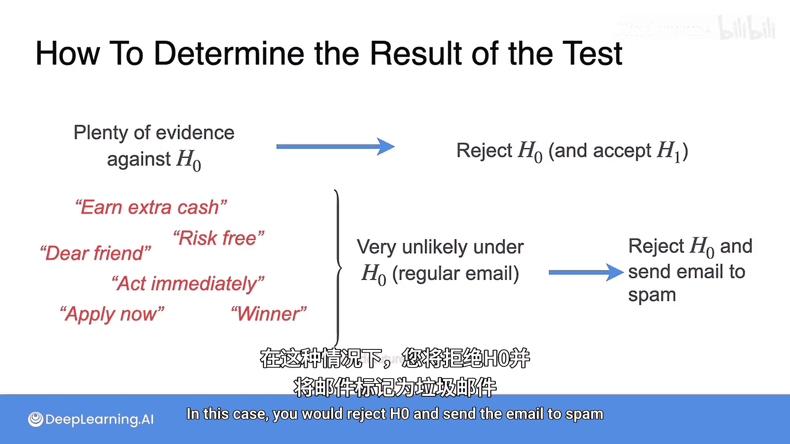

# 087：假设检验与A/B测试 🧪

在本节课中，我们将学习假设检验的基本概念。这是一种用于判断关于总体的某个信念（假设）是否可能为真的统计方法。随后，我们将探讨假设检验的一个重要应用——A/B测试。

## 假设检验简介

上一节我们介绍了概率分布，本节中我们来看看如何利用数据对假设进行检验。假设检验是一种方法，用于判断你对总体的某个信念（假设）是可能为真还是为假。

为了理解假设检验，让我们从一个简单的例子开始。

假设你有一个垃圾邮件检测器，它的功能是判断一封给定的电子邮件是正常邮件（Ham）还是垃圾邮件（Spam）。默认情况下，我们假设所有邮件都是正常邮件。这样做的原因是，误删一封好邮件比不小心让一封垃圾邮件进入收件箱的后果要严重得多。

我们的基础假设是“邮件是正常邮件”，这被称为**原假设**。原假设是我们安全地假设“没有特殊情况发生”时的基准。

原假设记作 **H₀**。

然后我们有一个**备择假设**，记作 **H₁**。这是我们试图去识别或证明的特殊情况。在原假设和备择假设中，一个重要的特性是它们必须互斥，因为一封邮件不可能同时是正常邮件和垃圾邮件。

此外，这些假设必须能得出“真”或“假”的答案。设计一组好的假设的关键在于，需要有大量证据表明邮件是垃圾邮件时，我们才能拒绝原假设，并接受备择假设（即邮件是垃圾邮件）为真。

但反过来则不成立：如果收集到的证据不足以证明邮件是垃圾邮件，那么你不能拒绝原假设。然而，这并不意味着邮件就是正常邮件，仅仅说明我们没有足够的证据证明它是垃圾邮件。

## 如何提出假设

通常，你需要提出你的假设。原假设是基准，备择假设则代表与之竞争的陈述。由于结论的不对称性，备择假设通常是你真正感兴趣并希望证明的那个。

假设检验的目标是基于数据和证据，在两个假设之间做出决定。在垃圾邮件的例子中，证据可能来自发件人、附件、邮件大小、特定关键词等任何可以用来证明邮件是垃圾邮件的信息。

直观地说，在进行假设检验时，如果你的样本提供了大量反对H₀的证据，那么你将拒绝原假设，从而接受备择假设。

## 一个具体例子

在这种情况下，你的证据将基于邮件中的不同词语或短语。假设你收到一封包含以下短语的邮件：“轻松赚外快”、“无风险”、“亲爱的朋友”、“立即行动”、“立即申请”、“赢家”。这些都是检测垃圾邮件的触发短语。

事实上，如果邮件是正常邮件（即原假设成立），这些短语出现的可能性非常低。在这种情况下，你会拒绝H₀，并将邮件标记为垃圾邮件。

---

本节课中我们一起学习了假设检验的基本框架：如何定义互斥的原假设（H₀）和备择假设（H₁），以及如何基于收集到的证据在两者之间做出决策。理解这种“拒绝H₀”而非“证明H₁”的逻辑不对称性至关重要。