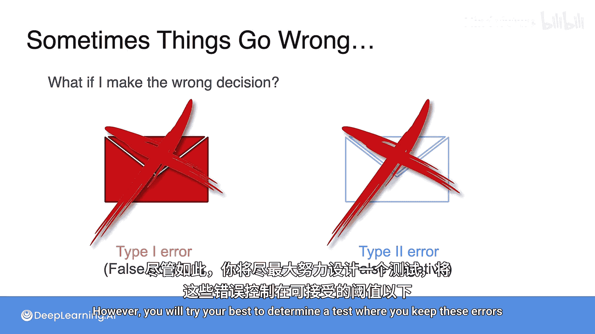
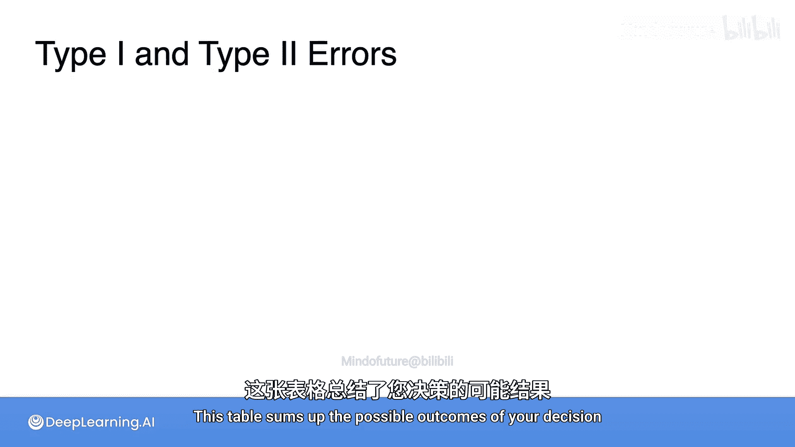
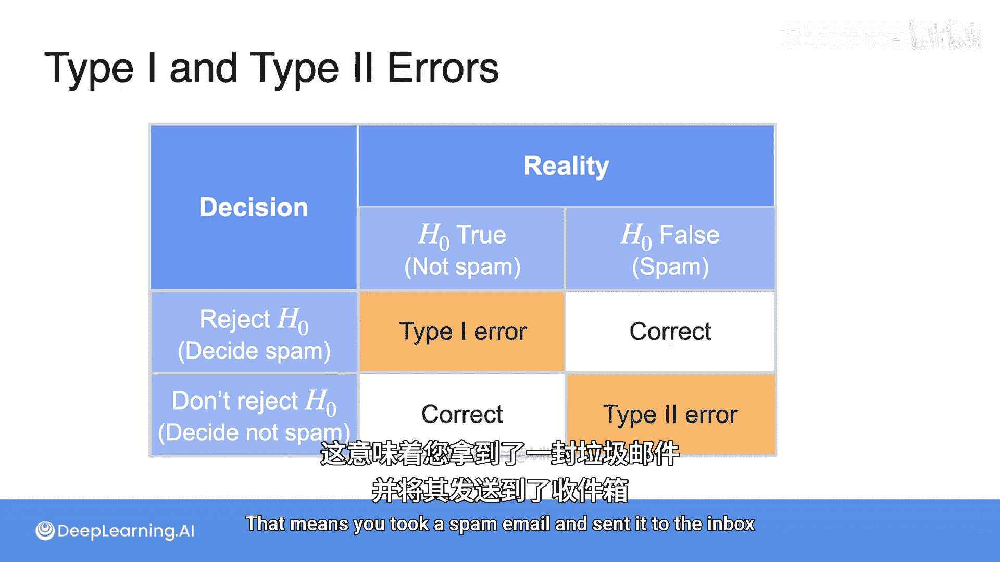
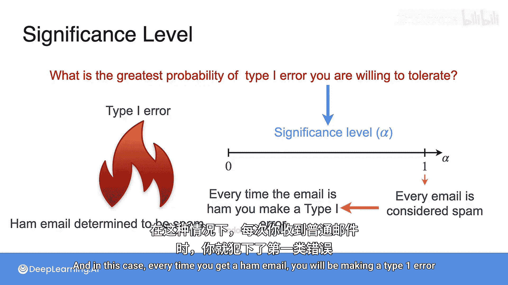
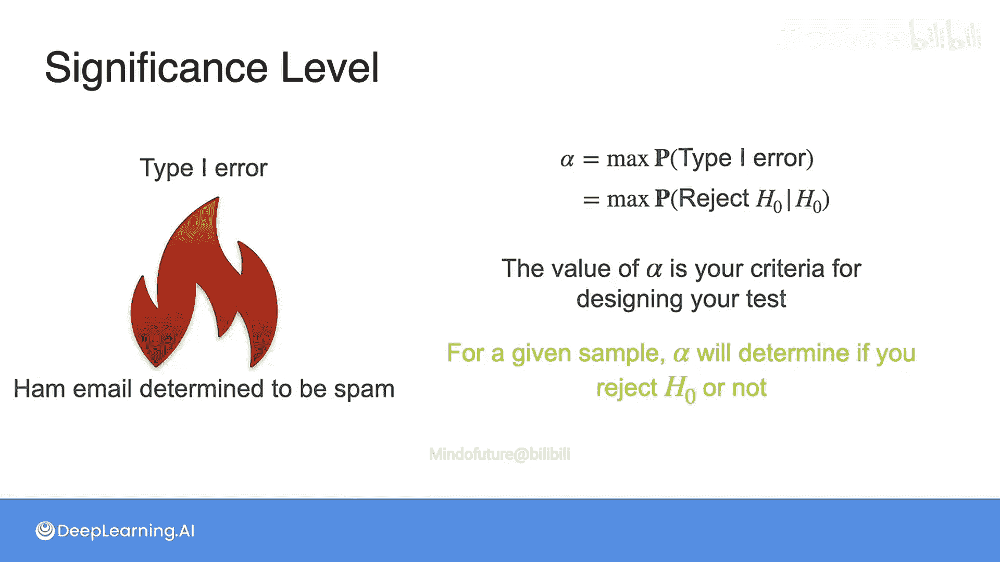

# 088：第一类与第二类错误

## 概述
在本节课中，我们将要学习假设检验中的两种错误类型：第一类错误与第二类错误。我们将了解它们的定义、区别、影响，以及如何通过设定显著性水平来控制这些错误。

## 理想与现实
理想情况下，我们总是希望做出完美的决策。然而，由于世界的随机性以及我们只能从研究总体中获得部分信息，这无法得到保证。

## 可能出错的两种情况
那么，什么可能出错呢？在假设检验中，测试有两种可能的结果：要么你将邮件发送到垃圾箱，要么你将其发送到常规收件箱。这两种结果都可能出错。

以下是两种错误的定义：

*   **第一类错误**：也称为**假阳性**。当你将一个常规邮件（非垃圾邮件）发送到垃圾箱时，就发生了第一类错误。这发生在原假设 `H0` 实际上为真时，你却拒绝了它。
*   **第二类错误**：也称为**假阴性**。当你错误地将一个垃圾邮件判定为非垃圾邮件（常规邮件）时，就发生了第二类错误。这发生在原假设 `H0` 实际上为假时，你却没有拒绝它。

理解这一点很重要：你永远无法确切知道你的决策是否正确，因为你不知道真实情况。然而，你会尽力设计一个测试，将这些错误控制在可接受的阈值以下。

## 决策结果汇总表
上一节我们介绍了两种错误的定义，本节中我们来看看一个总结决策可能结果的表格。

如果真实情况是 `H0` 为真（即邮件实际上不是垃圾邮件），那么：

*   如果你拒绝了 `H0`，你将犯下**第一类错误**。这意味着你将一封完全正常的邮件发送到了垃圾箱。
*   如果你决定不拒绝 `H0`，那么你做出了正确的判断。这意味着你将一封好邮件发送到了收件箱，正如你应该做的那样。

如果真实情况是 `H1` 为真（即邮件是垃圾邮件），那么：

*   拒绝 `H0` 将是正确的决定。这意味着如果你收到一封垃圾邮件，你正确地将其发送到了垃圾箱。
*   不拒绝 `H0` 将导致**第二类错误**。这意味着你拿了一封垃圾邮件并将其发送到了收件箱。

## 错误的影响与权衡
请注意，第一类错误和第二类错误对问题的影响并不相同。

在电子邮件的例子中，假设邮件是非垃圾邮件，那么将垃圾邮件发送到收件箱比将非垃圾邮件发送到垃圾箱要好。这是事实：你宁愿收件箱里有一封偶然的垃圾邮件，也不愿丢失一封完全正常的邮件，并且因为分类器认为它是垃圾邮件而永远无法阅读它。

这意味着**第一类错误比第二类错误更严重**。那么问题在于，你愿意在这里做出多大的妥协？你愿意容忍的第一类错误的最大概率是多少？换句话说，为了拥有一个仍然能将大多数邮件发送到正确位置的良好垃圾邮件检测器，你平均愿意错误地将多少封非垃圾邮件发送到垃圾箱？

## 显著性水平
这个第一类错误的最大概率被称为**显著性水平**，通常用希腊字母 `α` 表示。当然，因为它是一个概率，所以它的值在 `0` 和 `1` 之间。

*   如果 `α = 0`，意味着无论你获得什么证据，邮件总是被认为是非垃圾邮件。在这种情况下，你永远不会犯第一类错误。
*   另一方面，如果显著性水平 `α = 1`，意味着每封邮件都被认为是垃圾邮件。在这种情况下，每次你收到非垃圾邮件时，你都会犯第一类错误。

当然，这两种极端情况都是糟糕的决策者。你想要的是一种能够定义邮件是否为垃圾邮件，并且尽可能减少第一类错误的方法。然而，正如你所见，这个错误永远不可能为 `0`，所以一个典型的考虑值是 `α = 0.05` 作为你的显著性水平。这意味着平均而言，你将有 `5%` 的时间判定一封非垃圾邮件为垃圾邮件。另一个常见的值是 `α = 0.01`。

## 两类错误之间的权衡
正如我们所说，你希望 `α` 尽可能小。但是，这里有一个小问题：对于一个固定的样本数量，如果你过多地降低第一类错误的概率，那么你就会增加第二类错误的概率。这就是我们想到 `α = 0` 的场景时会发生的情况。

为了给出显著性水平的正确定义：它是犯第一类错误的**最大概率**，这也等同于当 `H0` 实际上为真时，拒绝 `H0` 的最大概率。`α` 的值是你设计这个检验的标准。这意味着 `α` 将根据你的样本，决定一个阈值来判断是否应该拒绝 `H0`。

## 总结
本节课中，我们一起学习了假设检验中的核心概念：第一类错误（假阳性）和第二类错误（假阴性）。我们了解到第一类错误通常被认为更严重，并通过设定**显著性水平 `α`** 来控制它。同时，我们也认识到在固定样本量的情况下，减少第一类错误的概率会增加第二类错误的概率，因此需要在两者之间进行权衡。`α` 作为检验的设计标准，为我们提供了做出统计决策的阈值依据。