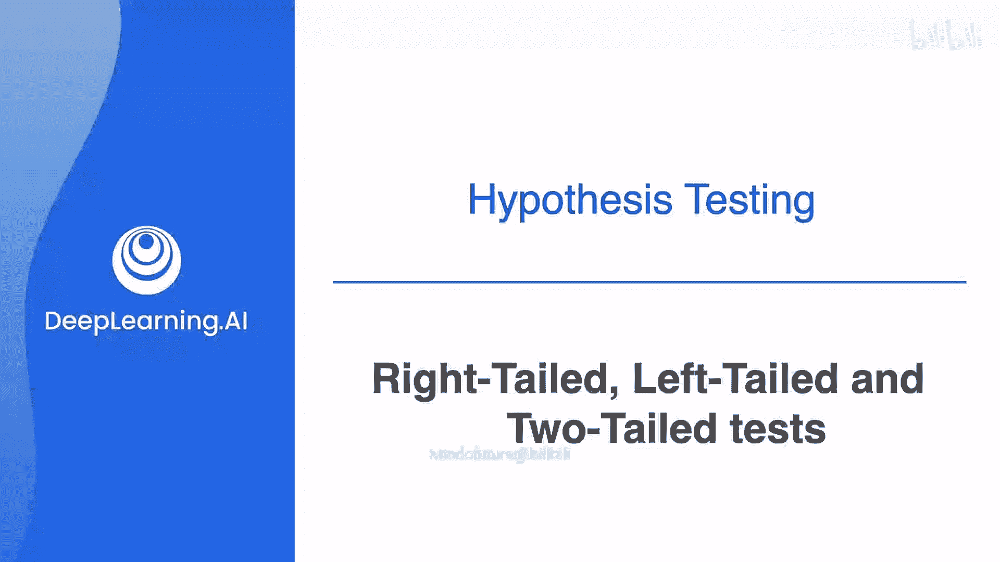
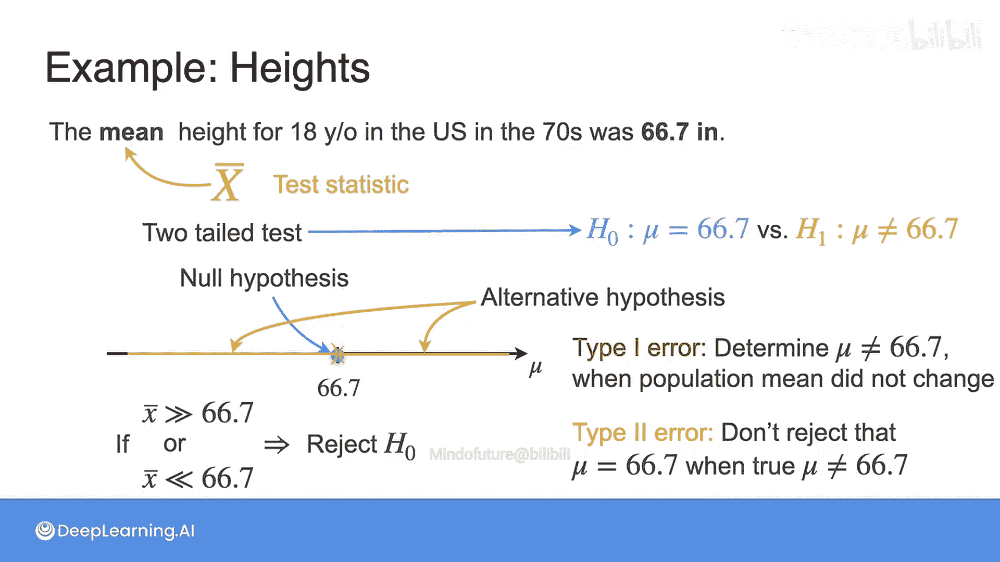

# 089：右侧、左侧与双尾检验

在本节课中，我们将学习如何进行关于总体均值的假设检验。我们将涵盖两种情况：已知总体标准差和未知总体标准差。在未知标准差的情况下，我们将再次遇到一个熟悉的概念——学生t分布。此外，我们还将学习一个非常重要的概念：**P值**。

为了清晰地理解假设检验以及显著性水平如何发挥作用，让我们分析另一个例子。

## 数据准备与假设

想象你对美国18岁青年的平均身高感兴趣，并测量了10个人的身高（单位：英寸）。如果你还记得，这正是我们在第二课中用于对平均身高进行最大似然估计的同一数据集。

这些样本值的平均身高是 **68.442** 英寸。

在深入假设检验之前，还有一点需要考虑：**数据质量**。既然你的目标是根据数据做出决策，那么数据必须是可靠的，否则你将得出错误的结论。

那么，可靠意味着什么？
*   每个样本必须能代表总体。
*   数据需要完全随机化，以避免在决策过程中引入偏差。

例如，如果你对美国18岁青年的身高感兴趣，但所有样本都来自各学校的篮球队，那么你就在样本中引入了偏差，因为一般来说，篮球运动员更高。
*   你还应考虑可用数据的数量。样本量是否足以做出好的决策？一个经验法则是考虑30个或更多的样本。

在接下来的例子中，我们将假设我们拥有的样本足以进行检验。

## 构建假设

历史数据显示，20世纪70年代美国18岁青年的平均身高是 **66.7** 英寸。

基于观察到的数据，你能确认美国18岁青年的平均身高增加了吗？你拥有的样本均值是68.442，大于66.7，但这足以确认假设吗？

让我们尝试构建**零假设**和**备择假设**。这里的基线是“没有变化”，因此零假设是18岁青年的总体均值仍然是66.7英寸。备择假设是总体均值大于66.7英寸。

请注意，假设总是根据**总体参数**（本例中是总体均值）来构建，绝不能涉及样本。

现在，假设是基于总体参数的，但决策将基于你的观察结果。在这个例子中，你将基于**样本均值**（随机样本X的平均值）做出决策。

如果你的决策是基于样本均值做出的，那么样本均值就是你的**检验统计量**。请注意，这是一个随机变量，尚未依赖于你拥有的特定观测值。另一方面，数值68.442被称为**观测统计量**，它基于你的测量结果。

一般来说，检验统计量是随机样本的一个函数，它提供关于你想要研究的总体参数的信息。例如：
*   如果你正在检验总体均值，一个好的统计量是样本均值。
*   同样，对于检验概率或发生率，样本比例是合适的。
*   如果你想检验总体的方差，那么一个好的候选者是**S²统计量**。

需要指出的是，检验统计量不是唯一的。例如，Xi与样本均值之间的平方和差异也可以用作方差的检验统计量。你将在后续视频中看到一个关于此的例子。

## 三种假设检验类型

回到我们的例子，我们想比较当前的总体均值与20世纪70年代的总体均值。在这种情况下，会产生三组问题，每组问题都对应一组假设。

以下是三种主要的假设检验类型：

**1. 右侧检验**
第一个问题是：过去50年，总体身高是否增加了？这里的基线是平均身高保持不变，而你想要证明的是总体均值实际上增加了。这意味着你的H0是 μ = 66.7，H1是 μ > 66.7。这被称为**右侧检验**，因为备择假设延伸到零假设的右侧。也就是说，因为大于66.7的数字在66.7的右边。

**2. 左侧检验**
第二个问题是：总体均值在过去50年是否下降了？这引出了零假设 μ = 66.7 和备择假设 μ < 66.7。这种假设被称为**左侧检验**，因为备择假设在零假设的左侧。也就是说，小于66.7的数字在66.7的左边。

**3. 双尾检验**
最后一个问题是：平均身高是否发生了任何变化（无论是变大还是变小）？在这种情况下，H0仍然是 μ = 66.7，而H1是 μ ≠ 66.7。这是一个**双尾检验**，因为它表示μ已经改变，并且要么移到了66.7的右边，要么移到了66.7的左边。

请注意，对于这些情况，零假设或基线总是相同的，但备择假设会根据你想要证明的内容而变化。

## 检验类型与决策错误

现在让我们考虑第一组假设（右侧检验）。由于你试图对总体均值做出结论，很自然地会考虑使用样本均值来接近总体均值。

如果你的样本均值远大于66.7（即H0），那么你就拒绝H0并接受H1。

这里可能犯哪两种错误呢？
*   **第一类错误**：当真实值实际上是66.7时，却判定μ大于66.7。
*   **第二类错误**：当你判定总体均值保持不变，但真实值实际上更大时发生。

接下来看第二组假设（左侧检验）。这里H0仍然是总体均值为66.7，你的备择假设是数值实际上在这些年里下降了。在这种情况下，如果你的样本均值远小于66.7，那么你将拒绝H0。
*   在这种情况下，当总体均值没有变化，但你接受了μ小于66.7的假设时，就会发生第一类错误。
*   而当实际上总体平均身高下降了，你却没有拒绝H0时，就会发生第二类错误。

最后考虑第三组假设（双尾检验）。在这种情况下，当样本与66.7的差异很大时，你将拒绝H0。由于差异可以是任何方向，一个简单的表示方法就是取样本均值与H0中值（66.7）之差的绝对值。
*   在这种情况下，当总体均值没有变化，但你接受了μ不同于66.7的假设时，就会发生第一类错误。
*   而当实际上总体平均身高发生了变化，你却没有拒绝H0时，就会发生第二类错误。

## 总结

本节课中，我们一起学习了假设检验的核心步骤。我们首先强调了数据质量的重要性，然后学习了如何根据研究问题构建零假设和备择假设。我们详细介绍了三种主要的假设检验类型：**右侧检验**、**左侧检验**和**双尾检验**，并理解了它们各自的应用场景。最后，我们分析了在每种检验类型中可能发生的**第一类错误**和**第二类错误**，为后续学习P值和显著性水平等概念奠定了基础。