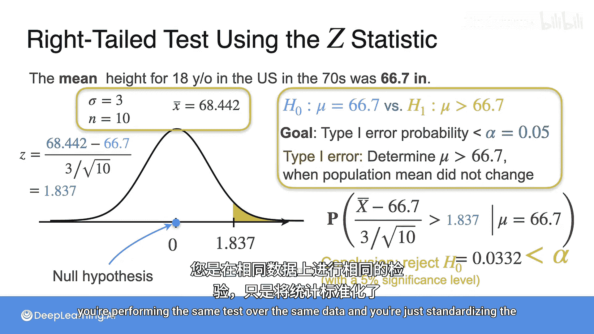

# 090：P值与假设检验决策

## 概述
在本节课中，我们将要学习假设检验中的一个核心概念——P值。我们将了解P值的定义、计算方法，以及如何利用P值，结合预先设定的显著性水平，对原假设做出“拒绝”或“不拒绝”的统计决策。我们将通过单侧（右尾、左尾）和双侧检验的具体例子来阐明这一过程。

## P值的定义与作用
上一节我们介绍了假设检验的基本思想：如果样本均值与原假设的预期值相差太远，就拒绝原假设。但“太远”具体意味着什么？这需要借助P值来量化。

**P值** 是在原假设H0为真的前提下，检验统计量取得与观测值一样极端或更极端值的概率。P值衡量了在当前原假设下，观测到当前样本（或更极端情况）的“惊奇程度”。一个**很小的P值**意味着，如果原假设为真，那么当前样本结果将非常不可能发生，这构成了拒绝原假设的证据。

## 右尾检验中的P值
让我们回顾之前的例子。原假设H0：美国男性平均身高μ = 66.7英寸。备择假设H1：μ > 66.7英寸（身高增加）。我们已知总体标准差σ = 3英寸，样本量n = 10，观测到的样本均值 x̄ = 68.442英寸。

在原假设H0为真（μ = 66.7）的条件下，样本均值 x̄ 服从正态分布：
`x̄ ~ N(μ0 = 66.7, σ²/n = 3²/10)`

我们设定显著性水平α = 0.05。第一类错误（错误地拒绝真原假设）的概率不应超过α。

对于右尾检验，P值定义为观测到比当前样本均值更大或相等的极端值的概率：
`P值 = P(x̄ ≥ 68.442 | H0为真)`

计算这个概率（即下图中68.442右侧的阴影面积），我们得到P值 ≈ 0.0332。

由于计算出的P值 (0.0332) 小于我们设定的显著性水平α (0.05)，我们得出结论：有足够的证据拒绝原假设H0，接受备择假设H1，即认为平均身高增加了。

## 决策规则
基于P值的假设检验决策规则是通用的：

*   如果 **P值 ≤ α**，则拒绝原假设H0。
*   如果 **P值 > α**，则没有足够的证据拒绝原假设H0。

这个规则将统计证据的强度（P值）与我们愿意承担的风险（α）直接联系起来。

## 不同检验类型的P值计算
P值的具体计算方式取决于备择假设的方向。令T为检验统计量，T_obs为其观测值，μ0为原假设中的参数值。

以下是三种常见假设检验的P值定义：

*   **右尾检验 (H1: μ > μ0)**
    P值是检验统计量大于或等于观测值的概率。
    `P值 = P(T ≥ T_obs | H0为真)`

*   **左尾检验 (H1: μ < μ0)**
    P值是检验统计量小于或等于观测值的概率。
    `P值 = P(T ≤ T_obs | H0为真)`

*   **双侧检验 (H1: μ ≠ μ0)**
    P值是检验统计量取值比观测值更极端（即距离μ0更远）的概率，需要考虑两侧尾部。
    `P值 = P(|T - μ0| ≥ |T_obs - μ0| | H0为真)`

## 双侧检验示例
现在考虑双侧检验的情况。原假设H0：μ = 66.7。备择假设H1：μ ≠ 66.7。使用相同的样本数据（x̄ = 68.442）。

此时，P值需要计算样本均值与原假设值66.7的绝对差异大于等于观测差异（|68.442 - 66.7| = 1.742）的概率。这涉及到分布的两侧尾部。

计算得到的P值约为0.0663，这恰好是右尾检验P值(0.0332)的两倍。因为0.0663 > 0.05 (α)，所以我们**不拒绝**原假设H0。这表明，如果只关心身高是否有任何变化（增或减），当前证据尚不充分。

## 左尾检验示例
最后，我们看一个左尾检验的例子。假设我们怀疑平均身高降低了，备择假设为H1: μ < 66.7。现在想象我们观测到一个不同的样本均值 x̄ = 64.252。

P值计算为在原假设下，样本均值小于或等于64.252的概率：
`P值 = P(x̄ ≤ 64.252 | H0为真)`

计算这个概率（下图左侧阴影面积），得到P值 ≈ 0.0049。

这个P值远小于α = 0.05，甚至小于更严格的α = 0.01。因此，我们坚决拒绝原假设，接受备择假设，认为平均身高确实降低了。

## 使用Z统计量进行检验
之前的所有检验都直接基于样本均值 x̄ 的分布。另一种常见且等价的方法是使用**标准化**的Z统计量：
`Z = (x̄ - μ0) / (σ/√n)`

如果原假设H0为真，则Z统计量服从**标准正态分布 N(0, 1)**。

以右尾检验为例，观测到的Z值为：
`Z_obs = (68.442 - 66.7) / (3/√10) ≈ 1.837`

此时，事件“x̄ ≥ 68.442”等价于事件“Z ≥ 1.837”。因此，P值可以重新计算为：
`P值 = P(Z ≥ 1.837 | H0为真)`

从标准正态分布表中查得，该概率同样约为0.0332。使用Z统计量的优势在于，我们只需与一个标准分布（标准正态分布）打交道，简化了计算和查表过程。

## 总结
本节课中我们一起学习了假设检验的核心决策工具——P值。

我们首先明确了P值的定义：它是在原假设成立的前提下，得到当前观测结果或更极端结果的概率。P值越小，反对原假设的证据越强。

接着，我们掌握了基于P值的通用决策规则：将计算出的P值与预先选定的显著性水平α进行比较，若P值 ≤ α则拒绝H0，否则不拒绝。

我们通过右尾、左尾和双侧检验的具体算例，演示了P值在不同检验类型中的计算方法及其对决策的影响。最后，我们介绍了使用标准化Z统计量进行检验的等价方法，这通常能简化计算。

理解P值是理解现代统计推断的基石，它使我们能够基于数据和概率，对关于世界的假设做出量化的、可重复的决策。