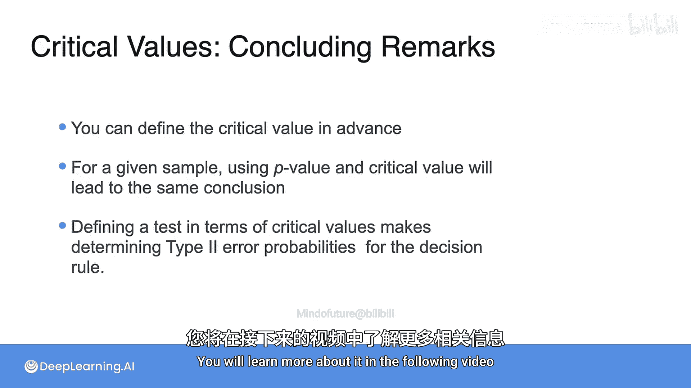

# 091：临界值

## 概述
在本节课中，我们将要学习假设检验中的另一个重要概念——**临界值**。我们将了解临界值如何定义，它与显著性水平α的关系，以及如何利用临界值来制定决策规则，从而在收集数据之前就确定拒绝原假设的标准。

## 临界值的定义
上一节我们介绍了基于观测统计量的P值进行决策的方法。本节中我们来看看临界值。

临界值是指，在给定的显著性水平α下，能够使P值恰好等于α的**最不极端**的样本统计量值。任何比这个临界值更极端（即更有利于备择假设）的观测值，其P值都会小于α，从而拒绝原假设。临界值通常记作 **k_α**，以强调它对α的依赖。

关于临界值的一个关键特性是：任何比临界值更极端的观测统计量，其P值总是小于或等于α。因此，你可以基于临界值创建一个决策规则。

## 右尾检验示例
让我们再次回到关于18岁人群平均身高的右尾检验例子。

*   **原假设 H₀**：总体均值 μ = 66.7
*   **备择假设 H₁**：总体均值 μ > 66.7
*   样本量 n = 10
*   总体标准差 σ = 3
*   我们感兴趣的显著性水平 α = 0.05

我们需要找到临界值 **k_0.05**，它使得P值恰好等于0.05。这等价于在统计量分布中找到右侧尾部面积为0.05的那个点。

当原假设H₀（μ = 66.7）为真时，样本均值 `X̄` 服从正态分布：
`X̄ ~ N(μ=66.7, σ_X̄ = 3/√10)`

对于这个分布，临界值 `k_0.05` 就是其 `1 - 0.05 = 0.95` 分位数。计算可得：
`k_0.05 ≈ 68.26`

现在，我们可以制定决策规则：**如果观测到的样本均值大于68.26，则拒绝原假设H₀**。

临界值的一个优点是，你可以在收集任何数据之前就定义好决策规则。一旦获得数据，只需计算观测统计量，即可根据此规则做出决策。

在我们的例子中，观测到的样本均值是68.442，它大于临界值68.26。因此，在α=0.05的显著性水平下，我们将拒绝原假设。这个结论与之前使用P值方法得出的结论完全一致。

## 改变显著性水平的影响
如果我们改变显著性水平α会怎样？例如，将α从0.05改为0.01。

由于0.01比0.05更小，这意味着我们要求更严格的证据来拒绝H₀。因此，临界值 `k_0.01` 必然会向右移动（变得更大）。计算可得新的临界值：
`k_0.01 ≈ 68.91`

此时的决策规则变为：**如果观测到的样本均值大于68.91，则拒绝原假设H₀**。

用我们的数据（样本均值68.442）来看，由于68.442 < 68.91，因此在α=0.01的显著性水平下，我们**不能**拒绝原假设。

## 不同类型检验的临界值
现在，让我们看看临界值在各类检验中是如何定义的。

以下是不同检验类型中临界值的确定方法：

*   **右尾检验**：临界值 `k_α` 是当H₀为真时，统计量分布中右侧尾部面积为α的那个值。它对应于 `1 - α` 分位数。
    *   **决策规则**：如果观测统计量 `T > k_α`，则拒绝H₀。

*   **左尾检验**：临界值 `k_α` 是当H₀为真时，统计量分布中左侧尾部面积为α的那个值。它对应于 `α` 分位数。
    *   **决策规则**：如果观测统计量 `T < k_α`，则拒绝H₀。

*   **双尾检验**：错误概率α需要平分在分布的两个尾部。因此需要找到两个临界值：
    *   `k_α1`：右侧尾部面积为 `α/2`，对应于 `1 - α/2` 分位数。
    *   `k_α2`：左侧尾部面积为 `α/2`，对应于 `α/2` 分位数。
    *   **决策规则**：如果观测统计量 `T > k_α1` **或** `T < k_α2`，则拒绝H₀。

## 总结
本节课中我们一起学习了临界值的概念与应用。

*   临界值 `k_α` 可以根据检验设计（如样本量、总体分布信息）和选定的显著性水平α预先确定，无需样本数据。
*   P值方法和临界值方法必须始终导向相同的统计结论。
*   使用临界值法，可以在收集数据之前就制定明确的决策规则，这带来了一个重要的优势：由于决策规则不依赖于具体观测值，我们可以更容易地计算**第二类错误**的概率。我们将在接下来的视频中深入探讨这一点。