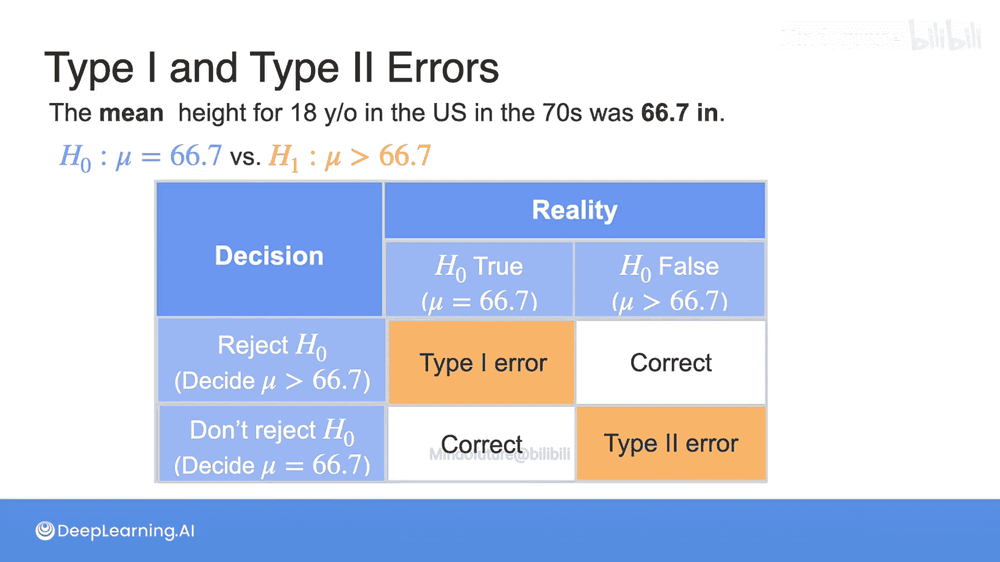
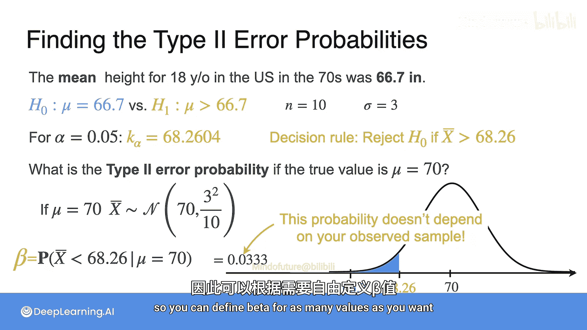
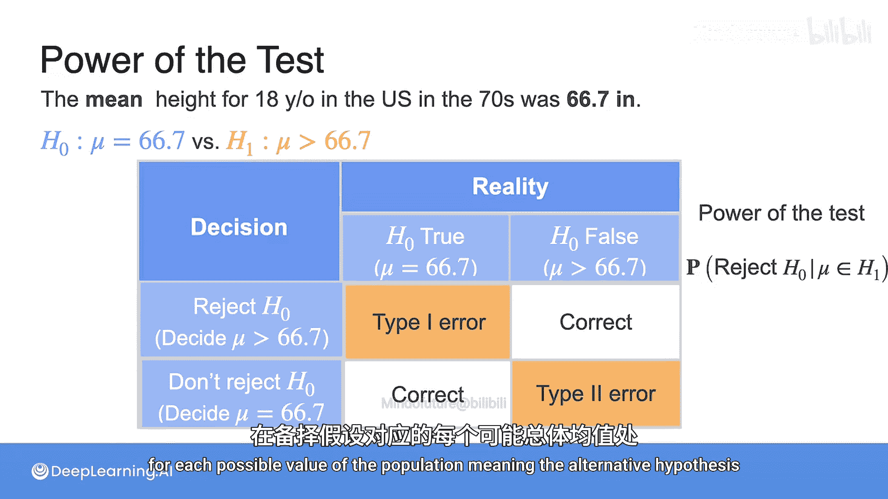
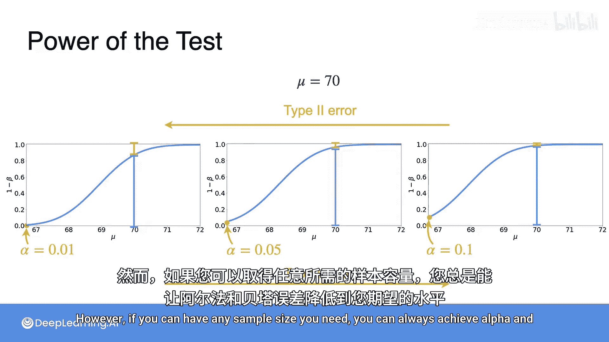

# 092：检验功效

在本节课中，我们将学习假设检验中的另一个核心概念——**检验功效**。我们将回顾第一类错误与第二类错误，并深入探讨如何量化做出正确决策的概率。

## 第一类与第二类错误回顾

上一节我们介绍了假设检验的基本框架，并定义了第一类错误（弃真）和第二类错误（存伪）。到目前为止，我们的讨论主要围绕**第一类错误**和**显著性水平**展开。

让我们再次考虑一个例子：你想检验美国18岁青年的平均身高是否比70年代的66.7英寸有所增加。**第一类错误**发生在：当总体均值实际上仍然是66.7英寸时，你却错误地拒绝了“总体均值等于66.7英寸”这个原假设。

现在，我们将关注**第二类错误**。这种错误发生在：当原假设不成立时，你却未能拒绝它。

需要注意的是，第一类错误只可能发生在原假设为真的那个特定总体均值上（本例中是66.7）。然而，第二类错误可以发生在**任何大于66.7的总体均值**上。

## 计算第二类错误的概率

对于这个例子，我们假设样本容量 `n = 10`，总体标准差 `σ = 3`。

在之前的课程中，我们得出在显著性水平 `α = 0.05` 下，临界值为 `68.26`。因此，决策规则是：如果观测到的样本均值大于68.26，则拒绝原假设。

现在，我们可以问自己一个问题：如果总体均值的真实值实际上是70，那么犯错误的概率是多少？这就是**第二类错误的概率**。

我们要求的是：在总体均值真实值为70的条件下，**不拒绝原假设**的概率。根据我们设定的决策规则，这等价于在总体均值为70的条件下，样本均值小于68.26的概率。

需要记住：
*   如果原假设 `H0` 为真（`μ = 66.7`），样本均值服从正态分布：`X̄ ~ N(66.7, 3/√10)`。
*   如果真实总体均值 `μ = 70`，那么样本均值将服从另一个正态分布：`X̄ ~ N(70, 3/√10)`。

不拒绝 `H0` 的概率（即第二类错误概率）就是下图蓝色区域的面积，对应于样本均值小于临界值68.26的概率。计算可得，这个概率值 `β ≈ 0.0333`。

第二类错误的概率通常用希腊字母 **β** 表示。一个非常有趣的点是：这个概率**不依赖于观测到的具体样本**，只取决于你为检验所选择的显著性水平 `α`。

这里我们只考虑了 `μ = 70` 的情况，但实际上，你可以计算出备择假设中**任意μ值**所对应的第二类错误概率 `β`。

## 引入检验功效的概念

现在，你应该对第一类和第二类错误有了更好的理解。但在很多时候，我们更想量化**做出正确决策**的机会。具体来说，关注下表中“拒绝原假设且原假设为假”这个象限尤为重要。

这个信息被汇总在**检验功效**中。检验功效是一个函数，它告诉你：对于备择假设中**每一个可能的总体均值μ值**，你能够**拒绝原假设**的概率。

记住，第二类错误概率 `β` 是当 `H0` 不成立时，**不拒绝** `H0` 的概率。而检验功效则是当 `H0` 不成立时，**做出正确决策并拒绝** `H0` 的概率。这两个概率是互补的。

因此，检验功效可以写作：
**功效(μ) = 1 - β(μ)**

总结来说，对于备择假设 `H1` 中的每一个 `μ` 值，检验功效等于1减去犯第二类错误的概率。

## 检验功效曲线的解读

下图展示了一个典型的右侧检验的**功效曲线**。

在图形的最左侧，`μ = 66.7`（即原假设成立的点），曲线的高度恰好等于 `α`，因为这是在 `μ` 取该特定值时拒绝 `H0` 的概率（即第一类错误率）。本图中 `α = 0.05`。

图形中所有其他 `μ` 值（大于66.7）都对应备择假设。考虑 `μ = 68`，此时曲线的高度就是在 `μ = 68` 处的检验功效，它精确地代表了如果总体均值真实值为68时，拒绝原假设的概率。

曲线高度与1之间的差值，则对应了如果 `μ` 确实是68时，犯第二类错误的概率 `β`。对于 `μ = 70` 的情况也是如此：曲线高度是检验功效，而1与曲线之间的差值就是第二类错误概率。

这个图形有一个有趣的模式：随着横轴 `μ` 值的增加，曲线也不断上升，越来越接近1。这很合理，因为请记住，`μ` 的值决定了样本均值分布的中心。所以当 `μ` 增大时，样本均值小于临界值的概率自然会下降。

## 显著性水平对功效的影响

让我们看看三种不同 `α` 值下的检验功效曲线是怎样的。

*   左边是 `α = 0.01` 的功效曲线。
*   中间是 `α = 0.05` 的曲线（即上一张幻灯片所用的）。
*   右边是 `α = 0.1` 的曲线。

从左到右，显著性水平 `α`（第一类错误率）递增。现在考虑曲线在 `μ = 70` 处的函数值。结果表明，随着 `α` 值增大，`μ = 70` 处的检验功效也随之增大。这对于曲线上的每一个点都是成立的。

与此相反，让我们看一下第二类错误概率 `β`。此时，行为恰好相反：如果你对控制第一类错误过于严格（即 `α` 很小），最终会导致你的第二类错误概率 `β` 增加。

对于一个固定的样本容量 `n`，**第一类错误和第二类错误之间总是存在此消彼长的权衡关系**。然而，如果你可以自由选择任意所需的样本量，你总是可以同时将 `α` 和 `β` 降低到任意小的水平。

---

**本节课总结**

在本节课中，我们一起学习了：
1.  **回顾了第一类错误（α）和第二类错误（β）**。
2.  **学习了如何计算特定备择假设值下的第二类错误概率β**。
3.  **引入了“检验功效”的核心概念**，其定义为 `1 - β`，代表了当原假设为假时正确拒绝它的概率。
4.  **解读了检验功效曲线**，理解了其随备择参数值变化的趋势。
5.  **分析了显著性水平α与检验功效的关系**，认识到在固定样本量下，α与β存在权衡；但通过增加样本量，可以同时降低两者。

掌握检验功效的概念对于设计有效的实验和评估统计检验的可靠性至关重要。