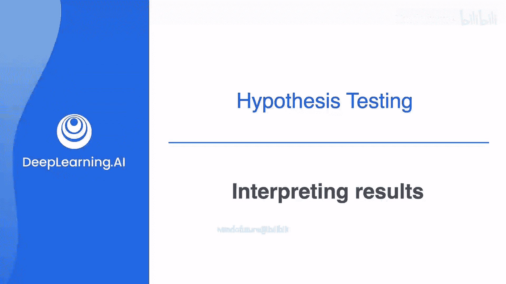
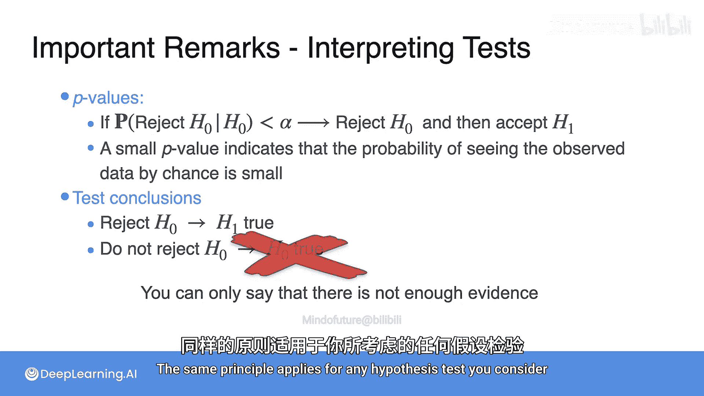

# 093：假设检验的结果解释

在本节课中，我们将学习假设检验的完整步骤，并深入探讨如何正确解释检验结果，特别是P值的含义以及常见的理解误区。

上一节我们介绍了假设检验的基本思想，本节中我们来看看执行假设检验的具体流程。

## 假设检验的四个步骤

以下是执行假设检验通常需要遵循的四个步骤。

1.  **陈述假设**：这包括定义**原假设**（H0），它是你检验的基准。例如，H0：总体身高的均值 μ = 66.7。同时，你还需要定义**备择假设**（H1），这通常是你希望证明的陈述。例如，H1：μ > 66.7。
2.  **设计检验**：这意味着决定你将使用的检验统计量（例如样本均值），并定义检验的**显著性水平**（α）。最常见的值是 α = 0.05。请记住，显著性水平是犯第一类错误的最大概率，应始终保持较小。
3.  **计算观测统计量**：根据你的样本数据计算检验统计量的实际观测值。在之前的例子中，我们使用的观测统计量是 68.442。
4.  **做出决策**：这是根据你的数据得出结论的阶段。一种常见的决策方法是基于**P值**。如果P值小于你在步骤2中定义的显著性水平α，那么你可以拒绝原假设并接受备择假设。

然而，得出结论并不像看起来那么简单，人们常常会犯错误。

## 检验中的错误类型

在深入探讨结果解释之前，让我们先回顾一下检验中可能出现的错误定义。

*   **第一类错误**：当原假设H0实际上为真时，你却拒绝了它。其概率由显著性水平α控制。
*   **第二类错误**：当备择假设H1实际上为真时，你却未能拒绝原假设H0。

你的设计参数是显著性水平α，根据定义，它对应于犯第一类错误的**最大概率**。你希望这个值尽可能小。但是请注意，在**固定样本量**的情况下，第一类错误和第二类错误的概率是相互关联的。因此，在选择α时要谨慎，因为你可能会迫使第二类错误的概率变得过高。

现在，我们已经理清了相关概念，接下来看看如何正确解释结果，以及一些常见的误解。

## P值的正确解释与常见误区

P值是依据数据做出决策的一个标准。如果P值小于显著性水平，我们就拒绝H0并接受H1。

**P值代表什么？**

P值代表H0为真的概率吗？**并非如此**。

虽然小的P值确实会导致拒绝原假设，但它并不代表原假设为真的概率。P值代表的是**在原假设为真的前提下，观察到当前样本数据（或更极端数据）的概率**。简单来说，一个小的P值告诉你，原假设不是解释你数据的好模型，因为观察到这样数据的可能性很小。

**公式表示**：`P值 = P(观测到当前统计量或更极端值 | H0为真)`

## 检验结论的正确理解

现在，让我们来看看检验结论。

*   如果你拒绝了原假设，你就接受备择假设为真。
*   那么，**不拒绝H0是否意味着原假设为真呢？这也是错误的。**

还记得垃圾邮件的例子吗？你并不会直接说这封邮件是“正常邮件”，你最多只能保证**没有足够的证据**表明这封邮件是垃圾邮件。

同样的原则适用于你考虑的任何假设检验。未能拒绝原假设，仅仅意味着在当前证据和显著性水平下，不足以推翻原假设，而**不能证明**原假设绝对正确。

---

本节课中我们一起学习了假设检验的完整四步流程，明确了第一类和第二类错误的定义，并重点澄清了关于P值含义和检验结论的常见误解。记住，P值是在原假设成立条件下观测到数据的概率，而非假设本身为真的概率；同时，“不拒绝”不等于“接受”，统计结论需要谨慎表述。