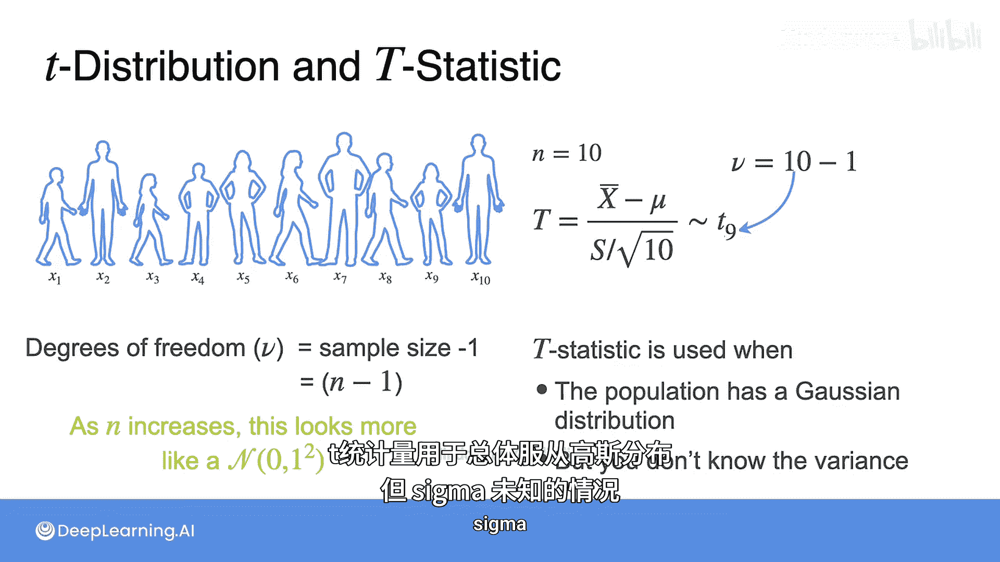

# 094：T分布在假设检验中的应用 🧮

在本节课中，我们将学习T分布，并了解它在假设检验中扮演的关键角色。我们将从回顾T分布的基本概念开始，然后探讨当总体标准差未知时，如何使用T统计量进行推断。

---

## 回顾：T分布与置信区间

在上一节关于置信区间的课程中，我们学习了T分布。现在，让我们回顾一下T分布如何在假设检验中发挥作用。

考虑一个例子：我们抽样测量10名18岁青少年的身高。正如前几周提到的，人的身高可以被建模为一个参数为μ（均值）和σ²（方差）的高斯分布（正态分布）。因此，样本均值`x̄`也将遵循一个高斯分布，其均值相同，但标准差更小。因为我们有10个样本，所以标准差是`σ / √10`。

如果已知总体分布的参数（μ和σ），那么`(x̄ - μ) / (σ/√n)`这个统计量就遵循标准正态分布。这个过程称为标准化，这个统计量被称为**Z统计量**。

## 当总体标准差未知时

然而，更常见的情况是我们不知道总体标准差σ的值。如果μ和σ未知，那么知道样本均值服从标准差为`σ/√n`的高斯分布就没有太大用处，因为我们不知道σ的具体数值。

在这种情况下，我们会在标准化公式中用其估计值`s`来替换未知的σ。请记住，`s`被定义为样本标准差，其计算公式几乎是样本方差，但分母是`n-1`而不是`n`。具体公式如下：

`s = √[ Σ(x_i - x̄)² / (n-1) ]`

由此得到的统计量被称为**T统计量**，其计算公式为：

`t = (x̄ - μ) / (s/√n)`

## T统计量的分布

那么，这个T统计量是否遵循标准正态分布呢？答案是否定的。

事实证明，T统计量遵循我们之前已经学过的一种分布：**学生T分布**，简称**T分布**。让我们回顾一下它的样子。

T分布的PDF（概率密度函数）呈钟形，与高斯分布相似。然而，如果将T分布的PDF与正态分布的PDF进行比较，你会发现T分布的尾部更“厚”。这种更厚的尾部分布，解释了当我们用样本标准差`s`替代总体标准差`σ`时所引入的不确定性。

## T分布的参数：自由度

T分布只有一个参数，称为**自由度**，通常用希腊字母`ν`表示。自由度控制着分布尾部的“厚度”。

`X ~ t(ν)` 这个符号表示随机变量X服从一个自由度为ν的T分布。

让我们看看随着自由度增加，分布形态如何变化。当ν增大并接近30时，T分布的PDF与高斯分布的PDF看起来几乎一模一样。这就是为什么我们通常希望样本量达到30个，因为此时T分布与高斯分布非常相似。

## 回到身高测量的例子

现在，让我们回到视频开头的例子。这里我们有`n = 10`个样本。现在我们知道，T统计量 `(x̄ - μ) / (s/√10)` 遵循一个自由度为`ν`的T分布。

那么自由度`ν`的值应该是多少呢？自由度`ν`简单地等于`10 - 1`，也就是样本数量减1，这给了我们9个自由度。

一般来说，如果你有一个样本量为`n`的样本，那么自由度就是`n - 1`。请注意，自由度与总体均值μ和方差σ²无关，只取决于你收集的样本数量。

## 样本量与分布形态的关系

样本量与自由度之间的关系意味着，随着`n`的增加，T统计量的分布看起来越来越像高斯分布。

---

## 总结

在本节课中，我们一起学习了T分布在假设检验中的应用。我们了解到：

*   当总体服从高斯分布但标准差σ未知时，我们使用**T统计量**。
*   T统计量 `t = (x̄ - μ) / (s/√n)` 服从**学生T分布**。
*   T分布的形状由其唯一参数**自由度**`ν`决定，`ν = n - 1`。
*   随着样本量`n`（即自由度`ν`）的增加，T分布会逐渐接近标准正态分布。当样本量达到30左右时，两者已非常相似。

掌握T分布是进行小样本统计推断的基础，它在机器学习模型评估和数据分析中有着广泛的应用。