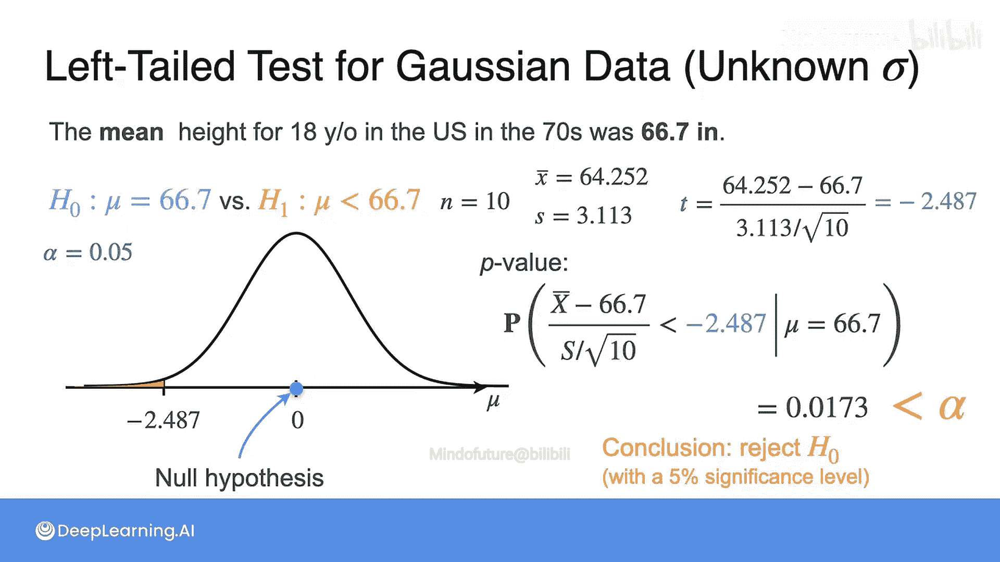

# 095：t检验应用实例

在本节课中，我们将学习如何在实际场景中应用t检验。我们将通过一个具体的例子，演示当总体标准差未知时，如何使用t统计量进行单尾和双尾假设检验，并解释P值的计算与决策过程。

## 概述

在上一节中，我们介绍了t统计量的概念，它用于在总体标准差未知的情况下进行假设检验。本节中，我们将通过一个具体的例子，详细讲解如何使用t统计量进行右尾、左尾和双尾检验，并比较其与已知总体标准差时（使用z检验）结果的差异。

## 案例背景

再次考虑你的样本，它由10名18岁青少年的身高数据组成，样本均值为68.442。我们继续讨论之前视频中提到的三组假设。

在之前的例子中，你知道样本量为10，且总体标准差为3。这意味着如果零假设H0成立，那么样本均值服从均值为66.7、标准差为3/√10的正态分布。

现在的区别在于，你不知道总体标准差σ。这反过来影响了数据的分布，它不再是之前那个正态分布。那么你现在该怎么办？

如果你还记得上一课的内容，我们介绍了t统计量，它正是用于处理此类情况。一个小小的缺点是，所有的计算都必须基于t统计量，而不是直接使用样本均值。

因此，你将需要在0周围绘制分布图，而不是围绕66.7。在H0成立的条件下，这个t统计量服从自由度为9的t分布，上图是其对应的概率密度函数。现在的目标是使用t统计量重复进行之前的三种检验。

## 右尾检验

让我们从对高斯分布均值进行右尾检验开始，但此时总体标准差σ未知。

现有数据为：n=10，样本均值为68.442。我们需要补充样本方差，经计算为3.113。观测到的t统计量计算如下：

**t = (样本均值 - 假设均值) / (样本标准差 / √n) = (68.442 - 66.7) / (√3.113 / √10) ≈ 1.77**

要得到这个检验的P值，我们需要计算在H0成立的条件下，t统计量大于1.77的概率。这个概率对应上图中右侧的阴影区域，其值为0.0552。

由于这个P值大于0.05，你不应该拒绝H0。这与你在总体标准差已知时进行右尾检验得到的结果完全相反。这与因未知总体方差而增加的不确定性有关，你手头的证据突然变得不足以拒绝H0了。

## 双尾检验

现在让我们重复双尾检验的过程。

此时的P值是在H0成立的条件下，t统计量的绝对值大于你观测到的数据（1.77）的概率。因为观测到的统计量是正数，所以计算正确。在一般情况下，如果观测到的统计量为负数，你需要加上绝对值符号。

你现在需要包含左侧尾部，因为你在考察绝对值。这给出的概率为0.1103。请注意，这个值再次是右尾检验P值的两倍。这个P值大于0.05，所以结论同样是**不拒绝H0**。

## 左尾检验

最后，考虑左尾检验。

让我们再次假设你获得的样本平均值为64.252。同时想象样本标准差保持不变。

在左尾检验的情况下，P值是在H0成立的条件下，t统计量小于观测值-2.487的概率。这对应上图中左侧的阴影区域，其概率为0.0173。

对于这个样本，你得到的P值小于0.05。因此，正确的结论是**你应该拒绝H0**，并接受总体均值已经降低的备择假设。

## 总结

本节课中，我们一起学习了如何在实际问题中应用t检验。我们通过一个身高样本的例子，演示了当总体标准差未知时，如何计算t统计量，并据此进行右尾、双尾和左尾假设检验。关键点在于，与已知σ时使用z检验相比，t检验考虑了额外的估计不确定性，这可能导致不同的统计结论。我们看到了在右尾检验中，由于方差的估计，原本显著的证据变得不显著。掌握t检验的应用，是处理现实世界中小样本数据分析的重要技能。