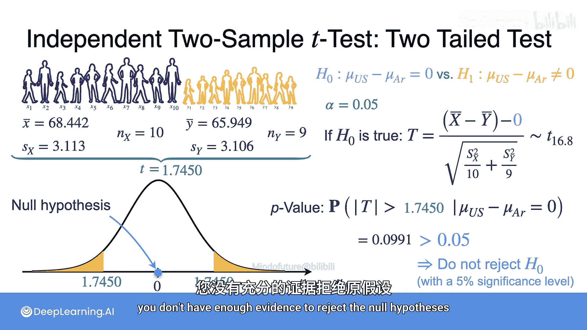

# 096：双样本t检验

在本节课中，我们将要学习如何比较来自两个不同总体的样本，即双样本假设检验。我们将通过一个具体的例子——比较美国和阿根廷18岁青年的身高——来理解其原理和步骤。

到目前为止，我们所做的所有假设检验都只涉及一个总体中的一个样本。但是，如果我们想比较来自不同总体的不同样本，该怎么办呢？例如，假设我有两个国家，并且我认为这个国家的人比那个国家的人更高，但我只能获取样本。双样本假设检验将告诉我们如何比较不同总体的样本。

在接下来的内容中，你将学习如何比较两个总体。以这个例子为例，你感兴趣的是比较美国18岁青年的身高与阿根廷18岁青年的身高。

## 问题设定与数据

对于第一组（美国），你有10个样本 `x1` 到 `x10`，其观测到的样本均值为 **68.442英寸**，样本标准差为 **3.113**。

对于阿根廷组，你只有9个样本 `y1` 到 `y9`，其观测到的样本均值为 **65.949英寸**，样本标准差为 **3.106**。

你的目标是确定美国总体的均值是否与阿根廷总体的均值不同。

## 假设的三种类型

与单样本检验一样，你可以定义三种类型的假设。在所有三种情况下，你都将考虑原假设：两个总体均值相同。

1.  你可以考虑备择假设：美国18岁青年的总体均值大于阿根廷的总体均值。
2.  你也可以考虑备择假设：美国18岁青年的总体均值小于阿根廷的总体均值。
3.  最后，还有一种备择假设：两个总体均值就是不同。

用差值 `μ_US - μ_Argentina` 来表示这些假设，你会得到一个**右侧检验**、一个**左侧检验**和一个**双尾检验**。

## 基本假设

现在，我们使用以下假设：

1.  来自两组的样本中的所有个体都是不同的。这意味着没有一个人同时属于两个组。
2.  每个人的身高测量值与其他人的测量值是独立的。
3.  两国身高的总体都服从正态分布。这意味着所有来自美国的测量值 `x` 服从均值为 `μ_US`、标准差为 `σ_US` 的高斯分布。同样，来自阿根廷的样本服从均值为 `μ_Argentina`、标准差为 `σ_Argentina` 的高斯分布。

然后，你可以定义每组的样本均值：`x̄` 是美国总体的样本均值，`ȳ` 是阿根廷总体的样本均值。

## 统计量的分布

核心问题是：两个样本均值之间的差值是如何分布的？

由于它是高斯变量的线性组合，因此它也将是一个高斯分布。但其参数是什么？均值将是总体均值之差，标准差将是每个样本均值方差之和的平方根。如果你不太记得这个结果，可以回顾第二周第一课的内容。

当然，你可以将 `x̄` 和 `ȳ` 的差值标准化，得到一个服从标准正态分布的统计量。然而，由于我们不知道两个总体中任何一个的总体标准差，我们能做的最好方法是用每组的样本标准差 `Sx` 和 `Sy` 来分别替代 `σ_US` 和 `σ_Argentina`。

因此，你得到以下统计量：
`T = (x̄ - ȳ - (μ_US - μ_Argentina)) / sqrt(Sx²/nx + Sy²/ny)`

这个统计量也服从 **t分布**，因为它对应于一个总体标准差未知的高斯总体均值的统计量。不幸的是，计算其自由度的公式非常繁琐，但不必担心，许多软件包会为你完成这个计算。将 `nx`、`ny`、`Sx`、`Sy` 代入实际值，你可以得到自由度约为 **16.8**。

## 进行假设检验

在了解了所有数学原理之后，让我们简要回顾一下问题陈述。你有两组样本：一组是美国18岁青年的10个身高样本，另一组是阿根廷18岁青年的9个身高样本。美国样本的观测均值为68.442英寸，样本标准差为3.113。阿根廷样本的观测均值为65.949英寸，样本标准差为3.106。

### 右侧检验示例

让我们从右侧检验开始。原假设 `H0: μ_US - μ_Argentina = 0`，备择假设 `H1: μ_US - μ_Argentina > 0`。这意味着我们检验美国总体均值是否大于阿根廷总体均值。同时，我们设定显著性水平 `α = 0.05`。

从上一节可知，如果 `H0` 为真，那么统计量 `T = (x̄ - ȳ) / sqrt(Sx²/10 + Sy²/9)` 服从自由度为16.8的t分布。

将观测值代入统计量，你得到观测统计量 `T_obs = 1.7459`。

那么，这个样本的p值是多少？因为是右侧检验，p值是在原假设下，统计量 `T` 大于观测统计量的概率。这对应于t分布概率密度函数曲线下右侧的面积，计算得到 **p值 = 0.0495**。

由于p值（0.0495）小于显著性水平（0.05），因此决策是**拒绝原假设**，接受美国总体均值大于阿根廷总体均值的结论。

### 双尾检验示例

现在让我们看看双尾检验会得出什么结论。所有样本值、显著性水平和检验统计量都与之前相同。现在改变的是p值的计算方式。

在这种情况下，你需要的是在原假设 `H0` 下，统计量的绝对值大于观测统计量绝对值的概率。这对应于t分布曲线下左右两侧尾部的面积之和，计算得到 **p值 = 0.0991**。

在这种情况下，由于p值（0.0991）大于显著性水平（0.05），你**没有足够的证据拒绝**两个总体均值相同的原假设。

## 总结

本节课中，我们一起学习了**双样本t检验**。我们了解到，当需要比较两个独立总体的均值时，可以使用这种方法。关键在于构建一个基于两样本均值差、并考虑了各自样本方差的t统计量。我们通过一个身高比较的例子，具体演示了如何进行**右侧检验**和**双尾检验**，包括计算检验统计量、确定自由度、查找p值并做出统计决策。记住，检验类型（单尾或双尾）的选择取决于你的研究问题和备择假设，这会直接影响p值的计算和最终的结论。