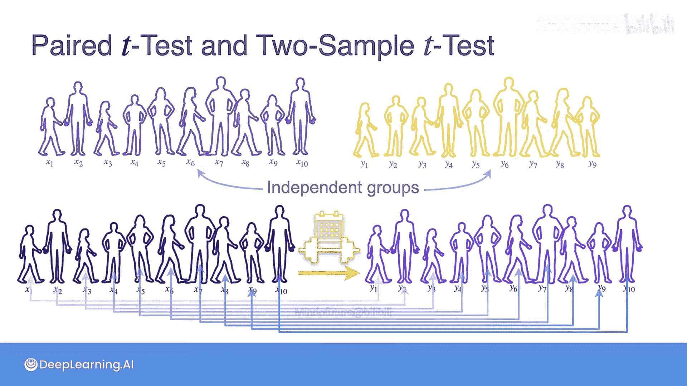
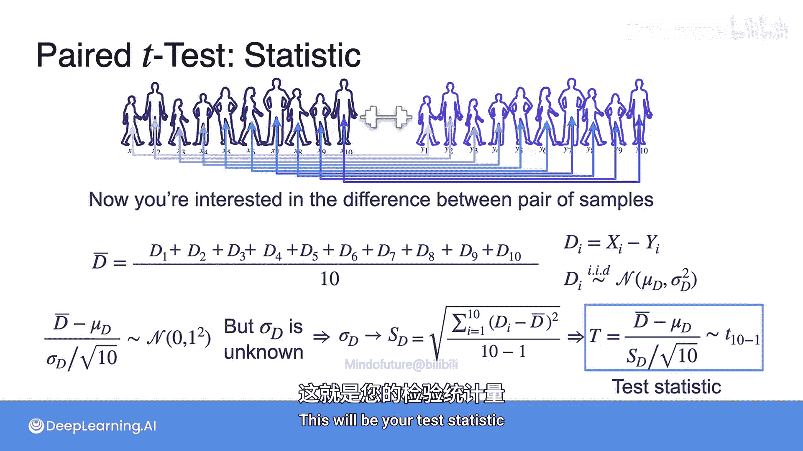
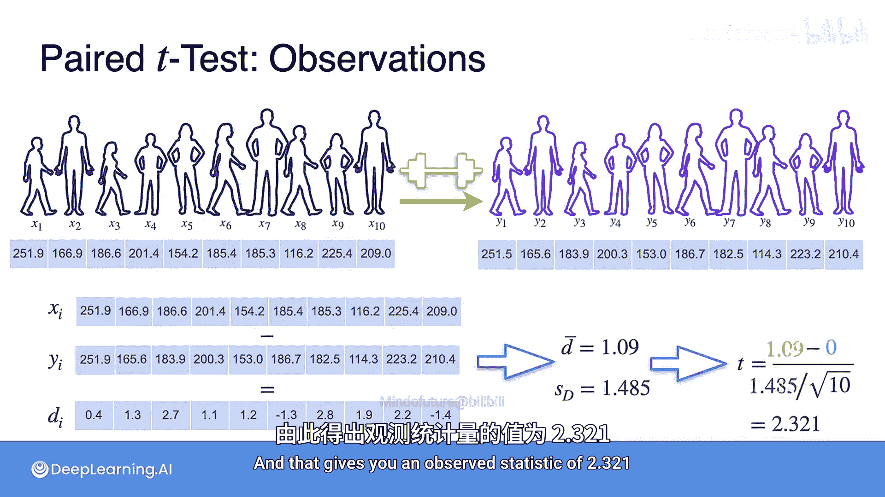
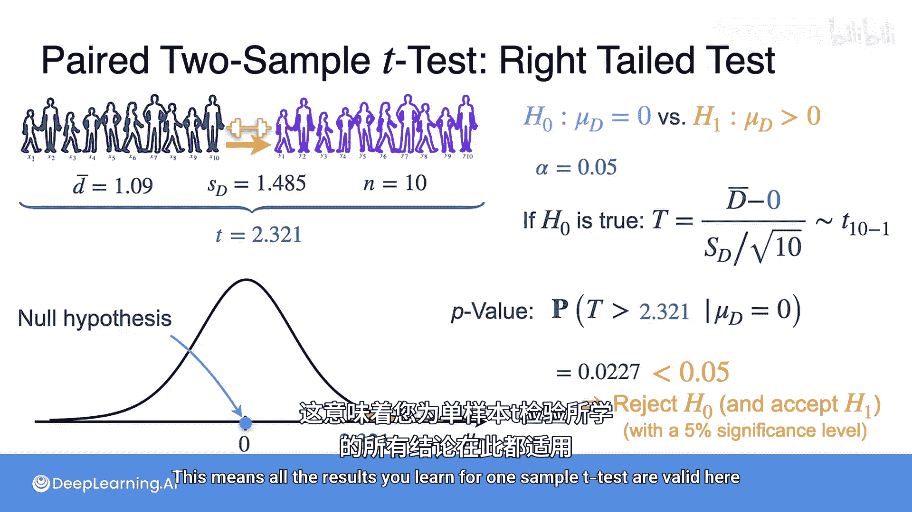

# 097：配对t检验

在本节课中，我们将要学习一种新的假设检验方法——配对t检验。它适用于比较两组数据，但这两组数据并非相互独立，而是存在一一对应的配对关系。

## 配对样本与独立样本

上一节我们介绍了用于比较两个独立群体的双样本t检验。本节中我们来看看另一种情况：你同样有两组数据，但它们并非独立。

设想一个场景：你想测试一个减肥训练计划的效果。第一组数据是参与者在训练前的体重，经过四周训练后，你再次测量同一批参与者的体重，得到第二组数据。这样，第一个人的“训练前”和“训练后”数据是配对的，第二个人的数据也是配对的，依此类推。在这种情况下，我们称这些样本是**配对**的。

## 配对t检验的核心思想

配对t检验关注的是每对数据之间的差值，以此来评估训练计划是否有效。

以下是具体步骤：
1.  计算每对观测值的差值：`D_i = X_i - Y_i`，其中 `X_i` 是训练前体重，`Y_i` 是训练后体重。
2.  这些差值 `D_i` 构成了一个新的样本。
3.  我们研究这个差值样本的均值 `D_bar`。

如果 `X` 和 `Y` 来自正态总体，那么差值 `D` 也服从正态分布。对 `D_bar` 进行标准化，可以得到一个统计量。由于总体标准差未知，我们使用样本标准差 `s_D` 进行估计，从而得到 **t 统计量**：

**公式：** `t = (D_bar - μ_D) / (s_D / √n)`

其中，`μ_D` 是差值总体的均值，`n` 是配对样本的数量。这个统计量服从自由度为 `n-1` 的 t 分布。

## 假设检验的步骤

在配对t检验中，无论进行右侧、左侧还是双侧检验，零假设通常设定为两组之间没有差异，即差值总体的均值为0：`H0: μ_D = 0`。

让我们通过一个例子来具体计算。假设我们有10位参与者的体重数据：

**训练前体重 (X):** [85, 90, 78, 92, 88, 79, 95, 82, 87, 91]
**训练后体重 (Y):** [83, 88, 77, 90, 86, 78, 92, 81, 85, 89]

以下是计算过程：
1.  计算每对差值 `D_i = X_i - Y_i`：得到差值列表 `[2, 2, 1, 2, 2, 1, 3, 1, 2, 2]`。
2.  计算差值样本的均值 `D_bar`：`(2+2+1+2+2+1+3+1+2+2) / 10 = 1.8`。
3.  计算差值样本的标准差 `s_D`：约为 `0.632`。
4.  计算观测到的 t 统计量：`t = (1.8 - 0) / (0.632 / √10) ≈ 9.0`。

## 做出统计决策

现在进行假设检验。我们采用右侧检验：
*   `H0: μ_D = 0` （训练计划无效）
*   `H1: μ_D > 0` （训练计划有效，平均体重下降）
*   设定显著性水平 `α = 0.05`。

计算 P 值：P 值是在零假设成立的前提下，得到当前观测统计量（t ≈ 9.0）或更极端情况的概率。对于自由度为9的 t 分布，这个 P 值极小（远小于 0.001）。

由于 P 值 < α (0.05)，我们**拒绝零假设**。有充分的统计证据表明，差值总体的均值大于0，即该训练计划对减肥有积极效果。

## 配对t检验的本质

如果你仔细观察，会发现一旦我们开始处理差值变量 `D_i`，整个问题就**简化为了对单个样本（差值样本）进行 t 检验**。这意味着，之前学到的所有关于单样本 t 检验的结论在这里都完全适用。

## 总结

本节课中我们一起学习了配对t检验。我们了解到，当比较的两组数据存在天然配对关系（如“前后”测量）时，应使用配对t检验。其核心是将配对数据转化为差值，然后对差值样本执行单样本t检验。这种方法能更有效地控制个体差异，提高检验的灵敏度。