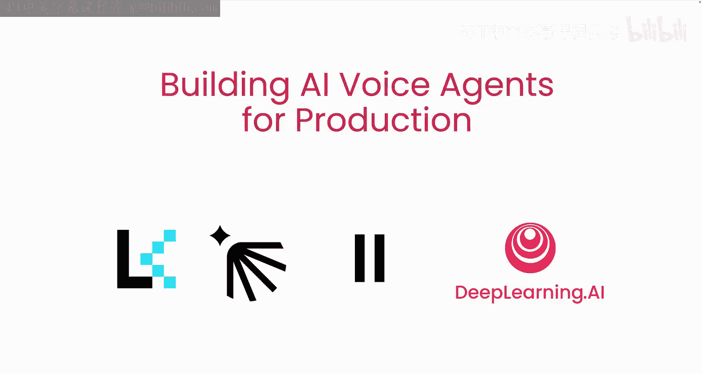
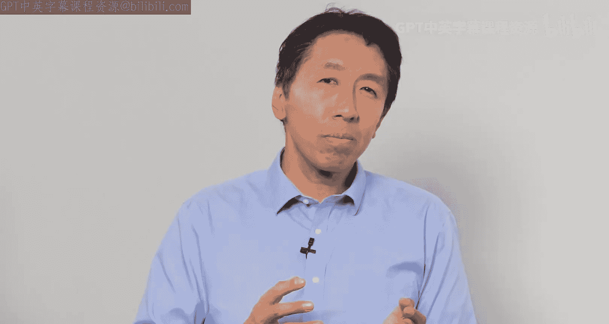
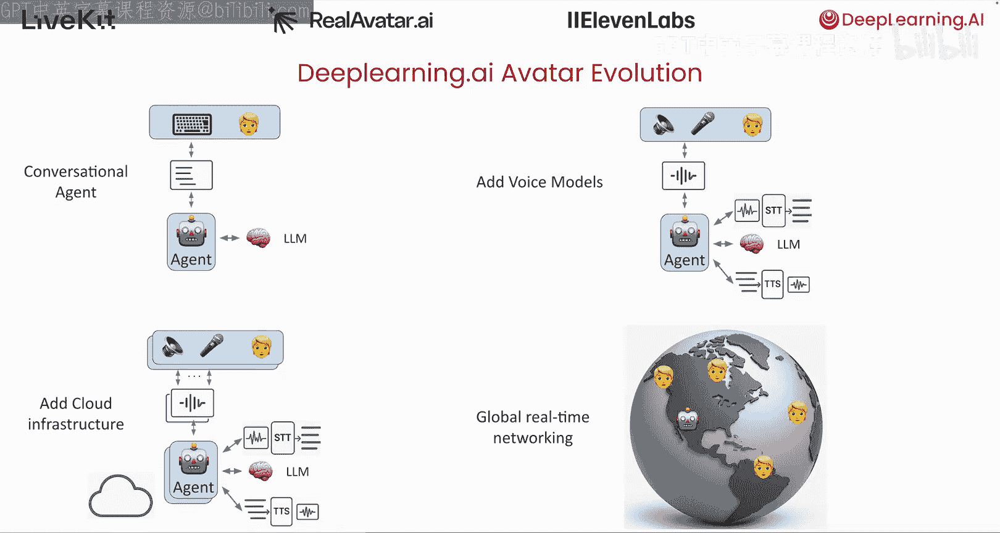
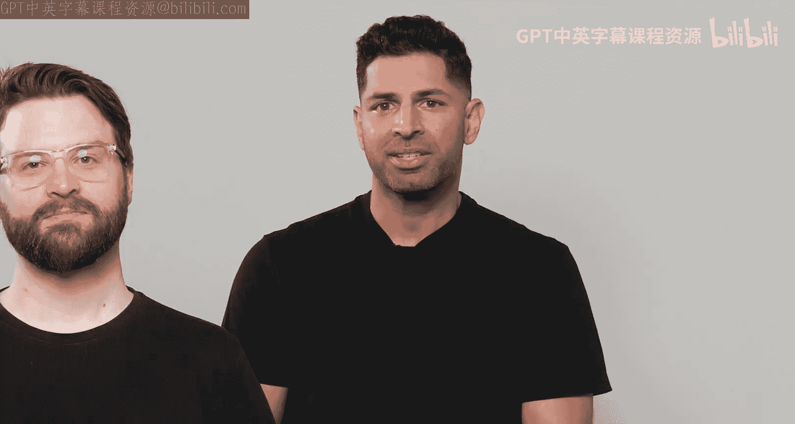
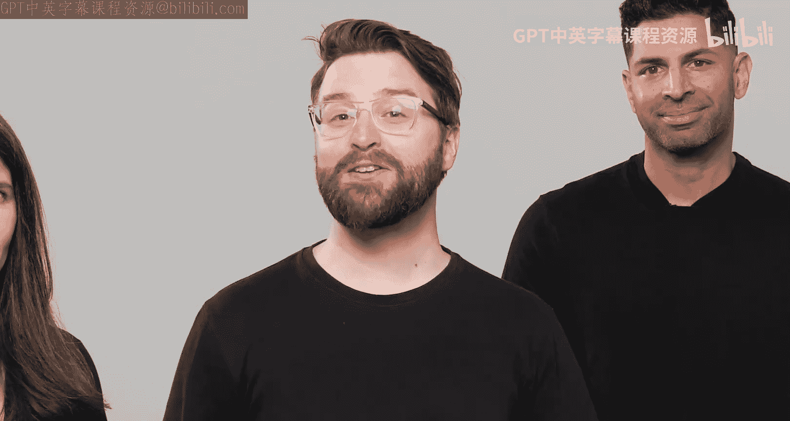
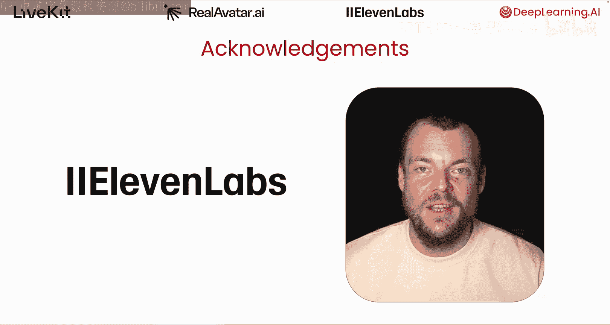

# 001：课程介绍 🎤

在本节课中，我们将介绍《构建生产级AI语音助手》这门课程的目标、讲师团队以及课程的核心项目案例。你将了解我们将要学习的关键组件和挑战。

欢迎来到由Ruslan、Shane、Emily和Naina Tlliveva主讲的《构建生产级AI语音助手》课程。Ruslan是Livekit的联合创始人兼CEO，Shane是Livekit的开发者布道师。Naina是Ro Avatar的AI负责人，并与DeepLearning.AI团队共同开发了一款对话式虚拟形象。Ro Avatar也是AI Ts的一个投资组合公司，我领导着这个专注于能与用户对话的智能体的团队。事实证明，这正成为人们与AI智能体互动的一种重要方式。

DeepLearning.AI和Ro Avatar团队，包括Naina，在使用Livekit构建对话式虚拟形象方面拥有丰富的经验。我个人也非常喜欢在各种其他项目中使用Livekit。在本课程中，我们希望与您分享构建语音智能体的一些最佳实践。

让我描述一下我们将作为贯穿课程示例的项目。我们从一个类似于您可能在之前的课程中见过或构建过的对话式智能体开始。我们开发了一个智能体工作流，让系统尝试选择词语，以在不同情境下说出类似于我会说的话。在输入侧，我们添加了一个**语音转文本模型**，将用户的音频语音转换为文本，供智能体工作流处理。在输出侧，我们添加了一个**文本转语音模型**，将文本输出转换为语音，然后可以使用来自11 Labs的模型生成音频并播放给用户。该模型被训练成模仿我的声音，我认为音频效果相当不错，稍后你会听到并可以自行判断。我们希望这个系统能够扩展到大量用户，因此我们迁移到了一个能够支持许多并发用户的云基础设施。最后，该服务的用户可能遍布世界各地，这带来了网络问题和音频集成挑战。

我们的解决方案使用云资源来支持虚拟形象的前端，后端则运行智能体工作流，并集成Livekit来提供通信基础设施。Naina、Shane和Ruslan将在课程中详细介绍这些内容。

在第一课中，你将学习语音管道的组件，包括**语音转文本**和**文本转语音**模型，以及**语音活动检测**和**话轮结束检测**。你还将了解**延迟**的重要性以及一些保持低延迟的策略。

然后，我们将试用一个语音智能体。你将了解语音智能体与其他应用程序的真正不同之处：语音智能体具有状态，并且为了有效，必须具有临场感，就像对话的另一端有另一个人一样。

在第四课和第五课中，你将构建一个可以在课程中使用或下载到自己机器上的语音智能体。你将学习如何测量语音管道中的延迟，以实现自然的对话。

许多人共同努力创建了这门课程。我要感谢来自Livekit的Theo Manom和来自Gi Bla A I的Jeff Ladwayig。此外，我还要感谢来自11 Labs的4 Shave，他创建了本课程中将使用的语音转文本模型，并为本课程提供了支持。

感谢你，Andrew。很高兴能成为这门课程的一部分。我希望你会发现对话式AI智能体和我们一样引人入胜，并愿意花时间不仅探索11 Labs的文本转语音技术，还有我们功能齐全的对话式AI平台，它允许你在几分钟内为你的智能体添加语音功能。我们迫不及待想看到你将构建出什么。这听起来很棒。让我们开始下一课，概述语音智能体。