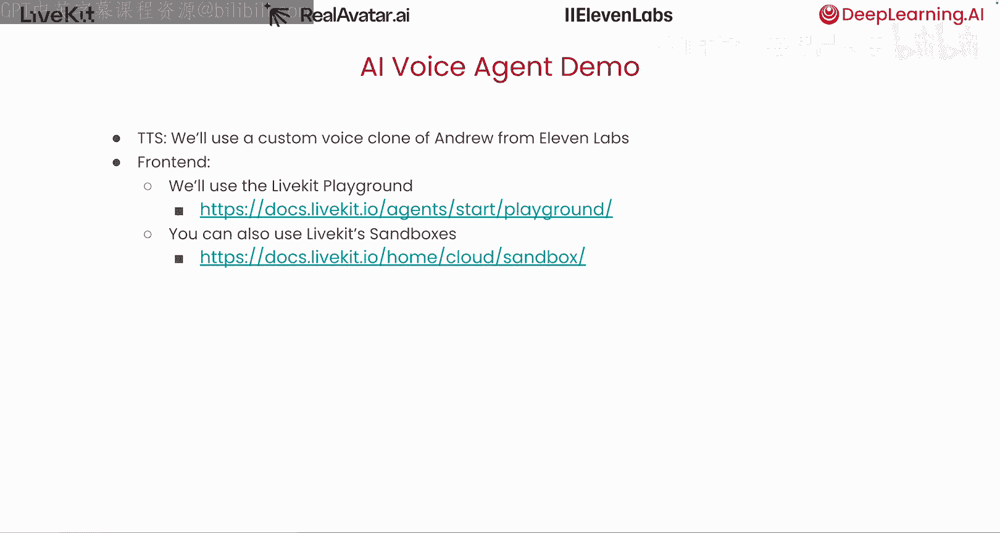
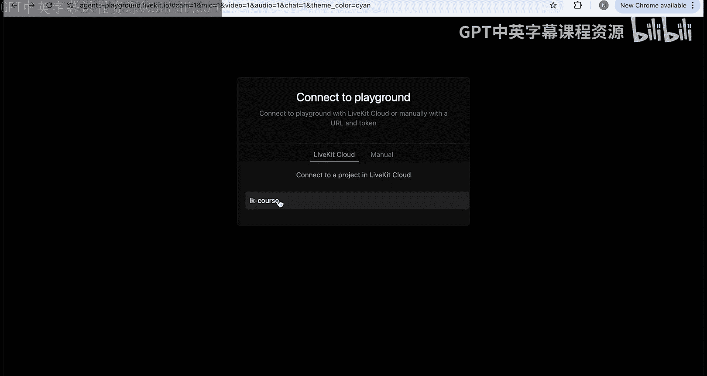
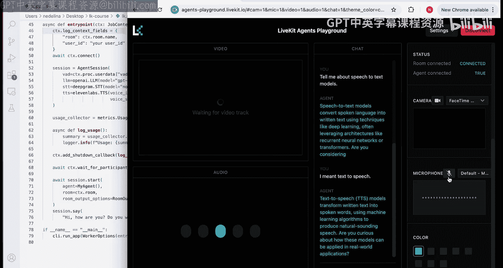

# 002：语音助手概述 🎙️

在本节课中，我们将学习AI语音助手的基础知识。我们将了解其核心组件，如语音转文本、文本转语音和大语言模型，并分析语音助手技术栈每一层引入的延迟。我们将探讨像LiveKit这样的平台如何通过提供优化的网络基础设施和实现低延迟通信协议来缓解这些延迟挑战。最后，我们将通过一个Python构建语音助手的最小示例，并探讨评估和提升语音助手性能的实用方法。

## 什么是AI语音助手？

在深入之前，你可能会问，究竟什么是AI语音助手？简单来说，AI语音助手将语音能力与基础模型的推理能力相结合，以实现实时、类人的对话。语音助手在多种场景中都非常有用。在教育领域，它们可以指导个性化技能发展或进行模拟面试。在商业领域，它们可以帮助处理客户服务电话，例如在餐厅预订餐桌或协助销售。由于语音助手交互是免提的，它们还能增强可访问性。想象一下，患者可以使用语音助手描述症状或在家进行谈话治疗。

## 语音助手技术栈剖析

现在，我们来剖析一下语音助手的技术栈。该系统以用户的语音（如问题或请求）作为输入，并产生语音响应。在某些情况下，音频输出也可能与视频同步，例如一个会说话的头像，但本课程将专注于纯音频交互。

在设计语音助手内部结构时，我们有两个主要选项。第一种是使用“语音到语音”或实时API。这种选项实现起来更简单，但对助手行为的控制灵活度较低。第二种，也是本课程主要关注的方法，是“流水线”方法。

语音助手流水线由三个组件组成：一个语音转文本模型或API、一个LLM或智能体框架，以及一个生成最终音频输出的文本转语音模型或API。

## 流水线组件详解

让我们更详细地看看语音助手流水线的每个组件。

**第一个组件是自动语音识别，也称为语音转文本。** 这涉及将给定的音频信号（通常是波形）转录为文本。输入是原始音频，输出是相应的转录文本。

**第二个组件是大语言模型或更广泛的智能体工作流。** 它基于转录的文本生成响应。这一层可能涉及一个或多个LLM智能体，通常通过工具使用、记忆或规划能力进行增强。附带一提，语音助手也可以生成带有支持材料（如图像或链接）的转录文本，作为其功能的副产品。这个流水线可以推广以支持此类多模态LLM响应，从而在需要时同时显示语音输出和视觉上下文。

**第三个组件是文本转语音，也称为语音合成。** 这是将生成的文本转换回听起来自然、清晰可懂的语音的任务。这里的输入是文本，输出是音频。在稍后你将看到的演示中，合成的声音是Andrew的。

除了这三个主要组件，还需要强调两个在ASR步骤之前发生、对于正确处理人类语音至关重要的任务。

**第一个任务是语音活动检测。** 它用于确定音频信号中是否存在人类语音。例如，未检测到语音可能对应于自然的停顿或主要由背景噪音主导的部分。

**第二个任务是说话轮次结束检测。** 它用于识别说话者何时完成了他们在对话中的轮次。这是一个不小的挑战，因为语音通常包含不同长度的停顿，这取决于说话者的语言、习惯和表达风格。

## 如何构建这些组件？

既然我们已经回顾了两种语音助手架构的核心组件，下一个问题是：我们如何实际构建这些组件？幸运的是，我们不需要从零开始。相反，我们可以专注于对我们特定用例最重要的技术栈部分。例如，根据应用的不同，某些组件可能需要比其他组件更多的关注。

如果你正在为临床环境开发语音助手，ASR组件就变得至关重要。你需要准确识别专业的医学词汇，并满足严格的精度要求。另一方面，如果你正在开发餐厅预订助手，LLM或智能体工作流就变得更加重要，因为你需要强大的推理能力和可靠的工具使用来避免诸如超额预订餐桌等问题。

除非你的用例需要专门的或设备端模型，否则你可以从众多提供商中选择TTS、STT和LLM服务。在本页幻灯片上，我们在灰色框中列出了一些选项。正如你所见，有许多提供商可供选择，值得在演示中探索。在本课的演示中，我们使用OpenAI进行STT，使用ElevenLabs进行TTS。对于文本转语音输出，我们使用Andrew声音的录音训练了一个ElevenLabs自定义语音模型，以创建一个一致且个性化的AI语音克隆用于语音合成。最后，对于LLM组件，由于低延迟是关键要求，你可能希望探索由快速推理提供商（如Groq、Cerebras或Together AI）提供的开源Llama模型。

如果你选择使用“语音到语音”或实时API方法构建语音助手，也有几个提供商支持该工作流。这些API抽象了底层流水线的大部分复杂性，非常适合快速部署比精细控制更重要的用例。

## 延迟挑战与优化

无论你选择哪种智能体架构，都将面临一个主要挑战：**时机**。人类期望在很窄的时间窗口内得到响应。如果系统延迟，交互很快就会显得不自然。为了保持流畅的对话流程，你的基础设施必须支持低延迟音频流，并有效管理流水线中的输入和输出流。

例如，在流水线方法中，你需要协调多个用户的实时交互，同时确保在VAD、STT、LLM和TTS等组件之间无缝切换，而不会在任何阶段引入明显的延迟。

在考虑延迟时，从一个基准开始是有帮助的：在自然对话中，人类期望多快得到响应？研究表明，平均而言，人们期望在对话伙伴说完话后的236毫秒内得到回应。然而，标准差相当高，大约在520毫秒左右，这反映了人类语音的自然变异性。同样重要的是要注意，这些数字是基于英语使用者的。其他语言可能表现出显著更快或更慢的响应时间。

现在，如果你看幻灯片上的表格，我们可以看到语音助手流水线每一步引入的延迟。在最佳情况下，通过高效的输入/输出流处理，完整语音助手响应的延迟下限约为540毫秒。这使其刚好处于人类期望值的一个标准差范围内。然而，根据你所用提供商的服务水平协议，延迟可能增加到超过一秒半，用户几乎肯定会注意到。

那么，我们如何接近符合自然人类对话的低延迟界限呢？关键在于**实时点对点通信**，它支持设备之间的直接数据交换，绕过中间服务器，从而显著减少延迟。在这种设置中，你的客户端（如网络浏览器或移动设备）充当一个对等点，而你的语音助手后端则充当另一个对等点。

LiveKit的基础设施旨在通过一个用于媒体转发的全球分布式网状网络来支持这一点。系统的核心是几项技术：首先，**WebRTC** 是一个开源项目，通过标准化API为Web和移动应用程序提供实时通信能力。其次，**WebSocket** 用于建立客户端-服务器握手，实现高效的信号传递和会话管理。最后，LiveKit的开源实现依赖于异步处理和输入/输出流以及流式API的仔细管理，特别是对于STT、TTS和LLM组件。这确保了整个语音助手流水线的流畅、低延迟性能。

虽然底层点对点基础设施很复杂，Rus将在课程后面带你深入了解，但LiveKit抽象了大部分复杂性，使得仅用几行代码定义AI语音助手变得非常简单。在本页幻灯片上，你可以看到一个如何设置语音助手后端的最小示例。有三个主要组件需要关注：首先是定义智能体本身，包括任何提示词；其次是智能体会话，它将你选择的语音转文本、LLM和文本转语音提供商链接到一个功能性的流水线中；第三是入口点函数，它作为每个新点对点通信的主函数执行。你将在课程后面更深入地了解代码和配置。现在请注意，在本课的演示中，我们将代码中的`TTS_VOICE_ID`变量设置为引用一个我们训练过的自定义ElevenLabs语音克隆，以匹配真实的头像。

## 构建语音应用的独特挑战

为了结束本节，我想强调构建基于语音的应用时面临的一些独特挑战。首先，言语障碍，如填充词（如“嗯”）或长停顿，可能会在转录中引入伪影，并影响说话轮次结束检测。这些问题随后会传播到给LLM的输入中，可能降低输出质量。其次，如果你正在开发多语言语音助手，请记住，多语言ASR模型的表现通常不如英语ASR模型。

现在，让我们简要谈谈延迟优化。在实践中准确测量延迟是具有挑战性的，尤其是在试图将客户端延迟与服务器端延迟分开时。为了通过设计帮助最小化这些延迟，LiveKit提供了低延迟网络基础设施。在STT-LLM-TTS流水线中，LLM组件通常是延迟的主要来源。为了减少它，你可以在自托管时使用更小或量化的模型，或者如果你依赖LLM API，可以选择更快的推理提供商。你还可以提示LLM生成更短或分阶段的回复，以减少感知到的响应延迟。

## 演示与实践

现在让我们看看实际效果。我将向你展示我们用于Andrew头像的语音助手的简短演示。语音助手后端在我的笔记本电脑上本地运行。对于前端，我们将使用LiveKit Playground，这是一个多功能Web前端，可以轻松测试你的多模态AI智能体，而无需担心UI，直到你对后端满意为止。

（演示过程描述：左侧显示语音助手代码，与之前展示的最小示例代码非常相似。右侧后端显示代码在本地计算机命令行上运行。浏览器中运行着LiveKit Playground，已为课程创建了项目。通过连接和对话，演示了语音助手的响应、语音活动检测和打断功能。）

## 总结

在本节课中，我们一起学习了AI语音助手的基础概念。我们了解了其核心架构，包括**语音转文本**、**大语言模型**和**文本转语音**三大组件构成的流水线。我们探讨了构建过程中面临的**延迟挑战**，以及如何通过**实时点对点通信**和优化基础设施来应对。最后，我们通过一个实际演示，看到了一个功能完整的语音助手是如何工作的，并了解了评估和优化其性能的一些关键考量。下一节课，我们将深入了解语音助手的端到端架构细节。