# 003：端到端架构 - 第一部分

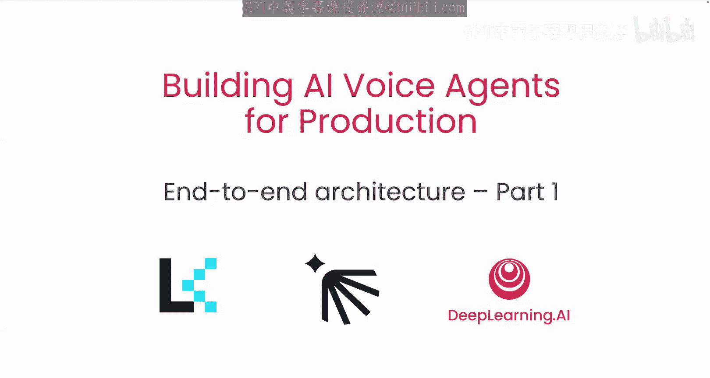

## 概述
在本节课中，我们将学习如何为AI语音助手设计端到端架构。我们将重点探讨用户设备与服务器端语音代理之间的通信，分析不同网络协议的优劣，并了解如何选择最适合实时语音流传输的技术方案。

---

## 网络协议基础

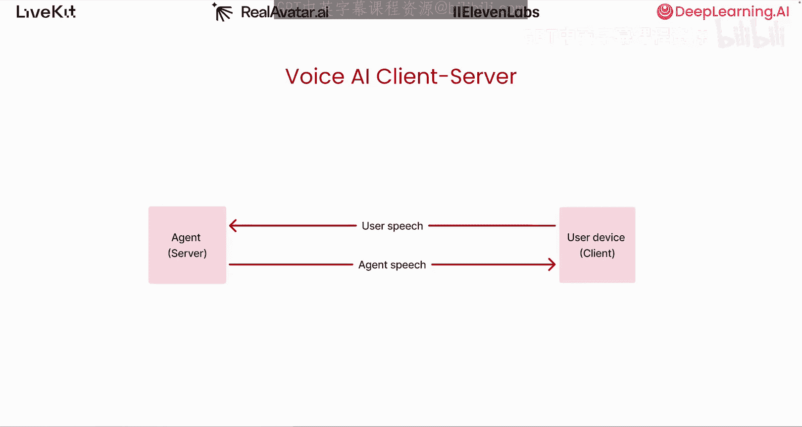

上一节我们介绍了构建语音助手的基本概念，本节中我们来看看连接用户与服务器的网络基础。

互联网建立在**IP（互联网协议）**之上。IP负责为每个设备分配一个地址，就像房屋的地址一样。如果一个设备想向另一个设备发送信息，类似于在两个房屋之间发送实体邮件，有几种建立在IP之上的协议可以实现这一点：**TCP**和**UDP**。它们各自提供了不同的方法。

### TCP协议：可靠性优先
TCP优先考虑可靠性而非低延迟。我们可以想象用户正在使用TCP向代理发送一些语音数据包。互联网就像世界的道路系统，每个发送出去的数据包在网络中可能采取不同的路由。在这个例子中，数据包1和3首先到达代理，而数据包2仍在传输中。TCP不会向你的应用程序（本例中是代理）提供数据包1和3的访问权限，直到数据包2到达。如果数据包2在传输中丢失（这有可能发生），接收端的TCP协议会要求发送方重新发送数据包2。与此同时，你的代理程序必须继续等待，直到数据包2成功到达。

现在，请想象一个现实世界的语音代理示例，其中每秒有成千上万个音频数据包被发送。即使其中一小部分数据包丢失或到达代理的速度较慢，也可能导致队列积压或停滞。你可能会在其他地方看到这个问题，被称为**队头阻塞**。TCP的设计对于语音代理应用来说是有问题的，因为它最终会导致音频播放结巴或冻结，从而带来糟糕的用户体验。

### UDP协议：低延迟优先
另一方面，UDP优先考虑低延迟而非可靠性。与TCP不同，使用UDP时，协议会在收到数据包的瞬间就将它们全部交给你的代理。具体来说，如图所示，你的代理可以立即访问数据包1和3，即使数据包2仍在传输中。这意味着你的代理实际上可以决定在这种情况下该怎么做：它可以等待数据包2，忽略数据包2，甚至在数据包1和3之间进行插值，或者可能直接跳过数据包1和2，从数据包3开始处理。

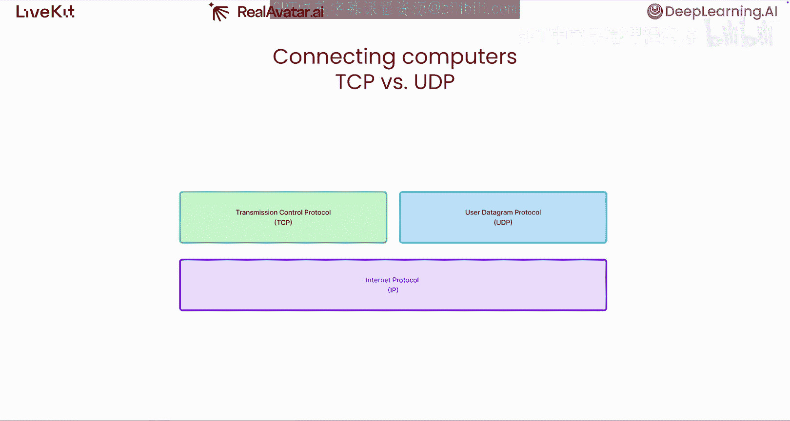

对于像AI语音助手这样的实时流媒体应用，UDP是更合适的选择，因为它让我们在糟糕的网络状况下能完全控制如何处理数据。

---

## 高层网络协议选择

既然我们知道UDP是我们的用例的理想选择，我们该如何使用它呢？它是一个底层协议，因此直接使用它需要编写大量代码。幸运的是，有一些更易于使用的高层网络协议。有三种协议在所有浏览器、桌面和移动设备上得到广泛支持，那就是**HTTP**、**WebSocket**和**WebRTC**。

### HTTP协议及其局限性
HTTP建立在TCP之上，我们现在知道TCP并非我们构建应用的理想选择。它是一个无状态协议，意味着它并非为需要持续来回流式传输数据的长连接而设计。

使用HTTP时，发送方连接到接收方，发送一些数据，然后断开连接。忽略其底层的TCP劣势不谈，如果我们仍然想使用HTTP在用户和代理之间交换语音数据，我们必须弄清楚在发送方要缓冲多长时间的音频，建立到接收方的连接，发送该缓冲区，然后在发送完成后断开连接。这不仅难以做好，而且每次连接和断开都需要额外的时间，这会增加整体延迟，并使处理用户中途打断代理等事情变得困难。

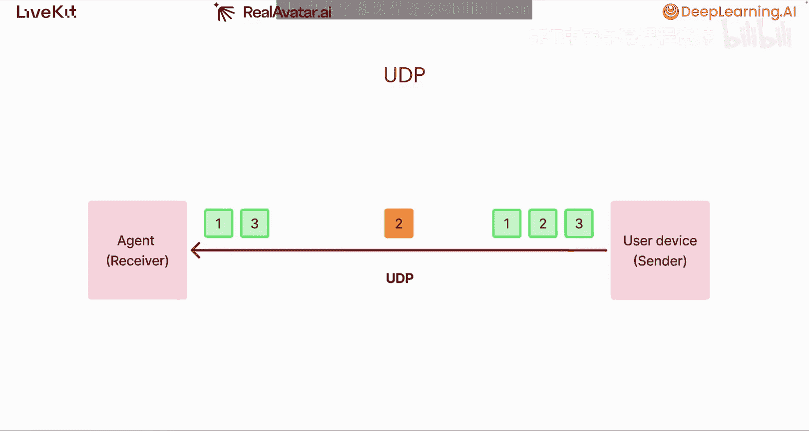

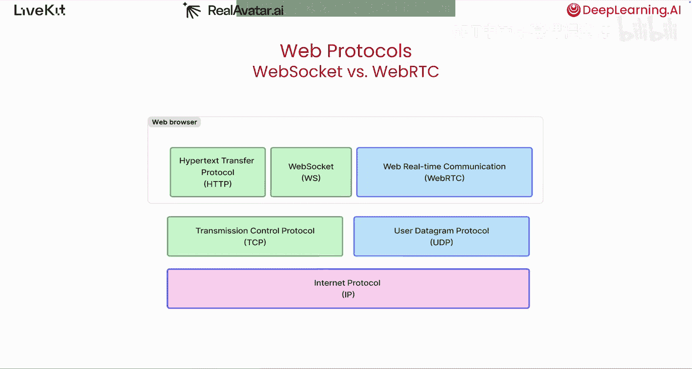

最后，HTTP代表**超文本传输协议**，而不是超音频、超语音或超语音协议，这意味着它没有用于来回发送音频数据的高层抽象。对于我们的用例来说，在客户端和服务器之间交换音频数据是我们主要做的事情，因此拥有强大的工具来做这件事会很好。

**一个有趣的事实**：十多年前，像Siri或Alexa这样的应用实际上为它们的语音代理使用HTTP。当用户有疑问时，他们的客户端应用（如Alexa设备）会将他们的语音录制到本地文件。一旦用户说完话，他们的客户端会向服务器端点发出HTTP请求，将包含用户查询的音频文件上传到亚马逊服务器。服务器应用处理他们的查询，生成一个音频文件响应，并在HTTP响应中发回该文件。一旦客户端应用下载了音频文件，它就会通过设备扬声器播放出来。现在你更了解HTTP在底层的工作原理，就能明白为什么那些早期的语音代理感觉不那么快速或像对话了。

---

## 理想架构：有状态连接

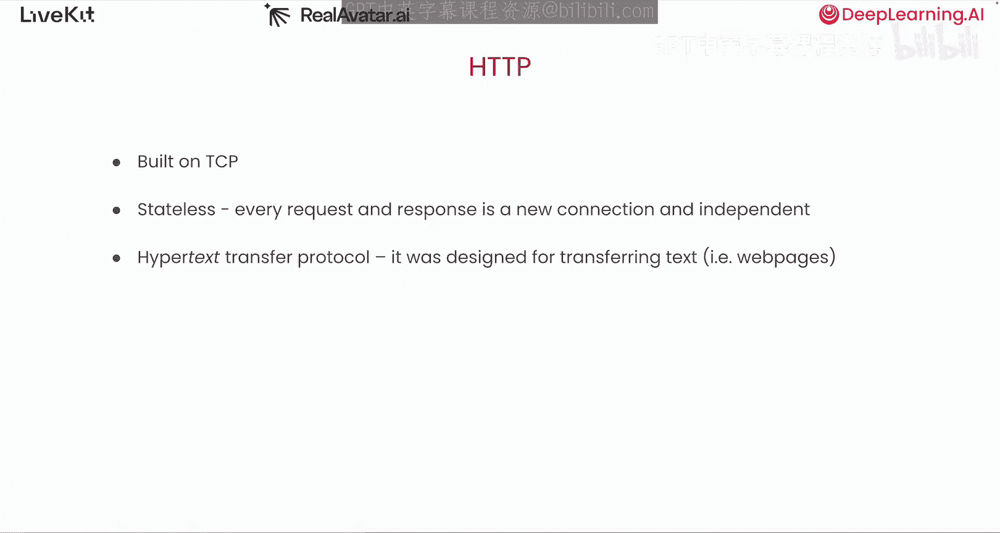

我们需要的是一个**有状态架构**，一个可以在用户和代理之间建立持久连接并持续来回流式传输音频的架构。任何一方都可以实时处理语音，就像人类用耳朵听一样，并在代理生成语音或用户说话时流式传输语音。有了有状态系统，代理可以建立对话历史，并实时检测用户何时说完话或何时打断它。

是否有协议可以帮助我们实现这一点？

### WebSocket协议
WebSocket确实支持持久连接，并允许我们来回流式传输任意数据，但像HTTP一样，它建立在TCP之上，因此从根本上遭受同样的问题。它也没有任何用于来回发送音频数据的特殊设施。

### WebRTC协议
WebRTC是另一种广泛支持的协议，支持长连接和双向数据流。它建立在UDP之上，并且是专门为在两台计算机之间传输音频或视频数据而设计的。

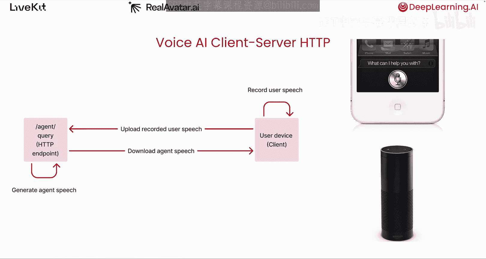

在协议层面，WebRTC实时测量网络状况，并调整音频数据包的发送节奏，以便它们尽可能平稳、一致地到达接收端。它还会在数据通过线路发送之前自动压缩音频数据，这有助于降低延迟。一方需要发送的数据越多，所需时间就越长。例如，通过HTTP请求发送的或通过WebSocket流式传输的5秒未压缩语音数据，在被WebRTC协议压缩后，数据大小仅为原来的3%。

最后，WebRTC会自动为通过线路发送的每个数据包加上时间戳，使得处理中断和准确知道中断发生的时间变得轻而易举。

---

## WebRTC的挑战与解决方案

WebRTC被世界上一些最广泛采用的应用大规模使用。Discord、Google Meet、Zoom和TikTok都将其用于实时音频和视频流。

然而，WebRTC也带来了一些挑战。

### 挑战一：复杂性
它确实非常难以使用。这仅仅是在发送方和接收方之间建立一对一通话所需的完整调用栈。

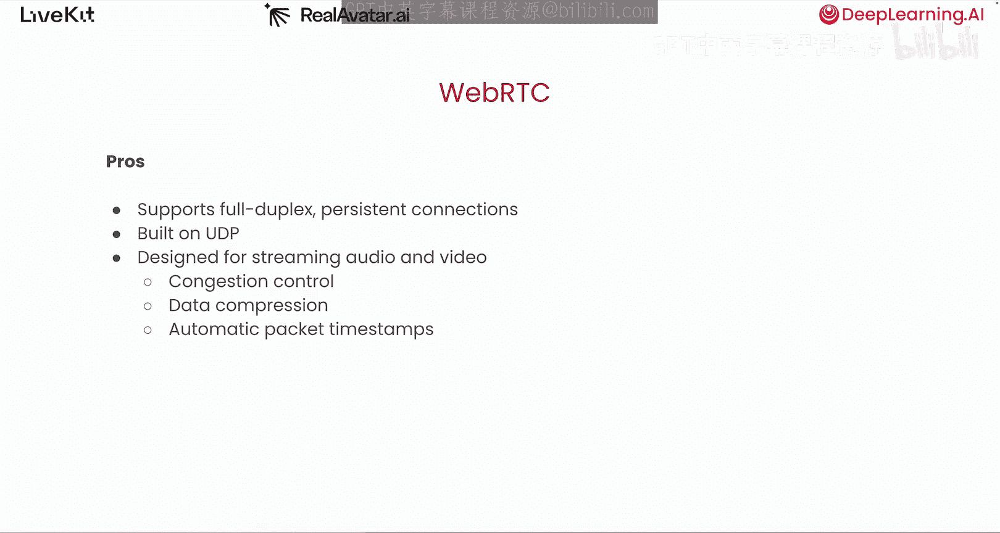

### 挑战二：扩展性
标准的WebRTC协议是一个点对点协议。这意味着，如果我们为标准WebRTC用于我们的语音代理应用，你的用户和代理将直接连接。语音数据将通过公共互联网直接从源流式传输到目的地。

正如我们之前学到的，公共互联网就像世界的道路系统，有相当于高速公路、住宅街道、单车道、坑洼，甚至高峰时段。其他人的数据包和你的数据包在同一条道路上行驶。你的数据包需要行驶的距离越长，它们最终遇到这些道路危险的可能性就越大，这些数据包到达目的地所需的时间也就越长。

解决这个问题的一种方法是在世界各地部署你的代理，这样无论你的用户在哪里，他们与代理之间交换音频的路径都相对较短。然而，这是一项相当艰巨的任务，并且带来了很多操作复杂性。

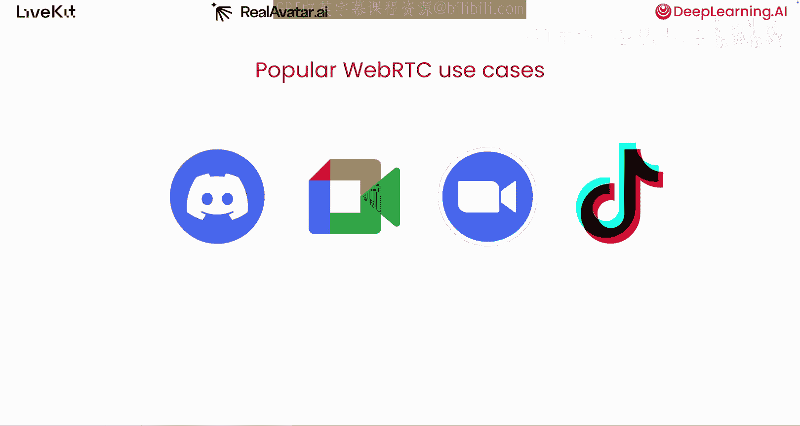

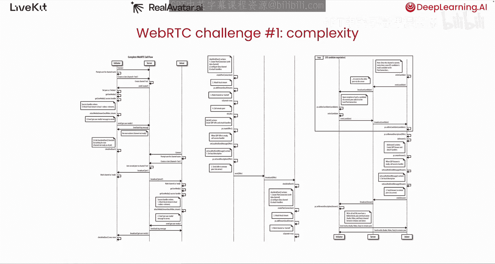

幸运的是，有基础设施可以解决使用标准WebRTC带来的这两个挑战。

---

## LiveKit：简化WebRTC

LiveKit是一个开源项目，它使得使用WebRTC构建和扩展语音代理比在客户端使用HTTP或WebSocket更容易。

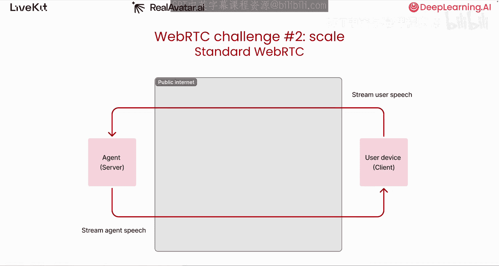

在客户端，LiveKit拥有适用于所有平台的开源SDK，你可以将其集成到你的应用中。它简化了在用户和代理之间建立持久连接以及来回流式传输语音的过程。

在服务器端，LiveKit有一个开源框架，使得构建AI语音代理变得简单。我们将在下一课中更多地讨论代理端。

还记得我们学到的那个道路系统吗？事实证明，还有另一种避免交通拥堵的方法。与其走公共道路，不如让我们沿着互联网中的私人隧道行驶。

LiveKit Cloud是一组分布在世界各地的WebRTC服务器，它们形成了一个全球隧道网络。当你的用户想要向你的代理流式传输语音数据时，他们可以通过公共互联网将数据发送到最近的LiveKit Cloud服务器。从用户设备到最近站点的这一跳距离很短，因此增加的延迟不大。一旦数据包到达LiveKit Cloud服务器，它们就会通过这个隧道网络，沿着优化后的路径传输，几乎没有拥塞。数据包将在最靠近代理运行位置的服务器处退出LiveKit的网络，并完成到代理本身的最后一段短途旅行。

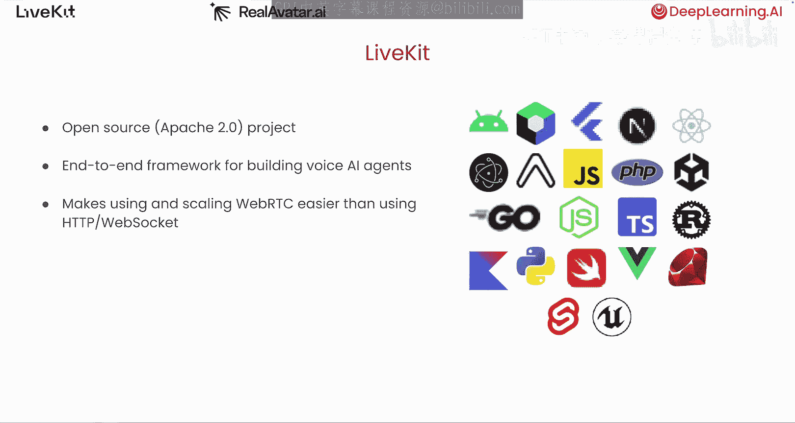

在实践中，这种策略将用户和你的代理之间的网络延迟降低了约20%到50%。

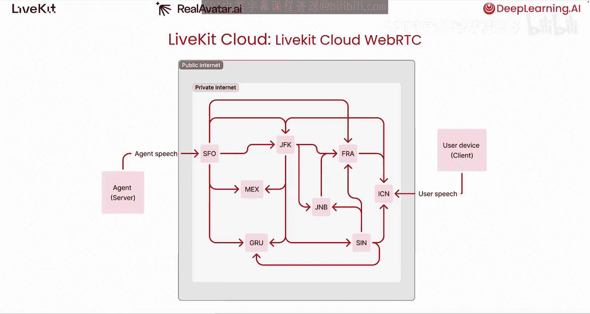

如果你有兴趣看到LiveKit的实际应用，OpenAI团队使用LiveKit构建了ChatGPT高级语音模式。当你与他们的语音代理交谈时，所有这些语音数据都通过LiveKit的云网络来回传输。

---

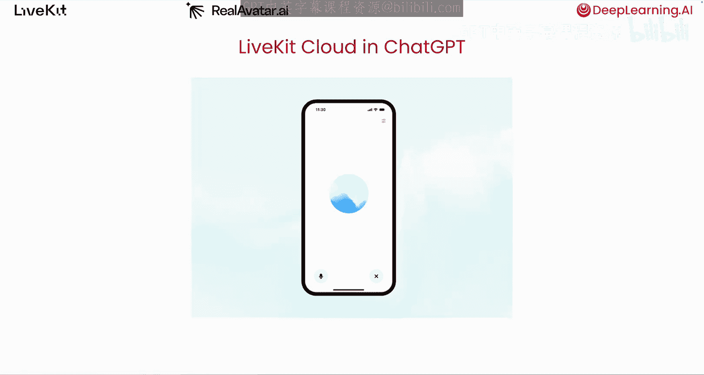

## 总结
本节课中，我们一起学习了AI语音助手端到端架构的第一部分。我们深入探讨了用户设备与服务器代理之间的通信机制，比较了TCP与UDP协议在实时语音传输中的优劣，并得出结论：基于UDP的WebRTC协议是构建低延迟、流畅语音交互的理想选择。我们还介绍了WebRTC的挑战以及如何利用LiveKit这样的基础设施来简化开发并提升全球网络性能。现在你已经很好地理解了用户设备和你的代理之间底层发生的情况，接下来我们将更多地讨论语音代理本身，以及一旦用户的语音到达服务器后，幕后发生了什么。