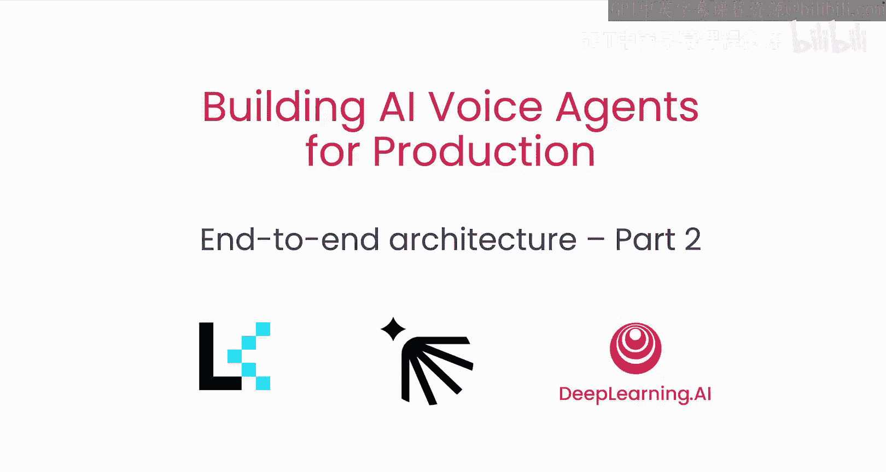
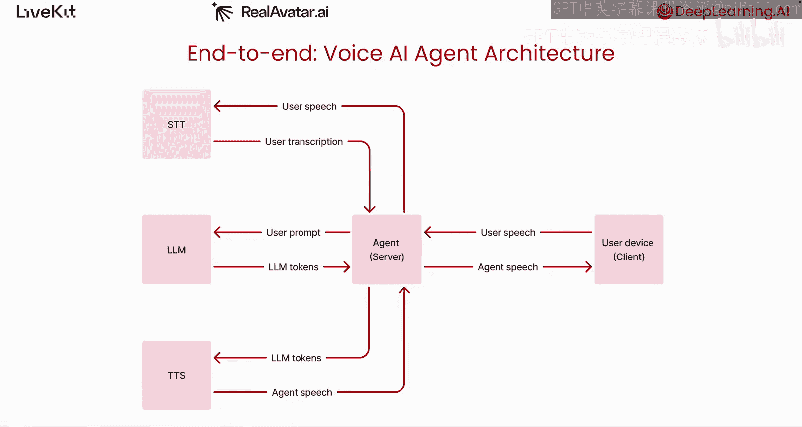
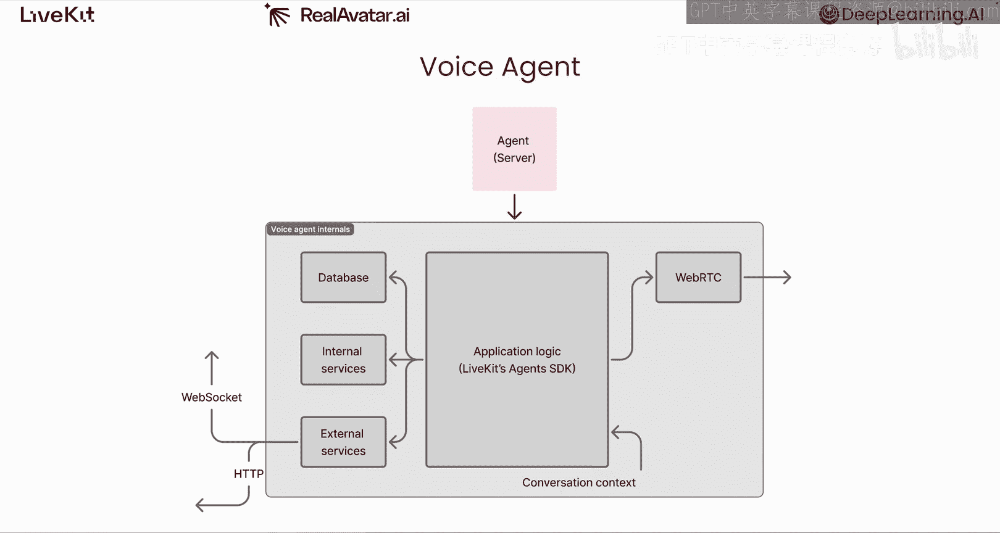
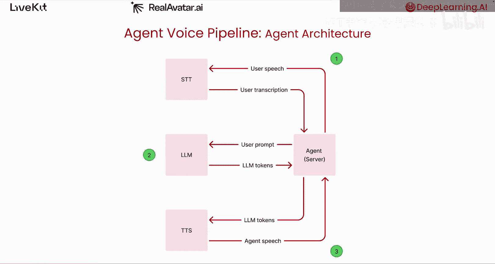
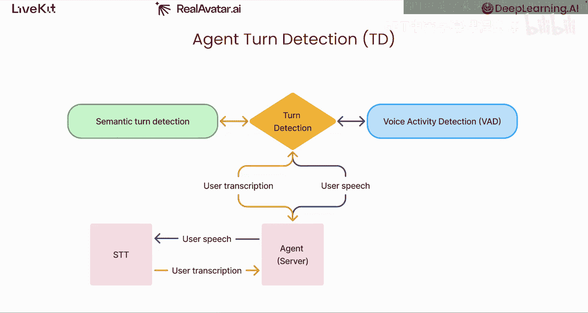
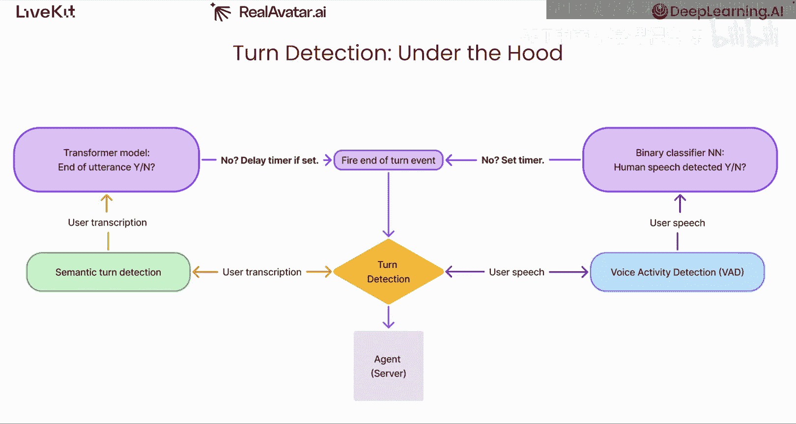
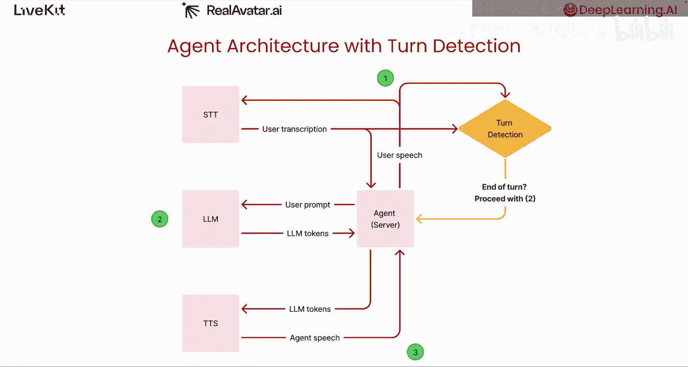
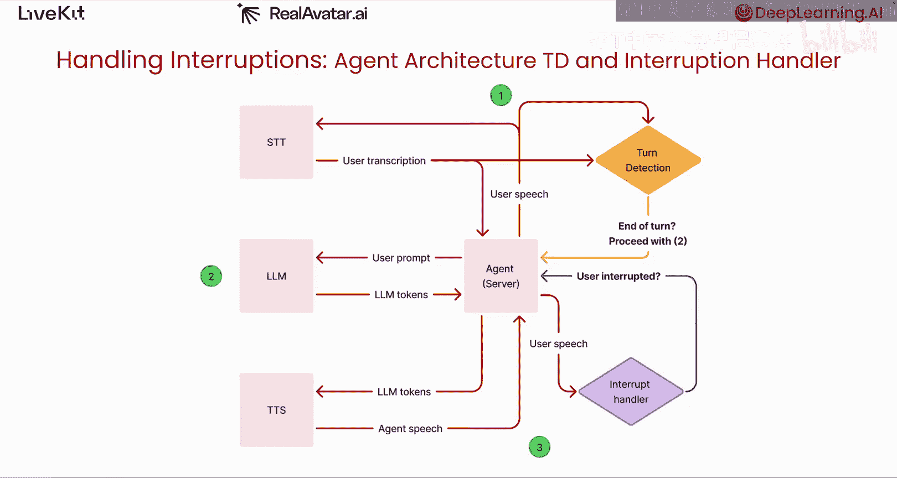
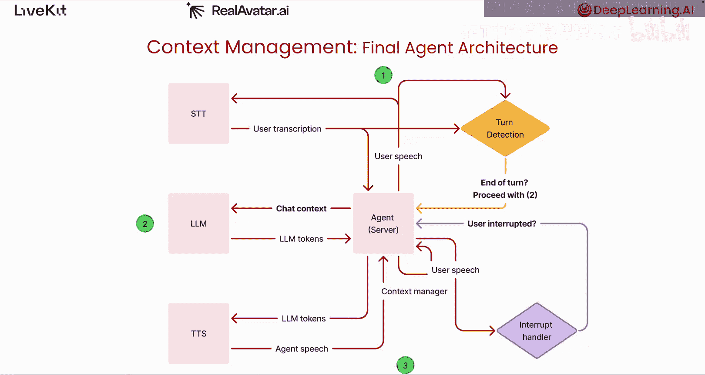
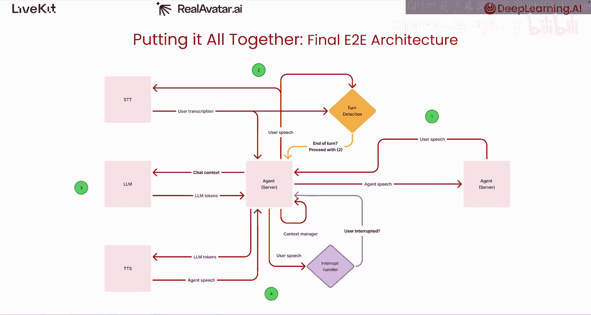

# 004：端到端架构（第二部分）🎤

## 概述
在本节课中，我们将深入探讨语音助手（Voice Agent）的核心架构，了解其如何通过一个有序的“流水线”模型来“听”、“想”和“说”。我们将重点解析语音转文本（STT）、大语言模型（LLM）和文本转语音（TTS）如何协同工作，并学习构建拟人化对话体验中最具挑战性的技术之一：话轮检测（Turn Detection）。

---

## 语音助手是什么？🤖

上一节我们介绍了如何通过WebRTC将客户端设备连接到语音助手。这很棒，用户现在可以用低于30-50毫秒的延迟与你的助手对话。

那么，语音助手究竟是什么？语音助手本质上是一个**有状态的计算机程序**，它能够消费和处理流入的语音数据（例如用户对着手机说话），并生成语音响应发送回用户。你的助手程序的大部分应用逻辑将针对你的具体用例，但使用LiveKit的Agent SDK构建的语音助手具有一个持久的WebRTC连接，将其与一个或多个客户端设备链接起来。

LiveKit的Agent SDK还负责管理对话上下文，并为每个想要与之对话的用户启动一个助手实例。每个助手实例可以保持数据库连接以执行诸如RAG（检索增强生成）之类的操作，与同一台机器上运行的库或服务交互，或发起HTTP请求，或建立WebSocket连接。

这些外部服务连接用于语音转文本或LLM推理等功能。在接下来的课程中，你将使用LiveKit的Agent SDK来构建你的语音助手。你将使用Python构建，但也可以使用Node.js。

---

## 助手的“听、想、说”流水线 🔄

我们如何赋予助手倾听、思考和回应用户的能力？让我们放大来看这部分。这就是所谓的**流水线**或**级联组件模型**语音架构。

当用户的语音输入数据流式传输到助手时，它会经过一系列有序的步骤，然后助手的语音响应才会被发送回用户。

以下是该流水线的核心步骤：

1.  **语音转文本（STT）**：助手将用户的语音转发给一个较小的**语音转文本AI模型**（常缩写为STT）。STT模型实时将语音转换为文本，并传回给助手。
2.  **大语言模型推理（LLM）**：当用户停止说话，助手获得了用户所说的完整转录文本后，它会将该完整转录作为用户的提示词（prompt）转发给一个**LLM**。LLM接收该提示词并对其进行推理。随着输出令牌（token）的生成，它们会从LLM流式传输回助手。
3.  **文本转语音（TTS）**：助手收集并组织这些令牌。对于它收集到的每一个句子，助手会将该句子转发给另一个较小的**文本转语音模型**（常缩写为TTS）。TTS模型将助手发送的句子转换回语音，并流式传输给助手。
4.  **音频流回传**：助手接收这些数据，并将来自TTS的语音数据字节，通过我们在上一课中讨论过的持久WebRTC连接，实时转发回客户端设备。

这就是你的助手运行的完整端到端流水线：它接收用户语音，转换为文本，将该文本输入LLM，将LLM输出的令牌通过TTS管道传输，然后从TTS将音频流式传输回用户。

---

## 话轮检测：拟人对话的关键 🎯

现在，我想把注意力转向构建令人信服的拟人语音助手中最困难的问题之一：**话轮检测**。

在人类对话中，这种在说话和倾听之间交替的概念被称为**话轮转换**。人类非常擅长自动知道何时该说话或倾听。话轮检测是语音助手用来判断用户何时说完、可以做出响应的启发式方法。

话轮检测系统结合了两种信号：
*   **信号处理**：用户是否真的在说话？
*   **语义处理**：用户实际说了什么？

以下是其典型工作方式：

当用户音频流入时，它不仅被发送到STT，同时也会并行流式传输到一个叫做**语音活动检测**（简称VAD）的模块中。VAD分析音频信号，它是一个小型二元分类神经网络，简单地输出在输入样本中是否检测到人类语音。

当比特位从“检测到人声”翻转为“未检测到人声”时，VAD会启动一个计时器，计时器在开发者可配置的毫秒数后触发一个标记用户话轮结束的事件。如果在计时器触发前VAD再次检测到人声，则一切重置。

同时，当用户的语音被STT转换为文本并发送回助手时，助手也将转录文本转发给话轮检测系统的另一部分：一个**语义话轮检测器模型**。LiveKit有一个我们内部训练的开源模型。它接收用户转录的语音以及对话中前三四轮的转录文本，并基于用户所说的内容输出一个预测，判断它认为用户是否已经说完。

例如，如果VAD检测到静默并设置了计时器来触发话轮结束事件，但语义模型认为用户还没说完（可能只是在思考间隙停顿），那么话轮检测器会将计时器的触发延迟一段可配置的时间。

现在我们理解了话轮检测，这就是我们整合了该功能的整体语音助手架构图。**只有当话轮检测系统触发了话轮结束事件时，助手才能继续将用户转录的语音转发给LLM进行推理。**

---

## 中断处理与上下文管理 ⚡

VAD不仅用于话轮检测。它也用于**中断处理**，以模拟两个人对话的动态。

我们需要能够处理用户**在助手说话中途打断**的情况。这可能由于多种原因发生，包括LLM可能说得太多、用户改变了主意，或者用户想纠正自己。

在底层，由于用户的语音已经通过话轮检测传入VAD，我们使用**人声的存在**（而非话轮检测中的人声缺失）作为中断信号。当中断发生时，语音流水线下游的每个部分都会被刷新：如果LLM当时正在进行推理，则停止；如果有任何助手的语音正在由TTS生成，也同样停止。

我们整体架构的最后一个更新是**上下文管理**。当轮到助手思考和说话时，不仅发送用户最近一次说话的转录文本给LLM，还会一并发送该会话中迄今为止任何一方所说的所有内容的完整历史记录。这包括诸如函数调用及其结果等内容，这是大多数生产级语音助手的一部分。

LiveKit的Agent SDK还会在用户打断助手时自动同步LLM上下文。它使用时间戳来确定用户最后听到的助手回放内容，并将助手端的对话对齐到这一点。

---

## 总结 🎓

本节课中我们一起学习了语音助手的核心架构。我们拆解了“听-想-说”的完整流水线，深入探讨了实现自然对话的关键技术——话轮检测，它结合了VAD信号处理和语义分析。我们还了解了如何通过VAD实现中断处理，以及如何管理对话上下文以确保连贯性。

现在，我们已经将所有部分整合在一起。在下一课中，我们将把这里讨论的所有理论概念付诸实践，构建一个你可以与之对话的语音助手。

