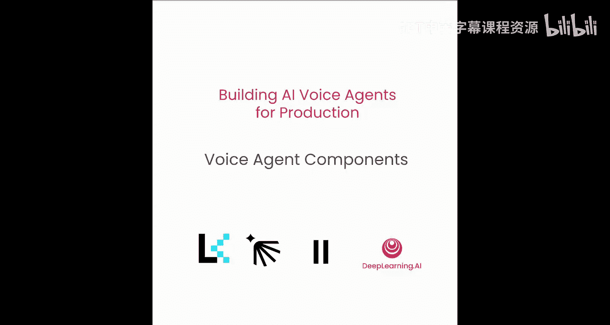
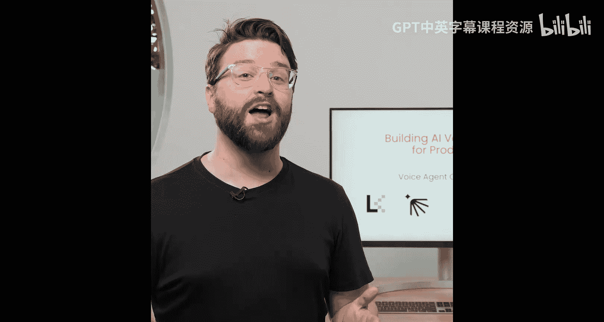
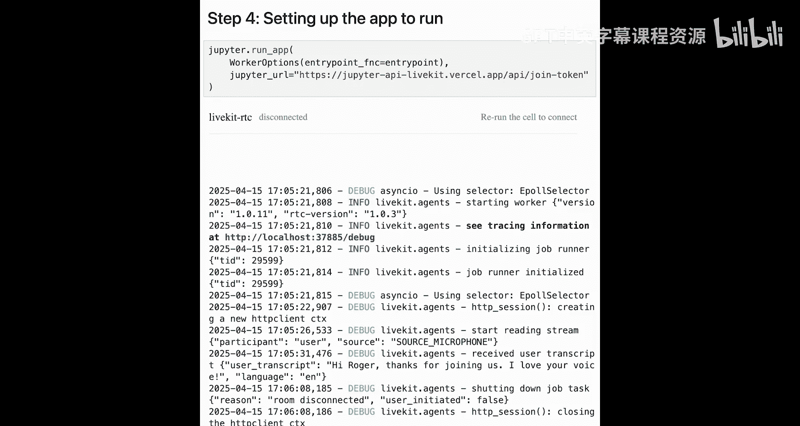

# 005：语音助手核心组件 🎙️



在本节课中，我们将深入探讨语音助手从用户开始说话到助手做出响应的整个流程中的各个核心构建模块。我们将分解流水线中的每个阶段，讨论其中的权衡取舍，并了解在哪些环节可以做出决策，从而真正塑造用户体验。无论你是优化速度、质量还是可控性，理解每一层的工作原理都将帮助你构建更智能、更高效的语音助手。

## 语音助手的两种主要类型

语音助手主要有两种类型。第一种是**流水线式**，这是我们之前详细介绍过的。第二种是**语音到语音**或**实时**助手，Naalina在第一课中介绍过。

语音到语音助手的实现通常更简单，听起来也更自然。但作为交换，你放弃了对中间过程的控制。由于模型直接接收语音并输出语音，因此很难查看或调整中间发生的事情。

另一方面，流水线式助手有更多的组成部分，是的，也更复杂，但你能对每个阶段进行细粒度的控制。你可以精确地查看和管理每个步骤的输入和输出，这可能非常重要。

## 现实应用中的权衡取舍

对于现实世界的应用，每个系统都存在权衡取舍。在某些时候，你可能需要在延迟、质量和成本之间做出选择。



使用流水线方法的一大优势是，你不需要全局性地做出这种权衡。你可以根据具体用例最看重的方面，更换系统中的不同部分。

以Nealina之前给出的例子来说，如果你在做餐厅预订这类事情，你可能希望优化**语言模型的推理能力**，从模型中获得尽可能好的响应。但如果你处理的是像医疗分诊这样需要精确转录的任务，那么将更多的延迟预算花在**语音转文本层**上可能更有意义。

## 设计各组件时的关键考量

接下来，我们谈谈在具体实施时真正重要的因素。以下是设计这些部分时需要牢记的一些关键点。

首先是**语音活动检测**。这个组件只在检测到有人实际说话时才发送音频。这非常重要。它减少了语音转文本模型的幻觉，并且由于不发送静默片段进行转录，从而降低了成本。

然后是**语音转文本层**。在这里，我们需要做出一些关键决策，例如我们希望支持哪些语言，是否进行直接语音翻译，以及是否希望在更窄的用例（如电话通信）中使用专门训练的模型来识别语音。

语音助手的最后两个步骤是**大语言模型层**和**文本转语音层**。

大语言模型层是人们已经最熟悉的部分。在这里，我们运行文本到文本的推理，从大语言模型获得响应。如果你想添加内容过滤等功能，就是在这个层进行。根据你使用的模型，这里也是延迟影响最大的地方。

最后是**文本转语音层**。这一层将LLM生成的文本转换回语音。在TTS层，你可以选择使用哪种声音或口音，以及是否希望对特定单词或短语应用发音覆盖，以便它们以某种特定方式说出来。

## 动手实践：编写代码

现在，让我们将所学的一切付诸实践，开始编写代码。

首先，我们将导入必要的LiveKit Agent类和插件，包括用于语音转文本的OpenAI、作为推理层的LLM、用于TTS的ElevenLabs以及用于语音活动检测的Clero。我们还将导入`dotenv`以便将环境变量加载到内存中，并导入`logging`以便查看代理的运行情况。

```python
import asyncio
import os
from dotenv import load_dotenv
from livekit.agents import Agent, Room, VoiceActivityDetector, SpeechToText, TextToSpeech
from livekit.plugins import openai, elevenlabs, clero

load_dotenv()
```

我们定义一个继承自`livekit.agents.Agent`类的助手类。这个助手被赋予关于其角色的基本指令，并将跟踪到目前为止对话中说了什么。默认情况下，发送给LLM的请求是无状态的，但我们希望保持一个有历史记录的对话。助手会将我们来回发送的所有消息保存在上下文中，以便它能进行一个了解我们之前说过什么的对话。它还会跟踪轮到谁说话、是否可以被中断以及它可以使用哪些工具来回答用户的问题。今天，我们只设置`instructions`参数，并从基础代理继承所有其他默认值。

```python
class MyAssistant(Agent):
    def __init__(self):
        super().__init__(
            instructions="你是一个乐于助人的AI助手。请用友好、专业的语气回答用户的问题。"
        )
```

接下来，我们将定义一个异步入口点函数，当LiveKit通知我们的代理需要时，它将运行。默认情况下，每个新房间都会请求一个代理。房间是将代理会话连接到用户的原始实体。当代理和用户进行对话时，对话就发生在一个房间内。

这个入口点函数逐步执行以下操作：连接到LiveKit房间，定义一个包含所有必要插件的代理会话（这些插件用于监听用户和与用户对话），并将我们的助手分配给该会话。

```python
async def entrypoint(room: Room):
    # 连接到房间
    await room.connect()

    # 定义插件
    vad = clero.VoiceActivityDetector()
    stt = openai.SpeechToText()
    tts = elevenlabs.TextToSpeech(voice_id="EXAVITQu4vr4xnSDxMaL") # 示例语音ID
    llm = openai.LLM()

    # 创建代理会话
    agent_session = Agent(
        vad=vad,
        stt=stt,
        tts=tts,
        llm=llm,
        agent_class=MyAssistant
    )

    # 将代理附加到房间
    await agent_session.attach(room=room)
```

最后，我们使用LiveKit Agent Jupiter CLI命令向LiveKit注册应用程序。这将允许我们的代理在房间需要时被调度。

```python
if __name__ == "__main__":
    from livekit.agents.cli import run_agent
    run_agent(entrypoint)
```

当我们运行下一个单元时，我们将能够与我们的代理进行对话。

**代理对话示例：**
> **用户:** Hello there.
> **代理:** It‘s wonderful to have you here. How can I assist you today? 😊
> **用户:** Hi there. What kind of things can you help with?
> **代理:** Hi. I‘m here to help with a wide range of topics. Whether you need information, help solving a problem, or just want to chat. Feel free to ask about anything.

很好，我们的代理运行正常。

## 自定义代理声音

既然我们的代理正在运行，让我们把声音换成别的。

我们将向上滚动到定义自定义代理的地方，并添加一个语音ID。

```python
    tts = elevenlabs.TextToSpeech(voice_id="ANOTHER_VOICE_ID_HERE") # 更改为新的语音ID
```

现在当我们运行代理时：
> **用户:** Hello there.
> **代理:** It‘s wonderful to have you here. How can I assist you today?
> **用户:** Hi, Roger, thanks for joining us. I love your voice. 😊
> **代理:** Thank you so much. It‘s great to be here with you. How can I make your day better?

## 课程总结 🎯

本节课中，我们一起学习了语音助手的核心组件。我们首先介绍了流水线式和语音到语音两种主要架构及其权衡。然后，我们详细探讨了语音活动检测、语音转文本、大语言模型和文本转语音这四个关键层级的职责与设计考量。

在实践部分，我们成功运行了一个基础的语音助手，并通过修改代码轻松地更换了它的声音。这体现了流水线架构提供的灵活性和控制力。



在下一课中，我们将学习一些关于性能指标的知识，以及如何优化我们的代理。