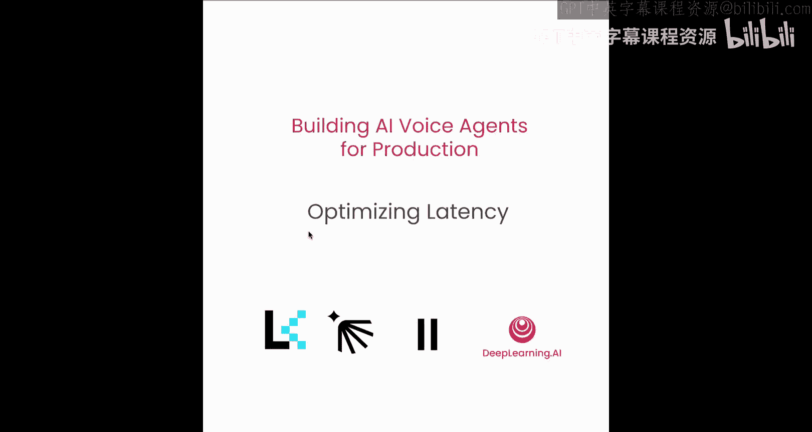
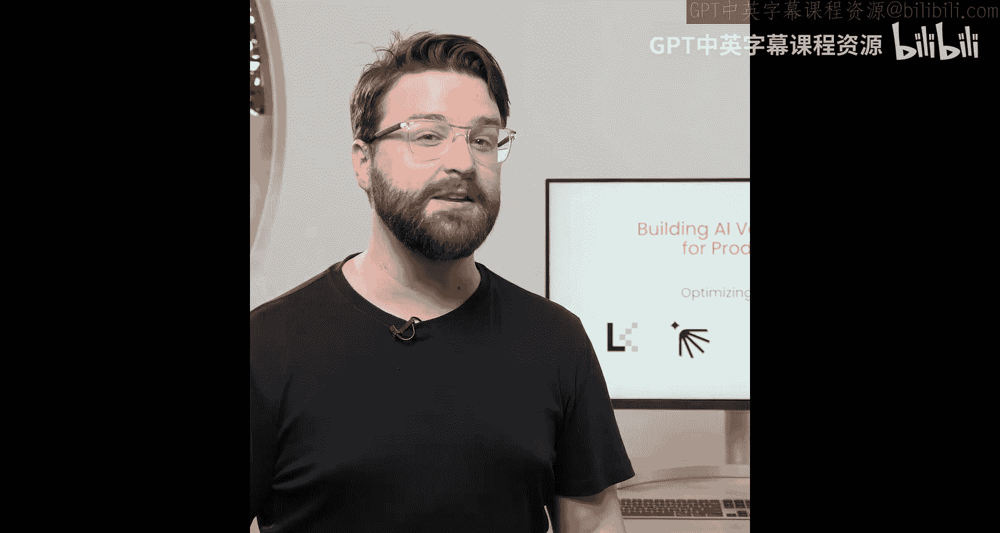
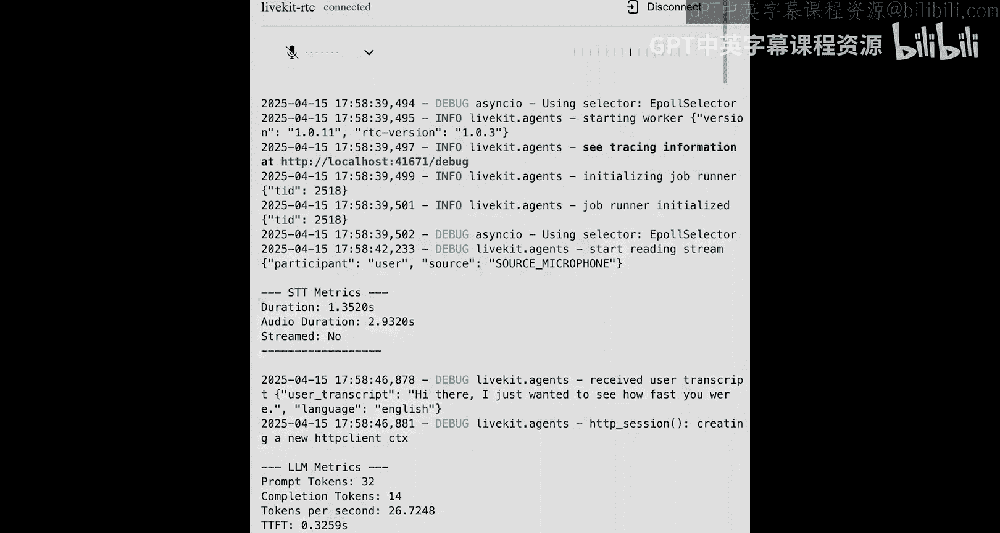

# 006：优化延迟




在本节课中，我们将学习如何优化AI语音助手的延迟。我们将逐一分析语音处理管道的每个阶段，找出延迟发生的位置，并探讨如何从语音检测到文本生成，再到语音输出的全流程中减少延迟。我们将介绍那些能让你的助手感觉快速、响应灵敏的关键调节手段。

## 概述：延迟的重要性与优化目标

语音助手的成败取决于延迟。一个响应迅速的助手能提供更好的用户体验。本节课程将引导你理解整个语音处理流程，识别瓶颈，并实施有效的优化策略。

## 客户端优化：WebRTC的作用



上一节我们介绍了语音管道的整体流程，本节中我们来看看客户端如何为低延迟做出贡献。一个保持系统快速运行的关键部分来自客户端。我们来详细谈谈WebRTC。

WebRTC是一个开源项目，它使得在网页浏览器和移动应用中直接进行实时通信成为可能。其核心在于，它允许你共享音频、视频和数据，而无需任何插件或额外软件。

以下是WebRTC的关键功能：
*   它使用 `getUserMedia` API 来访问你设备的摄像头和麦克风。
*   它还通过 `getDisplayMedia` 方法支持屏幕共享。
*   如果你希望超越音视频，可以使用RTC数据通道进行直接的数据交换。

## 优化语音处理管道

现在，让我们来讨论如何优化语音处理管道。你可能还记得这里的主要组件。

我们拥有语音活动检测，用于识别用户何时在说话。还有话轮检测，用于管理说话者之间的转换。以及语音转文本，负责将音频转换为文字。

默认情况下，VAD和话轮检测是阻塞式的，这是有意为之的。我们不希望发送音频帧，除非我们确信那确实是语音。对于VAD，我们通常在每个话语开始时损失大约15到20毫秒，只是为了确认语音正在发生。

话轮检测则有些不同。它不会阻塞转录过程。它会监听用户话轮的结束，并在结束时触发一个事件，但在用户仍在说话时，它不会停止转录的进行。

以下是它在实践中的工作方式。如果某人正在说一段话，比如五个句子，语音转文本会在用户说话时连续地分段进行转录。最初的几个片段会实时发送给转录器。一旦话轮检测发出信号表明说话者已经结束，我们才会将完整的转录文本发送给LLM。所以，并不是所有内容都在等待一个大块数据，它是一个流，而话轮检测只是帮助我们知道何时向前推进。

## 优化大语言模型阶段

接下来是LLM阶段。LLM逐个令牌地生成响应。即使是模型本身，在完成之前也无法确切知道完整响应会有多长。因此，等待整个响应准备就绪对我们来说是没有意义的。

相反，我们在LLM生成响应的同时，将其输出流式传输到文本转语音引擎。这里需要跟踪的最重要指标是**首令牌时间**。这是模型生成其响应第一部分所需的时间。它通常定义了用户在有任何事情发生之前需要等待多久。在此之后的一切都是异步发生的：当LLM继续生成令牌时，我们已经将文本传递给TTS引擎开始合成语音。因此，如果你想减少总体响应时间，**首令牌时间**是你应该集中进行延迟优化的地方。

## 优化文本转语音流式传输

最后，我们来看文本转语音流式传输阶段。在这个阶段，我们直接从LLM流式传输到TTS引擎，这为我们提供了最佳的延迟。与LLM阶段以**首令牌时间**为关键指标不同，这里最重要的事情是关注**首字节时间**。这是我们实际开始听到音频从TTS引擎输出的时刻。

渲染完整响应所需的总时间不那么关键，只要渲染速度比引擎能说话的速度快即可。因为物理上说出一段话语需要时间，模型有一个缓冲区。所以，再次强调，对于TTS性能，需要优化的就是那个**首字节时间**。这决定了语音实际开始回应的速度。

## 实践：测量与优化代理速度

让我们看看代理实际上有多快，并跟踪一些指标。这里的第一个步骤将与上一个模块相同。

我们将导入我们的代理插件和模块。不过，我们需要添加一些额外的东西。我们将导入定义从语音管道每个部分收集的数据结构的度量类。这些类帮助我们访问性能信息，如响应时间、令牌计数、音频持续时间等。我们还将导入 `asyncio`，以便可以运行异步任务。这让我们能够处理指标收集和其他后台工作，而不会阻塞代理的主流程。

接下来，我们将像上一个代理一样定义我们的代理。但这次我们将称其为 `metrics_agent`。

接下来，我们将添加我们的指标收集钩子。这些处理器让我们从管道的每个部分收集性能数据，并在指标可用时触发回调函数。

我们添加的第一样东西是我们的LLM指标。这是针对**首令牌时间**和**每秒令牌数**的。接下来，我们将添加我们的STT指标包装器。这将告诉我们输入的持续时间以及是否使用了流式传输。然后，我们将添加我们的话语结束指标包装器。这个将告诉我们使用VAD检测到某人说话花了多长时间，以及转录花了多长时间。最后，是我们的文本转语音指标包装器。这个将是**首字节时间**和总渲染时间。这是说明代理开始对我们说话的速度有多快的指标。

现在我们已经定义了包装器，我们将实际定义那些将收集指标并将其打印到控制台的回调函数。

首先是LLM指标。我们在这里跟踪的是提示令牌、完成令牌、每秒令牌数以及那个至关重要的**首令牌时间**。接下来，我们将添加我们的语音转文本指标。即音频的总持续时间，以及响应是否被流式传输。接下来是话语结束指标。这个告诉我们语音转文本运行了多长时间以及VAD花了多长时间。最后，是我们的文本转语音指标。这是**首字节时间**，即我们实际能听到代理说话需要多长时间，以及音频持续时间和响应是否被流式传输。

接下来，我们将像上一个代理一样定义我们的入口点。然后我们就可以运行我们的代理了。

```
Hi, I wanted to see how fast you were.
Hello, I'm designed to respond quickly to your questions and requests. How can I assist you today?
```

现在，当我们向下滚动查看日志时，可以看到我们所有的语音转文本指标。我们可以看到我们的LLM指标，包括每秒令牌数和**首令牌时间**。然后我们可以看到那些关键的**首字节**花了多长时间才传过来。

好的，现在让我们做一个改变。目前，我们LLM的**首令牌时间**是0.84秒，但我想我们可以让它变得更好一点。我们将把我们的LLM模型从 `gpt-4` 改为 `gpt-4o-mini`。这是一个比 `gpt-4` 能力稍弱的模型，但它的响应速度要快得多。

让我们再次使用 `gpt-4o-mini` 与我们的代理对话。

```
Hi there, I just wanted to see how fast you are.
I'm ready to help. What do you need assistance with?
```

现在，如果我们向下滚动查看LLM指标，可以看到我们的**首令牌时间**几乎比使用 `gpt-4` 时快了一倍。

## 总结

本节课中，我们一起学习了如何系统性地优化AI语音助手的延迟。我们重建了代理，添加了跟踪各项性能指标的能力，并通过更换为更快的模型，将LLM的响应时间减少了近一半。关键要点在于：关注并优化管道中每个阶段的特定延迟指标，如LLM的**首令牌时间**和TTS的**首字节时间**，是打造快速响应语音助手的关键。



