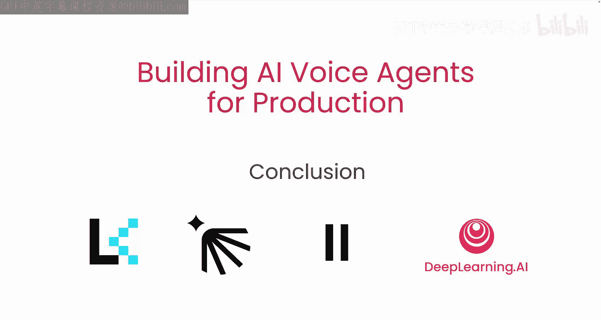

# 007：总结

在本课程中，我们学习了构建生产级AI语音助手所需的核心组件与系统架构。现在，让我们对所学内容进行回顾与总结。

## 课程概述

在本节课中，我们回顾了AI语音助手流水线的各个组成部分，并探讨了如何将它们组合成一个具备低延迟通信和智能体托管能力的完整系统，以构建一个实用的对话式AI智能体。

## 核心内容回顾

上一节我们介绍了系统的具体实现细节，本节中我们来对整个课程进行总结。

以下是本课程涵盖的核心组件：

*   **语音识别**：将用户的语音输入转换为文本。
*   **自然语言理解**：理解转换后文本的意图和关键信息。
*   **对话管理**：根据理解的结果管理对话状态和流程。
*   **自然语言生成**：根据对话状态生成合适的文本回复。
*   **语音合成**：将生成的文本回复转换为自然语音输出。

这些组件通过精心设计的低延迟通信协议连接，并部署在可靠的托管平台上，共同构成了一个高效的AI语音助手系统。

## 总结

本节课中我们一起学习了构建一个可用于生产环境的AI语音助手的完整流程。从识别语音到理解意图，再到管理对话并生成回应，每个环节都至关重要。通过将各个组件有效集成，并确保系统间的低延迟通信，我们能够打造出流畅、自然的对话体验。

希望本课程对你有所帮助。我们期待在智能体构建的道路上与你继续交流。