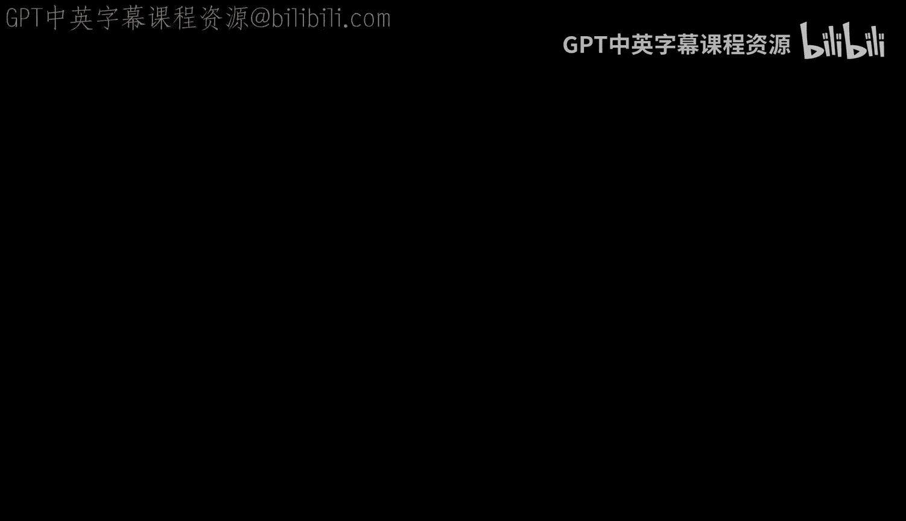

# 001：欢迎与课程概述

在本节课中，我们将要学习PyTorch深度学习专业证书系列的第一门课程——“PyTorch基础”。我们将了解PyTorch在AI领域的重要性，以及本课程如何通过清晰、结构化的路径，帮助你从零开始掌握这一强大工具。

## 课程概述

PyTorch已成为AI领域应用最广泛的框架之一，是研究人员依赖的工具，工程师构建应用的基石，也是全球学生和专业人士渴望学习的技能。事实上，近期生成式AI革命的很大一部分正是由PyTorch驱动的。

然而，学习PyTorch的路径并不总是清晰。网络上教程众多，对于初学者而言，很难分辨哪些内容相关且高质量。为此，我们精心设计了这条清晰、结构化的学习路径。你将从基础开始，逐步构建更高级的架构。

## 与专家对话：为什么选择PyTorch？

我们很高兴向您介绍劳伦斯·莫罗尼，他的课程和书籍已经帮助了数百万人入门AI和深度学习。劳伦斯多年来广泛使用PyTorch，并见证了它如何改变我们构建模型的方式。

**劳伦斯，是什么让你对教授PyTorch感到兴奋？**

我认为，当我最初深入研究PyTorch时，最打动我的一点是：回想过去，我们曾合作制作过一些TensorFlow专项课程。其中最受欢迎的课程之一是关于Keras函数式API的。

Keras函数式API改变了我对模型设计的一切认知，它让你不再局限于设计线性模型。你可以开始构思更复杂的模型结构，例如连体网络和跳跃连接等。

当我开始研究PyTorch时，我发现PyTorch原生就支持这种设计方式。你通过代码设计网络和前向传播过程，这种方式非常简单，并且是默认体验，而非附加功能。这让我感到非常兴奋，因为我可以更简单地开始构建更先进的模型。

**这正是我喜欢这门入门课程的原因：我们将立即开始构建。** 我们将看到第一个PyTorch模型，编写代码并运行它。我们将观察它如何从数据中学习。到课程结束时，你将实际拥有一个能够识别图像中物体的图像分类器。

过去Keras做得好的一点，现在PyTorch也做到了，那就是让你能够组合构建模块，从而更轻松地组装成更复杂的架构。我对此感到非常兴奋，我们如何能通过你提到的这种基于模块的方法，帮助学习者从零开始，一路进阶到最先进的架构。

**我知道很多人使用预训练模型就能完成很多工作。** 但在某个阶段之后，我的许多团队会进行非常高级的操作，例如微调模型、微调生成式AI模型，或者在视觉AI模型上实现非常高的性能。因此，我认为在当今AI工作蓬勃发展的世界里，这确实是一项重要的技能。

**我还想帮助你理解，即使你刚刚开始学习之旅，** 从代码开始，从理解基础开始，并使用像PyTorch这样强大的框架，这真的能为你在这个世界取得成功奠定基础。

**关于PyTorch，另一个让我感到愉快的特点是它的易用性实际上让学习变得更有趣。** 当你下载开源的PyTorch包，并相对轻松地从Hugging Face获取Transformers库并进行微调时，这个过程本身就充满了乐趣。因此，除了找到工作（这当然非常重要）之外，我发现这种高效也让工作变得更加愉快。

**我完全同意。** 我认为这种易用性不仅体现在构建模型上，也体现在当出现问题时，你能够更快地发现、修复和调试问题，从而让你能更快速地取得成功。

通过这个专业证书课程，从第一门基础课程开始，最终完成整个专业证书，我相信它将让学习者为就业做好更充分的准备。

希望你喜欢学习PyTorch。让我们进入下一个视频，正式开始学习！

---

本节课中，我们一起学习了PyTorch深度学习课程的概述，了解了PyTorch在AI领域的关键地位以及本课程的结构化学习路径。我们还聆听了专家对PyTorch易用性和强大功能的见解，为后续的实际编码学习做好了准备。