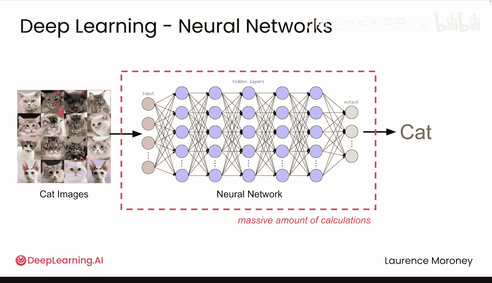
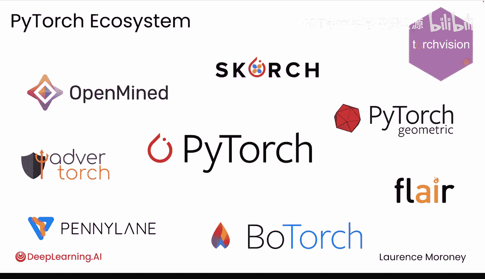

# 002：为什么选择PyTorch 🚀

在本节课中，我们将学习为什么PyTorch成为了深度学习领域的主流框架。我们将通过对比传统编程、早期深度学习工具与PyTorch的差异，来理解其核心优势。

## 概述

深度学习工具的发展经历了从复杂到简单的过程。早期框架为了处理海量计算，设计得十分复杂，而PyTorch的出现改变了这一局面。它的核心原则是：**深度学习应该像编写普通Python代码一样简单**。

## 传统编程与机器学习的差异


上一节我们概述了PyTorch的核心理念，本节中我们来看看传统编程与机器学习的根本区别。


在传统编程中，开发者需要编写明确的规则来将输入转化为输出。例如，构建一个推荐系统：

*   **传统方法**：编写大量`if-else`规则。
    ```python
    if customer_buys("camera"):
        recommend("lens")
    ```
*   **问题**：规则难以覆盖所有例外情况（例如，商品是礼物，或用户已拥有多个镜头）。

机器学习则采用了不同的范式。你无需编写规则，而是向系统提供**输入和输出的示例**，系统会**自动学习其中的映射关系**。

深度学习进一步利用神经网络来实现这一点。例如：
*   提供客户历史记录，神经网络能学习人们的购买趋势。
*   展示猫的图片，神经网络能学习“猫”的特征。

## 早期深度学习框架的挑战

了解了机器学习的基本思想后，我们来看看实现它的技术挑战，这导致了早期工具的复杂性。

神经网络需要从海量示例中学习，这涉及巨大的计算量。每一张图片、每一次购买记录都需要在整个网络中进行数百万次计算。早期框架为了高效管理这些计算，采用了**静态计算图**。




你可以将静态计算图想象成一个工厂流水线：

以下是使用静态计算图时面临的主要问题：

1.  **缺乏灵活性**：流水线必须预先完整定义并编译。一旦运行，无法中途修改或插入新步骤。
2.  **难以调试**：必须构建完整的流水线后才能测试。错误信息指向框架内部，而非你的代码。
3.  **非Pythonic**：无法使用普通的Python `if`语句或`for`循环，必须使用框架特殊的、复杂的操作符。
4.  **输入限制**：流水线通常只能处理固定尺寸的输入。

这种复杂性使得即使是最简单的操作也变得十分繁琐。例如，仅仅想查看两个数相加的结果，输出可能是一串难以理解的符号，而不是直观的数值。

## PyTorch的解决方案：动态性与Python优先

面对早期工具的种种不便，PyTorch应运而生，其核心原则是：**让深度学习感觉像编写普通的Python代码**。

PyTorch引入了**动态计算图**。你只需编写干净、地道的Python代码，PyTorch会在后台自动构建和管理计算图。

以下是PyTorch带来的关键优势：

1.  **直观的代码**：代码看起来和运行起来都像普通Python。例如，加法操作简洁明了：
    ```python
    import torch
    result = torch.tensor(1) + torch.tensor(2)
    print(result) # 输出: tensor(3)
    ```
2.  **完全的灵活性**：你可以随时使用`if`语句、`for`循环，随时修改网络结构，一切都按预期工作。
3.  **友好的调试**：当程序出错时，错误信息直接指向你的代码行。你可以像调试普通Python程序一样，随时中断程序、检查变量。
4.  **强大的社区**：PyTorch拥有一个庞大的社区，研究人员分享代码，常见问题都有解决方案，并且框架在不断改进。

正是这种**Python式的简洁**、**强大的工具链**和**活跃的社区**的完美结合，使PyTorch成为了从学生到顶尖AI研究者的首选工具。

## 总结



本节课中我们一起学习了：
1.  **传统编程**与**机器学习**在解决问题范式上的根本区别。
2.  早期深度学习框架因采用**静态计算图**而导致的**复杂性**和**不灵活性**。
3.  PyTorch如何通过**动态计算图**和**Python优先**的设计哲学，解决了这些问题，使得深度学习开发变得直观、灵活且高效。
4.  PyTorch凭借其易用性和强大的社区生态，已成为深度学习领域的首选框架。


现在，你已经了解了为什么选择PyTorch，并准备好开始用它构建你的第一个模型了。让我们开始吧！