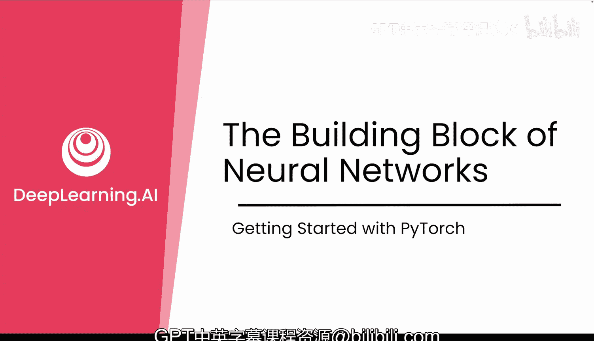
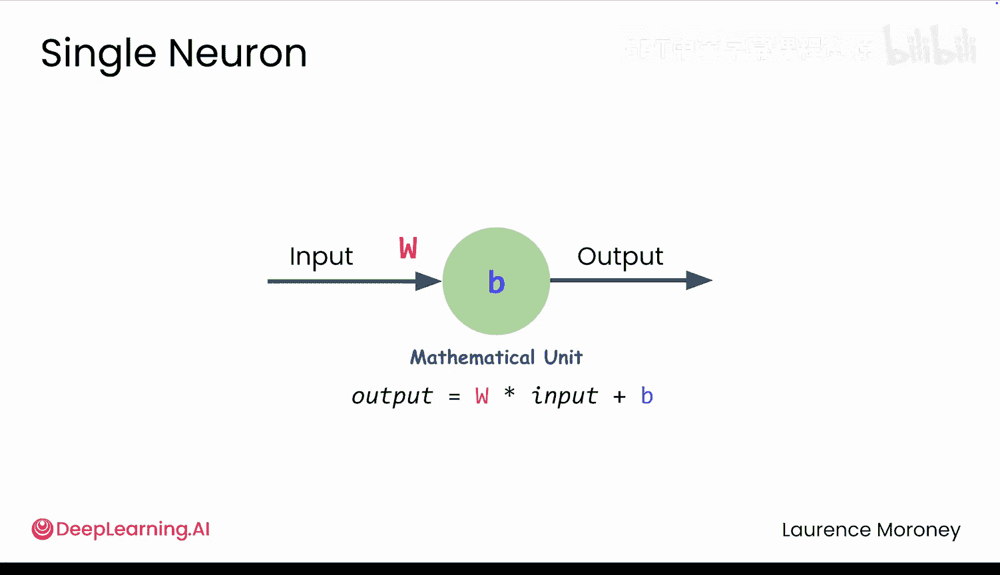
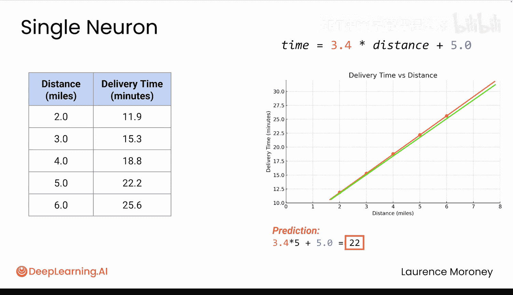
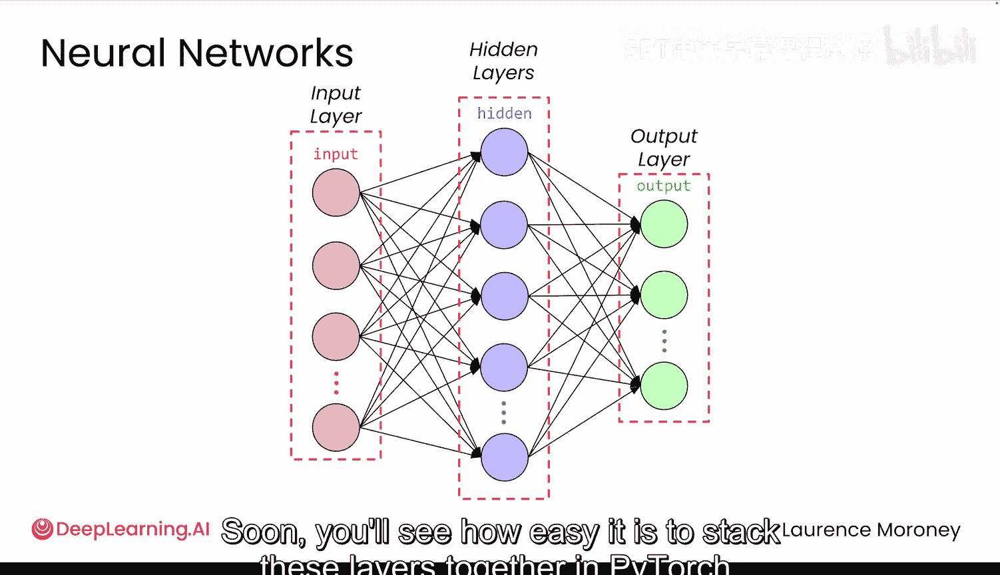

# 003：神经网络的构建模块 🧱

在本节课中，我们将要学习神经网络的基本构建单元——神经元。我们将从一个简单的实际问题出发，理解单个神经元如何工作，以及它如何通过数学运算来学习和预测。这为理解更复杂的神经网络奠定了基础。

## 从实际问题出发

假设你在一家本地快递公司工作，公司承诺在30分钟内送达订单。上个月你有三次延误，经理很不满意。现在，一个新订单来了，需要配送7英里。你需要判断是否能在30分钟内完成。

神经网络擅长解决这类问题。我们将使用可能的最简单神经网络——仅包含一个神经元——来应对这个挑战。

## 单个神经元：一个线性方程

复杂的网络本质上是由许多执行相同基本操作的神经元组成的。因此，理解一个神经元的工作原理就为理解所有神经网络打下了基础。

虽然灵感来源于生物学，但此处的神经元只是数学单元。它们是具有可调参数的工具，这些参数会调整以匹配数据中的模式。

这听起来很直观。让我们看一些历史配送数据：5英里耗时22.2分钟，6英里耗时25.6分钟。现在，假设客户需要配送7英里。我们将数据绘制出来。

注意这些点如何遵循一条直线。对这些数据一个好的预测模型就是一条直线。如果你知道这条直线的方程，就可以预测新值。

**关键点在于：单个神经元就是一个带有两个参数（权重和偏置）的线性方程。** 其数学形式如下：

`y = w * x + b`

这就是直线的方程。因此，神经元需要做的就是为 `w`（权重）和 `b`（偏置）找到正确的值，以创建一条最贴合所有数据的直线。而寻找这些最佳值的过程，就是机器学习中的“学习”。

## 神经元如何学习最佳直线？

那么，神经元如何找出哪条直线是最佳的呢？让我们从一个粗略的猜测开始。

假设我们初始猜测权重 `w=1`，偏置 `b=10`。那么，预测5英里的配送时间为：`1 * 5 + 10 = 15` 分钟。但实际数据显示5英里耗时22.2分钟，我们的预测误差超过了7分钟。看起来需要更陡的斜率。

让我们尝试 `w=3.4`，`b=5`。预测5英里的时间为：`3.4 * 5 + 5 = 22` 分钟。现在几乎完全吻合，只差0.2分钟，拟合效果好得多。

就像我刚才查看误差并认为需要提高权重和偏置、改变斜率一样，神经网络也做类似的决策，但它使用数学而非直觉。

## 学习过程：从随机到优化

神经网络从随机的权重和偏置值开始。在PyTorch中，这些被称为模型的**参数**。

接着，它会查看每个预测值与实际数据相差多远。点偏离越远，总误差就越大。然后，网络将使用微积分来找出调整权重和偏置的方向。本质上，它在问：“如果我稍微增加权重，误差是上升还是下降？”

一旦弄清楚了这些，它就会朝正确的方向迈出一小步，测量新误差，再次微调，并不断重复这个过程。这个过程可能进行数百甚至数千次，但最终它会找到接近最佳可能值的参数。

在PyTorch中，你只需几行代码就能看到这一切发生。

## 扩展到多个输入

你可能会想，当你开始连接成千上万个甚至数百万个神经元时，数学会变得无比复杂吗？这里有一个令人惊讶的事实：**它仍然是线性的**。每个神经元仍然在进行相同的基本计算。

我们的配送问题神经元只有一个输入：距离。但如果你想考虑多个因素呢？比如距离、一天中的时间和天气。

一个具有三个输入的神经元只是扩展了相同的模式。它仍然只是一个线性方程，只是有更多的项相加。每个输入都有其独特的权重，它们全部相加，再加上一个偏置值。

`y = w1*x1 + w2*x2 + w3*x3 + b`

## 从神经元到网络

神经网络就是神经元连接到神经元。一个层只是一组接收相同输入的神经元。当你将一层的输出连接到下一层的输入时，你就构建了一个网络。

*   **输入层**：接收原始数据（如距离、时间、天气）。
*   **隐藏层**：中间的那些层，因为你从不直接设置或查看它们的值。
*   **输出层**：给出你的预测（如配送时间）。

在PyTorch中，将这些层堆叠在一起非常容易。但目前，让我们继续专注于单个神经元。

## 总结与展望

本节课中，我们一起学习了神经网络的核心构建模块——神经元。我们了解到：

1.  单个神经元本质上是一个线性方程 `y = w*x + b`。
2.  神经网络的“学习”过程就是通过计算误差，并利用微积分不断调整权重 `w` 和偏置 `b` 这两个参数，以找到最佳拟合直线的过程。
3.  多输入神经元只是线性方程的扩展，每个输入对应一个权重。
4.  神经网络通过将这样的神经元分层连接而成。

在下一个视频中，你将看到完整的流程，了解如何从原始数据到部署模型。这是每个PyTorch项目遵循的系统过程。之后，你将构建你的第一个神经网络，并在这个具体的配送问题上训练它。只需几行PyTorch代码，就能让所有这些概念变得生动起来。让我们继续前进。