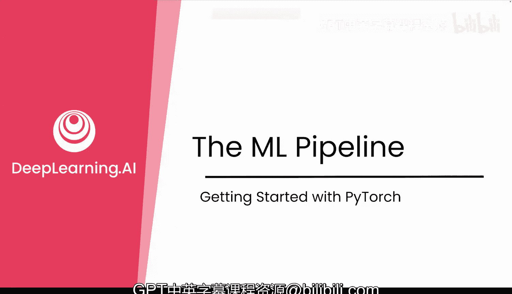
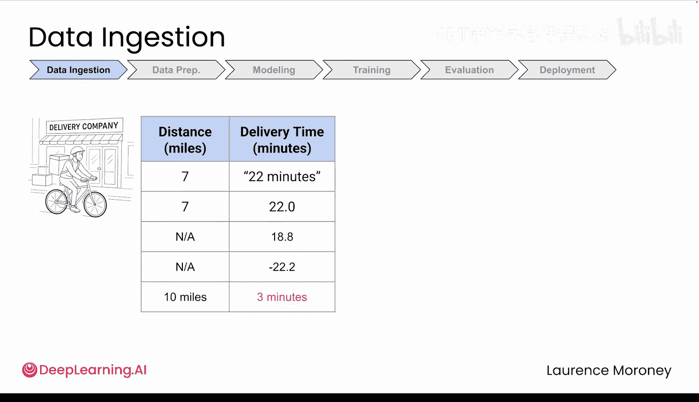
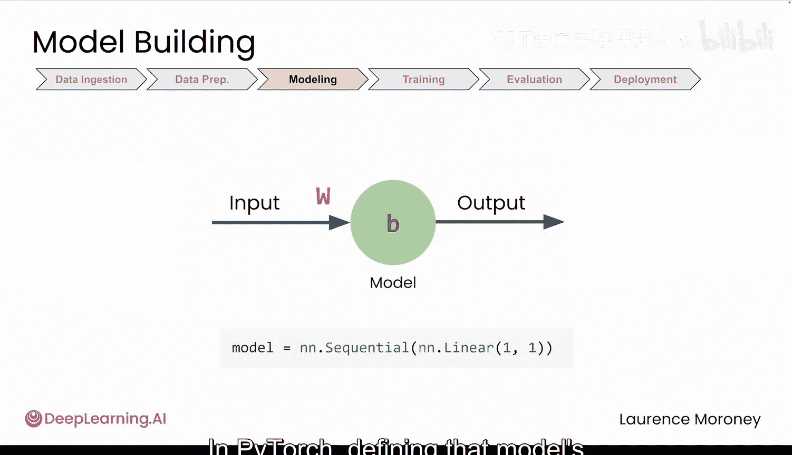
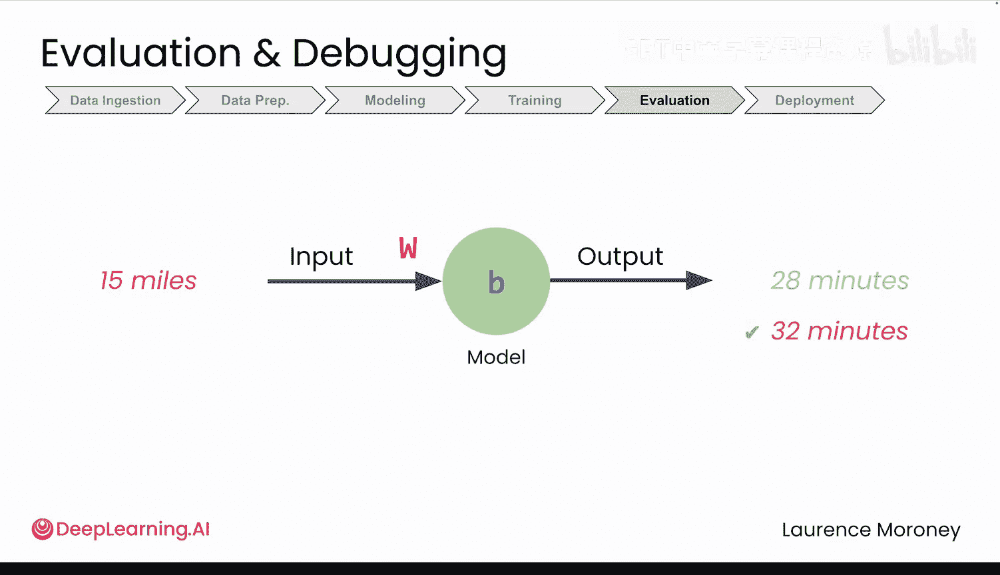
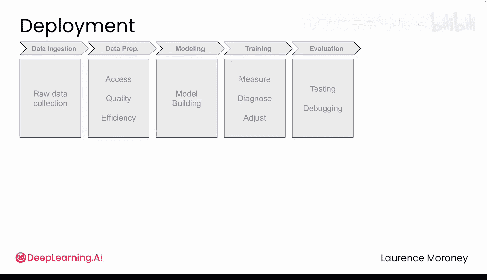

# 004：机器学习流程 🚀

在本节课中，我们将要学习构建机器学习模型的完整流程。这个流程是一个系统化的框架，无论你是在预测配送时间，还是未来构建图像分类器，都将遵循相同的六个核心阶段。

上一节我们介绍了神经网络如何从历史数据中学习简单的线性模式。本节中，我们来看看将这个学习过程付诸实践所需的完整步骤。

---

## 阶段一：数据获取 📥

一切从数据开始。在训练任何模型之前，你需要收集原始信息并将其组织起来，以便PyTorch能够高效地处理每个数据点。

对于配送时间预测器，数据将来自公司的配送记录。但这里会遇到一个常见难题：数据通常是混乱的。例如，早期记录可能将配送时间写为“22分钟”这样的自由文本，而新记录则使用“22.0”这样的数值。此外，数据中总会出现诸如缺失值、负的配送时间，或者记录显示你以每小时200英里的速度骑行等异常情况。



这种混乱的数据是常态而非例外。在我们的第一个实验中，为了简化，你将从一个已准备好的、干净的配送数据集开始。但理解这些步骤有助于你认识到真实项目需要投入什么，随着课程的深入，你将亲自应对更多此类挑战。

---

## 阶段二：数据准备 🧹

获取数据只是第一步。无论你处理的是配送记录、自定义图像还是电子邮件文本，下一个挑战是相同的：你必须清理、转换并组织数据，使其成为模型可以学习的形式。

对于配送数据，这可能意味着处理我们之前提到的错误，例如删除不可能的配送时间或重复条目。它也可能意味着处理时间戳未记录时的缺失值，或者通过将“橡树街123号”这样的地址转换为“8.2英里”这样的距离来构建新特征。

在真实项目中，这个阶段通常花费最多的时间和编写最多的代码，这很正常。大多数模型失败不是因为数学错误，而是因为数据混乱。



---


## 阶段三：模型构建 🏗️

现在你的数据已经清理完毕并准备就绪，是时候设计将要从中学习的模型了。

无论你是预测配送时间、分类图像还是分析文本，这一步都是为你的问题选择正确的架构。“架构”指的是结构：你将使用多少个神经元？它们如何连接？模型需要什么类型的层？

对于你的配送预测器，架构再简单不过了：**1个神经元**，用于学习距离和配送时间之间的关系。在PyTorch中，定义该模型的架构只需一行代码。

```python
model = nn.Linear(1, 1)  # 一个简单的线性模型
```

PyTorch的美妙之处在于，即使是这个简单模型，也将遵循与你在本课程后期将要处理的更复杂模型相同的模式。然而，一个好的模型设计只是一个蓝图，接下来你还需要实际教会它做出好的预测。



---

## 阶段四：模型训练 🏋️

这是你的模型开始学习的地方。你将输入示例，例如“配送距离8.2英里，耗时22分钟”或“这个距离12.5英里，耗时31分钟”，模型将逐渐开始找出其中的模式。

在训练阶段，你将学习如何配置使这个过程运作的关键部分：如何衡量预测误差？如何引导模型改进？如何通过训练设置控制其学习速度？然后，你将运行训练循环，由PyTorch完成繁重的计算工作，你的模型则从数据中学习。

但即使训练成功完成，你的工作也尚未结束。现在迎来了真正的考验：你的模型能在新的、未见过的数据上做出好的预测吗？

---

## 阶段五：评估与调试 📊


要知道你是否拥有一个真正的好模型，你需要观察它在**新数据**（即它未训练过的示例）上的表现如何。为此，你将使用一个**测试集**——这是在训练期间预留的一部分配送数据。

例如，你的模型可能预测15英里的配送需要28分钟，但实际上花了32分钟。你的预测有多频繁是接近的？又有多频繁是相差甚远的？随着课程的推进，你将学习如何在出现问题时检测更深层次的问题并调试模型。但目前，关键问题很简单：你的模型是否足够好，值得你信任？

---

## 阶段六：模型部署 🚀

这是最后一个阶段：将你的模型部署到现实世界中供人们使用。但让我们暂时先将这个阶段从流程中移除，当时机成熟时我们再回来讨论它。

---

现在你已经看到了全貌，准备好深入实践了。在下一个视频中，你将看到即使是我们简单的配送模型，在PyTorch代码中是如何遵循这些确切阶段的。然后在实验环节，你将亲自运行它，并判断是否应该接下那个配送订单。



---





本节课中我们一起学习了构建机器学习模型的六个核心阶段：**数据获取**、**数据准备**、**模型构建**、**模型训练**、**评估与调试**，以及最终的**模型部署**。理解这个系统化的流程是成功实施任何深度学习项目的基础。