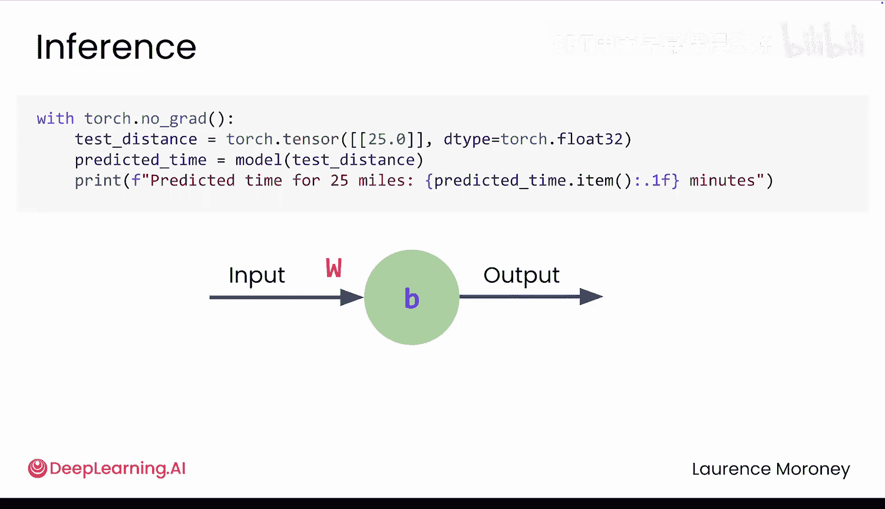
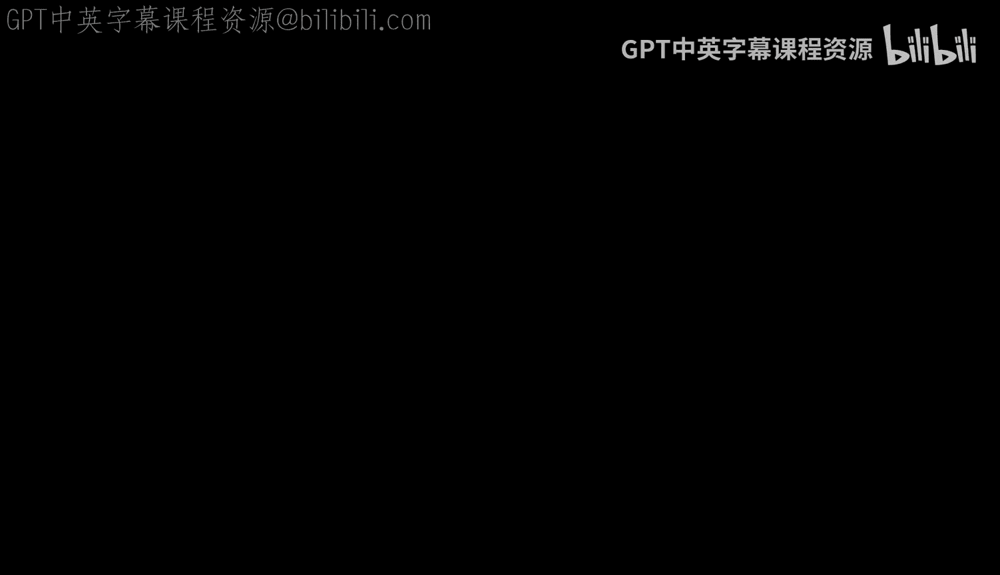

# 005：构建一个简单的神经网络 🧠

在本节课中，我们将学习如何将神经网络的理论概念映射到实际的PyTorch代码中。我们将从导入必要的库开始，逐步构建一个用于预测配送时间的简单神经网络，并理解其训练过程。

## 概述

你已经了解了机器学习的工作流程和神经网络的学习原理。现在，让我们看看这一切如何转化为实际的PyTorch代码。我们将从导入库开始，然后准备数据、构建模型、定义训练工具，最后通过训练循环让模型学习。

## 导入必要的库

首先，我们需要导入PyTorch的核心功能模块。这些导入语句将为我们提供构建和训练神经网络所需的核心工具。

```python
import torch
import torch.nn as nn
import torch.optim as optim
```

`torch` 提供了PyTorch的核心功能。`torch.nn` 包含了构建神经网络的组件。`torch.optim` 提供了训练这些网络的优化器工具。


## 准备数据

在真实项目中，数据获取和准备通常是独立的步骤。首先收集原始数据，然后进行清理和格式化。但在此示例中，我们合并了这些阶段，直接使用已清理并准备好的数据。我们从Python列表创建数据。

```python
# 输入特征：配送距离
inputs = torch.tensor([[5.0], [15.0], [25.0], [35.0]], dtype=torch.float32)
# 目标值：实际配送时间
targets = torch.tensor([[20.0], [40.0], [60.0], [80.0]], dtype=torch.float32)
```

这些数据不仅仅是列表。**张量（Tensor）** 是针对神经网络所需数学运算进行优化的数据结构。你现在可以将它们视为以模型能理解的方式存储和组织数据的容器。

现在，我们来看看数据的结构。每个数字都被包裹在自己的括号中。这些外层括号代表整个数据集的一个子集，即一个**批次（Batch）**。每个内层括号是批次中的一个样本。由于我们有四条配送记录，你会看到四个样本，每个都包裹在自己的括号中。因为每次配送只有一个特征（距离），所以每个样本只包含一个值。

但请记住，之前我们讨论过具有多个输入（如距离、时间、天气）的数据。那时，这些括号就变得非常重要，因为每个样本可能包含多个值，每个输入特征对应一个。因此，无论是一个还是数百个特征，这些括号都会告诉PyTorch一个样本在哪里结束，下一个样本在哪里开始。

最后，注意 `dtype=torch.float32` 这部分。它告诉PyTorch存储什么类型的数字。在本例中，是32位浮点数，非常适合我们的配送时间这类十进制数值。

## 构建神经网络模型

现在让我们创建你的神经网络。还记得早期深度学习框架中那些僵化的流水线吗？`Sequential` 是PyTorch的简化版本。它是一个容器，按顺序将数据传递各层，但让你可以轻松更换组件，而无需进行混乱的重新布线。

```python
model = nn.Sequential(
    nn.Linear(1, 1)
)
```

这里你只使用一层，这就是你的单个神经元。从技术上讲，它是一个**线性层（Linear Layer）**。第一个参数 `1` 表示它接受一个输入（即我们的距离）。第二个参数 `1` 表示它只产生一个输出（即我们预测的配送时间）。它会对输入应用一个线性变换，这就是线性层实际所做的全部。

PyTorch使这一切变得简单。像这样的层已内置在框架中，你只需一行代码即可创建。这个神经元将学习最佳的**权重（Weight）** 和**偏置（Bias）**，将我们的距离映射到配送时间，就像找到一条穿过所有数据点的最佳拟合线。

## 定义训练工具

你的模型需要两种工具来进行实际学习。第一个是**损失函数（Loss Function）**，我们使用**均方误差损失（Mean Squared Error Loss）**。它将衡量你的预测有多错误或多正确。例如，如果实际用时60分钟，你预测45分钟，这个误差就比预测58分钟要大。

```python
loss_function = nn.MSELoss()
```

第二个工具是**优化器（Optimizer）**。我们使用 **SGD（随机梯度下降，Stochastic Gradient Descent）**。这个算法负责找出调整权重和偏置的方向，以减少误差。

```python
optimizer = optim.SGD(model.parameters(), lr=0.01)
```

`model.parameters()` 是你访问PyTorch中那些值（在本例中就是单个神经元的权重和偏置）的方式。`lr` 是**学习率（Learning Rate）**。较小的值意味着你以较小的幅度调整权重和偏置参数，较大的值则意味着进行较大的调整。两种极端情况都可能带来各自的挑战。

如果你对损失函数或优化背后的数学原理感到好奇，你将在模块2中获得更深入的介绍。你也可以在课程资源中找到更多内容，或者探索深度学习专项课程进行全面的深入学习。

## 训练循环

这是实际发生学习的训练循环。还记得我手动调整权重和偏置以更接近正确直线的过程吗？这段代码正在自动地做同样的事情，而且是数百次。事实上，它将进行500次。每次完整遍历训练数据称为一个**周期（Epoch）**。在每个周期中，模型将：1. 进行预测；2. 测量这些预测的偏差有多大；3. 调整其内部参数以改进这些预测。

以下是每一行代码的作用：

```python
epochs = 500
for epoch in range(epochs):
    # 1. 清除上一轮的梯度
    optimizer.zero_grad()
    # 2. 进行预测
    outputs = model(inputs)
    # 3. 计算损失
    loss = loss_function(outputs, targets)
    # 4. 反向传播计算梯度
    loss.backward()
    # 5. 更新参数
    optimizer.step()
```

首先，看 `optimizer.zero_grad()`。你将在课程后面更多地了解这个方法。但现在只需知道，它会清除上一轮训练中计算的所有值。没有它，PyTorch会在多轮中累积调整，这会扰乱你的整个学习过程。

`outputs = model(inputs)` 这行代码告诉模型使用距离作为输入进行预测。

`loss = loss_function(outputs, targets)` 将预测值与真实时间进行比较，并计算它们有多错误。

`loss.backward()` 计算出如何调整权重和偏置以减少该误差。就像之前我说“我需要一个更陡的斜率来预测配送时间”一样，现在它通过背后的微积分完成了。这个过程的技术术语称为**反向传播（Backpropagation）**。

`optimizer.step()` 将执行所有这些调整。

## 进行预测

现在模型已经训练好了，让我们尝试进行预测。

```python
with torch.no_grad():
    prediction = model(torch.tensor([[30.0]], dtype=torch.float32))
    print(prediction)
```

`with torch.no_grad():` 这行代码告诉PyTorch你不再进行训练，只是进行**推理（Inference）**。训练在底层需要额外的工作，但对于推理，我们可以跳过所有这些，更高效地运行。

如果模型学会了它应该学的东西，它应该会给你一个好的答案。但你需要在实验课中亲自尝试才能看到结果。

## 总结





在本节课中，我们一起学习了如何用PyTorch构建一个简单的神经网络。我们从导入库开始，理解了张量作为数据容器的作用。然后，我们使用 `nn.Sequential` 和 `nn.Linear` 构建了一个单层神经网络模型。接着，我们定义了均方误差损失函数和随机梯度下降优化器来训练模型。最后，我们剖析了训练循环的每一步：清除梯度、前向传播、计算损失、反向传播和更新参数，并学会了如何在训练完成后使用 `torch.no_grad()` 上下文管理器进行高效的预测。这为你动手实践，看看你的配送工作是否仍然安全，打下了坚实的基础。