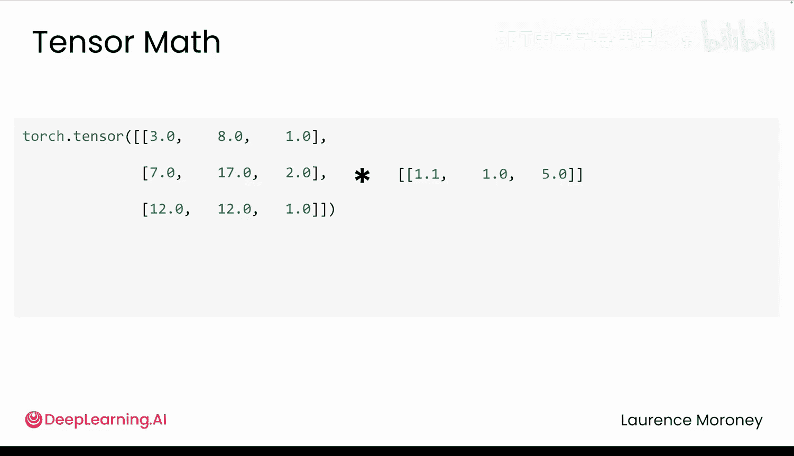

# 008：张量运算与广播

在本节课中，我们将要学习PyTorch中张量的核心数学运算，特别是元素级运算和强大的“广播”机制。理解这些概念是高效使用PyTorch进行深度学习的基础。

## 概述

上一节我们介绍了如何创建、重塑和调试张量。本节中，我们来看看PyTorch如何对它们进行计算。我们将从简单的单神经元模型计算开始，逐步深入到处理更复杂数据形状的广播机制。

## 从基础运算开始

让我们从一个单神经元模型的计算开始：`权重 * 距离 + 偏差`。

当你需要处理多个距离时，计算过程如下所示。PyTorch的张量数学以**元素级**方式工作。这意味着每个元素都是独立进行运算的。

你的计算将相同的权重应用于每个距离，然后将相同的偏差加到每个结果上。数学表达式看起来就像普通的Python代码，但PyTorch会高效地一次性对所有元素执行这些操作。

**公式**：`output = weight * distances + bias`

这对于标量（单个值）以及具有相同形状的张量都适用。

## 引入广播机制

但是，如果你有更复杂的数据呢？想象有三个配送任务，每个任务有三个特征：`距离`、`小时`和`天气`。现在你想应用调整因子：距离乘以1.1，时间不变，坏天气乘以5倍惩罚。

创建一个每行重复`[1.1, 1.0, 5.0]`的张量是可行的，因为张量形状相同，但这很冗余。如果能只指定一次这些调整值就好了。

这就是**广播**的用武之地。我们知道形状相同的张量会进行逐元素运算。但还记得一个标量如何更新我们距离张量中的每个值吗？当你将一个标量加到一个张量上时，PyTorch会自动将该单个值扩展以匹配每个元素。这就是权重和偏差可以一次性应用于所有距离的方式。这种自动扩展就是广播在起作用。

## 广播的工作原理

那么，如果我们有一个形状为`(1, 1)`的张量（例如 `[[5]]`），你认为它能与我们的形状为`(1, 3)`的张量（例如 `[[1, 2, 3]]`）一起工作吗？

*   第一个张量形状是`(1, 3)`：1行，3个值。
*   第二个张量形状是`(1, 1)`：1行，1个值。

通常，PyTorch要求运算的维度精确匹配，不同的形状会导致错误。但神奇之处在于：**当一个维度是1，而另一个维度更大时，PyTorch会自动通过重复值来扩展较小的维度**。

所以，我们大小为`(1, 1)`的张量`[[5]]`会变成`[[5, 5, 5]]`，以匹配`(1, 3)`的形状。现在它们就可以相加了。

**代码示例**：
```python
import torch
A = torch.tensor([[1, 2, 3]])  # shape (1, 3)
B = torch.tensor([[5]])         # shape (1, 1)
C = A + B  # B被广播为[[5, 5, 5]]，然后与A相加
print(C)  # 输出: tensor([[6, 7, 8]])
```

## 更复杂的广播示例

让我们看一个展示广播真正威力的更复杂例子。当你组合一个`(1, 3)`的张量和一个`(3, 1)`的张量时会发生什么？

PyTorch会查看每个维度：
1.  第一个维度：1 对比 3。1扩展为3。
2.  第二个维度：3 对比 1。1扩展为3。

因此，两者都变成了`(3, 3)`的形状。

**代码示例**：
```python
A = torch.tensor([[1, 2, 3]])           # shape (1, 3)
B = torch.tensor([[10], [20], [30]])    # shape (3, 1)
C = A + B
# A被广播为 [[1,2,3], [1,2,3], [1,2,3]]
# B被广播为 [[10,10,10], [20,20,20], [30,30,30]]
print(C)
# 输出: tensor([[11, 12, 13],
#               [21, 22, 23],
#               [31, 32, 33]])
```

## 广播的实际应用

那么你实际上会如何使用它呢？回到配送调整的例子，你不需要将`[1.1, 1.0, 5.0]`重复3次，你可以直接这样写：

**代码示例**：
```python
features = torch.tensor([[10.0, 9, 0.2],  # 配送1: 距离, 小时, 天气
                         [20.0, 10, 0.8], # 配送2
                         [15.0, 11, 0.5]])# 配送3
adjustments = torch.tensor([1.1, 1.0, 5.0]) # 调整因子
adjusted_features = features * adjustments  # 广播发生在这里！
print(adjusted_features)
```
无需循环，无需手动重复。PyTorch通过广播处理所有事情。



这种模式无处不在：跨批次调整多个特征、组合数据的不同维度、高效应用变换等等。一旦你学会寻找它，你会在深度学习的各个地方看到广播的机会。


## 模块一结束与总结

恭喜你！在过去的两个视频中，你已经涵盖了基本的张量操作。提供的实验包含更多你可以探索的示例，因为就像任何工具一样，张量需要通过练习才能变得直观。

最重要的是，我们已经完成了模块一的学习。我们首先探索了PyTorch的独特之处，现在你已经掌握了基础：你完成了机器学习流程，训练了你的第一个神经网络，掌握了张量操作，打下了坚实的基础。

接下来是张量实验课，你将在那里练习这些概念，随后是一个评分作业来测试你的技能。然后在模块二中，你将处理分类问题，并更深入地研究神经网络是如何真正学习的。你已经掌握了PyTorch基础，是时候将它们付诸实践了。

---


**本节课中我们一起学习了**：
1.  PyTorch中**元素级**张量运算的基本原理。
2.  **广播**机制：当张量形状不完全匹配但兼容时，PyTorch自动扩展维度为1的张量以执行运算。
3.  广播的实际应用场景，它能极大简化代码，避免不必要的重复数据。
4.  通过理解这些核心运算，为后续构建更复杂的神经网络模型奠定了坚实基础。