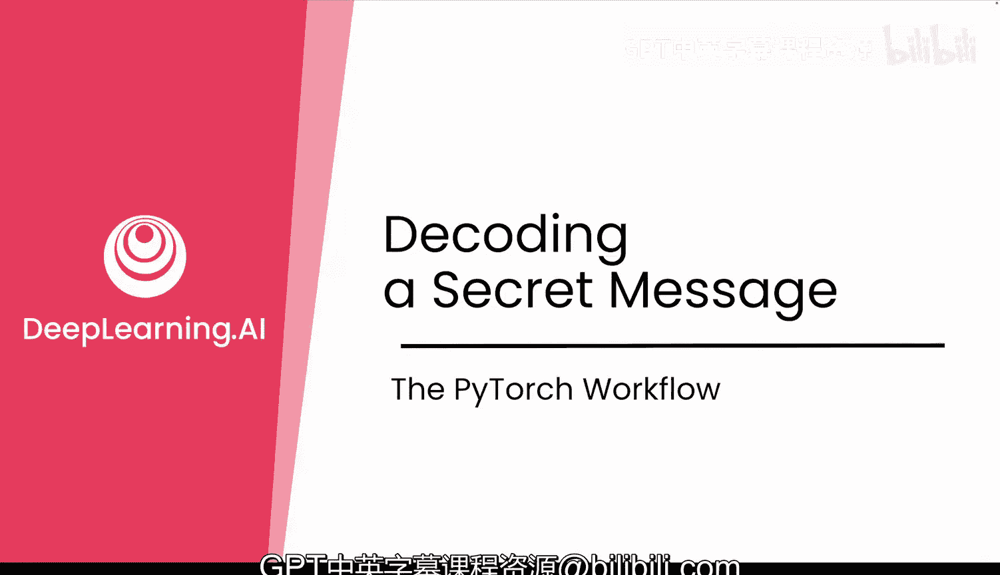
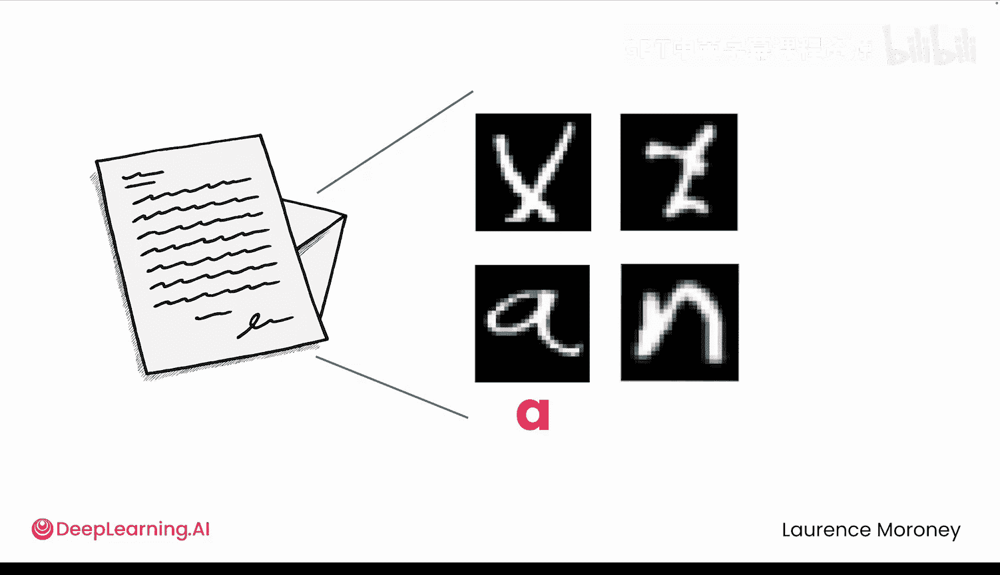
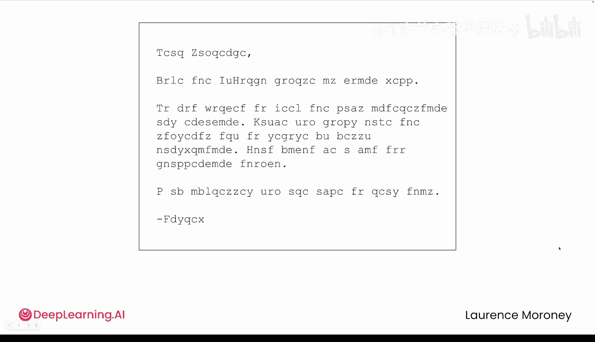
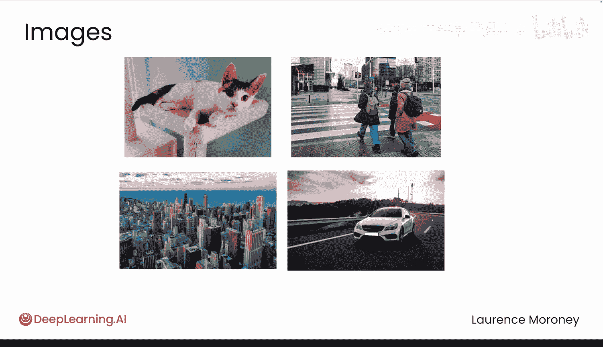
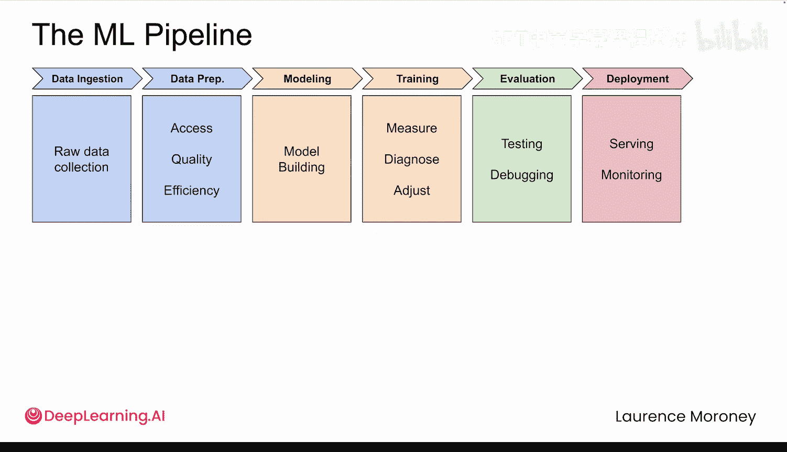
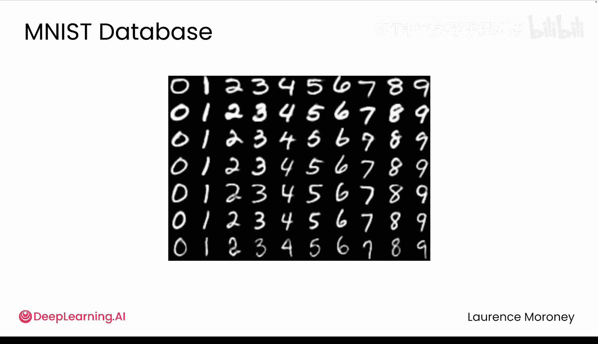
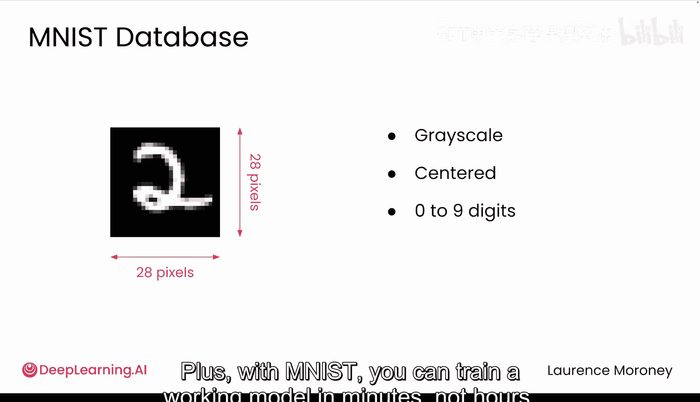
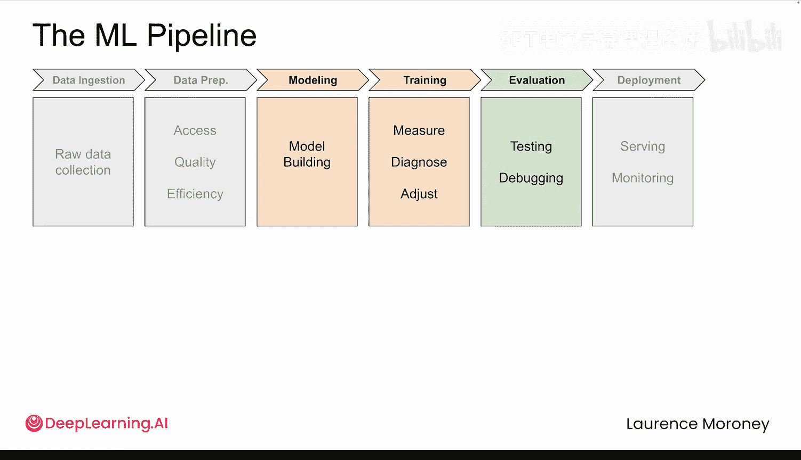

# 009：解码秘密信息 🕵️♂️

## 概述

在本节课中，我们将学习如何使用PyTorch处理图像数据，并构建一个多层神经网络来解码一封难以辨认的手写信件。我们将从更简单的MNIST手写数字数据集开始，掌握处理图像数据的核心流程和PyTorch特定技巧。

## 从模块1到图像世界

在模块1中，我们使用PyTorch构建了第一个模型，并熟悉了深度学习的基础知识。这为初学者打下了坚实的基础，也为有经验的学员提供了一些PyTorch特有的模式。

现在，让我们来处理一些更有趣的挑战。首先，我需要你们帮助解决一个问题。

我的朋友Andrew给我寄了这封信，但他的字迹和我的一样难以辨认。我一个字都看不懂。这确实很独特。于是我有了一个想法：能否训练一个神经网络来替我阅读这封信？

我拿了这封信，并将其分割成独立的图像，就像这样。然后我尝试构建一个模型来对每个字符进行分类。一旦我能对每个字母进行分类，就应该能够重建整个信息。

但当我运行我的模型时，得到了这样的结果。这并不完全正确。

所以我需要你们的帮助来翻译这封信，但你们需要一些新工具，因为你们将要处理图像数据。这意味着数据量将远超模块1中的规模。这里的每张图像都包含数百甚至数千个像素值。

事实上，在本课程的剩余部分，我们将专注于图像处理。在我们转向更高级的主题之前，这将给你们时间真正掌握机器学习流程。你们将更详细地探索损失函数和优化器，并学习一些PyTorch特有的技术，例如如何管理GPU等设备。

到本模块结束时，你们将构建一个多层神经网络，希望能解码Andrew的信件。但在你们处理这些手写体之前，你们将从一些更简单的内容开始练习。

## 从MNIST手写数字开始

这些是手写数字。你们可以看到不同书写风格之间存在很大差异。数字可能写得工整、潦草、倾斜等等。虽然你们可能很容易解读这些数字，但如何让神经网络做到同样的事情呢？

你们可能认出来了，这些例子来自一个名为MNIST的数据集。是的，你们可能对此有点不以为然。MNIST确实被大量使用，我理解。但请听我说，从这里开始有一个很好的理由，尤其是当你们刚刚开始PyTorch之旅时。

MNIST是一个非常好的起点，因为它简单，并且其结构使得训练神经网络变得容易。所有图像都是28x28像素的灰度图，整齐居中，并标有0到9的10个数字之一。使用MNIST，你们可以在几分钟内训练出一个有效的模型，而不是几小时。这将帮助你们在学习更复杂的挑战之前掌握核心思想。

## 学习路径与目标

在接下来的两个视频中，你们将重新审视机器学习流程，并学习PyTorch处理图像的方法。

第一个视频侧重于数据。真实世界的数据集庞大且杂乱，你们需要更好的工具来有效地加载和管理它们。

然后，在下一个视频中，你们将超越顺序模型，构建更具灵活性的模型，同时更仔细地观察训练的实际工作原理。

这些视频将为你们使用MNIST作为垫脚石构建第一个图像分类器奠定基础，并最终迈向构建所谓的卷积神经网络。

所以，让我们深入探索，看看有什么新内容。

## 总结

本节课中我们一起学习了从处理简单数据到处理复杂图像数据的过渡。我们明确了本模块的目标：构建一个能够解码手写信件的多层神经网络。我们选择了MNIST手写数字数据集作为起点，因为它结构简单、易于训练，是掌握图像分类核心流程的理想选择。接下来，我们将深入学习PyTorch中处理图像数据的工具和方法。