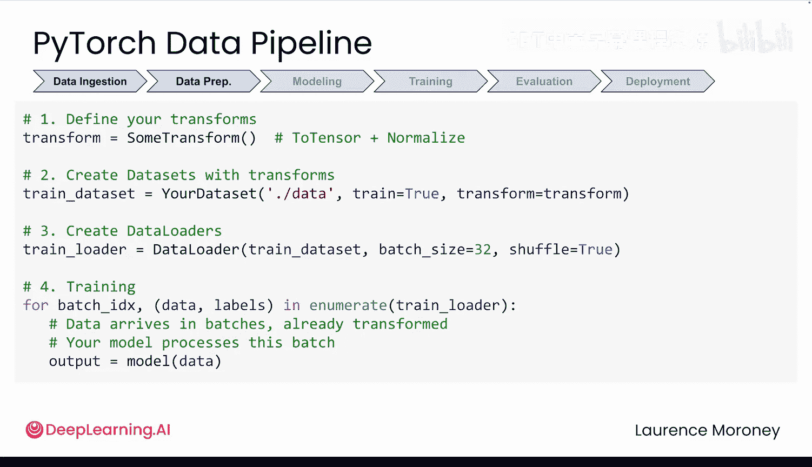

# 010：机器学习流程概览与PyTorch数据处理（第一部分）

在本节课中，我们将学习机器学习流程中的数据处理环节，并了解PyTorch如何通过其核心工具高效地处理数据，即使面对海量数据集。

## 概述：数据处理的重要性

在上一模块中，我们了解了机器学习的基本步骤。现在，为了深入理解Andrew的课程内容，我们需要掌握PyTorch的数据处理工具。在接触复杂的图像数据之前，让我们从一个更熟悉的例子开始：模块一中提到的配送数据。处理数百万条配送记录的工具，同样可以处理数百万张图像。一旦你理解了简单数据背后的模式，处理图像数据就会变得清晰很多。

## 从简单数据到海量数据

假设模块一中的配送公司业务增长了。现在，你需要分析的不是10条配送记录，而是10万条，甚至更多。

此时，如果你尝试一次性加载所有10万条记录，可能会使用类似下面的代码：

```python
# 示例：一次性加载所有数据
data = load_all_records()
```

加载这些数据时，每一条记录都需要占用你电脑的内存。对于10万条记录，你的电脑或许还能应付。但如果是数百万条记录呢？或者，如果数据中还包含了天气数据、交通模式、司机信息等各种附加信息呢？在这种规模下，你的电脑可能会迅速耗尽内存并崩溃。


这正是为什么我们需要分批加载数据。


## PyTorch的数据处理三剑客

一个实用的解决方案是分批处理数据，即将完整数据集分割成更小、更易管理的批次。但分批只是整个流程的一部分。在数据准备好用于训练之前，你需要对其进行处理、格式化，并以模型能够理解的方式提供给它。这就是PyTorch三个核心数据工具发挥作用的地方：**Transforms**、**Dataset** 和 **DataLoader**。它们各自负责流程中的一个关键部分，并且设计得能够很好地协同工作。

### 1. 数据转换（Transforms）

为了对数据应用转换，你通常会编写如下代码：

```python
transform = transforms.Compose([
    transforms.ToTensor(),
    transforms.Normalize(mean, std)
])
```

Transforms是在每个数据点被加载时对其执行的操作，目的是为模型准备数据。`Compose` 意味着按顺序执行以下操作。

以下是两种最常见的转换：
*   **`ToTensor()`**：将你的数据转换为PyTorch张量，并将其数值缩放到0到1之间。
*   **`Normalize(mean, std)`**：进一步调整这些数值，使其以零为中心，并使用标准差进行缩放。

神经网络对输入数据相当“挑剔”。当所有输入都是较小的数字（理想情况下以零为中心）时，它们的训练效果会好得多。这两个转换正是为此而设计的。目前，你只需知道它们能帮助你的模型更有效地训练。在下一个模块中，你将了解更多关于它们以及其他转换技术的知识。

### 2. 数据集（Dataset）

接下来，你需要将数据包装在一个 `Dataset` 对象中。这个对象在被请求时才会从磁盘获取每个样本，而不会一次性预加载所有数据。这是处理海量数据集的秘诀之一。

```python
dataset = SomeBuiltInDataset(..., transform=transform, train=True, download=True)
```

它负责处理诸如数据在磁盘上的位置、如何加载等问题。参数 `train=True` 让你可以在训练集和测试集之间进行选择。如果你对此还不熟悉，在讨论模型评估时你会看到更多相关内容。参数 `download=True` 会在数据不存在时自动下载数据。

你可以简单地通过索引来从数据集中检索一个样本：

```python
sample = dataset[0]
```

在模块三中，你将学习如何使用 `Dataset` 类来构建自定义数据集。但现在，我们将坚持使用PyTorch中提供的预构建数据集。

### 3. 数据加载器（DataLoader）

定义好数据集后，你将使用 `DataLoader` 来以批次的形式提供数据。

```python
dataloader = DataLoader(dataset, batch_size=32, shuffle=True)
```

它是整个流程的一部分，通过每次从数据集中请求一个批次，使得在海量数据集上进行训练成为可能。`batch_size` 告诉加载器每次提供多少个样本。你还可以打乱数据顺序，这有助于模型在训练过程中更有效地学习。

## 完整的数据处理流程

现在，让我们看看完整的数据处理流程是如何运作的。

```python
# 1. 定义数据转换
transform = transforms.Compose([transforms.ToTensor(), transforms.Normalize(...)])

# 2. 创建数据集
dataset = SomeBuiltInDataset(..., transform=transform, train=True, download=True)

# 3. 创建数据加载器
dataloader = DataLoader(dataset, batch_size=32, shuffle=True)

# 4. 在训练循环中使用
for batch in dataloader:
    # 将批次数据送入模型进行训练
    ...
```

至此，你的数据就准备就绪，可以开始训练了。这种模式能够高效地处理那些原本会压垮你电脑内存的数据集。无论你处理的是成千上万的配送记录，还是数百万张图像，其核心原则保持不变：**只在需要时，加载你需要的数据**。

## 总结与展望

本节课中，我们一起学习了PyTorch数据处理流程的核心部分。我们了解了为什么需要分批加载数据，并认识了PyTorch的三个关键工具：**Transforms**（用于数据预处理）、**Dataset**（用于封装和按需加载数据）以及**DataLoader**（用于提供批次数据并支持打乱顺序）。这个流程是高效训练模型的基础。

但是，将数据送入模型仅仅是开始。在下一个视频中，你将处理机器学习流程的其余部分，然后了解损失函数和优化器是如何更新模型的。我们下节课见。



