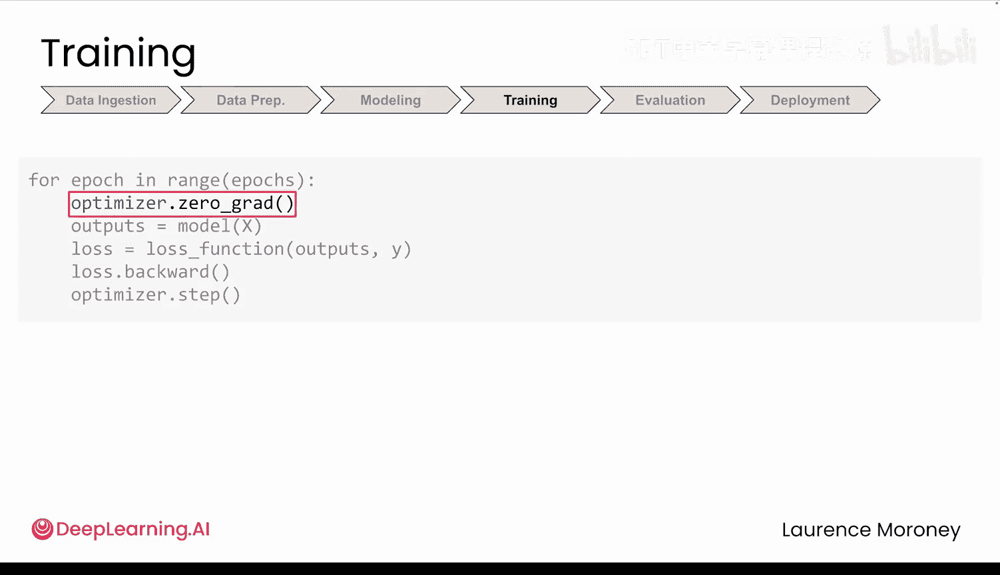
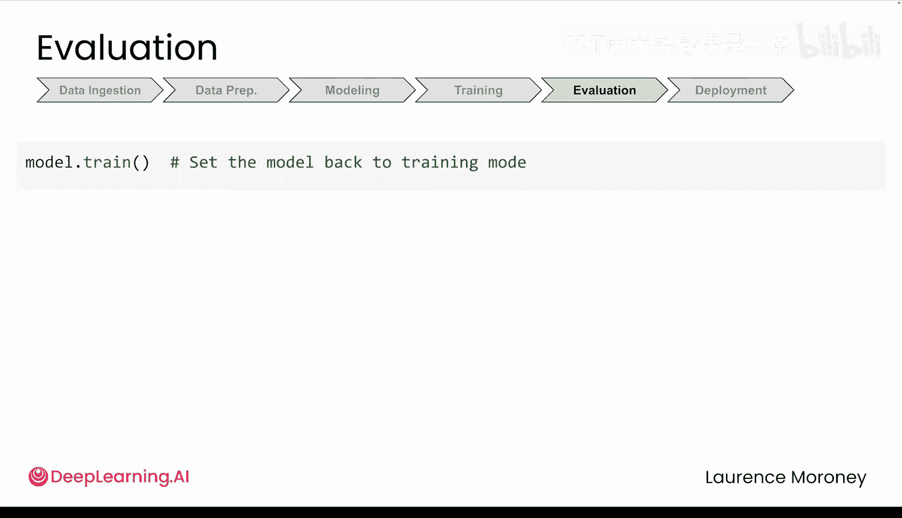

# 011：模型）🚀

## 概述
在本节中，我们将学习如何使用PyTorch构建、训练和评估深度学习模型。我们将从模型定义的基础开始，逐步深入到训练循环的细节，并了解如何正确评估模型性能。

## 模型构建：从Sequential到Module

上一节我们介绍了如何使用数据转换和数据加载器高效管理数据。本节中我们来看看模型构建的核心部分。

在模块1中，你已经见过`Sequential`的用法。它非常便捷，但PyTorch中更常见且灵活的模式是使用`nn.Module`来创建自定义模型。以下代码实现的功能与`Sequential`版本完全相同，但提供了更多控制权。

```python
import torch.nn as nn


class CustomModel(nn.Module):
    def __init__(self):
        super().__init__()
        self.layer1 = nn.Linear(784, 128)
        self.layer2 = nn.Linear(128, 10)
    
    def forward(self, x):
        x = self.layer1(x)
        x = self.layer2(x)
        return x
```

每个PyTorch模块类都包含两个核心部分：
*   **`__init__`**：定义模型中包含的层。这类似于准备你的工具。
*   **`forward`**：描述数据如何通过这些层流动。这里定义了数据在模型中的具体路径。

这种模式与`Sequential`安排数据流的方式类似，但以不同的风格编写。你会在PyTorch代码中频繁看到这种模式。

## 运行模型：调用与内部机制

你已经定义了`forward`方法，但如何实际运行它呢？你可能会想到`model.forward()`。但请回想一下，`Sequential`本身就是`nn.Module`的子类，它也有一个`forward`方法。然而，你运行那个模型时，从未直接调用过`forward`。对于自定义模型也是如此。

当你调用模型对象并传入数据时（例如 `output = model(input_data)`），PyTorch所做的不仅仅是运行你的`forward`方法。它还会进行一些内部检查、跟踪必要的数学运算，并为后续的模型更新做好准备。这就是为什么你总是通过调用模型对象并传入输入数据来运行模型，而不是直接调用`model.forward(input_data)`。PyTorch会为你处理`forward`调用，并将其包装在必要的簿记工作中。

关于代码中的 `super().__init__()` 这一行，它真的必要吗？你可能会认为这只是Python的样板代码，跳过它也许不会出问题。但当你创建模型时，PyTorch需要建立一个系统来跟踪其所有**可学习参数**（即训练过程中需要更新的权重和偏置）。调用 `super().__init__()` 实际上就是为你创建了这个跟踪系统。没有它，PyTorch将无处注册你的层。

## 训练循环：标准顺序至关重要

现在让我们来看看训练部分。你在模块1中已经见过这个训练循环。以下是大多数PyTorch训练循环的核心标准序列：

```python
for epoch in range(num_epochs):
    for batch in dataloader:
        # 1. 前向传播计算预测值
        predictions = model(batch_features)
        # 2. 计算损失
        loss = loss_fn(predictions, batch_labels)
        # 3. 梯度清零
        optimizer.zero_grad()
        # 4. 反向传播计算梯度
        loss.backward()
        # 5. 根据梯度更新参数
        optimizer.step()
```

这个标准顺序至关重要。`zero_grad()` 清除所有旧的计算结果，`backward()` 计算出改进方向（梯度），`step()` 根据梯度更新你的模型。




如果你不遵循这个标准顺序，你的训练可能会静默地失败。PyTorch不会抛出错误，但模型无法正常学习。例如：
*   如果你交换了 `backward()` 和 `step()` 的顺序，代码可以正常运行，但模型将基于**上一个批次**的计算结果来更新自己，而不是当前批次。
*   如果你把 `zero_grad()` 放在 `backward()` 之后，那么你就丢弃了 `backward()` 所做的所有工作。
*   如果你把 `zero_grad()` 放在循环之外，那么梯度计算会不断累积。每个批次的梯度都会加到前一个批次上，导致模型做出本应是微调的巨大调整。

接下来的两个视频将更深入地探讨这些主题。现在，只需记住这个模式很重要，每次训练模型时几乎都希望保持相同的顺序。

## 模型评估：验证学习成果

你一直在训练模型，但如何知道它是否真的在学习呢？这就是评估的目的：在模型**从未见过且未在其上训练过**的新数据上测试模型。

这里有两点至关重要：
1.  **`model.eval()`**：小心，这个方法**不是**评估你的模型（正如一些人错误认为的那样）。它只是将模型设置为评估模式。你需要这样做，因为它在计算上更高效，并且模型中的某些层在训练和评估期间的行为方式不同。
2.  **`torch.no_grad()`**：这将禁用PyTorch在训练期间进行的额外跟踪。如果你不关闭它，PyTorch即使在不需要时也会继续存储大量细节，这会浪费内存，甚至在验证期间可能导致程序崩溃。

评估最重要的部分是观察模型在**新数据**上的表现。在训练集上测试就像给学生同一份试卷考两次，学生可能只是记住了答案。你希望看到的是他们能否应用所学知识。

由于本模块主要探讨图像分类，你可以轻松地使用**准确率**来衡量性能。准确率的计算很直接：统计模型分类正确的次数，然后除以总尝试次数。

**准确率公式**：
`准确率 = (正确预测的数量) / (总预测数量)`

例如，如果你的模型在10000个数字中正确预测了9500个，那么准确率就是95%。

最后，如果你打算让模型返回训练状态，别忘了使用 `model.train()` 切换回训练模式。

## 总结



本节课中我们一起回顾了完整的机器学习流程：数据加载、模型构建、训练和评估。然而，对于训练部分，我们仅仅触及了表面。在接下来的两个视频中，我们将更深入地了解损失函数和优化器内部发生的事情。