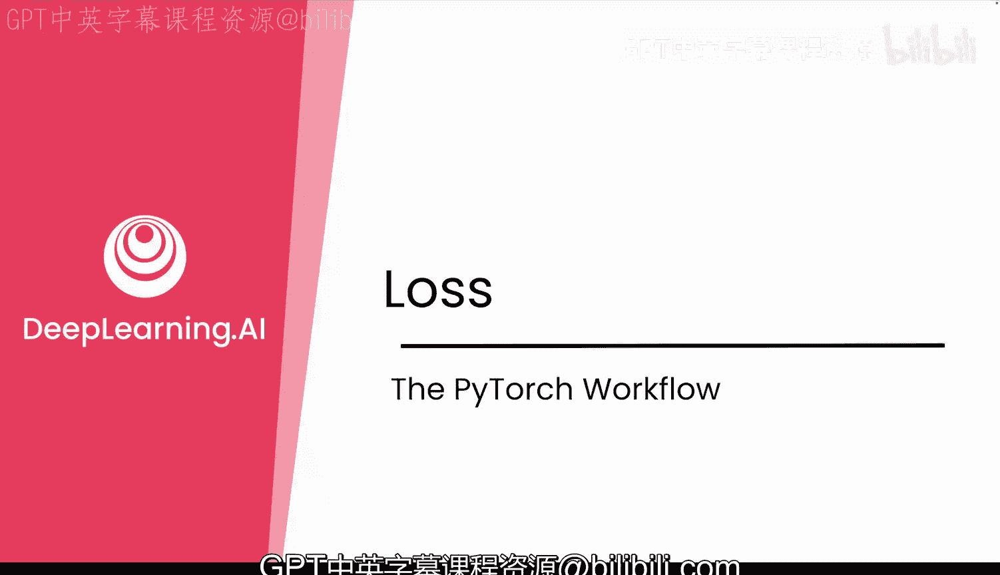
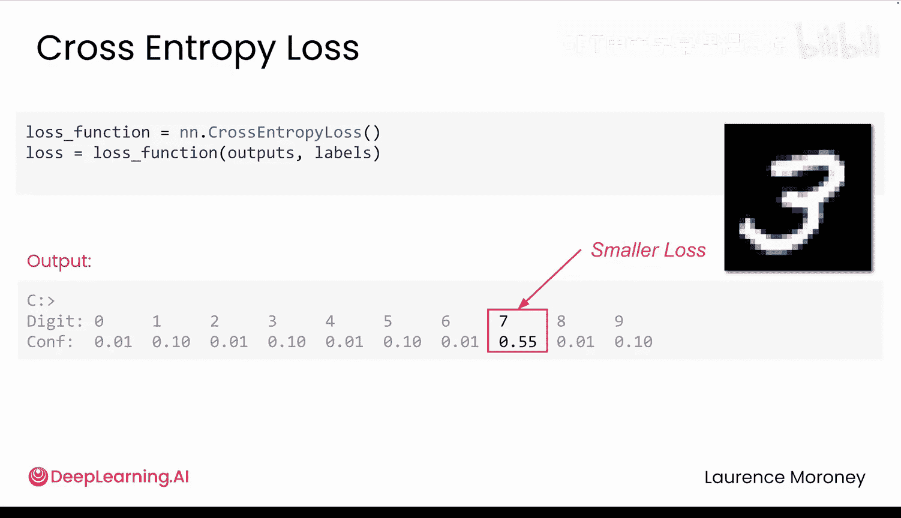
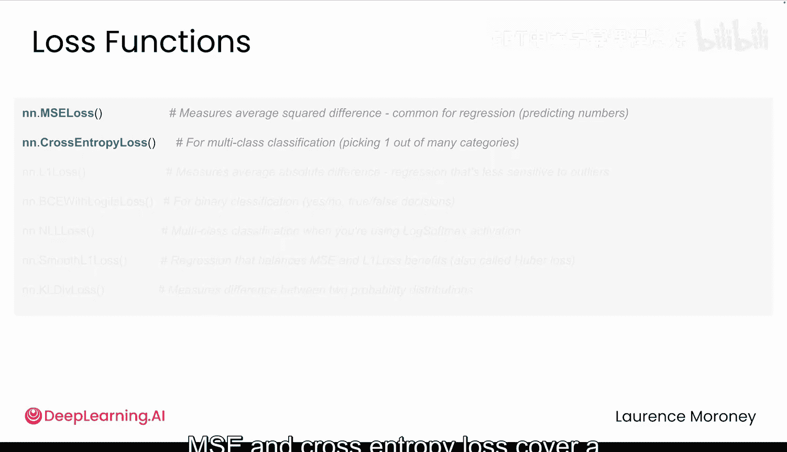

# 012：损失函数详解 📉

在本节课中，我们将要学习深度学习训练过程中的核心环节之一——损失函数。我们将深入理解其作用、常见类型以及如何根据任务选择合适的损失函数。

## 概述

在训练神经网络时，你会反复看到三行核心代码。它们写起来简单，但背后执行了复杂的数学运算。PyTorch会为你处理这些复杂计算。本节课，我们将聚焦于这三步中的第一步：**测量损失**，即评估模型预测的错误程度。

## 损失函数的作用

每一行代码在训练序列中按顺序协同工作：**测量 -> 诊断 -> 更新**。

首先，你需要测量预测的错误程度，这就是**损失**。它是一个汇总了所有错误的单一数值。随后，`backward()` 函数会诊断问题，分析模型中每个权重对误差的贡献。最后，`optimizer.step()` 根据这些诊断分数来更新权重，问题越大的权重会得到越大的修正。



本节课，我们专注于第一步：测量损失。

## 常见的损失函数

你已经见过一种损失函数，称为**均方误差**，它在预测送达时间这类任务中效果很好。你还将认识一种新的损失函数——**交叉熵损失**，它用于分类问题。我们将分解这些损失函数的工作原理，并学习如何为你的任务选择正确的损失函数。

每个损失函数都执行相同的基本工作：将模型的预测与真实答案进行比较，然后给出一个数值。数值越高，说明错误越大。

### 均方误差

回想快递公司的例子，模型根据距离预测送达时间。假设模型做了两个预测：第一个预测是6分钟，但实际时间是4分钟；第二个预测是3分钟，但实际时间是5分钟。

为了计算误差，你用预测值减去目标值。这就像测量猜测与现实之间的距离。那么模型整体表现如何呢？这里的损失是所有预测的平均误差。可以把它看作模型的成绩单：分数越低，说明你的预测平均上越接近现实。

但是，如果你直接平均原始误差（本例中是+2和-2，除以2得到0），看起来像是完美表现，尽管两个预测实际上都是错的。这就是为什么我们要使用**均方误差**：对差值进行平方可以消除负号。现在，两个错误都被计算在内，并且不会相互抵消。这就是“均方误差”名称的由来。

平方还有另一个好处：它让更大的错误影响更大。误差10分钟远比误差1分钟严重得多。

因此，MSE损失在两方面有帮助：
1.  确保所有错误都被计入。
2.  对较大错误的惩罚比对较小错误的惩罚更重。

**公式**：
`MSE = (1/n) * Σ (预测值 - 真实值)^2`

当你预测连续值时，如距离、温度或价格，均方误差是完美的选择。

### 交叉熵损失

在本模块中，你要处理分类问题（例如，识别这是什么数字）。这里你需要一个不同的损失函数，我们将使用一种称为**交叉熵损失**的函数。

使用交叉熵损失时，你的模型不只是选择一个答案。它会为所有可能的答案或类别输出一个置信度分数。

以MNIST数据集为例，你的模型必须在0到9的数字之间做出选择。因此，对于每张图像，它输出10个数字，即每个数字的概率。例如，模型可能70%确信它是3，8%确信它是2，等等。所有这些分数加起来应为100%。

核心思想是：**交叉熵损失会惩罚过于自信的错误答案**。如果你的模型说它有95%的把握认为这是数字7，但实际上它是3，这就是一个很大的错误，损失会非常高。但如果它只有55%的把握认为这是7，虽然仍然是错的，但没那么自信，因此损失会小一些。

你希望模型对正确答案有信心，对错误答案不确定。交叉熵损失正是为了塑造这种行为。

**代码**（在PyTorch中）：
```python
loss_fn = nn.CrossEntropyLoss()
loss = loss_fn(model_output, target_labels)
```

## 重要注意事项




以下是选择损失函数时的重要警告：

*   **不要混淆你的损失函数**。对分类任务使用MSE损失可能有效，但效果会很差，训练会变慢且可能不稳定。
*   如果你对回归任务使用交叉熵损失，它很可能会出错，因为它期望的是概率分布，而不是连续值。
*   同样，不要直接比较不同损失函数的原始数值。例如，MSE是0.08，而交叉熵是2.3，哪个更好？这就像比较两个完全不同的东西，它们尺度不同。只需确保在训练过程中，你选择的那个损失函数的数值在下降即可。

目标是**最小化损失**。

## 如何选择损失函数

那么，何时使用哪种损失函数呢？

*   如果你预测的是一个**数字**，如温度、价格或距离，使用**MSE**。
*   如果你预测的是一个**类别**，如数字、动物或单词，使用**交叉熵损失**。

当然，还有很多其他损失函数，每种都适用于特定情况。如果你感兴趣，可以查看下方资源进一步探索。但目前，了解MSE和交叉熵损失已经可以覆盖深度学习中的大部分任务了。

## 总结

本节课我们一起学习了损失函数的核心概念。我们了解到损失函数是衡量模型预测错误程度的工具，并重点介绍了两种最常用的损失函数：用于回归任务的**均方误差**和用于分类任务的**交叉熵损失**。关键在于根据你的任务类型（预测数值还是类别）来正确选择损失函数。



这就是我们“测量、诊断、更新”序列中的“测量”部分。在下一个视频中，我们将探索PyTorch如何诊断问题并进行权重更新。