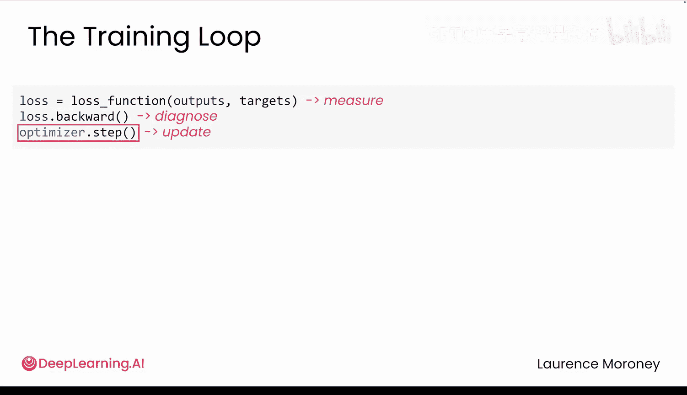
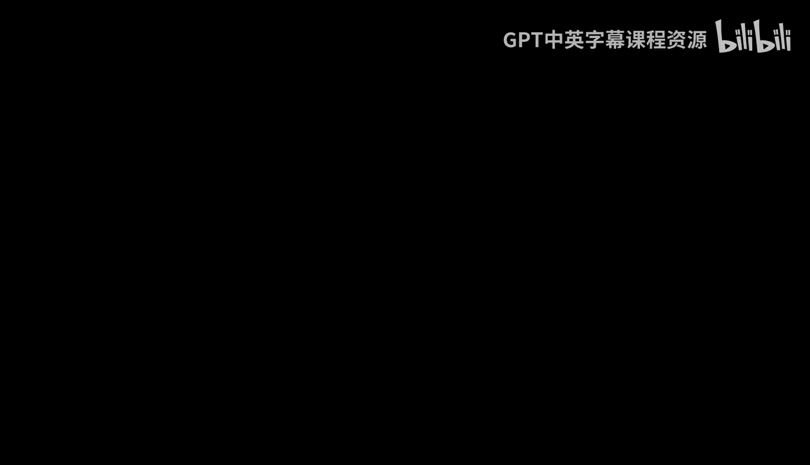

# 013：优化器与梯度 🧠

在本节课中，我们将要学习训练循环中的两个核心步骤：梯度计算与参数优化。我们将了解损失函数如何评估模型预测的准确性，以及如何利用这些信息来改进模型。

上一节我们介绍了损失函数如何衡量预测的对错，这是每个训练循环的第一步。本节中我们来看看接下来的两个关键步骤：反向传播和优化器。

## 损失评估与原因分析

在通过损失函数衡量了预测的错误程度后，下一步是找出造成这些损失的原因，这正是反向传播的作用。

回想一下神经网络的工作原理。每个神经元接收输入，将每个输入乘以一个权重，加上偏置，然后通过激活函数传递结果。即使在一个小型神经网络中，也可能涉及成千上万个权重和偏置。

以一个简单网络为例：
*   它有 **784** 个输入。
*   **128** 个隐藏层神经元。
*   **10** 个输出类别。

这个网络拥有超过 **100,000** 个权重和偏置参数。反向传播就像一个侦探，它会检查每一个权重和偏置，并询问：“你对最终的损失贡献了多少？”

## 理解梯度

这些诊断分数被称为**梯度**。梯度不仅告诉你哪些参数导致了误差，还告诉你贡献了多少以及方向如何。
*   **正值**意味着增加该权重会使损失变得更糟。
*   **负值**意味着增加该权重本可以帮助减少损失。
*   **大值**表示该参数影响很大。
*   **小值**表示该参数几乎无关紧要。

这里有一个常见的误解：人们常以为反向传播会直接更新权重。实际上，反向传播**只计算梯度**，即找出每个权重对总损失的贡献程度。实际的更新操作稍后会在调用 `optimizer.step()` 时发生。

## 梯度下降的直观理解

你的目标是**最小化损失**。可以想象成站在山坡上，试图到达山谷的底部。梯度告诉你当前位置的坡度，即哪边是上坡，哪边是下坡。为了到达谷底，你需要朝下坡方向走，也就是朝着损失更低的方向前进。这就是为什么我们称之为**梯度下降**。

最简单的实现就是我们一直在使用的**随机梯度下降**。其策略很直接：
*   如果一个权重的梯度为**负**，就**增加**它。
*   如果一个权重的梯度为**正**，就**减少**它。
*   梯度大，就做大的调整；梯度小，就做小的调整。

但优化器并非直接减去梯度，它会先用**学习率**对梯度进行缩放。例如，如果你的梯度是 `0.5`，学习率是 `0.01`，那么实际的更新量将是 `0.5 * 0.01 = 0.005`。

学习率的选择至关重要：
*   **过小的学习率**：更新步伐极小，需要极长时间才能到达谷底。
*   **合适的学习率**：稳步前进，高效到达谷底。
*   **过大的学习率**：更新步伐巨大，可能会在最小值附近来回震荡，甚至无法收敛。

## 更智能的优化器：Adam

SGD 效果不错，但还有更智能的优化器，它们能为每个权重进行自适应的调整，**Adam** 就是其中之一。它就像一个助手，知道哪些权重需要大幅调整，哪些只需要微调。Adam 因其可靠、灵活且通常比其它方法更快，已成为一个流行的首选优化器。

但请注意：**不要**将 SGD 的学习率直接复制给 Adam 使用，因为你的损失可能会爆炸。Adam 的学习率调优方式完全不同。

PyTorch 中还有其他优化器，如 RMSprop、Adagrad 等。但对于大多数项目，SGD 和 Adam 已经足够。

## 梯度清零的重要性

理解了梯度是每个参数的诊断分数后，`zero_grad()` 的作用就变得清晰了。每次调用 `backward()` 时，PyTorch 会将新的梯度**累加**到已有的梯度上。如果你不调用 `zero_grad()`，你就不只是在诊断当前批次的参数，而是在累积**每一个**批次的诊断结果，梯度会不断错误地累加，导致训练崩溃。

因此，你需要在每个训练循环开始时调用 `optimizer.zero_grad()`。

你可能会问，为什么 PyTorch 默认要累积梯度呢？这种行为对于高级用例非常有用，例如梯度累积或某些自定义的训练计划。但对于包括本课程在内的绝大多数项目，你每次都需要清除这些梯度。

## 完整的训练循环

现在，你可以理解完整的训练循环了：
1.  **损失函数**：衡量模型预测的对错。
2.  **反向传播**：诊断每个参数对误差的贡献（计算梯度）。
3.  **优化器**：利用这些诊断分数（梯度）来更新权重。

---

本节课中我们一起学习了：
*   反向传播如何像侦探一样，通过计算**梯度**来诊断每个模型参数对预测错误的贡献。
*   优化器（如 **SGD** 和 **Adam**）如何利用梯度信息，遵循**梯度下降**的原则来更新模型权重，以最小化损失。
*   学习率在优化过程中的关键作用，以及为什么需要在每个训练步骤前调用 `optimizer.zero_grad()` 来清除累积的梯度。

在开始构建你的第一个分类器之前，还有一个 PyTorch 特有的重要主题需要讨论：**设备管理**，即如何让代码在 GPU 上运行以实现快速训练。我们下节课见。