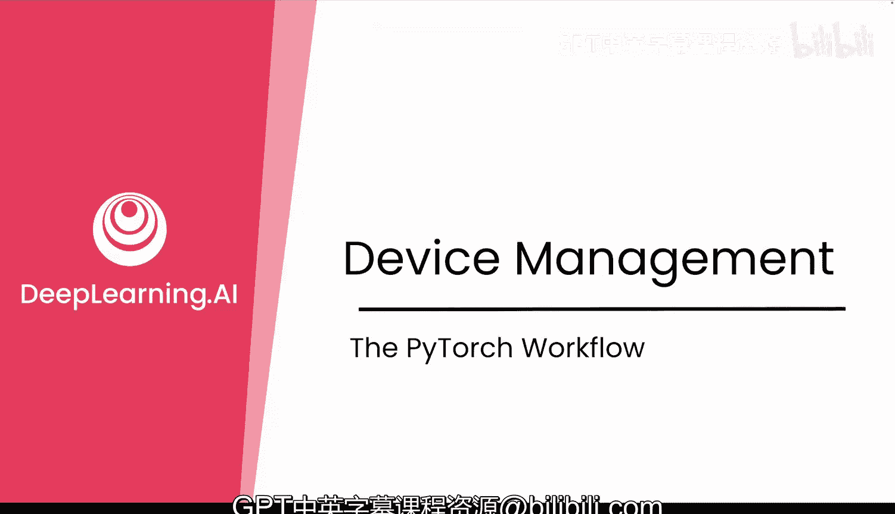
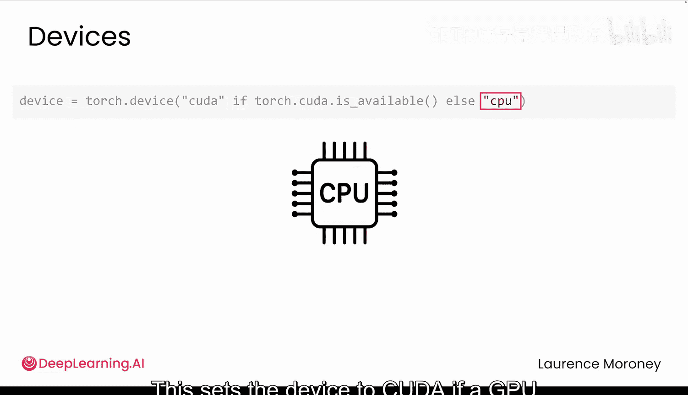
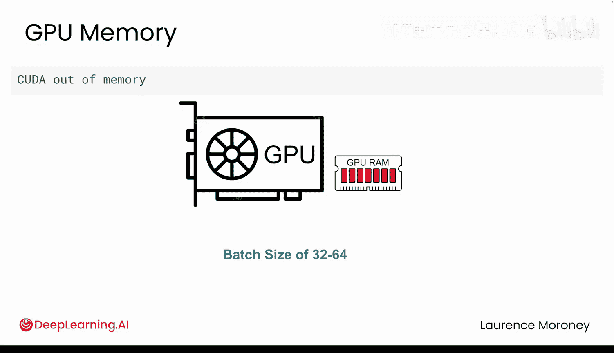

# 014：设备管理 🖥️➡️🎮

在本节课中，我们将要学习PyTorch中一个至关重要的概念：设备管理。理解如何控制数据和计算所在的设备（CPU或GPU），是避免常见错误、高效运行深度学习模型的基础。

## 概述

当你开始在PyTorch中更多地使用张量和模型时，有一个重要概念需要尽早理解：**每个张量和每个模型都存在于一个设备上**。这个设备可能是你的CPU，也可能是GPU或其他可用的加速器。关键在于，PyTorch**不会**自动为你移动数据。如果你的张量和模型不在同一个设备上，你的代码可能无法运行，甚至可能崩溃。

上一节我们介绍了张量和模型的基础操作，本节中我们来看看如何管理它们所在的硬件设备，以确保计算顺利进行。

## 设备是什么？

每台计算机都有一个**CPU**。这是PyTorch默认使用的设备，除非你另有指定。CPU是为通用计算设计的，按顺序执行操作。

此外，一些系统还拥有像**GPU**（图形处理器）这样的加速器。GPU可以极大地加速张量运算，尤其是在模型训练期间。事实上，在GPU等加速器上进行训练，其速度可能比仅使用CPU快**10到15倍**。因此，如果你的系统有GPU，你几乎总是希望使用它。

## 如何选择设备？

首先，你需要检查你的系统是否有可用的加速器。PyTorch提供了一个简单的方法：

```python
import torch

# 检查是否有可用的CUDA（GPU）设备
torch.cuda.is_available()
```



如果上述代码返回`True`，则PyTorch可以使用GPU来加速计算。

以下是选择设备的一个常见模式：

```python
# 设置设备：如果有GPU则使用CUDA，否则使用CPU
device = torch.device("cuda" if torch.cuda.is_available() else "cpu")
```

这是一个安全的默认设置，你在PyTorch代码中会经常看到。这里的`"cuda"`关键字指的是配备了CUDA工具包的NVIDIA GPU。虽然还有其他选项（如Apple Silicon的`"mps"`），但CUDA是最常用的，也是本课程实验将使用的。

## 如何将模型和数据移动到设备上？

一旦定义了你的设备，下一步就是将模型和数据移动到该设备上。

**首先，移动你的模型：**

```python
model = YourModelClass()  # 实例化你的模型
model.to(device)  # 将模型的所有参数移动到选定的设备上
```

这行代码将模型的参数放置到所选设备上。

**然后，在你的训练循环中，移动每一批数据：**

```python
for batch in dataloader:
    data, targets = batch
    # 将数据和目标标签都移动到设备上
    data, targets = data.to(device), targets.to(device)
    # ... 后续训练步骤
```



## 如何检查设备位置？


如果你不确定某个对象在哪个设备上，可以随时检查。

对于张量，这很简单：

```python
print(data.device)  # 输出例如：device(type='cuda', index=0)
```

对于模型，情况略有不同。模型本身不在设备上，但它的参数在。因此，你可以检查其中一个参数来了解所有参数的位置：

```python
# 检查模型第一个参数所在的设备
print(next(model.parameters()).device)
```

如果你遇到设备错误，还应该仔细检查你的目标标签（`targets`）和模型的输出是否也在同一个设备上。

## 一个常见的陷阱

当你使用`.to()`方法时，需要注意：**它不会原地（in-place）更改张量，而是会创建一个新的张量**。因此，如果你想真正移动张量，需要重新赋值。

```python
# 错误做法：这不会改变原始tensor
tensor.to(device)
# 后续使用 `tensor` 时，它仍在原来的设备上

# 正确做法：重新赋值
tensor = tensor.to(device)
```

任何时候使用`.to()`，请确保将结果赋值给你实际会使用的变量。

## 完整的训练循环示例

以下是一个包含正确设备管理的完整训练循环示例：

```python
# 1. 预先选择设备
device = torch.device("cuda" if torch.cuda.is_available() else "cpu")

# 2. 实例化模型并一次性移动到设备
model = YourModelClass().to(device)

# 3. 定义损失函数和优化器
criterion = nn.CrossEntropyLoss()
optimizer = torch.optim.SGD(model.parameters(), lr=0.001)

# 4. 训练循环
for epoch in range(num_epochs):
    for data, targets in train_dataloader:
        # 将每一批数据移动到设备
        data, targets = data.to(device), targets.to(device)

        # 前向传播
        outputs = model(data)
        loss = criterion(outputs, targets)

        # 反向传播和优化
        optimizer.zero_grad()
        loss.backward()
        optimizer.step()
```

关键步骤是：预先选择设备、一次性移动模型、然后在每个批次中移动数据。这个模式是你用PyTorch编写的每一个训练脚本的基础。

## 注意GPU内存限制

即使所有东西都在正确的设备上，还有一点需要注意：**GPU内存是有限的**。如果你的模型和批次大小占用的内存超过了GPU的可用内存，你会看到类似“CUDA out of memory”的错误。

这就是为什么**批次大小（Batch Size）很重要**：
*   批次太小：训练速度慢。
*   批次太大：可能超出GPU内存导致崩溃。

对于许多系统，**32到64之间的批次大小**是一个不错的起点，但这取决于你的硬件和模型架构。如果你看到内存错误，首先尝试**降低你的批次大小**，这是最常见的解决方法。

## 总结

本节课中我们一起学习了PyTorch中的设备管理。我们了解到：
1.  张量和模型需要位于相同的设备（CPU或GPU）上才能进行计算。
2.  可以使用 `torch.cuda.is_available()` 检查GPU是否可用，并使用 `torch.device()` 设置设备。
3.  使用 `.to(device)` 方法将模型和数据移动到目标设备，并注意需要重新赋值。
4.  可以通过 `.device` 属性检查张量或模型参数所在的设备。
5.  需要注意GPU的内存限制，合理设置批次大小。



早期就正确处理设备管理，可以帮助你避免PyTorch中最令人沮丧的一类错误。当出现问题时，你也将确切地知道该检查什么。


现在你已经了解了如何管理设备。结合目前所学的所有知识，你已经准备好进行整合了。在下一个视频中，你将看到如何在PyTorch中训练你的第一个图像分类器，让整个流程生动起来。