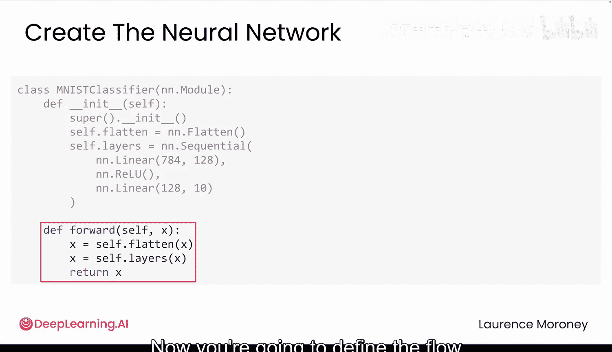
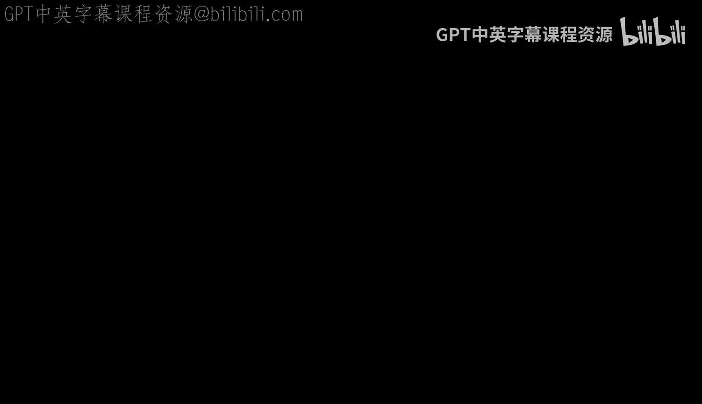

# 015：图像分类（第一部分）—— 数据准备与模型构建

在本节课中，我们将学习如何将之前学到的知识整合起来，使用PyTorch构建你的第一个图像分类器。我们将使用MNIST手写数字数据集，完成从数据加载、预处理到构建神经网络模型的完整流程。

到目前为止，你已经学习了如何加载数据、管理设备、计算损失和更新权重。现在，让我们将这些知识结合起来，用PyTorch构建你的第一个图像分类器。

你将要处理的是MNIST数据集，也就是之前见过的手写数字。这个数据集包含60000张训练图像和10000张测试图像。每张图像都是28x28像素的灰度图。在完成作业中的Andrew信件任务之前，这是一个完美的热身练习。

## 数据管道构建

让我们开始编写代码并构建模型。我们将从数据管道开始。

首先，你需要导入`torchvision`。这是PyTorch的计算机视觉库，内置了像MNIST这样的流行数据集，以及图像处理工具。

以下是构建数据管道的步骤：

1.  **定义数据转换**：我们使用`transforms.Compose`来组合一系列预处理步骤。
    *   `ToTensor()`：将图像转换为张量，并将像素值从0-255缩放到0-1的范围。
    *   `Normalize(mean, std)`：使用数据集的均值和标准差进行归一化，使数据以0为中心。对于MNIST，均值为`0.1307`，标准差为`0.3081`。使用相同的值归一化所有图像，可以使数据更一致，有助于模型更快地学习。

2.  **加载数据集**：
    *   **训练集**：`root='./data'`指定文件在计算机上的存储位置。`train=True`表示加载60000张训练图像。`download=True`表示如果MNIST数据集不存在，则自动下载。`transform`参数将我们定义的预处理步骤自动应用到每张图像上。
    *   **测试集**：与训练集类似，但使用`train=False`来获取10000张测试图像。我们使用相同的转换、存储位置等。`torchvision`会为你处理所有的下载和组织工作。

3.  **创建数据加载器**：
    *   **训练加载器**：设置`batch_size=64`，意味着每批包含64张图像。`shuffle=True`表示在每个训练周期，模型都会以不同的随机顺序看到图像。
    *   **测试加载器**：设置`batch_size=1000`。这些批次更大，因为我们不需要计算梯度，只是进行测试。注意，测试数据**不进行**打乱。

现在，思考一下为什么训练数据需要打乱而测试数据不需要。数据通常按类别组织。如果不打乱，模型可能会连续看到6000个“0”之后才看到“1”。它可能会学习到错误的模式（例如，前面的批次都是0，后面的批次都是9），而不是真正学习每个数字的特征。打乱可以混合所有数据，确保每个批次都有多样性。但对于测试，模型已经完成学习，我们只是检查它是否能正确识别数字，因此顺序无关紧要。

## 构建神经网络模型

现在，是时候创建一个神经网络了。你将超越简单的`Sequential`模型，构建一个自定义架构。

我们来逐步解析这个模型：

1.  **创建模型类**：你创建一个继承自`nn.Module`的类。这为你提供了PyTorch所有的神经网络功能。

2.  **定义层**：在类的`__init__`方法中定义网络层。
    *   `nn.Flatten()`：这是一个新层。它的作用如下：MNIST图像以特定形状的张量形式到达。当PyTorch加载单个MNIST图像时，它给出一个形状为`[1, 28, 28]`的张量（1个通道，28像素高，28像素宽）。当使用批次训练时（例如`batch_size=64`），数据形状变为`[64, 1, 28, 28]`。线性层期望的是平坦的向量（即每个图像是一长串数字，而不是二维网格）。`Flatten`层的作用就是将每个28x28的图像重塑为一行784个值（因为28 * 28 = 784）。这样，批次数据就从`[64, 1, 28, 28]`变成了`[64, 784]`。没有`Flatten`层，图像数据到达线性层时会发生形状不匹配错误。
    *   `nn.Linear(784, 128)`：将这784个像素值转换为128个隐藏特征。
    *   `nn.ReLU()`：我们的激活函数，保留正值，将负值置零。
    *   `nn.Linear(128, 10)`：将128个特征转换为10个输出。10个输出对应10个数字类别（0到9）。

3.  **定义前向传播**：在`forward`方法中定义数据的流动。接收输入，将其展平，然后通过定义的层，最后返回输出。

以下是模型定义的代码示例：

```python
import torch
import torch.nn as nn

class NeuralNetwork(nn.Module):
    def __init__(self):
        super().__init__()
        self.flatten = nn.Flatten()
        self.linear_relu_stack = nn.Sequential(
            nn.Linear(28*28, 128),
            nn.ReLU(),
            nn.Linear(128, 10),
        )

    def forward(self, x):
        x = self.flatten(x)
        logits = self.linear_relu_stack(x)
        return logits
```

现在，你已经准备好了一切：一个加载和预处理MNIST图像的数据管道，以及一个可以处理这些图像的神经网络。

但是，目前这个模型还无法区分0和9。在下一部分，你将看到如何通过训练让这个模型“活”起来。你将学习如何设置优化器、定义训练循环，并观察你的模型识别数字的准确率如何逐步提高。



## 总结



本节课中，我们一起学习了图像分类任务的第一部分。我们构建了处理MNIST数据集的数据管道，包括使用`torchvision`进行数据加载、转换（归一化）以及创建数据加载器。接着，我们构建了一个自定义的神经网络模型，它包含`Flatten`层以适配图像数据，以及线性层和ReLU激活函数来学习特征。现在，我们已经拥有了数据和模型架构，为下一部分的模型训练做好了准备。