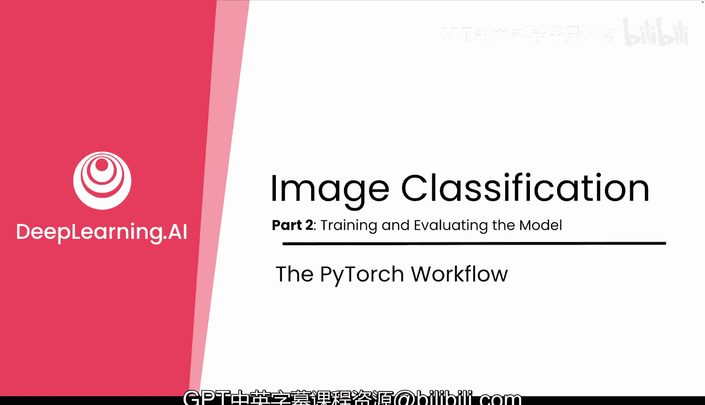
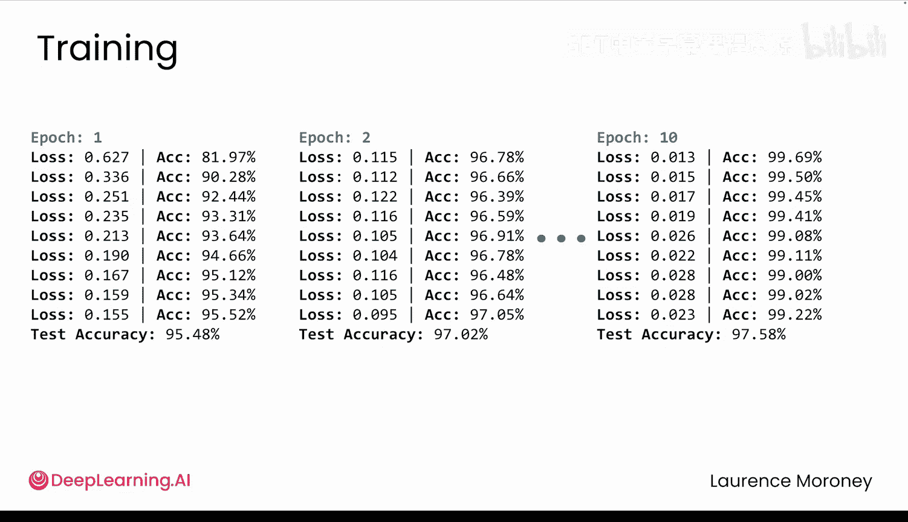

# 016：图像分类模型训练与评估

## 概述
在本节课中，我们将学习如何使用PyTorch训练和评估一个图像分类模型。我们将从设置训练环境开始，逐步讲解训练循环、损失函数、优化器的使用，以及如何评估模型在未见数据上的性能。

---

## 设备选择与模型准备
上一节我们介绍了如何构建数据管道和神经网络架构。本节中，我们来看看如何为训练做好准备。

首先，需要选择运行设备。如果CUDA可用，我们将使用GPU进行加速，否则PyTorch将自动回退到CPU。

```python
device = torch.device("cuda" if torch.cuda.is_available() else "cpu")
```

接着，创建模型并将其移动到选定的设备上。请记住，模型和数据必须位于同一设备上，否则训练过程中会出现错误。



```python
model = YourNeuralNetwork()
model.to(device)
```

## 定义损失函数与优化器
我们将使用交叉熵损失函数，它专为多分类任务设计，非常适合从0到9中选择一个数字。

```python
loss_fn = nn.CrossEntropyLoss()
```

优化器选择Adam，并设置学习率为0.001。Adam优化器能够在训练过程中自适应地调整学习率，在梯度噪声较大时进行较大调整，在训练稳定后进行较小修正。

```python
optimizer = torch.optim.Adam(model.parameters(), lr=0.001)
```

## 构建训练循环
现在，让我们创建一个函数来训练模型一个完整的周期（epoch）。该函数接收五个输入：模型、数据加载器、损失函数、优化器和运行设备。

以下是训练函数的核心步骤：

1.  将模型设置为训练模式。
2.  初始化跟踪变量，用于累计损失和统计预测正确的样本数。
3.  遍历数据加载器中的所有批次（batch）。
4.  对每个批次执行前向传播、计算损失、反向传播和参数更新。

```python
def train_one_epoch(model, dataloader, loss_fn, optimizer, device):
    model.train()
    running_loss = 0.0
    correct = 0
    total = 0

    for batch_idx, (data, target) in enumerate(dataloader):
        data, target = data.to(device), target.to(device)

        optimizer.zero_grad()
        output = model(data)
        loss = loss_fn(output, target)
        loss.backward()
        optimizer.step()

        running_loss += loss.item()
        _, predicted = output.max(1)
        total += target.size(0)
        correct += predicted.eq(target).sum().item()

        # 每100个批次打印一次进度
        if batch_idx % 100 == 0:
            print(f'Batch {batch_idx}, Loss: {loss.item():.4f}, Acc: {100.*correct/total:.2f}%')
```

观察训练过程，损失值会从较高水平（如0.64）下降，而准确率则会从较低水平（如81%）上升。仅通过一次完整的数据集遍历，模型性能就能得到显著提升。

## 构建评估函数
训练只是故事的一半，我们还需要在未见过的数据上测试模型的性能。

评估模式与训练模式有两个关键区别：
1.  使用 `model.eval()` 将模型切换到评估模式。
2.  使用 `torch.no_grad()` 上下文管理器，在评估期间不计算梯度，以节省内存并加速计算。

评估过程相对直接：运行每个批次通过模型，统计预测正确的样本数量，最后返回准确率百分比。

```python
def evaluate(model, dataloader, device):
    model.eval()
    correct = 0
    total = 0
    with torch.no_grad():
        for data, target in dataloader:
            data, target = data.to(device), target.to(device)
            output = model(data)
            _, predicted = output.max(1)
            total += target.size(0)
            correct += predicted.eq(target).sum().item()
    accuracy = 100. * correct / total
    return accuracy
```

## 执行完整训练与评估
现在，我们有了训练函数和评估函数，可以将它们组合起来进行完整的模型训练。

我们将模型训练10个周期。这不仅仅是简单的重复，每个周期模型都会优化其对不同数字（例如区分2和7）特征的理解。

在每个训练周期之后，我们都在测试集上进行评估，以观察模型在未见数据上的表现。这能告诉我们模型是在学习可泛化的模式，还是仅仅在记忆训练数据。

```python
num_epochs = 10
for epoch in range(num_epochs):
    print(f'Epoch {epoch+1}/{num_epochs}')
    train_one_epoch(model, train_loader, loss_fn, optimizer, device)
    test_acc = evaluate(model, test_loader, device)
    print(f'Test Accuracy after Epoch {epoch+1}: {test_acc:.2f}%\n')
```

经过10个周期的训练，你会看到损失变得非常小，而准确率则很高。当测试集上的准确率停止提升时，通常意味着模型在当前设置下已经完成了学习，可能不需要完整的10个周期。



## 总结
本节课中，我们一起学习了如何使用PyTorch训练和评估一个图像分类模型。我们涵盖了从设备准备、定义损失函数和优化器，到编写训练循环和评估函数的关键步骤。现在，你已经准备好训练你的第一个PyTorch图像分类器了。