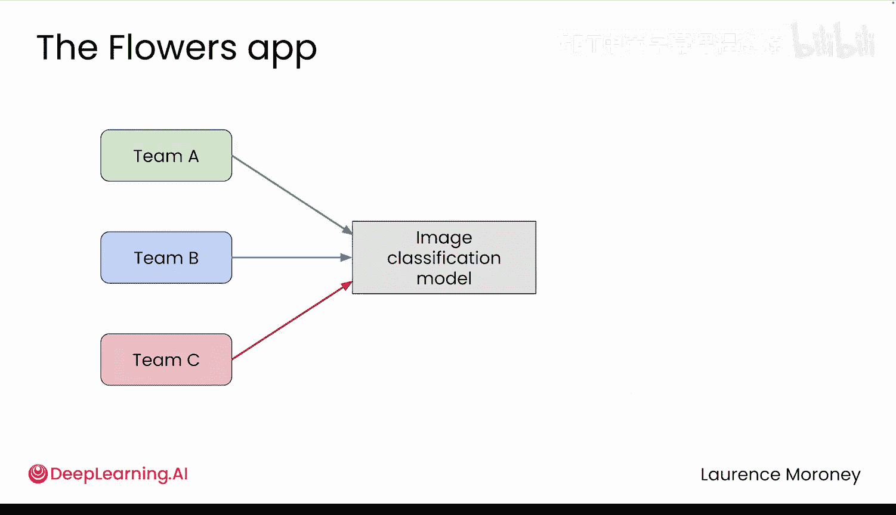
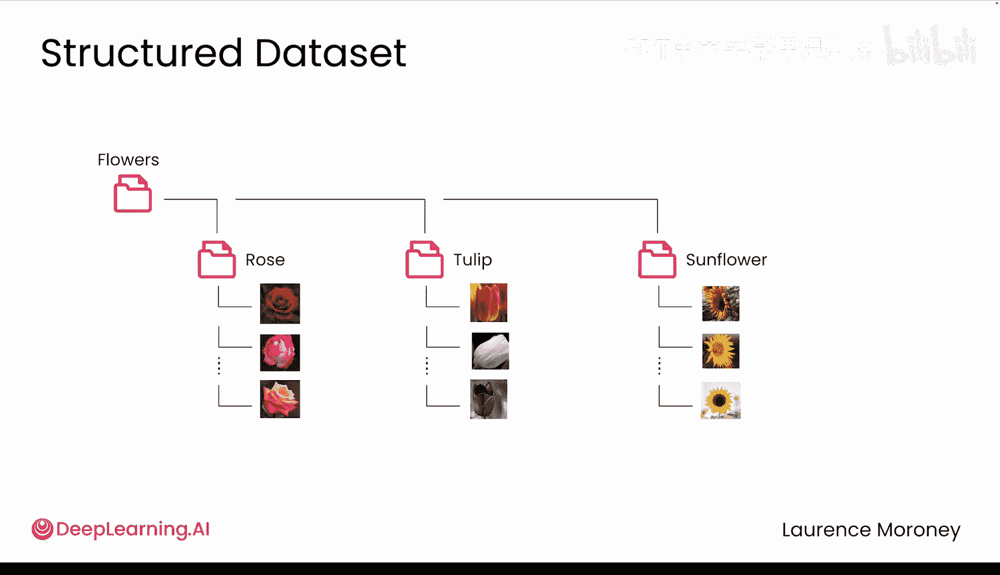
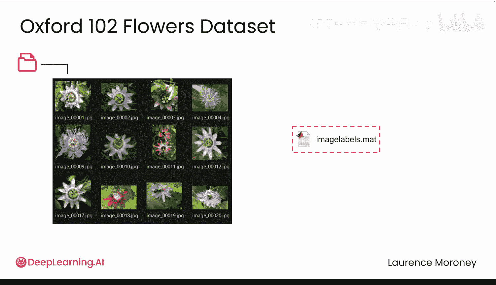
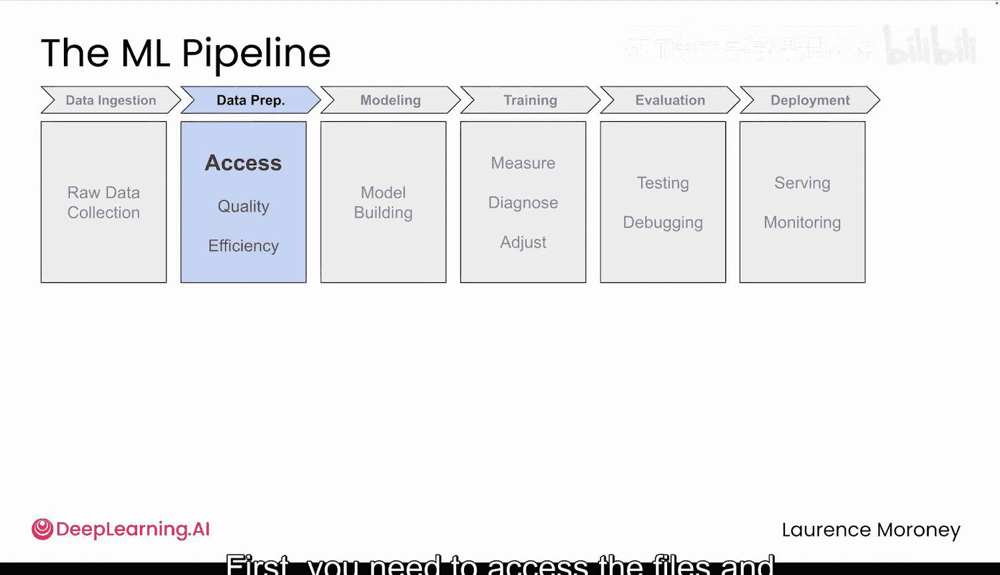
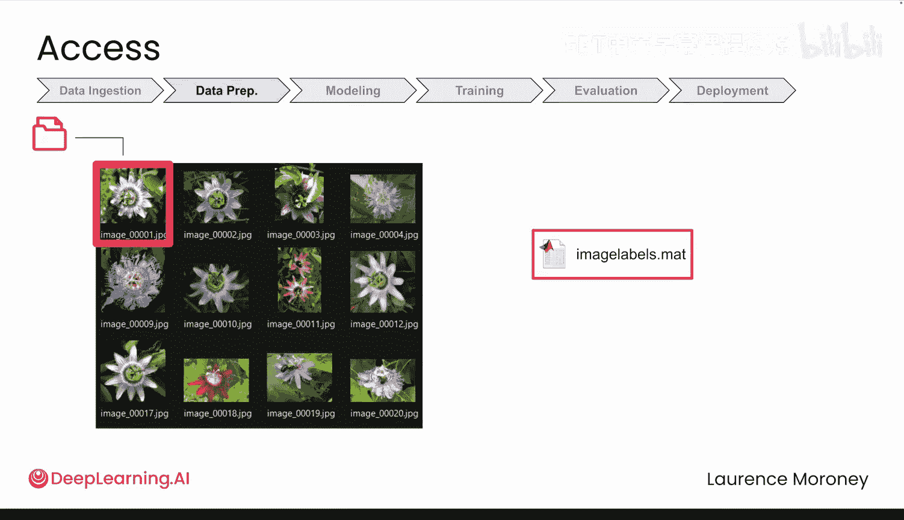
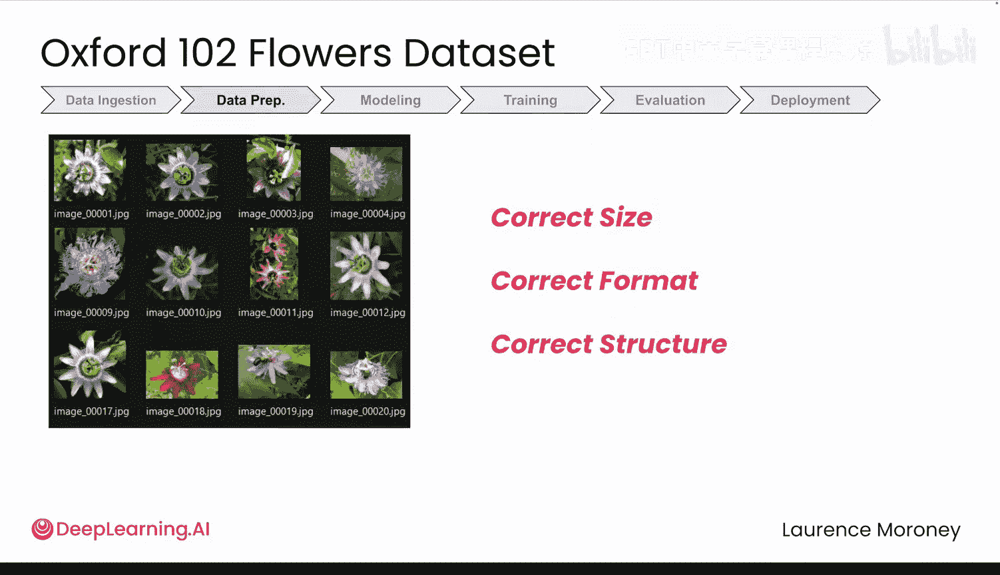
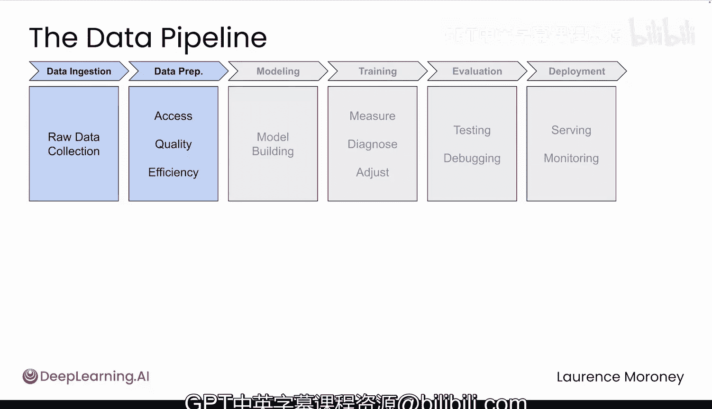

# 017：数据管道简介 🌸

在本模块中，我们将学习如何为深度学习模型构建高效、可靠的数据管道。我们将从一个真实世界的挑战——为植物园构建花卉识别应用——入手，探讨处理非标准、混乱数据集的完整流程。

在前两个模块中，你已经掌握了PyTorch的基础知识，并构建了第一个图像分类器。你学会了加载数据、构建神经网络、训练模型并获得预测结果。这个基础是后续一切工作的基石。现在，我们将进入更有趣的部分。

到目前为止，你处理的是像MNIST这样干净、组织良好的数据集。但实践中，数据集通常更加混乱且充满挑战。这正是你接下来要面对的问题。

## 项目背景与挑战

一个植物园希望为其游客构建一个花卉识别应用，而你被请来帮忙。在此之前，已有三个不同的团队尝试过。他们都使用了完全相同的神经网络架构、相同的层和参数，但得到了截然不同的结果。

为什么？因为真正的挑战不仅在于模型，更在于数据。无论你的模型多么复杂，如果你不能正确地访问和准备数据，从一开始就注定失败。糟糕的数据处理意味着糟糕的结果，这正是那些团队失败的原因。

现在你接手了这个项目，我们需要确保你不会犯同样的错误。因为即使是世界上最好的模型，也无法拯救一个破碎的数据管道。

## 数据集初探

植物园提供了牛津102花卉数据集用于训练。当你下载并解压后，会得到一个装满图像的文件夹。打开文件夹，你会看到一堆通用命名的JPEG文件，例如 `image_0001.jpg`。打开文件，可以看到里面的图像是各种花卉。

在许多数据集中，图像会被整齐地分类到以其类别命名的文件夹中。但这里并非如此。相反，标签被单独存储在一个 `.mat` 文件中，这是一种来自Matlab的压缩二进制格式。

你需要弄清楚如何从这个可能不熟悉的文件类型中提取标签。这就是你对数据的初步了解。请记住，那些失败尝试之间的唯一区别，就是每个团队处理这些数据的方式。这决定了一个成功应用和一个令人沮丧的失败之间的所有差异。

## 数据处理流程与潜在问题

那么，处理数据究竟意味着什么？当你处理任何数据集时，都有一个自然的流程，并且每一步都可能出现问题。

以下是数据处理的关键步骤：

1.  **访问文件并匹配图像与标签**：对于牛津花卉数据集，这已经具有挑战性。图像使用通用名称，而标签则隐藏在 `.mat` 文件中。这对初学者并不友好。
2.  **将图像转换为正确格式**：包括正确的尺寸、数据类型和结构，以便你的模型能够从中学习。
3.  **高效加载数据**：需要以批次（batch）的形式加载所有内容，而不是一次加载一张图像，否则训练速度会变得非常缓慢。

问题可能出现在以上任何一步。

而且这些问题并不总是显而易见的。

## 本模块学习路径

在本模块中，我们将这些问题归纳为三类：**访问问题**、**质量问题**和**效率问题**。之前那些团队出错的原因，可能就出在其中任何一个环节。

我们将系统地使用牛津花卉数据集，逐一解决这些领域的问题。你的主要工具将是PyTorch的 `Dataset` 和 `DataLoader` 类。你之前见过它们，但现在我们将深入探讨它们真正能为你做什么。

到本模块结束时，你将掌握构建植物园应用所需的数据管道技能，并能应对未来遇到的任何项目挑战。

## 总结

本节课我们一起学习了数据管道在深度学习项目中的核心重要性。我们通过一个真实案例看到，即使模型相同，不同的数据处理方式也会导致截然不同的结果。我们初步了解了牛津102花卉数据集的非标准结构，并明确了数据处理流程中的三个主要挑战：**访问**、**质量**和**效率**。在接下来的课程中，我们将使用PyTorch工具逐一攻克这些难题。