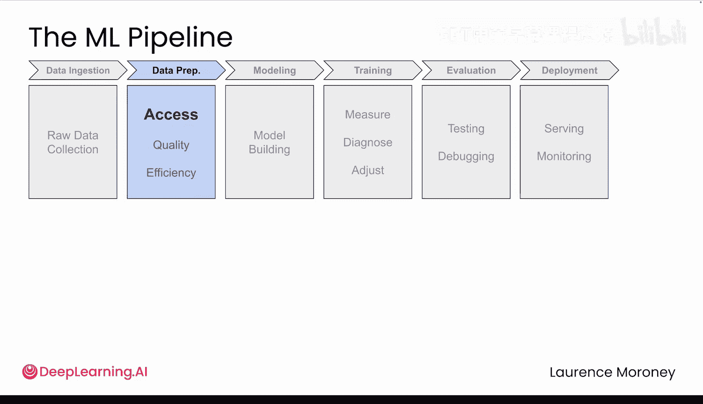
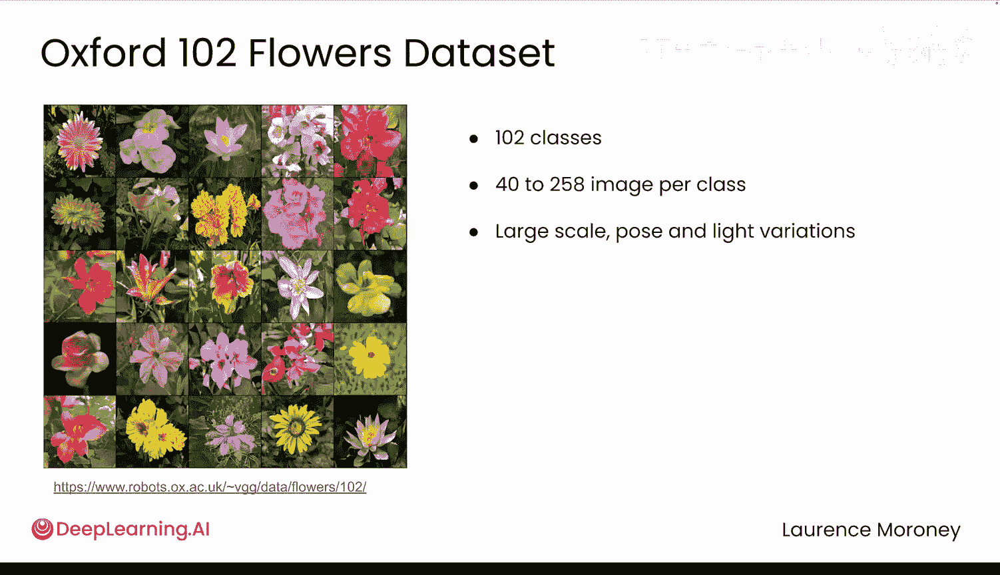
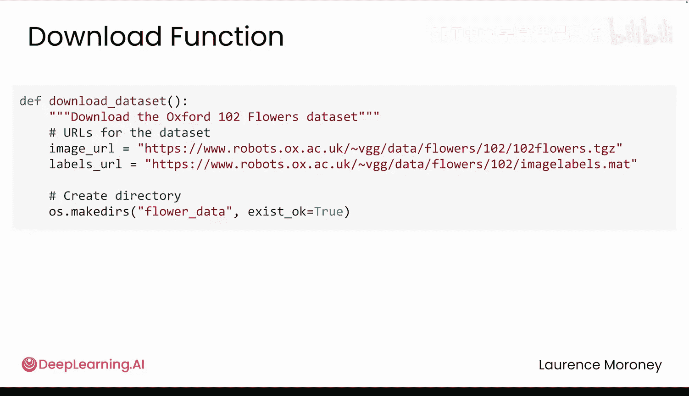
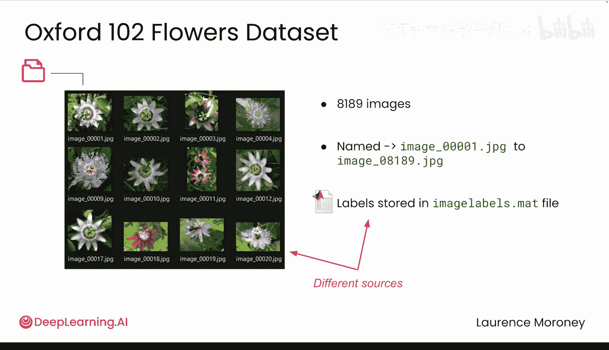
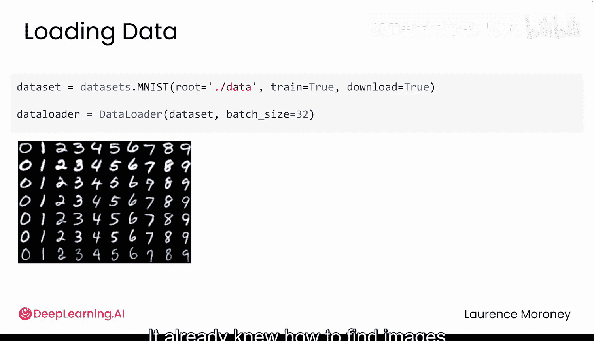
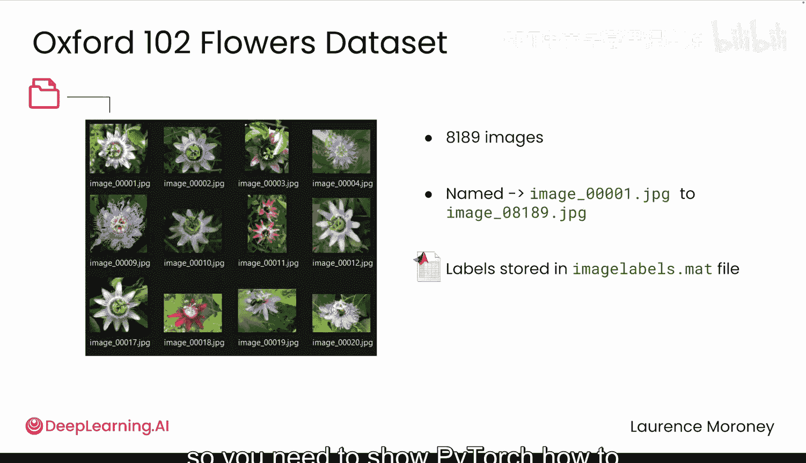
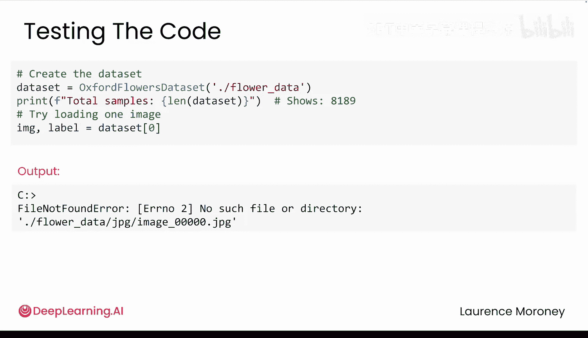
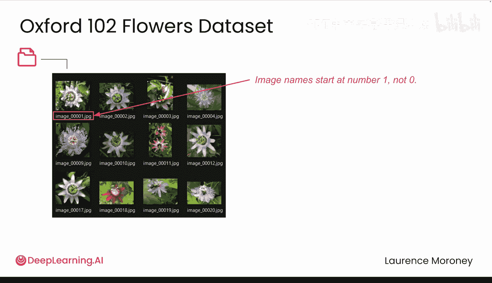
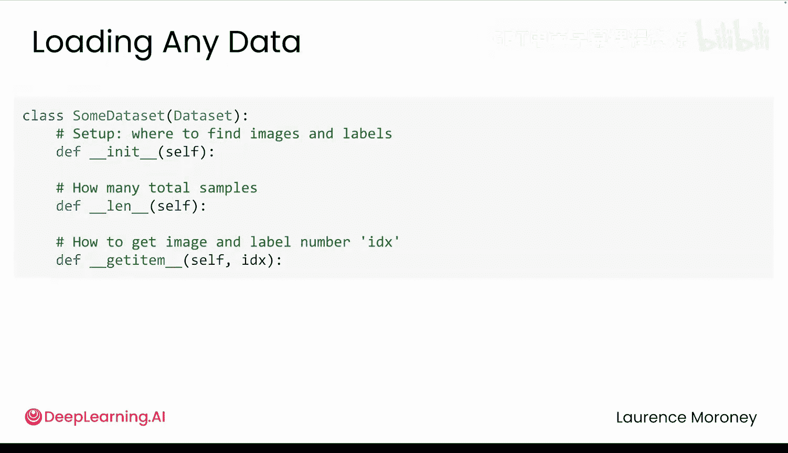

# 018：数据访问 📂

在本节课中，我们将要学习如何为PyTorch构建一个自定义的数据集类。我们将以牛津花卉数据集为例，解决数据文件与标签分离、格式不统一等常见问题，并实现一个能够系统化访问数据的`Dataset`类。

## 概述

上一节我们介绍了植物园花卉识别应用因数据处理不当而失败。本节中，我们来看看如何解决第一个主要问题：数据访问。如果无法可靠地加载数据，其他一切都无从谈起。我们将了解混乱数据（如牛津花卉数据集）的问题所在，并学习如何使用PyTorch的`Dataset`类来解决这些问题。

## 数据集的挑战

首先，我们下载并查看数据集的结构。下载函数会获取图像文件和标签文件。

我们得到了超过8000张图像，文件名是通用的，例如 `image_00001.jpeg`。这些文件没有按花卉类型组织，只是一个扁平的数字文件列表。

标签则单独存储在一个 `.mat` 文件中，这是一种Matlab使用的二进制格式。它将每张图像映射到一个花卉类别。

因此，图像和标签存储在不同的位置，且格式也不同。我们需要一种清晰、系统化的方式来连接它们。

## 构建自定义Dataset类

在之前的模块中，我们使用过像MNIST这样的预构建数据集。它们已经知道如何找到图像并匹配正确的标签。牛津花卉数据集没有这样的预包装，因此我们需要通过构建一个自定义的`Dataset`类来告诉PyTorch如何处理它。

一个PyTorch自定义`Dataset`类需要回答三个问题：
1.  `__init__`：如何设置？数据在哪里？
2.  `__len__`：有多少个样本？
3.  `__getitem__`：当请求一个样本（例如图像42）时，应该返回什么？

以下是实现这三个方法的关键步骤。

### 1. `__init__` 方法：数据设置

这是设置方法。在这里，我们将告诉自定义数据集在哪里找到所有内容，并加载后续需要的信息。

我们需要处理文件路径，使用SciPy读取Matlab文件，并修正标签索引。关键点在于，我们现在可以访问所有图像路径及其对应的标签。

让我们看看标签数组里有什么。我们有8189个标签，每个图像一个。每个标签是一个从1到102的数字，代表一种花卉类型。看起来前10张图像都被标记为类型1，数据集似乎是按类别组织的。

但是，标签是从1开始的。这是一个问题。我们有102种花卉类型，但PyTorch期望从0开始索引的标签。因此，我们需要将1-102的范围改为0-101。我们通过从每个标签中减去1来修正它。

另外，请注意我们在`__init__`中**没有**做什么：我们没有加载任何图像。我们只是设置了稍后查找它们所需的信息。这被称为**惰性加载**，它至关重要。一次性加载所有8189张图像会占用数GB内存。相反，我们只存储路径和标签，实际的图像加载将在`__getitem__`中稍后进行。

### 2. `__len__` 方法：样本数量

这个方法很简单：返回数据集中的样本总数。由于每个图像对应一个标签，标签数组的长度就告诉PyTorch预期有多少个样本。PyTorch在训练期间使用这个长度来正确迭代你的数据。

### 3. `__getitem__` 方法：获取样本

这是最重要的方法。其核心思想是：PyTorch给你一个索引，你的工作是返回该索引对应的数据。

对于这个数据集，可能意味着：PyTorch说“给我第42个样本”，你返回第42张花卉图像及其标签（即它代表的花卉类型）。

以下是关键操作：
*   `f”image_{index:05d}.jpg”`：将索引格式化为5位数字（用零填充）以匹配文件名（例如 `image_00042.jpg`）。
*   使用PIL（Python图像库）的 `Image.open()` 加载图像。
*   从标签数组中获取对应的标签。

这样，当PyTorch请求索引42时，它会得到图像42及其标签。这就是你定义的契约：你定义每个样本的样子，PyTorch将处理何时以及如何频繁地调用此方法。

## 测试与调试

现在让我们确保我们的数据集确实能工作。哦，我们遇到了一个错误。让我们检查文件夹：图像被命名为 `image_00001`, `image_00002`, `image_00003` 等，编号从1开始，而不是0。所以当我们请求索引0时，我们试图加载 `image_00000.jpg`，但这个文件不存在。

因此，我们需要在 `__getitem__` 方法中修正这个“差一错误”。修正后，再次尝试。

很好！这就是为什么你总是要尽早测试你的数据集。像这样的简单差一错误可能会在以后破坏一切。如果现在一切正常，你的数据就成功地将图像与标签连接起来了。

## 总结

本节课中我们一起学习了如何为PyTorch构建自定义`Dataset`类。我们解决了数据与标签分离、标签索引不从零开始以及文件名索引不匹配等实际问题。通过实现 `__init__`、`__len__` 和 `__getitem__` 这三个核心方法，并采用惰性加载策略，我们成功构建了一个能够系统化访问超过8000张图像和标签，且不会导致内存崩溃的数据集。

但访问数据只是第一步。在下一节中，你将处理数据质量问题，例如当你的图像具有各种不同的形状、大小和格式时该怎么办。我将向你展示如何构建一个转换管道，为训练准备好数据。