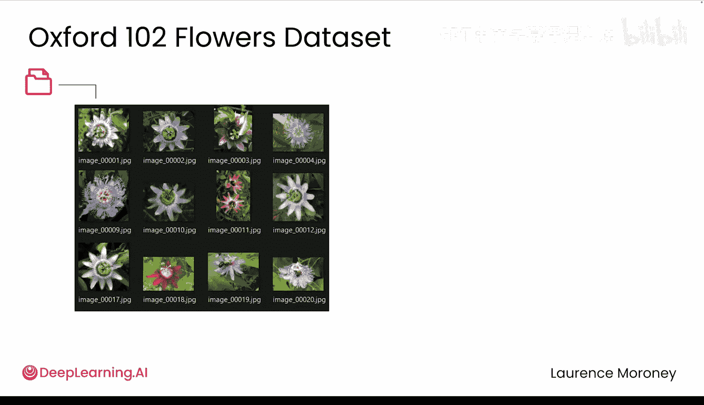
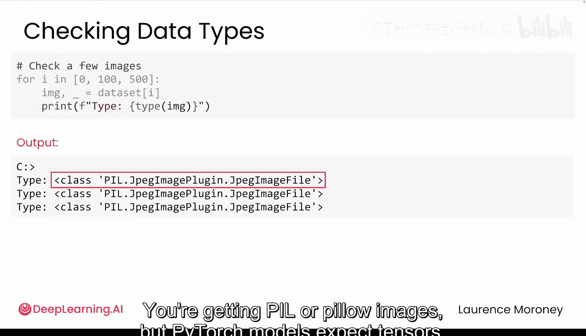
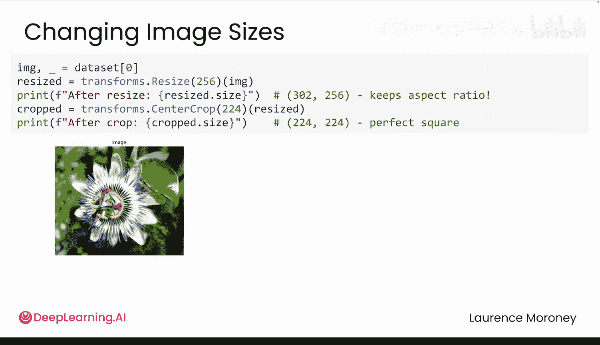
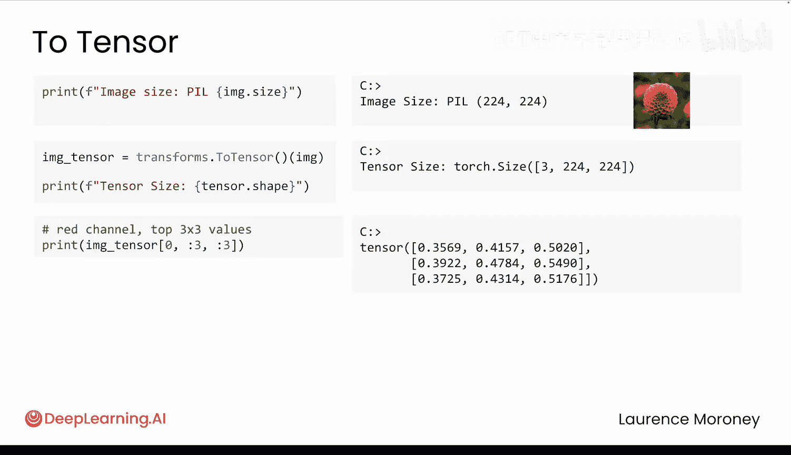
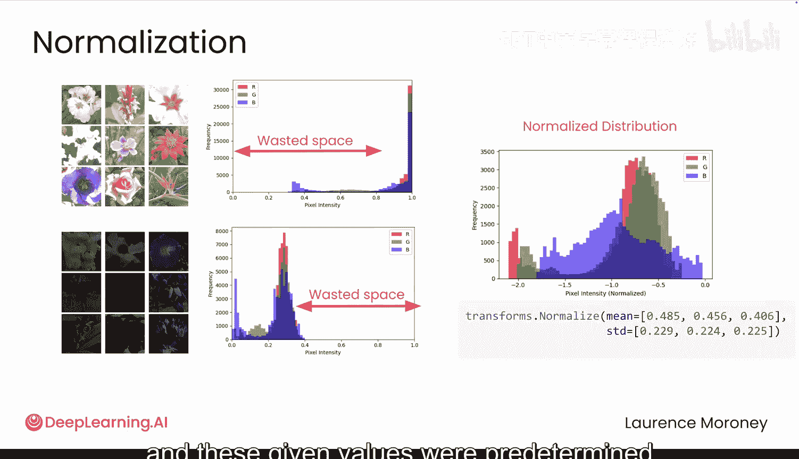
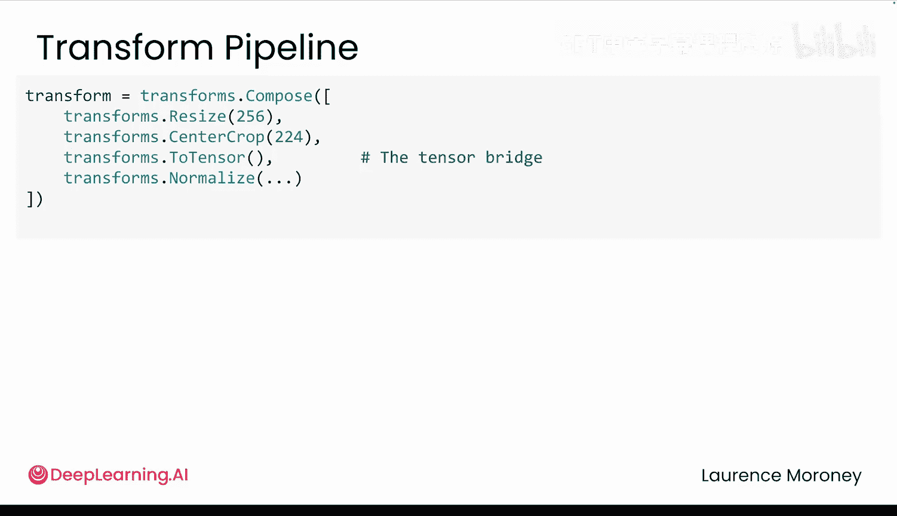

# 019：数据转换流水线 🛠️

在本节课中，我们将学习如何使用PyTorch的转换流水线来处理原始图像数据，解决尺寸不一、格式错误等问题，使其能够被深度学习模型使用。

## 概述

上一节我们构建了一个数据集类来加载牛津花卉数据集。然而，访问数据只是第一步。原始图像通常存在各种问题，无法直接用于PyTorch模型。本节将介绍如何使用PyTorch的转换流水线来处理这些问题，包括调整尺寸、格式转换和归一化。

## 识别数据问题

当我们尝试直接使用数据时，可能会遇到错误。这通常意味着图像具有不同的高度和宽度。PyTorch无法将不同尺寸的图像堆叠成一个批次，因为图像批次需要遵循固定的格式：`[batch_size, channels, height, width]`。如果维度不匹配，PyTorch会抛出错误。

但尺寸问题可能并非唯一的问题。让我们深入检查一下数据。

这些图像尺寸各不相同，这可能是由于多年来使用不同相机拍摄所致，存在差异是合理的。然而，还存在另一个问题：数据类型。你得到的是PIL（Pillow）图像，但PyTorch模型期望的是张量。因此，我们面临两个不同的问题：一是尺寸不同，二是格式错误。

这正是PyTorch转换系统发挥作用的地方，它能以清晰、一致的方式处理预处理步骤。

## 解决尺寸不匹配问题

PyTorch提供了可以链接在一起使用的转换操作来解决这个问题，例如 `Resize`。

`Resize` 可以将高度和宽度设置为224。但如果你的图像是矩形，会发生什么？它会扭曲图像，拉伸或挤压以适应。更好的方法是使用 `Resize` 并只指定一个值，这将按比例缩放较短边，同时保持宽高比。然后，你可以使用 `CenterCrop` 从中间提取一个正方形区域。

**注意命名**：如果你将你的转换变量命名为 `transforms`（带s），你可能会覆盖PyTorch的 `transforms` 模块，导致一些令人困惑的错误。

以下是构建转换流水线时的一个快速调试技巧：单独测试每个步骤，以便清楚地看到发生了什么。像这样逐步检查是调试转换操作的关键，你可以精确地看到数据如何变化，从而及早发现问题。

## 转换图像格式

接下来，你需要将这些PIL图像转换为张量。你之前见过 `ToTensor`，但还记得它具体做了什么吗？让我们更仔细地检查一下 `ToTensor` 的实际功能。

首先，我们的PIL图像尺寸是224x224像素。当你对此图像调用 `ToTensor` 时，它首先会将图像转换为张量，并具有一些有趣的属性。打印其形状，你会发现它重新排列了维度，为红、绿、蓝三个颜色通道添加了一个通道层。

像素值通常在0到255之间。`ToTensor` 会缩放这些值，将所有值除以255，使值域落在0到1之间。从张量中的这些样本值可以看出，它们确实都在0到1之间。这是相同像素数据，但处于不同的尺度。

这种缩放有助于网络学习。首先，如果所有特征都在同一尺度上，会很有帮助。试想一下，年龄增加10年是巨大的变化，但身高增加10毫米则不是。然而，模型只会看到两个“10”。通过将所有值缩放到0到1的范围，10%的变化始终是10%的变化，无论单位如何。此外，神经网络会进行大量乘法运算，像255这样的大数字很容易导致数值爆炸。因此，缩放也有助于保持数学运算的稳定性。

## 添加归一化转换

现在，让我们再添加一个转换：归一化。我们之前见过归一化，但让我们更仔细地看看。

虽然我们的强度值现在落在0到1之间，但如果你的图像大多是明亮的花朵，值会接近1；如果大多是暗色背景，值会聚集在0附近。这留下了大量未使用的空间，将重要的细节挤压到一个狭窄的范围内，使得模型更难发现细微的差异。

使用均值和标准差进行归一化可以更均匀地分布这些值。这里给定的值是预先确定的，在这种情况下效果很好。现在，你的强度值具有了正确的形状、尺度和分布，使网络更容易学习重要的特征。

## 理解转换顺序

在构建转换流水线时，了解每个转换期望的数据类型会很有帮助。在运行 `ToTensor` 之前，你处理的是常规图像。在这个例子中，`ToTensor` 就像一座桥梁。一旦你跨过它，你就进入了张量的领域。有些转换只在一侧有意义。

过去，像 `Resize` 或 `CenterCrop` 这样的图像转换只对图像有效。因此，如果你在转换为张量后尝试使用它们，会遇到错误。如今，`torchvision` 更加灵活。许多图像转换现在可以在我们桥梁的两侧工作，但情况并非总是如此。例如，`Normalize` 只对张量有效，如果你尝试在图像上运行它，会出错。

因此，请注意你处于 `ToTensor` 桥梁的哪一侧，以便以正确的方式使用每个转换，避免流水线中的细微错误。

## 应用完整的转换流水线

现在，让我们用完整的转换流水线更新我们的数据。现在是关键时刻：我们最终能创建之前导致崩溃的批次吗？

完美！我们现在批次中有四张图像。每张图像都有三个颜色通道，并且尺寸都是224x224。数值已正确归一化。你的牛津花卉数据现在应该已准备好进行训练了。

这里有一个快速提示：在构建转换流水线时，你可以从数据中提取一张图像，这将应用转换，你可以检查这张图像以确保一切看起来都正确。如果出现问题，你可以从数据中检索原始图像，然后通过一次应用一个转换来调试问题。这个方法为我节省了无数小时的调试时间。

## 总结

本节课中，我们一起学习了如何解决阻碍数据集与PyTorch模型协同工作的质量问题。你现在可以一致地调整图像尺寸，将其转换为正确的格式，然后对数值进行归一化以获得最佳训练效果。你的数据现在已经格式正确。

但工作尚未完成。在下一个视频中，我们将构建完整的数据流水线，分割数据，高效地进行批处理，并避免一些常见的性能陷阱。这些步骤对于让你的模型顺利训练以及在未来处理更大规模数据时进行扩展至关重要。