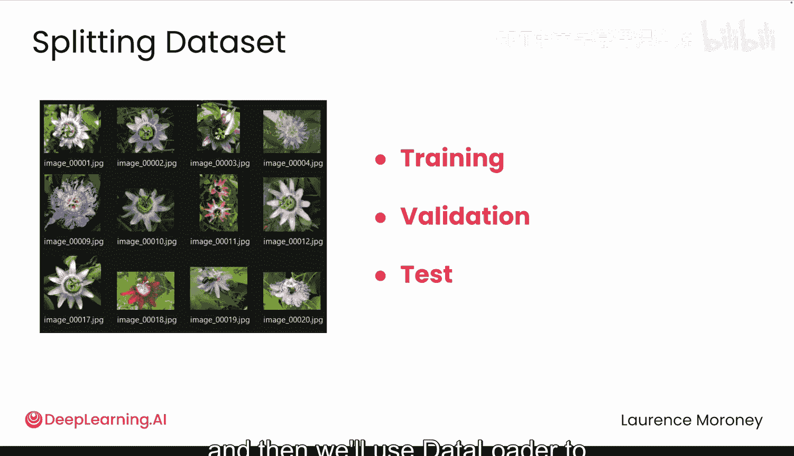
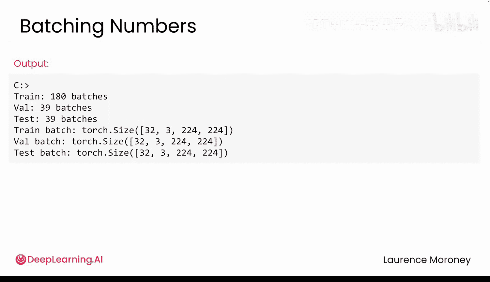

# 020：DataLoader与数据分割

在本节课中，我们将学习如何将数据集分割为训练集、验证集和测试集，以及如何使用PyTorch的`DataLoader`来高效地批量加载数据。这是构建可靠机器学习模型的关键步骤。

## 数据分割的必要性

上一节我们介绍了如何使用`transforms`来清洗和预处理数据。本节中，我们来看看如何组织这些数据以进行有效的模型训练和评估。

如果更多的数据是好事，为什么我们不直接用全部的花卉图像来训练模型呢？关键在于，你需要知道你的模型在从未见过的新照片上表现如何。这就是为什么需要分割数据。

通常，数据集被分为三个部分：训练集、验证集和测试集。每个部分都有不同的用途。训练集是模型学习知识的来源，它在训练过程中会反复看到这些图像。验证集帮助你在训练过程中检查模型性能，以便调整超参数。测试集是最终的检查，仅在训练完成后使用一次。


## 在PyTorch中实现数据分割



对于Oxford Flowers数据集，你可以将总共8189张图像大致按以下比例分割：5700张用于训练，1200张用于验证，其余用于测试。以下是PyTorch中的实现方法：

```python
# 假设 data 是你的完整数据集
train_size = int(0.7 * len(data))
val_size = int(0.15 * len(data))
test_size = len(data) - train_size - val_size

train_data, val_data, test_data = random_split(data, [train_size, val_size, test_size])
```

关键函数是`random_split`。它会随机将图像分配到每个集合中，从而避免所有雏菊都在一个集合而所有玫瑰在另一个集合的情况。这确保了每个分割都包含102种花卉类型的良好混合。需要明确的是，原始数据集并未被修改，你只是创建了同一数据的三个独立视图。

现在，你拥有了用于训练、验证和测试的三个独立数据集。

## 使用DataLoader进行批量加载

接下来，你将使用`DataLoader`来高效地从每个集合中加载批次数据。这在训练期间对性能尤其重要。

还记得批量大小（batch size）等于32吗？这意味着你一次会得到32个样本，而不是一个。有趣的是，遍历`DataLoader`时，每次迭代会得到一个批次。

以下是检查第一个批次的代码模式：

```python
# 创建DataLoader
train_dataloader = DataLoader(dataset=train_data, batch_size=32, shuffle=True)

# 获取一个批次进行检查
train_features_batch, train_labels_batch = next(iter(train_dataloader))
```

每个批次会给你两样东西：一个图像批次和一个标签批次。例如，这意味着你有32张图像，每张图像有3个颜色通道，尺寸为224x224。标签张量则给出了该批次中每张图像对应的一个标签。

## 为什么需要打乱（Shuffle）数据？

我们需要为训练数据的`DataLoader`添加一个关键参数：`shuffle=True`。这有两个主要原因：

1.  **防止顺序偏差**：如果你的数据是有序的（例如先全是雏菊，然后是玫瑰，再是向日葵），模型可能会学习将位置与花卉类型关联起来，而不是学习实际的特征。这对于真实世界的预测没有帮助。
2.  **防止灾难性遗忘**：如果模型在许多批次中只看到雏菊，然后只看到玫瑰，它实际上可能会忘记之前学到的关于雏菊的知识。打乱数据会让每个批次都混合不同的花卉类型，帮助模型记住它所学到的一切。

那么，为什么验证集和测试集的`shuffle`要设置为`False`呢？这很简单，因为模型不是从这些集合中学习，而只是被评估，所以不需要打乱，之前提到的问题也不会出现。

需要澄清的一点是：`shuffle`只影响`DataLoader`提供批次的方式，你的原始数据保持不变。

## 批次（Batch）与周期（Epoch）的数学关系

让我们理清一个关于批次和周期的常见困惑点。以下是数学计算：

假设你的训练集有5732张图像，批量大小为32。
*   完整批次数量：`5732 // 32 = 179`
*   剩余图像数量：`5732 % 32 = 4`

你不能有0.125个批次，所以你会得到179个完整的32张图像的批次，以及1个包含4张图像的部分批次，总共180个批次。

一个周期（epoch）意味着你遍历所有180个批次一次，看到数据集中的每张图像恰好一次。

因此，当你训练10个周期时，你就是在遍历所有180个批次10次。由于`shuffle=True`，你的模型总共会看到每张图像10次，但每个周期的顺序都不同。

## 常见错误与最佳实践

最后，我们来看看两个可能导致严重问题的常见错误。

**错误1：每次调用`__getitem__`时都从磁盘加载整个文件**

```python
# 错误做法：每次获取单个样本都重新加载整个CSV
def __getitem__(self, index):
    data = pd.read_csv(‘path/to/data.csv‘) # 每次调用都加载！
    # ... 处理数据
    return sample
```

如果你的数据集有5732个条目，这意味着每次检索一个样本时，整个CSV文件（所有条目）都会被重新加载，即每个周期加载5732次。如果训练10个周期，那就是超过57000次对同一文件的完整加载，会造成巨大且不必要的性能下降。修复方法很简单：在`__init__`中加载一次。

**错误2：CUDA内存不足（OOM）错误**

如果你遇到CUDA内存不足错误，首先要尝试的是减少批量大小。可以从32甚至16开始，然后逐步增加，以适应可用的内存。

## 总结




本节课中，我们一起学习了构建PyTorch数据管道的核心步骤。我们了解了将数据分割为训练集、验证集和测试集的重要性，并掌握了使用`random_split`实现分割的方法。接着，我们深入探讨了`DataLoader`的作用，它如何通过批量加载数据来提升训练效率，以及为什么需要在训练时打乱数据而在评估时不需要。我们还明确了批次与周期的概念及其数学关系。最后，我们指出了两个常见的编程错误及其解决方案，帮助你构建更健壮、高效的数据加载流程。

现在，你已经为植物园应用构建了一个完整的数据管道，从杂乱的图像文件一直到高效的数据加载。在下一个视频中，我们将快速了解如何调试和加固这个数据管道。