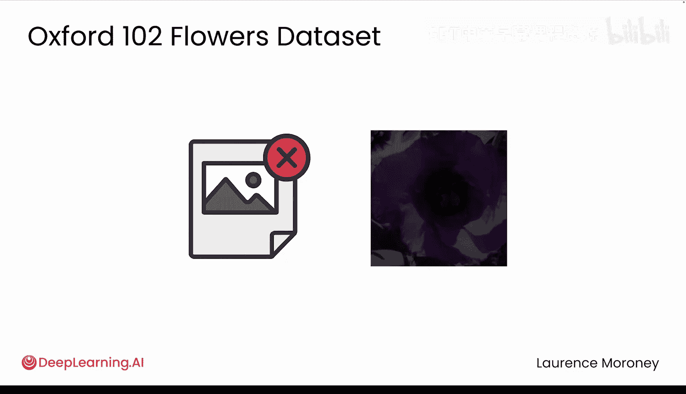
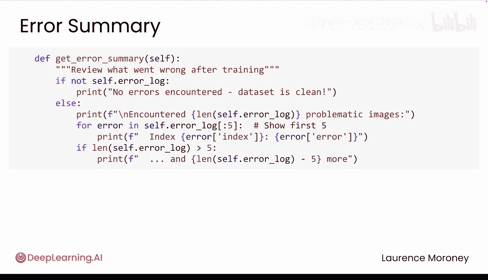
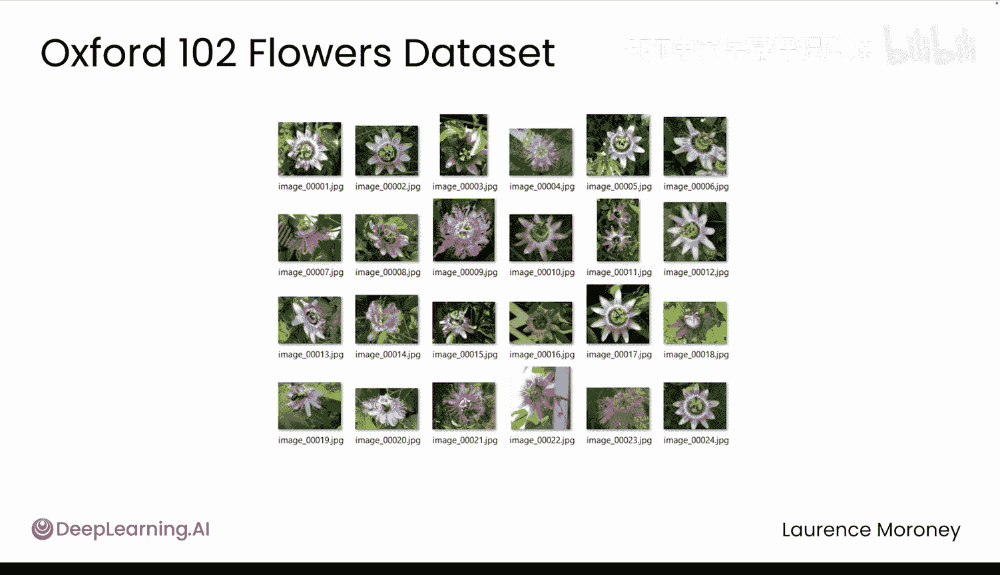

# 021：构建健壮的数据管道 🛡️

在本节课中，我们将学习如何将一个基础的牛津花卉数据集管道，升级为一个能够应对现实世界挑战的健壮系统。我们将涵盖数据增强、错误处理、管道验证和性能监控等关键技术。

## 概述：为何需要健壮的管道？

你已经构建了一个可以运行的牛津花卉数据集管道。但这个管道有多健壮呢？如果数据包含损坏的图像怎么办？如果模型需要在不同或较差的光照条件下识别花朵呢？你如何确保在开始长达数小时的训练之前，你的管道是正常工作的？本节视频将教你相关技术，使你的管道更可靠，模型更鲁棒。

## 数据增强：让模型适应真实世界 🌈

上一节我们介绍了基础的图像加载和预处理。本节中，我们来看看如何通过数据增强来提升模型的泛化能力。




到目前为止，你的模型只见过原始的牛津花卉图像，这些图像都是在相似条件下拍摄的。为了让模型能在更多样化的场景中识别花朵，你可以使用数据增强来生成这些图像的新版本。


为什么这会有帮助呢？如果你的模型只见过在明亮阳光下完美居中的玫瑰，那么当有人给它看一张偏离中心且在阴影中的图像时，它可能会失败。通过从不同角度、不同光照条件以及细微变化中展示同一朵花，你是在教模型关注本质特征（如形状和颜色），而不是图像中花朵的位置等表面细节。

一种方法是将翻转、旋转或亮度调整后的副本保存为新文件。但PyTorch有一个更聪明的解决方案：**即时增强**。PyTorch不会存储额外的文件，而是在每次加载图像时应用随机变换。例如，在第1个训练周期，第42朵花可能被水平翻转；在第2个周期，它可能被轻微旋转并调暗。这为你的模型提供了无穷无尽的训练数据变体，而无需占用额外的存储空间。

为了实现这一点，我们需要为训练和验证定义不同的变换。

以下是训练变换的代码示例，它包含随机变化：

```python
from torchvision import transforms

train_transform = transforms.Compose([
    transforms.RandomHorizontalFlip(p=0.5),  # 随机水平翻转
    transforms.RandomRotation(degrees=15),   # 随机旋转
    transforms.ColorJitter(brightness=0.2, contrast=0.2, saturation=0.2, hue=0.1),  # 随机颜色抖动
    transforms.ToTensor(),
    transforms.Normalize(mean=[0.485, 0.456, 0.406], std=[0.229, 0.224, 0.225])
])
```


你可以看到，在验证阶段，我们移除了这些增强变换。为什么要在验证时跳过增强呢？这是因为你希望在一致的数据上评估模型。如果验证图像也随机变化，你将无法判断性能变化是真实的模型改进，还是仅仅因为不同的输入造成的。

## 错误处理：防止单点故障导致崩溃 🚨

现在你已经添加了增强功能以使模型更鲁棒，接下来让我们也使你的管道更健壮。

这里有一个令人沮丧的场景：你的训练一直运行顺利，然后两小时后崩溃了——一张损坏的图像导致一切停止。或者，一张图像在技术上有效，但尺寸太小，以至于破坏了你的变换。这些问题比你想象的更常见，尤其是在现实世界的数据集中。牛津花卉数据集相对干净，但如果文件只是部分下载并损坏了呢？或者有人不小心保存了一张损坏的图像？

让我们构建一个能优雅处理这些问题的数据集。

第一步很简单：不直接崩溃，而是跟踪错误。接下来是重要部分：使 `__getitem__` 方法对坏数据具有弹性。它开始时和往常一样，但现在我们可以添加一些安全检查。

以下是增强错误处理的自定义数据集 `__getitem__` 方法示例：

```python
import torch
from PIL import Image
import warnings

class RobustFlowerDataset(torch.utils.data.Dataset):
    def __init__(self, file_paths, labels, transform=None):
        self.file_paths = file_paths
        self.labels = labels
        self.transform = transform
        self.error_log = []  # 用于记录错误

    def __getitem__(self, idx):
        try:
            # 1. 尝试加载图像
            img_path = self.file_paths[idx]
            image = Image.open(img_path).convert('RGB')  # 确保转换为RGB

            # 2. 安全检查：跳过过小的图像
            if image.size[0] < 32 or image.size[1] < 32:
                warnings.warn(f"图像 {img_path} 尺寸过小 ({image.size})，跳过。")
                self.error_log.append(f"尺寸过小: {img_path}")
                # 递归调用以跳过此图像（注意：需确保不会无限递归）
                return self.__getitem__((idx + 1) % len(self.file_paths))

            # 3. 应用变换
            if self.transform:
                image = self.transform(image)

            label = self.labels[idx]
            return image, label

        except Exception as e:
            # 4. 记录错误并优雅地跳过
            error_msg = f"索引 {idx}, 路径 {self.file_paths[idx]}: {str(e)}"
            warnings.warn(error_msg)
            self.error_log.append(error_msg)
            # 跳过坏数据，返回下一个样本（同样需注意递归边界）
            return self.__getitem__((idx + 1) % len(self.file_paths))

    def __len__(self):
        return len(self.file_paths)

    def get_errors(self):
        """训练后查看问题"""
        return self.error_log
```

验证步骤确认文件未损坏。尺寸检查跳过可能破坏变换的过小图像。`convert('RGB')` 修复可能混入的灰度图像。但关键是：当仍然出现问题时怎么办？我们不直接崩溃，而是精确记录出错内容，打印警告，然后优雅地跳转到下一张图像。对 `__getitem__` 的递归调用将保持管道运行，即使文件损坏。最后，我们将添加一个方法，用于在训练后审查问题。

现在，在训练时，你可以预期哪些图像有问题，然后决定是修复它们还是将其排除。有了错误处理，你的管道不会因坏数据而崩溃，并且你将清楚地记录出错情况。

## 验证增强效果：眼见为实 👀

但还有一个可能损害模型性能的微妙问题：**过度激进的增强**。我见过一些管道，其增强效果如此极端，以至于花朵变成了无法识别的色块。如果你的模型无法分辨它看到的是什么，它就无法学习特征，也就无法学会分类。

那么，如何知道你的增强是否合理呢？一个简单的方法就是**查看它**。我们可以构建一个快速的可视化工具。每次调用 `data[idx]` 时，随机增强都会创建一个新的变体。我们可以利用这一点来显示同一朵花的八个不同版本。

但有一个注意事项：图像是经过标准化的，因此在显示之前我们需要撤销这个操作。以下代码反转了标准化，以便你能看到真实的颜色，而不是扭曲的数值。

```python
import matplotlib.pyplot as plt
import numpy as np

def visualize_augmentations(dataset, idx, num_samples=8):
    """可视化对同一张图像应用的不同增强效果"""
    fig, axes = plt.subplots(1, num_samples, figsize=(15, 5))
    original_image, label = dataset[idx]  # 获取原始（已增强）图像和标签

    # 注意：dataset[idx] 每次调用可能因随机增强而不同。
    # 为了展示同一原始图像的不同增强，我们需要一个自定义循环。
    # 更简单的方法是：从数据集中获取原始图像路径，然后多次应用变换。
    # 这里假设我们有一个方法能获取原始PIL图像。
    # 以下是一个概念性示例：

    # 假设 `get_raw_pil_image(idx)` 返回未变换的PIL图像
    # raw_img = dataset.get_raw_pil_image(idx)
    # for i in range(num_samples):
    #     augmented_img = dataset.transform(raw_img) # 每次应用随机变换
    #     # 反标准化显示
    #     img_np = augmented_img.numpy().transpose((1, 2, 0))
    #     mean = np.array([0.485, 0.456, 0.406])
    #     std = np.array([0.229, 0.224, 0.225])
    #     img_np = std * img_np + mean
    #     img_np = np.clip(img_np, 0, 1)
    #     axes[i].imshow(img_np)
    #     axes[i].axis('off')

    # 由于实现细节取决于数据集结构，此处提供核心反标准化代码：
    # 对一个已变换的张量进行反标准化：
    def denormalize(tensor):
        """将标准化后的张量转换回可显示的图像格式"""
        mean = torch.tensor([0.485, 0.456, 0.406]).view(3, 1, 1)
        std = torch.tensor([0.229, 0.224, 0.225]).view(3, 1, 1)
        return tensor * std + mean

    # 示例：显示数据集中的多个样本（它们可能已经是不同增强版本）
    for i in range(num_samples):
        # 注意：直接调用dataset[idx]每次可能得到不同的增强，因为索引可能被随机化。
        # 更稳定的做法是创建一个使用固定随机种子的临时变换来可视化。
        pass

    plt.suptitle(f'数据增强效果示例 (标签: {label})')
    plt.show()

# 提示：在实际操作中，你可能需要修改数据集类，使其能返回原始PIL图像或应用特定变换。
```

你可以测试你的增强效果，以下是要观察的内容：
*   **良好状态**：如果花朵在每个版本中都清晰可辨，那么你的增强是合适的。
*   **增强无效**：如果它们看起来完全一样，那么你的增强可能没有起作用。
*   **过度增强**：如果它们看起来像抽象艺术，那可能太激进了。
*   **标准化问题**：如果图像全是黑色或有奇怪的颜色，可能是标准化出了问题。




## 监控管道：洞察训练过程 📊

你已经优雅地处理了错误，并验证了增强效果看起来合理。但这里有一个关键问题：你如何知道你的管道在训练期间实际是如何工作的？你可能因为洗牌错误而有一些从未被访问到的图像，或者某些图像可能被加载的次数远多于其他图像。没有监控，你永远不会知道。

让我们添加一些轻量级的跟踪，以揭示底层发生了什么。这将扩展你的数据集，以跟踪哪些图像被加载、每张图像被访问的频率以及每次加载所需的时间。然后，我们将添加一个简单的方法来审查所有这些统计数据，并在每个训练周期后调用它。

这种监控可以揭示：
*   **洗牌错误**：某些图像从未被访问。
*   **性能问题**：加载时间过慢。
*   **数据不平衡**：某些图像被访问过于频繁。

最好现在就发现这些问题，而不是在训练数天后才发现。

以下是向数据集添加统计跟踪的示例：

```python
import time


class MonitoredFlowerDataset(RobustFlowerDataset):
    def __init__(self, file_paths, labels, transform=None):
        super().__init__(file_paths, labels, transform)
        self.access_count = [0] * len(file_paths)
        self.load_times = [0.0] * len(file_paths)

    def __getitem__(self, idx):
        start_time = time.time()
        try:
            result = super().__getitem__(idx) # 调用父类方法，包含错误处理
            end_time = time.time()
            # 记录成功访问（注意：如果父类因错误跳过，可能记录的是跳转后的索引）
            # 更精确的记录需要在父类中修改或使用其他方法。
            self.access_count[idx] += 1
            self.load_times[idx] += (end_time - start_time)
            return result
        except RecursionError:
            # 防止因连续坏数据导致无限递归
            raise RuntimeError("数据集中存在过多连续坏数据，请检查。")
        except Exception as e:
            end_time = time.time()
            # 即使出错，也记录尝试时间（可选）
            # self.load_times[idx] += (end_time - start_time)
            raise e # 或者按照父类逻辑处理

    def get_stats(self):
        """获取数据加载统计信息"""
        total_accesses = sum(self.access_count)
        avg_load_time = sum(self.load_times) / total_accesses if total_accesses > 0 else 0
        never_accessed = [i for i, count in enumerate(self.access_count) if count == 0]
        often_accessed = [(i, count) for i, count in enumerate(self.access_count) if count > 5] # 假设阈值是5

        stats = {
            'total_samples': len(self.file_paths),
            'total_accesses': total_accesses,
            'avg_load_time_per_sample': avg_load_time,
            'never_accessed_indices': never_accessed,
            'often_accessed_samples': often_accessed,
            'error_log': self.error_log
        }
        return stats


# 在每个epoch后调用 dataset.get_stats() 并打印或记录结果。
```

## 总结：从基础到生产就绪 ✅

本节课中，我们一起学习了如何将你的牛津花卉数据集管道从一个基础加载器转变为一个生产就绪的系统。我们主要掌握了以下四个核心技巧：

1.  **应用数据增强**：通过即时随机变换（如翻转、旋转、颜色抖动）增加训练数据的多样性，提升模型在真实世界中的鲁棒性。关键是为训练和验证集使用不同的变换策略。
2.  **实现错误处理**：在数据集的 `__getitem__` 方法中添加异常捕获和容错逻辑（如检查文件完整性、图像尺寸），防止单个损坏样本导致整个训练过程崩溃，并记录错误以供后续分析。
3.  **可视化验证增强**：通过将标准化后的图像反变换并显示，直观检查数据增强的效果是否合理（花朵应保持可识别，既不是完全不变，也不是变成无法辨认的抽象图案）。
4.  **添加轻量级监控**：在数据集中嵌入统计跟踪功能，记录每个样本的访问次数和加载耗时。这有助于早期发现数据洗牌错误、加载瓶颈或样本访问不平衡等问题。

如果你想看到所有这些部分的实际运作，请查看本模块的实验课，在那里你将构建并探索完整的管道，甚至在训练开始之前就将你的数据置于现实世界的测试中。




你已经准备好了数据，现在是时候用它来构建一些了不起的东西了。恭喜你掌握了PyTorch的数据管道构建技巧，我们下个模块再见。