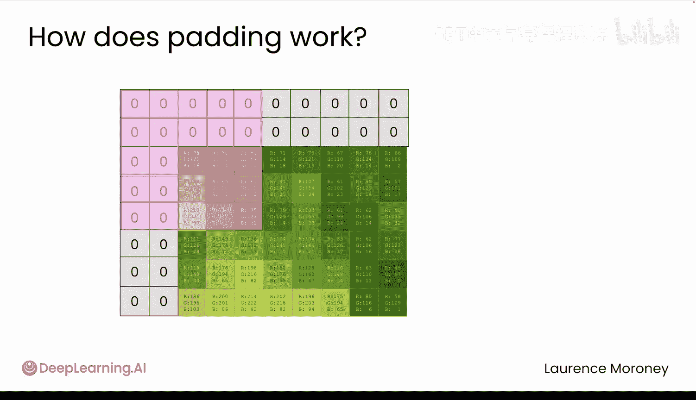

# 022：滤波器、模式与特征图 🦋

在本节课中，我们将要学习卷积神经网络的基础知识。我们将了解为什么在处理图像数据时，卷积层比普通的线性层更有效，并深入探讨卷积层如何通过滤波器来“观察”图像中的边缘、纹理和模式。

## 概述

上一节我们介绍了如何处理植物园应用的数据。现在，我们需要扩展应用功能，使其能够对昆虫和小动物进行分类。这要求我们的模型能够识别更高级的特征，例如边缘、纹理和模式。为此，我们需要引入卷积神经网络。

## 线性层的局限性

你之前使用线性层构建了分类器。但线性层存在一个问题：它将每个像素视为独立的。当模型观察一朵花或一只蝴蝶的图像时，它看到的是成千上万个独立的数字，无法理解相邻像素可以共同构成如翅膀、眼斑等特征。

## 卷积神经网络简介

卷积神经网络是计算机视觉的基石。其灵感来源于生物学。在20世纪60年代，神经科学家发现视觉皮层中的某些神经元只在看到特定模式时才会响应。CNN通过使用滤波器来筛选图像中的特征并从中学习，从而模仿了这一机制。

## 卷积的工作原理

让我们通过一张自然照片的灰度图来了解其工作原理。这是一张我们数据集的灰度特写。放大后，你可以看到单个像素。现在，我们聚焦于一个值为61的像素。将这个像素及其周围的3x3网格视为它的邻居。

想象一个滤波器，它是一个独立的3x3数字网格。你将这个滤波器滑过图像。在每个位置上，将滤波器值与下方的像素值相乘，然后将所有这些乘积相加并取平均值。得到的平均值将替换中心像素的值，从而改变其颜色。当你将滤波器滑过整个图像，并为每个像素基于其邻居计算新值时，这个过程就称为**卷积**。

## 滤波器的功能

你可能会问，为什么要这样做？通过为滤波器中的权重赋予不同的值，你实际上可以突出显示不同类型的模式。

让我们看一个例子。你能猜出这个滤波器的作用吗？你可以将其中心值视为从零或黑色的基线开始。但如果你观察左右两侧，相似的相邻像素值实际上会相互抵消。然而，如果存在强烈的对比，比如左侧非常暗而右侧非常亮，这就会为该滤波器产生一个强输出。这正是图像中垂直边缘的体现。滤波器捕捉到这种对比度，并突出显示垂直边缘出现的位置。

那么，这个滤波器可能做什么呢？它与前一个非常相似，但检测的是水平边缘。这就是它产生的结果。

## 滤波器在分类中的重要性

这对于分类任务为何重要？当你识别一只蝴蝶时，你不会分析每个像素。你会注意到翅膀形状、翅脉图案、那些独特的橙色和黑色部分。你的大脑利用这些特征来识别这是一只帝王蝶。对于我们的模型，原理是相同的。滤波器有助于突出那些能区分帝王蝶和燕尾蝶、或蝴蝶和甲虫的模式。

## CNN的关键优势

有趣的部分来了。你可以手动设计这些滤波器。但你如何知道哪些滤波器对蝴蝶、花朵或甲虫最有效？或者，如果模型能够学习哪些滤波器效果最好，并调整它们以找到识别每个类别的特定模式呢？这就是卷积神经网络的关键能力。它们将找出哪些视觉特征对于你手头的特定任务最为重要。

## 在PyTorch中创建卷积层

现在，让我们深入了解如何在PyTorch中使用`nn.Module`创建卷积层。你之前使用过`nn.Linear`等层来构建网络。卷积层的工作方式完全相同，它只是你添加到模型架构中的另一种类型的层。在PyTorch中，你可以使用`nn.Conv2D`来定义一个卷积层。这个名字意味着它是一个二维卷积，就像你在二维图像中使用的那样。

以下是每个设置参数的逐步说明：

*   **in_channels**：输入图像的颜色通道数。对于我们的自然照片，通常是三个通道：红色、绿色和蓝色。
*   **out_channels**：决定你的卷积层将使用多少个滤波器。每个滤波器学习检测不同的特征。可能一个会找到翅膀边缘，另一个找到斑点眼纹，还有一个检测绒毛纹理。通常你会使用多个滤波器来捕捉图像中所有不同的特征。
*   **kernel_size**：设置每个滤波器的大小。3x3的滤波器很常见，因为它检查每个像素及其直接邻居，非常适合检测局部模式，如翅膀鳞片或花瓣纹理。
*   **stride**：控制滤波器在扫描图像时每一步移动的距离。步幅为1意味着它仔细检查每个像素。增加步幅会使滤波器跳过一些像素，速度更快，但可能会错过像触角节段这样的精细细节。
*   **padding**：这个参数非常有趣，它与内核大小有关。思考一下：你如何将像素定位在图像的边缘？想象一下，你放大到图像的这个角落，使得边界现在位于图像之外。现在拿一个滤波器并将其滑入角落。但如果你想将滤波器中心对准角落的像素会发生什么？你的滤波器现在有邻居值落在了图像之外。填充值为1会简单地添加这些值，默认情况下它们通常被设置为零。这与内核大小相关，因为如果我的内核大小为5，那么你将需要填充大小为2才能将中心对准角落像素。

## 总结

本节课我们一起学习了卷积神经网络的基础。我们探讨了线性层在处理图像时的局限性，并介绍了卷积层如何通过滤波器来检测图像中的局部模式，如边缘和纹理。我们了解了卷积操作的基本步骤，以及滤波器如何突出对分类任务至关重要的特征。最后，我们介绍了在PyTorch中定义卷积层`nn.Conv2D`的关键参数及其作用。

下一节视频中，你将探索完整卷积神经网络的架构，并理解卷积层、池化层和全连接层如何协同工作，然后我们将在PyTorch中实现它。