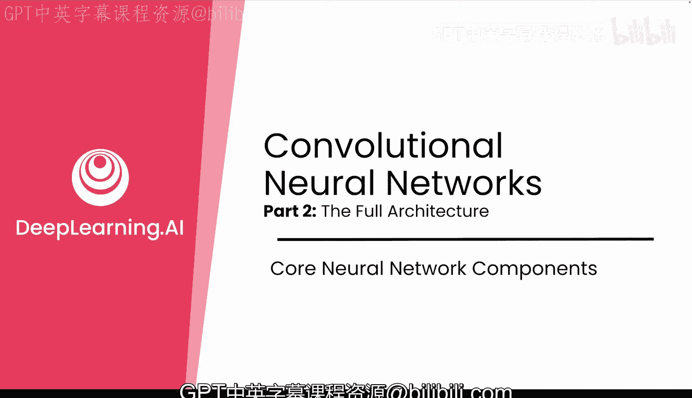
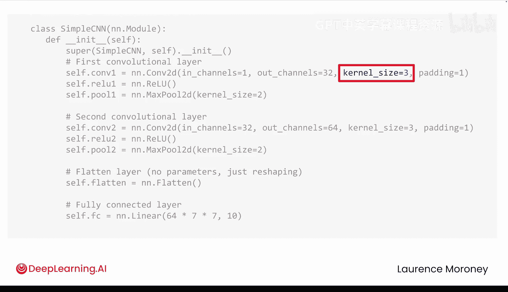
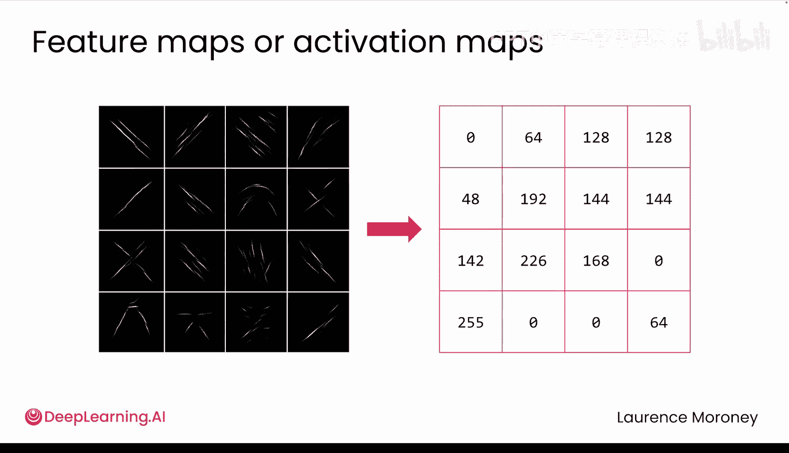
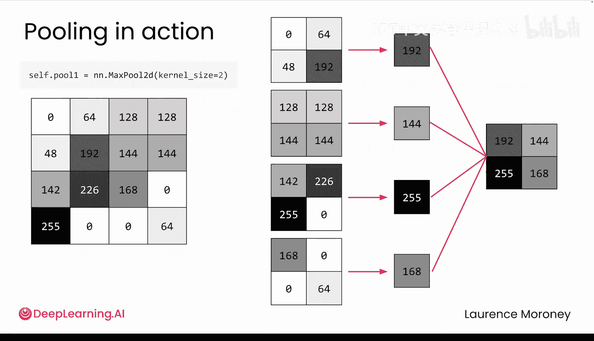
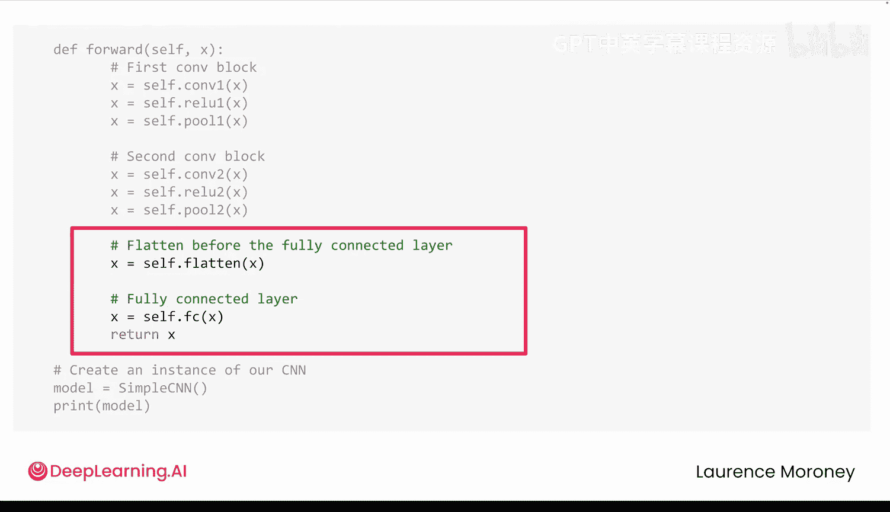

# 023：完整CNN架构解析 🏗️

在本节课中，我们将学习如何将卷积层、激活函数、池化层和全连接层组合成一个完整的卷积神经网络架构。我们将详细解析每一部分的作用及其在图像分类任务中的协作方式。

## 概述

在上一节中，我们探讨了卷积层的工作原理以及CNN如何学习有用的滤波器来从图像中提取特征和模式。本节中，我们将把这些部分组合成一个完整的卷积神经网络架构。

## 网络结构定义

该网络继承自 `nn.Module`，与之前构建的神经网络类似。在 `__init__` 函数中，我们定义网络的结构。它从两个卷积层开始，以一个用于图像分类的全连接层结束。

“全连接”意味着输入中的每个神经元都与输出中的每个神经元相连，它只是线性层的另一个名称。





## 第一卷积层详解

在第一卷积层中，我们从一个具有一个通道的图像开始。这是一个灰度图像，每个像素只有一个亮度值。模型将尝试学习32个不同的滤波器。

每个滤波器都是一个3x3的数字网格，因此每个滤波器有9个权重。这些滤波器在图像上滑动，并以填充为1的方式响应不同的模式。

```python
# 示例：定义一个卷积层
self.conv1 = nn.Conv2d(in_channels=1, out_channels=32, kernel_size=3, padding=1)
```

该层的输出可能看起来像32张新图像，但它们实际上只是数值数组，显示了每个滤波器对图像不同部分的响应强度。这些通常被称为**特征图**或**激活图**，它们映射了每个特征在输入中出现的位置。

## 激活函数与池化层



接下来是ReLU激活函数。它将结果特征图中的任何负数设置为0，这有助于模型学习更复杂的模式。

然后，数据被输入到名为 `MaxPool2d` 的层中。池化是卷积神经网络中的一种常用技术，用于减小特征图的大小。它本质上是在应用滤波器后丢弃像素，压缩数据，同时保留最重要的部分，且不应影响结果。

以下是其工作原理：

假设最大池化的核大小为2。在左侧，您有滤波器输出的特征图。由于池化核大小为2，您选择一个2x2的值区域，然后只保留该组中的最大值（例如192），并丢弃其余部分。这就是为什么它被称为**最大池化**。

```python
# 示例：定义一个最大池化层
self.pool = nn.MaxPool2d(kernel_size=2, stride=2)
```

如果您对特征图中的每个2x2值组重复此过程，最终将得到一个更小的输出，仅保留每个2x2区域的最大值。

这里的逻辑是，您的滤波器已经从原始图像中提取了重要特征。因此，通过应用池化，您正在压缩每个滤波后的图像，仅保留最重要的信息。结果，通过网络传递的数据量减少，下一层看到的图像大小仅为原始大小的四分之一。



这一点很重要，因为在第一个卷积层之后，您现在有32个不同的特征图流入第二层。对于大图像，这很快就会产生大量数据。池化减少了这种信息量，使您的神经网络更加高效，而不会丢失有价值的细节，并且对小变化更具鲁棒性。

## 全连接层与分类

在卷积层和池化层突出显示并压缩了图像中的关键特征之后，现在是时候使用全连接层对结果进行分类了。这个全连接层将所有特征组合成最终的预测。

在这个例子中，您可以看到线性层有 `64 * 7 * 7` 个输入。这里的64应该相对直观。例如，图像被调整为28x28像素。您需要弄清楚这一点。

请记住最大池化层是如何工作的：它从2x2的块中获取图像。因此，一个28x28的图像将在每个轴上被分成两半，得到14x14的图像。第二个最大池化层将做同样的事情，将14x14减半，得到7x7。然后，这些7x7的特征图将被输入到最终的线性层。

换句话说，每个最大池化层将其输入的大小减半。

## 前向传播流程

然后是 `forward` 方法，用于定义数据流，这相当直接。您将数据传递到每个卷积层，然后回想一下，线性层期望一个单行的值。因此，您需要将张量展平为一个向量，并将其传递到最后一层以产生预测。

这就是您完整的CNN流程：从原始像素到学习到的特征，再到分类。

## 总结

到目前为止，您已经看到了CNN如何处理图像：从那些生成特征图的学习滤波器开始，然后通过池化来减小大小并提高鲁棒性，最后通过全连接层进行分类。现在您可以理解其核心理论了。



在下一视频中，我将逐步引导您使用PyTorch构建一个卷积神经网络的代码。