# 024：训练用于图像分类的CNN 🖼️

在本节课中，我们将学习如何构建并训练一个完整的卷积神经网络（CNN），用于一个扩展的自然图像分类任务。我们将使用一个包含32x32像素彩色图像的小型多样化数据集。

## 概述

上一节我们介绍了卷积层的工作原理。本节中，我们将构建一个完整的CNN架构，并探讨训练过程中的关键概念，如Dropout和权重衰减。

## 网络架构定义

以下是完整的CNN架构。它与之前介绍的类似，但有两个主要区别：输入图像现在是彩色的，并且网络包含三个卷积块，而不是两个。

请重点关注每个块的输入和输出通道数。

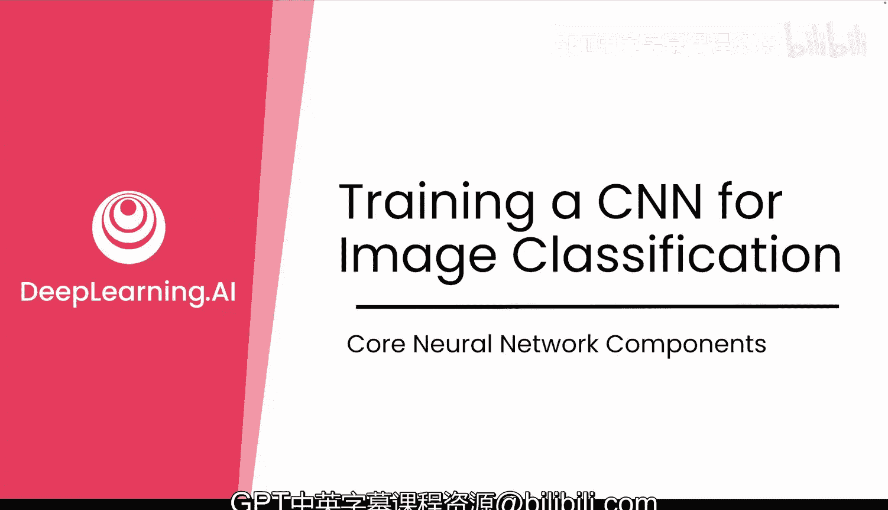

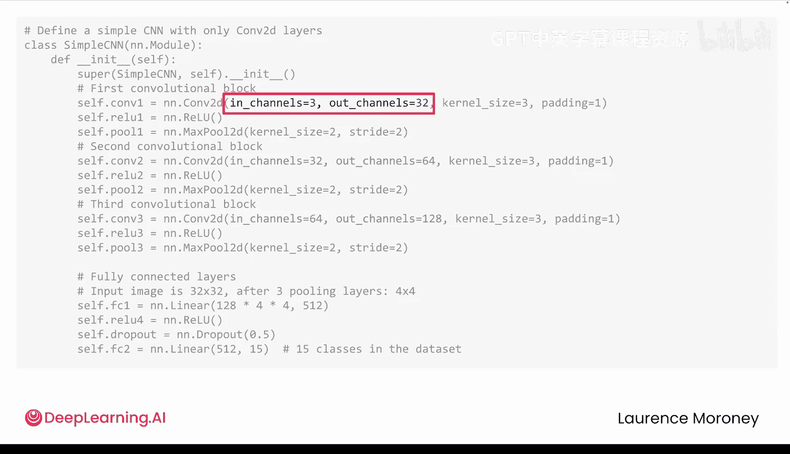

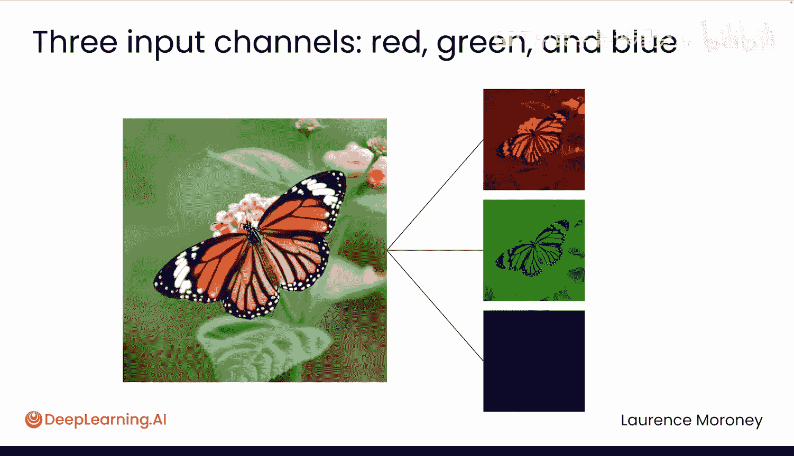

*   第一个卷积层接收3个输入通道（分别对应红、绿、蓝三色），并产生32个输出通道。这意味着它将学习32个不同的滤波器。你可以理解为模型看到了图像的三个版本（红、绿、蓝），而32个滤波器中的每一个都会从这些输入中提取不同的模式。
*   第二层接收这32个通道，并产生64个。
*   第三层从64个通道扩展到128个。

因此，随着网络加深，模型学习的滤波器数量也在增加。

每个卷积块后面都跟着一个最大池化层，它将图像的高度和宽度减半。因此，当图像通过所有三个块后，其空间尺寸从32x32缩小到了仅4x4。

在`forward`方法中，特征图被展平，然后传入一个包含512个神经元的全连接层。该层像之前一样使用ReLU激活函数，帮助模型将特征组合成更抽象的表示。

## 引入Dropout层

接下来是一个新概念：Dropout层。在训练期间，该层会随机使大约50%的神经元失活。

这听起来可能违反直觉。我们为什么要关闭网络的一部分呢？让我们看一个例子。

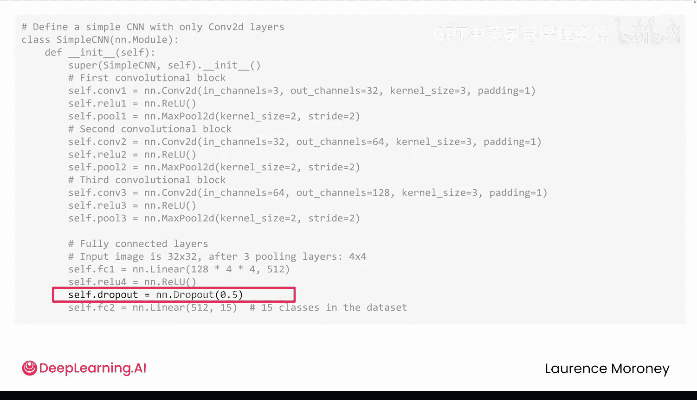

想象一个训练来区分狗和狼的模型。一张哈士奇的照片被错误地分类为狼。原因并非哈士奇长得像狼，而是因为模型在训练集中过度关注了背景中的雪——一些狼的图片有雪景，这足以让模型开始学习“雪意味着狼”。

这种现象被称为“共适应”。一些神经元变成了专门的雪检测器，而其他神经元开始依赖它们。模型变得懒惰，依赖捷径，而不是学习像身体形状或面部结构这样鲁棒的特征。

Dropout通过在训练期间随机关闭神经元来打破这些捷径。Dropout使得过度依赖任何一种模式都变得有风险。如果雪检测器神经元被关闭，模型就必须寻找其他真正重要的线索。

在实践中，Dropout率通常在0.2到0.5之间，并且通常放置在激活函数之后、最终分类层之前。

需要明确的是，如果你的数据中大多数狼的图片都有雪而狗的图片没有，那这是一个数据问题，而不是过拟合。模型只是学习了它看到的唯一模式。但在典型的现实世界数据中，模式并非如此清晰。Dropout通过鼓励模型学习泛化性强的特征，而不是那些偶然相关的特征，来提供帮助。

## 输出层与训练设置

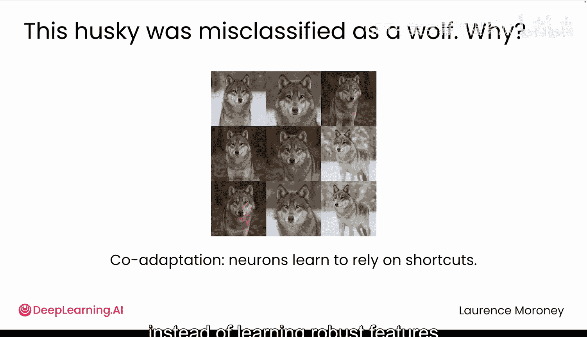

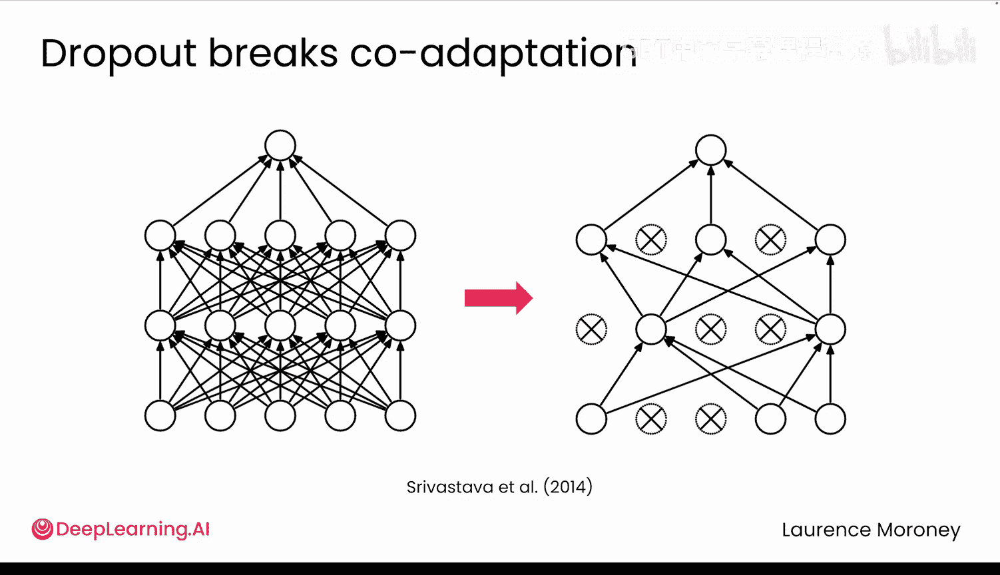

最后，是第二个全连接层，它输出15个值，对应数据集中每个类别一个。

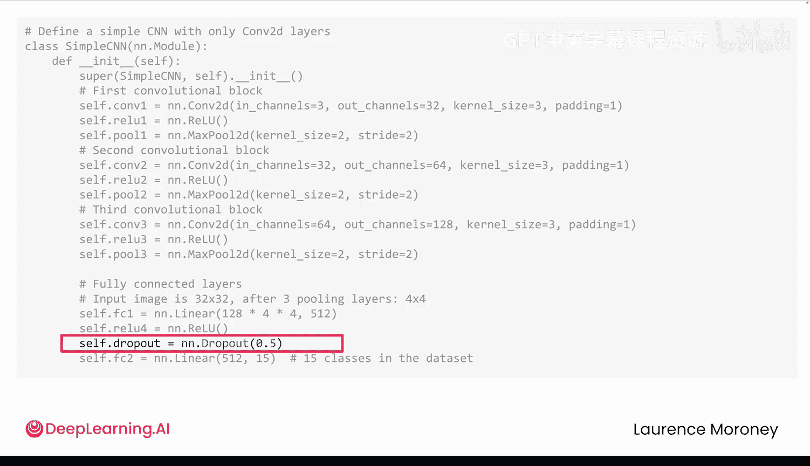

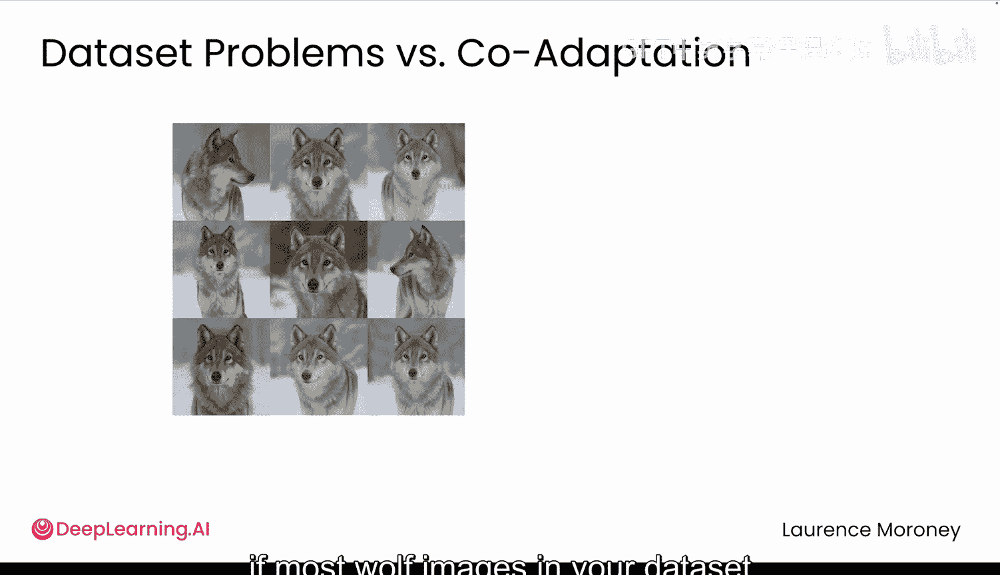

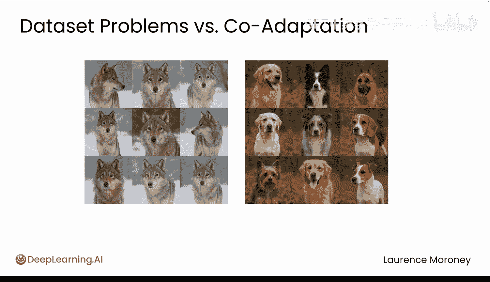

定义好模型后，还需要设置优化器和损失函数。在本例中，我们使用交叉熵损失和Adam优化器。

在分级作业中，你还会看到对Adam优化器应用了权重衰减。与Dropout类似，它是一种正则化技术，有助于提高泛化能力，但工作原理不同。

权重衰减不是关闭神经元，而是阻止网络使用非常大的权重。为什么要这样做？因为大的权重可能表明模型正在记忆训练数据中的特定模式，而不是学习能够泛化的特征。权重衰减对大权重施加了一个小的惩罚，促使模型趋向于更简单、更鲁棒的解决方案。

## 数据流形状变化

当你进入实验环节时，你将看到数据在流经CNN时形状是如何变化的。

你在每个形状中看到的第一个数字是批量大小。因此，如果你一次训练一张图像，这个数字就是1。

每张图像从3个通道（红、绿、蓝）开始，每个通道是32x32的数值。

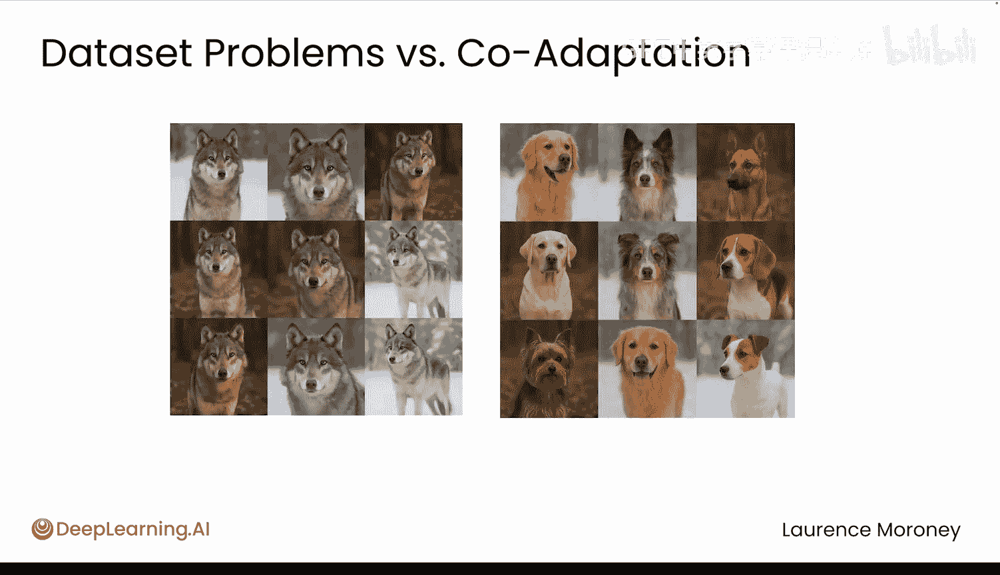

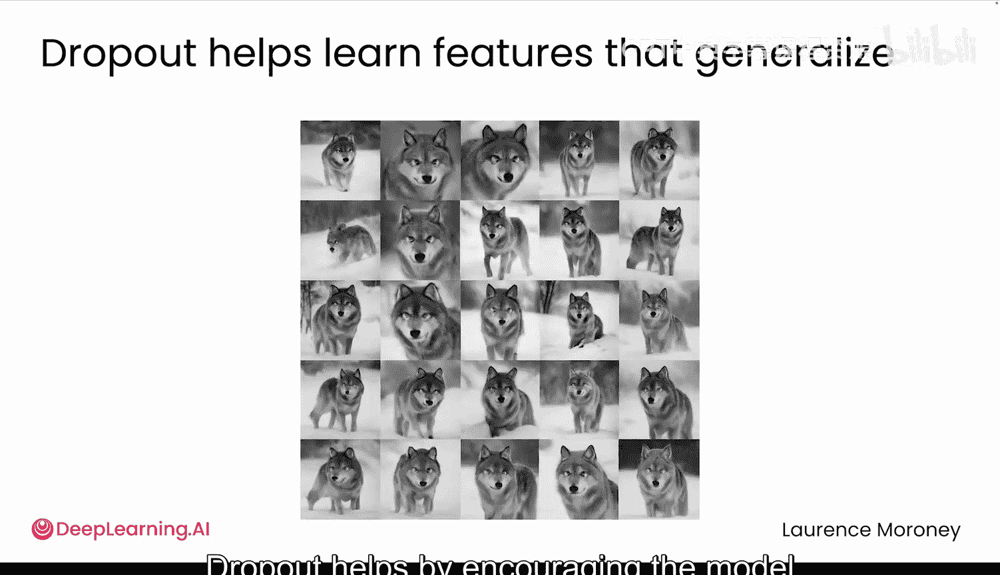

随着图像通过每个卷积层和池化层，空间尺寸会缩小，而通道数量会增加。

在最后一层，模型输出15个值，每个类别一个，代表预测的类别概率。

## 训练结果

当我仅训练这个模型10个周期时，结果看起来相当不错。

你可以在左侧的图表中看到，训练损失稳步下降。在右侧，模型在未见过的数据上的准确率随着时间的推移而提高。

当你查看一些样本预测时，模型的准确性令人惊讶。即使对于这些小型、低分辨率的图像（它们在这里看起来可能有点像素化，但这只是因为我们将它们从原始的32x32尺寸放大了）。

## 总结

本节课中，我们一起学习了如何构建一个用于彩色图像分类的CNN，理解了Dropout如何通过随机失活神经元来防止过拟合和共适应，并了解了权重衰减作为另一种正则化技术的作用。我们还跟踪了数据在网络中的形状变化，并观察了一个简单CNN在小型数据集上的有效训练过程。

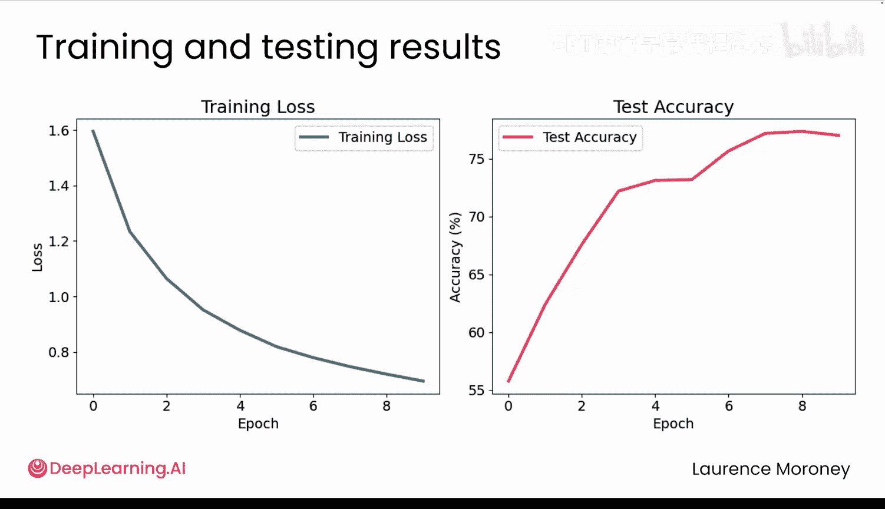

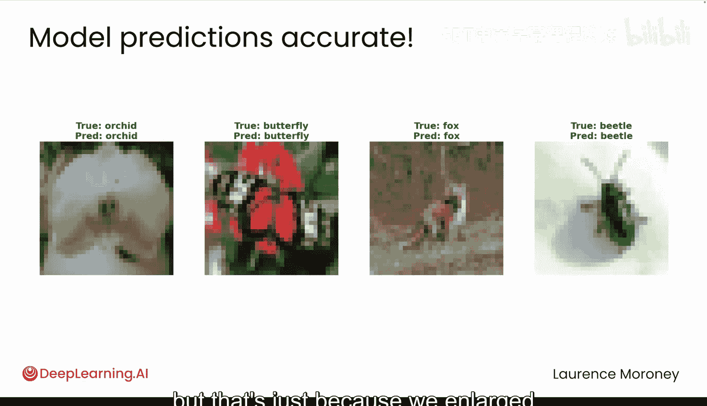

现在轮到你了，请前往实验笔记本，详细探索这一切是如何运作的。