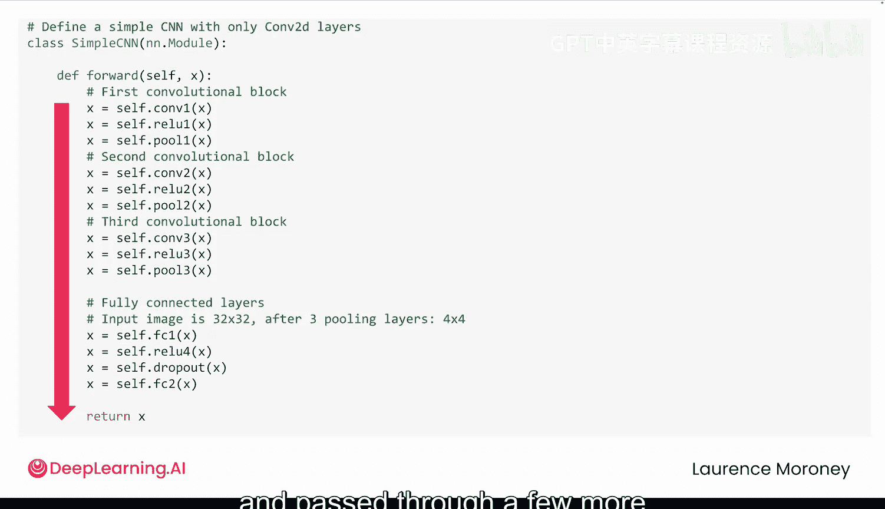
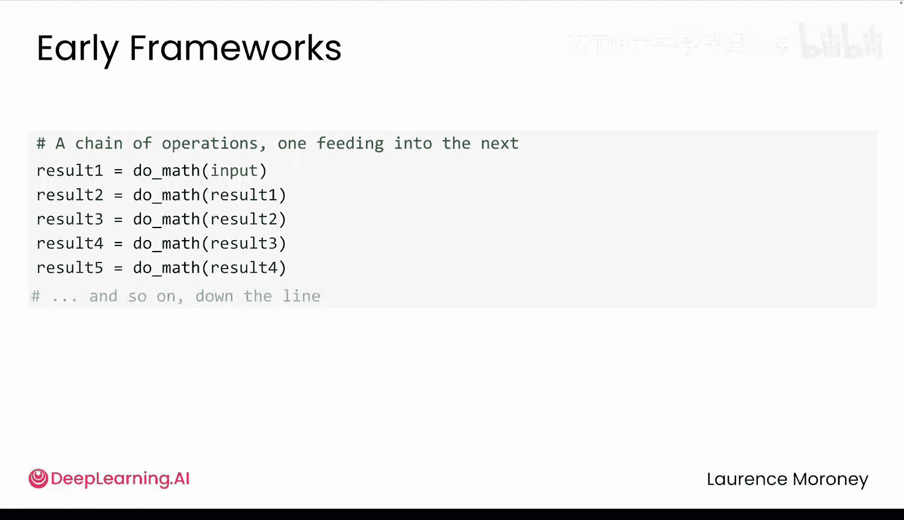
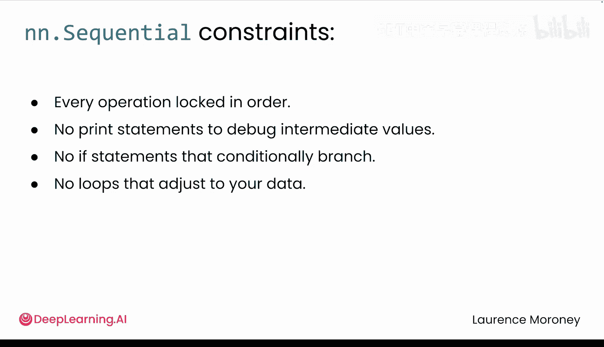
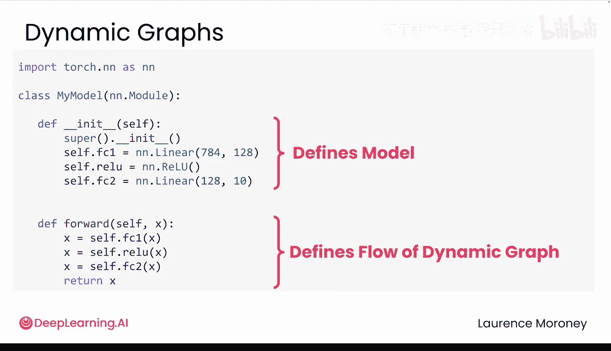
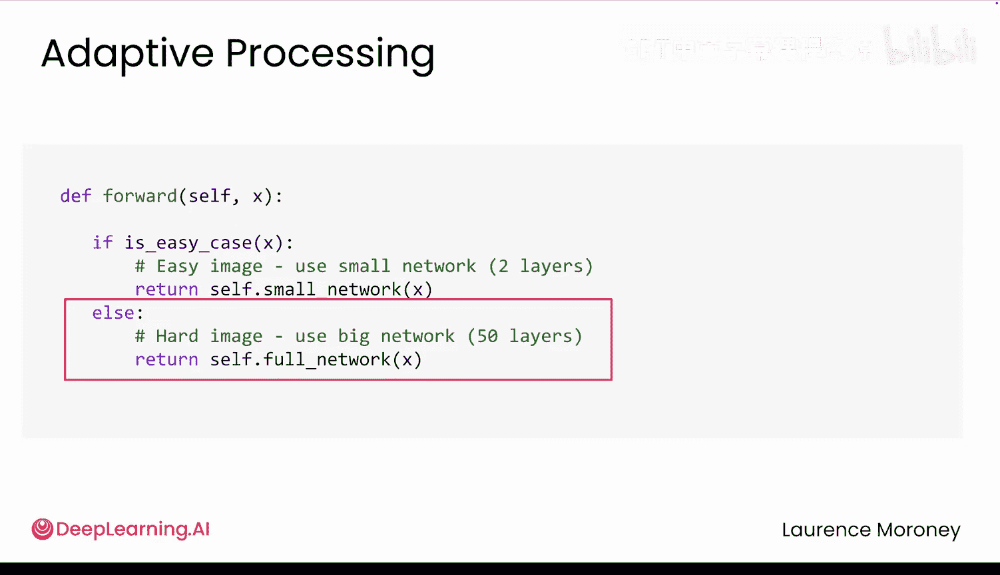

# 025：动态计算图 🧠

在本节课中，我们将要学习PyTorch框架的核心特性之一：动态计算图。我们将了解它与传统静态计算图的区别，以及这种动态性如何赋予我们构建更灵活、更强大模型的自由。

## 概述

欢迎回来。你刚刚为植物园应用训练了第一个卷积神经网络。但让我们更仔细地观察一下。它的结构是完全线性的。数据直接流过。它包含三个卷积、ReLU和池化层块，然后被展平并通过几个全连接层，最终输出预测。这是一个坚实的起点。但到目前为止，它只是一堆层的堆叠。它看起来有些重复，并且没有真正展示出PyTorch的特殊之处。

在PyTorch中，你并不被锁定在那种僵化的模型结构中。它通过一种称为**动态计算图**的机制来实现这一点，该图在你的模型逐步运行时构建而成。

正如你在模块1中听到的，旧框架的工作方式不同。你必须在任何数据通过之前，提前定义好你的计算图。这实际上意味着什么？什么是计算图？是什么让PyTorch的动态方法如此强大？让我们来仔细看看。

## 从顺序模型到计算图

让我们从一个使用 `nn.Sequential` 定义的模型开始。该模型按顺序将你的数据通过每一层，正如你所期望的那样。每一层都转换输入并将其传递下去。它简单、可读，对于简单的架构是有效的。

但这里有一个问题：`nn.Sequential` 将你锁定在一个固定的结构中。它不支持循环、条件判断或其他类型的分支逻辑。实际上，这种代码与你在使用静态图的旧框架中构建模型的方式并没有太大不同。

为了理解原因，让我们更深入地看看计算图到底是什么。

## 什么是计算图？

当你编写这个顺序块时，你正在定义一个特定的数学方程。`Conv2D` 可能指定了成千上万的乘法和加法运算。`ReLU` 将任何负值归零。当它们链式连接时，你得到一个巨大的方程。现在，想象一下把这个方程一步一步地详细展开：乘以这个，加上那个，将结果归零，再乘以，加上偏置，如此反复无数次。这个逐步分解的过程，就是一个**计算图**。你应用的每一个操作都被记录为该图的一部分。

为什么需要这个图？在训练期间，所有深度学习框架都需要使用微积分中的链式法则沿着图反向传播。这就是它如何计算出如何调整每一个参数的方法。而旧框架处理这一点的方式与PyTorch现在的方式不同。

## 静态图 vs. 动态图

在旧框架中，你必须在任何程序运行之前，预先定义整个图：每一个操作，每一个连接。一旦定义，结构就被锁定了。当你在PyTorch中使用 `nn.Sequential` 时，你面临着类似的限制。一切都按固定顺序运行，你不能打印中间值来调试，没有条件判断，没有循环。每个输入都遵循相同的路径，没有例外。这就是为什么 `nn.Sequential` 感觉有点像静态图编程：你又回到了定义那个没有灵活性的固定方程。

你可能会想，为什么会有人想以这种方式工作？事实证明，当框架提前知道完整的计算图时，它可以为了速度和内存效率而优化它。但代价是你放弃了灵活性，因为你描述的是一个固定的方程，没有空间在运行时调整事物或探索意想不到的想法。而这正是PyTorch旨在改变的地方。

## PyTorch的动态图优势

让我们看一个例子。想象你正在为你的植物园应用构建一个CNN，但现在你希望它处理花朵和处理蝴蝶的方式不同。在PyTorch中，你可以直接在 `forward` 方法中编写这种逻辑。在使用静态图的旧框架中，这种控制非常、非常困难。是的，它们允许你有条件判断，但只能通过预先构建所有可能的路径来实现。

PyTorch采取了不同的方法。那个 `if` 语句不仅仅控制逻辑，它还**塑造了图本身**。每次 `forward` 运行时，PyTorch都会精确记录发生了什么：每一次乘法、加法、层和分支。结果是一个根据你的数据实际路径即时构建的定制计算图。该图用于反向传播，以便参数得到更新，然后图被丢弃。下次 `forward` 运行时，PyTorch从头开始，构建一个全新的图，为那次运行量身定制，即使它遵循完全不同的路径。

这就是核心区别。静态框架让你像编译器一样思考，但PyTorch让你像Python程序员一样思考：编写逻辑、分支、即时适应。

这种灵活性来自于使用 `nn.Module` 而不是 `nn.Sequential`。`__init__` 定义我们的模型，而 `forward` 允许我们定义动态图的流程。

## 动态图的实际应用与权衡

现在，这些动态图确实会带来一些小的性能权衡。但对于研究人员和开发者来说，这种灵活性意味着更快的迭代、更容易的调试和更具表现力的模型。这不仅仅是一个好主意，它解决了你实际会遇到的问题。

以下是动态图解决的一些实际问题：

*   **可变长度输入**：静态图通常要求所有输入具有相同的形状。但如果你处理句子，有些句子有3个词，有些很长的句子有50个词怎么办？在PyTorch中，这可以直接工作。
*   **轻松调试**：如果你需要在计算过程中调试某些东西，在静态框架中，这意味着切换到特殊的调试模式，不允许中断流程。在PyTorch中，这只是Python。如果需要调查问题，只需添加一个 `print` 语句。
*   **自适应模型**：你甚至可以构建适应输入的模型，例如对简单情况运行更简单的模型，对复杂情况运行更复杂的模型。你的模型会对其自身的计算变得“智能”。

这些并非边缘情况，这就是现代AI在PyTorch中的工作方式。所有这些都是通过编写Python代码实现的。

## 总结

本节课中，我们一起学习了PyTorch动态计算图的核心概念。我们了解到：

*   **计算图**是模型运算的逐步记录，用于反向传播。
*   **静态图**需要预先定义所有操作，结构固定，优化好但缺乏灵活性。
*   **动态图**在运行时即时构建，允许使用Python原生的条件、循环和分支逻辑，提供了极大的灵活性。
*   使用 `nn.Module` 和自定义 `forward` 方法是实现动态图的关键。
*   动态图虽然可能带来轻微性能开销，但它为快速实验、调试和构建复杂、自适应模型打开了大门。

这种灵活性非常适合实验，但随着模型的增长，你将需要更好的方式来组织你的代码。这将是我们接下来要探索的内容。