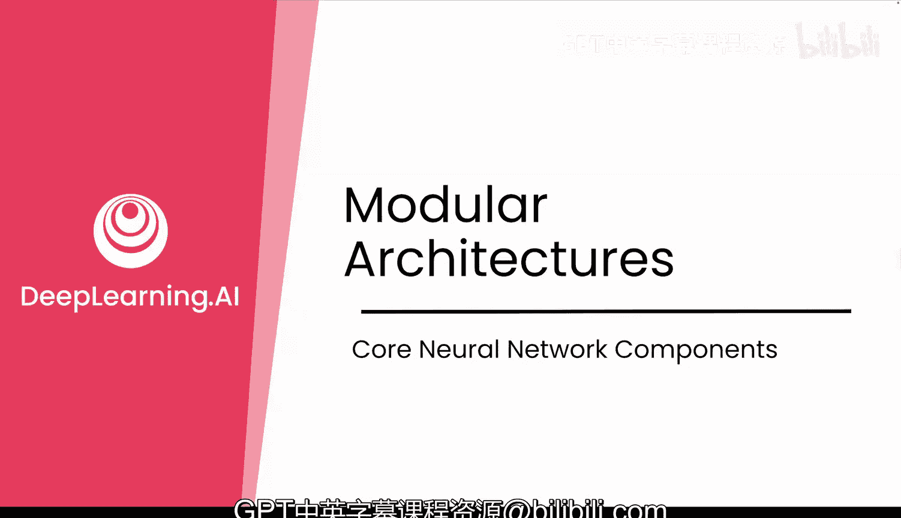
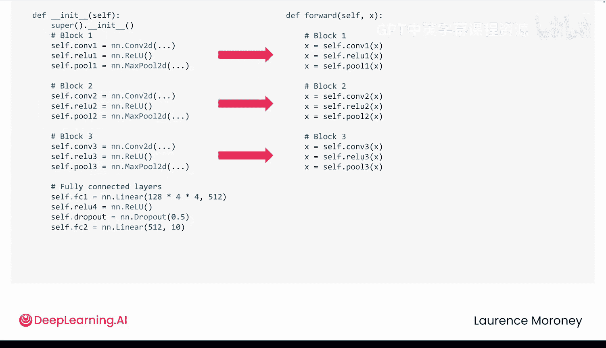
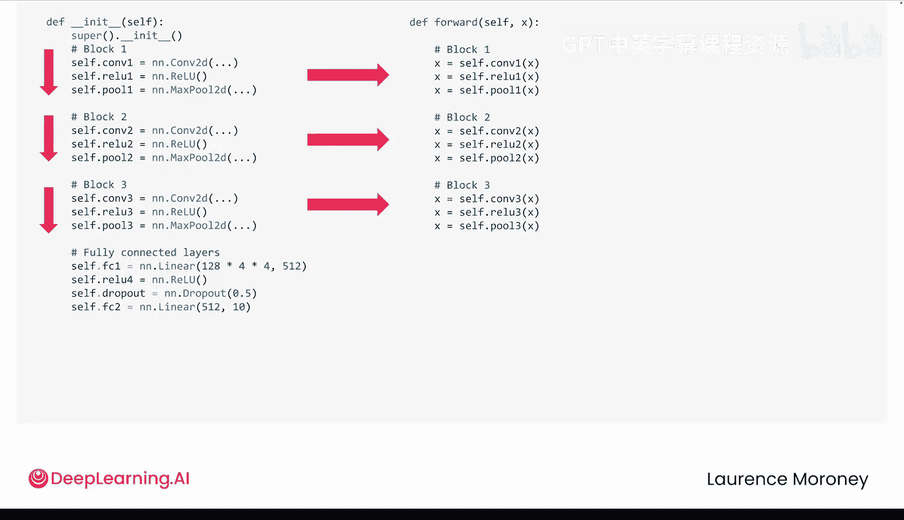
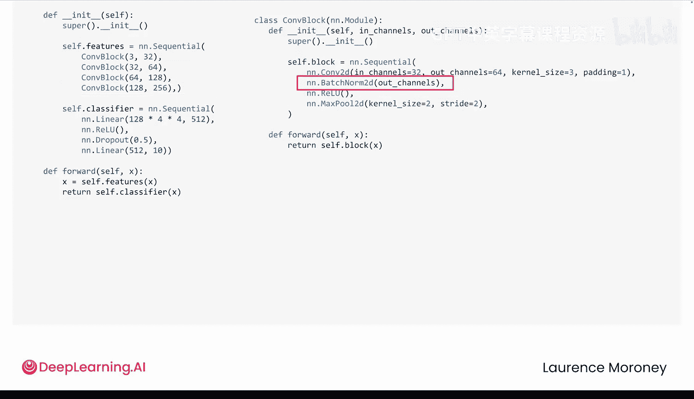

# 026：模块化架构 🧱

在本节课中，我们将要学习如何利用PyTorch的模块化特性来构建更专业、更易于维护的神经网络代码。我们将探讨如何避免代码冗余，以及如何结合使用`nn.Sequential`和自定义模块来创建清晰、可扩展的模型架构。

## 动态图与代码冗余

上一节我们介绍了PyTorch的动态计算图及其带来的灵活性。然而，这种灵活性并未解决构建卷积神经网络（CNN）时出现的代码重复问题。

观察一个典型CNN的`__init__`方法，其中可能定义了9个独立的层。在`forward`方法中，又需要按照完全相同的顺序手动调用这9个操作。这种在`__init__`和`forward`方法之间的重复是冗余的。

这种设计将模型架构的定义（`__init__`）与计算流程的定义（`forward`）分离开来，符合关注点分离的原则。`__init__`中定义的层和可学习参数将在整个训练过程中持续存在，而`forward`方法则定义了动态的计算图流程。但对于一个简单的、顺序执行的模型，这种重复并无必要。






## 引入 `nn.Sequential` 简化代码

当模型结构是固定的线性流程时，我们可以使用`nn.Sequential`来简化代码。`nn.Sequential`可以将按顺序运行的层组合在一起。

**代码示例：使用 `nn.Sequential`**
```python
# 冗余的写法
self.conv1 = nn.Conv2d(...)
self.relu1 = nn.ReLU(...)
self.pool1 = nn.MaxPool2d(...)
# ... 更多层定义

def forward(self, x):
    x = self.relu1(self.conv1(x))
    x = self.pool1(x)
    # ... 更多手动调用

# 使用 nn.Sequential 的简洁写法
self.features = nn.Sequential(
    nn.Conv2d(...),
    nn.ReLU(...),
    nn.MaxPool2d(...),
    # ... 更多层
)

def forward(self, x):
    x = self.features(x) # 只需一行调用
```




使用`nn.Sequential`后，`forward`方法变得非常简洁。当需要修改模型，例如添加第四个卷积块时，只需在`__init__`中更新`Sequential`即可，无需再修改`forward`方法，从而避免了命名冲突和遗漏调用层等错误。

## 模块化设计：创建自定义块

虽然`nn.Sequential`很方便，但它强制一个固定的线性路径，不支持条件分支、循环或动态行为。好消息是，我们不必在灵活性和简洁性之间二选一。

当模型中存在重复的模式时，例如“卷积 -> 激活函数 -> 池化”多次出现，我们可以将这些层分组，创建自定义的模块块。

**代码示例：创建自定义卷积块**
```python
class ConvBlock(nn.Module):
    def __init__(self, in_channels, out_channels):
        super().__init__()
        self.block = nn.Sequential(
            nn.Conv2d(in_channels, out_channels, kernel_size=3, padding=1),
            nn.ReLU(),
            nn.MaxPool2d(kernel_size=2, stride=2)
        )

    def forward(self, x):
        return self.block(x)
```

现在，主CNN模型可以变得非常清晰：

**代码示例：使用自定义块构建模型**
```python
class MyCNN(nn.Module):
    def __init__(self):
        super().__init__()
        self.features = nn.Sequential(
            ConvBlock(3, 64),   # 块 1
            ConvBlock(64, 128), # 块 2
            ConvBlock(128, 256) # 块 3
        )
        self.classifier = nn.Linear(256, 10)

    def forward(self, x):
        x = self.features(x)
        x = x.view(x.size(0), -1)
        x = self.classifier(x)
        return x
```

这种模块化设计带来了巨大优势：
*   **易于修改**：要添加第四个块，只需在`features`序列中添加一个新的`ConvBlock`。
*   **易于维护**：如果想为所有块添加批归一化（Batch Normalization），只需在`ConvBlock`类中修改一次，所有实例都会自动更新。
*   **可扩展**：你甚至可以嵌套模块，构建清晰、可扩展的架构。

## 工作流程建议

以下是构建模型的一个实用工作流程：

1.  **先明确，后重构**：在构建新模型时，即使代码重复，也先明确写出所有层。这有助于调试和理解模型的具体行为。
2.  **识别模式**：当模型正常工作后，寻找重复的模式或序列。
3.  **进行重构**：将重复的序列用`nn.Sequential`封装，或将可复用的组件提取成自定义模块（如`ConvBlock`）。




这就像先打草稿，再逐步打磨。你并不是因为不懂而写冗余代码，而是为了更有效地理解和调试。

## 总结

本节课中我们一起学习了如何构建模块化的PyTorch模型。我们从手动定义每一层，演进到使用`nn.Sequential`简化顺序结构，最终学会了创建自定义模块来封装重复模式，从而构建出像专业人士一样清晰、模块化的模型。


通过分离架构定义与计算流程，并利用模块化设计，我们能够编写出更易维护、更易扩展且更少错误的代码。在下一节中，我们将探索如何检查和分析这些模型，学习如何查看`Sequential`块内部的结构、可视化模型架构，并确切了解模型正在做什么。