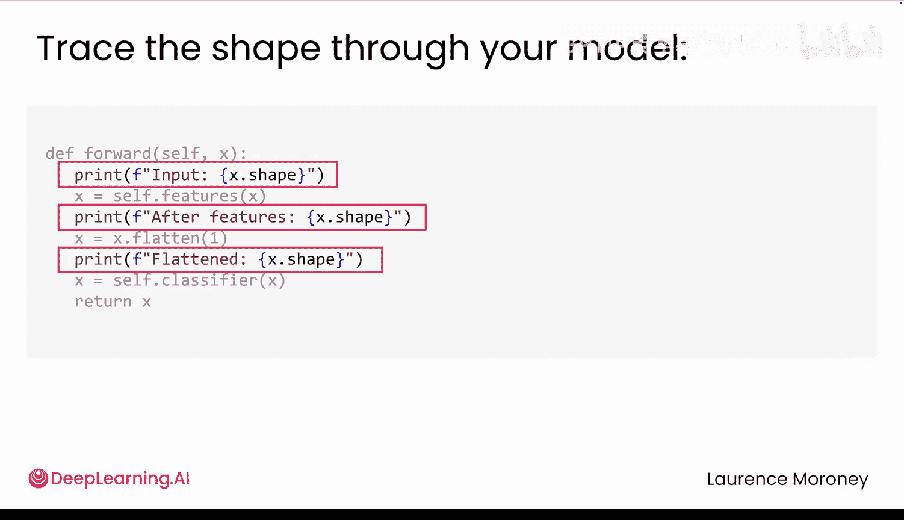
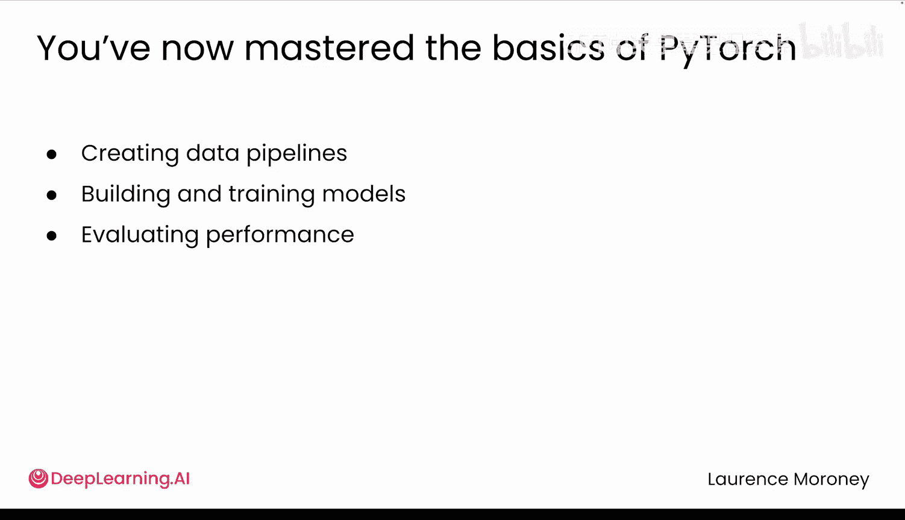
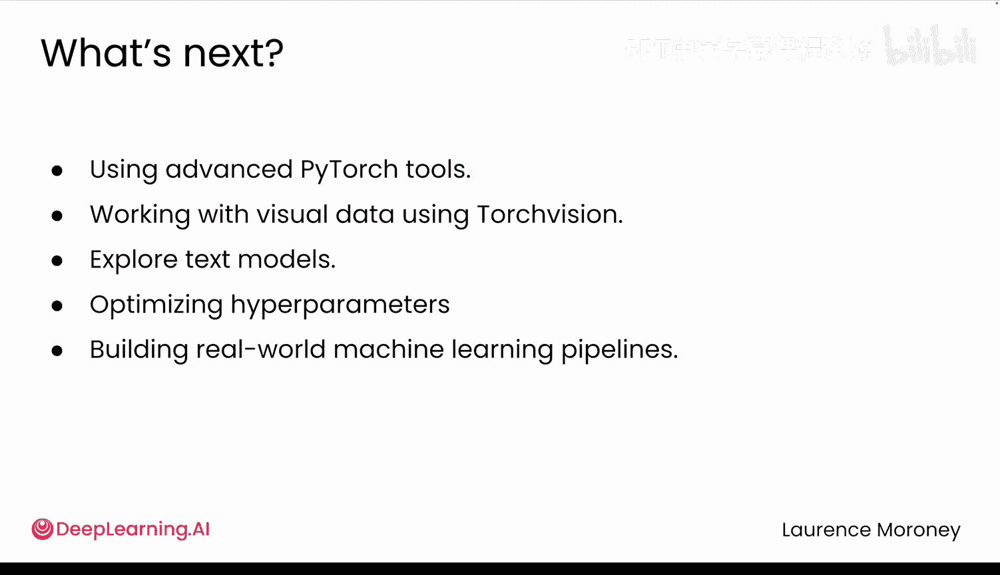

# 027：模型检查与调试 🔍

在本节课中，我们将学习如何检查PyTorch模型的内部结构、统计参数量，并利用这些技巧来调试常见的错误，例如形状不匹配问题。

你已经学会了如何通过坚实的数据管道和性能提升工具来逐层训练卷积神经网络。现在，是时候掌握最后一项技能：检查模型的内部。在本视频中，你将探索用于检查模型结构、统计参数数量以及理解各层如何连接的工具。你还会看到这些工具如何帮助你解决实际问题，比如那些恼人的形状不匹配错误。

## 如何查看模型内部结构？ 🏗️

让我们从一个简单的问题开始：如何查看模型内部？

你的第一反应可能是直接打印它。你会得到类似这样的输出：

```python
print(model)
```

每一行显示了你为层指定的名称（如 `conv1` 或 `fc2`）、层的类型（如 `Conv2D`、`MaxPool2D` 或 `Dropout`）以及关键设置（如输入输出尺寸或卷积核大小）。这完全反映了你在模型中定义的内容，就像PyTorch向你展示你的蓝图，非常适合发现结构错误。


但请注意缺少了什么信息：每一层有多少参数？张量的形状是什么？那些 `Sequential` 块里面到底有什么？


## 统计模型参数数量 📊

要统计参数数量，你可能会尝试：

```python
model.parameters()
```

但得到的不是一个列表，而是一个生成器。你能想到PyTorch在这里使用生成器的原因吗？因为它高效。它不会一次性将所有内容加载到内存中，而是在需要时一次提供一个参数。

要实际看到参数，你需要进行迭代，你会得到这样的形状：

```python
for param in model.parameters():
    print(param.shape)
```

每个形状代表一组参数，通常是来自各层的权重和偏置。

但如果你想要参数的总数，以下是标准方法：

```python
total_params = sum(p.numel() for p in model.parameters())
print(f"总参数量: {total_params}")
```

`.numel()` 方法给出每个张量中的元素数量。将它们全部加起来，你就得到了总参数量。

## 定位参数位置 🔍

很好，但它们具体在哪里呢？要找出答案，你需要逐个查看每一层，这就是 `.named_parameters()` 的用武之地。

```python
for name, param in model.named_parameters():
    print(f"数据科学与人工智能笔记（一）: {param.shape}")
```

这可以逐层精确地显示每组权重和偏置的位置。

为了理解这些形状，让我们以 `fc1.weight` 为例。它连接了2048个输入到512个输出，因此你得到一个形状为 `(512, 2048)` 的权重矩阵。每一行保存一个输出神经元的权重，每个输入对应一个权重。如果你期望它是按输入-输出的顺序，这可能会感觉是反的，但这个形状反映了其目的：每个输出都结合了所有输入的信息。因此，PyTorch围绕输出来组织权重。至于偏置，那就是 `(512,)`，每个输出神经元一个值。

## 检查嵌套模块 🔬

但如果你的模型包含嵌套块，比如 `Sequential` 或自定义模块，如何查看内部呢？

PyTorch为你提供了两个方便的方法：`.children()` 和 `.modules()`。

让我们从 `.children()` 开始。它只显示顶层组件，比如卷积层或全连接层。如果一个块包含其他层（如 `Sequential` 或自定义模块），你将看不到内部内容。

要深入查看，请尝试 `.modules()`。区别是什么？把你的模型想象成一个文件夹结构。`.children()` 只显示顶层文件夹，而 `.modules()` 显示内部的所有内容，包括嵌套在 `Sequential` 或其他自定义块内的层。这在处理模块化架构并希望检查每一层时尤其有用。

## 调试常见错误 🐛

现在，你已经对模型有了全面的了解。但当出现问题时会发生什么？让我们看一个常见的PyTorch错误：

```
RuntimeError: mat1 and mat2 shapes cannot be multiplied (a x b and c x d)
```

这通常意味着线性层的输入与层期望的不匹配。

在实际项目中，大多数人首先检查的是层本身的形状。如果错误发生在 `fc1`，你可以像这样打印它的权重形状：

```python
print(model.fc1.weight.shape)
```

这会给你最快的答案。

但如果你不确定是哪一层导致了问题，或者想一次检查多个层，你可以直接使用 `.named_parameters()`。

例如，`fc1` 期望1024个输入，但你的模型传入了2048。为什么会不匹配？为了追踪模型中的形状变化，可以尝试在 `forward` 传递过程中打印形状。

```python
def forward(self, x):
    print(f"输入形状: {x.shape}")
    x = self.features(x)
    print(f"特征块输出形状: {x.shape}")
    x = torch.flatten(x, 1)
    print(f"展平后形状: {x.shape}")
    x = self.fc1(x)
    return x
```

现在你可以看到特征块产生的形状，以及展平操作是否按预期工作。通过结合模型检查（`fc1` 期望什么）和形状追踪（它实际得到了什么），你可以快速定位问题出在哪里。






这就是检查和调试如何协同工作。


## 总结 📝

本节课中，我们一起学习了如何深入检查PyTorch模型。我们掌握了查看模型结构蓝图、统计总参数量以及定位特定层参数的方法。我们还探讨了 `.children()` 与 `.modules()` 的区别，用于检查嵌套模块。最后，我们应用这些检查技巧来调试形状不匹配等常见错误，通过在 `forward` 函数中追踪张量形状来定位问题根源。

至此，你已完成了本课程的学习。从预测送达时间的单个神经元到卷积神经网络，你已取得了长足的进步。你在PyTorch中打下了坚实的基础，包括创建数据管道、构建和训练模型、评估性能以及检查底层运行情况。



在下一课程中，你将开始使用PyTorch生态系统更高级的工具进行构建。你将使用 `torchvision` 处理视觉数据，探索文本模型，优化超参数，并构建更快、更灵活、更接近真实世界机器学习的训练流程。这正是坚实基础转化为强大能力的地方。期待在那里见到你！