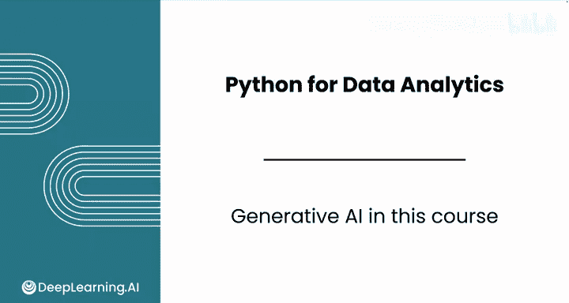
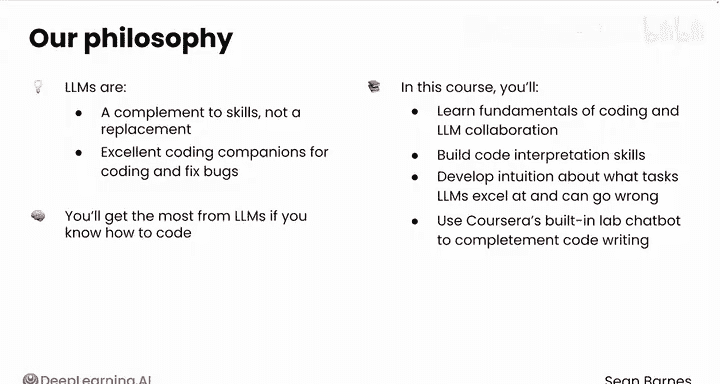
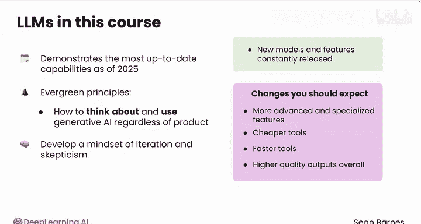
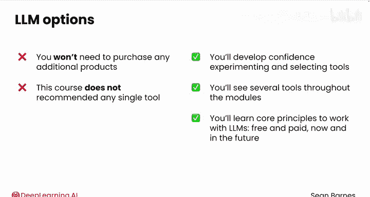

# 002：生成式AI在本课程中的角色 🤖

在本节课中，我们将探讨生成式人工智能（特别是大型语言模型）如何作为数据分析师的核心技能补充，并学习如何有效地将其与编程工作相结合。

---

## 概述

本课程的一个关键要素是学习如何与生成式AI，特别是大型语言模型（LLMs）协同编程。有效使用LLMs将帮助你提升工作效率并在职场中脱颖而出。

---

## LLMs：数据分析师的编程伙伴

上一节我们提到了本课程的核心要素。本节中，我们来看看大型语言模型（LLMs）的具体角色。LLMs如ChatGPT、Claude、Gemini等，是数据分析师技能的**补充**，而非**替代品**。

它们是一个优秀的编程伙伴，可以帮助你编写代码和修复错误。然而，只有在你自身懂得如何编程时，才能最大化利用LLM的价值。

在本课程中，你将学习编程基础以及如何与LLM协作。你将构建代码解读能力，并培养对LLM擅长任务及其可能出错之处的直觉。

你还将使用Coursera平台内置的实验聊天机器人来辅助你的代码编写。

---

## 课程的前瞻性与核心原则

本课程展示了截至2025年初的最新功能，我们预计在未来数月和数年内会有变化。

本课程旨在传授**永恒的原则**：即如何在工作中思考和使用生成式AI，无论你使用哪种具体产品。你将培养一种**迭代和怀疑的思维模式**。

新的模型和功能不断发布，以下是你近期可能看到的一些变化：

以下是未来LLMs可能的发展方向：
*   更先进、更专业的生成式AI工具。
*   更便宜的工具。
*   更快的工具。
*   整体更高质量的输出。

跟上这个领域的快速发展具有挑战性，但无需担心。在本课程中，你将发展所需的元认知技能，以在工作中驾驭这些技术进步。

---

## 关于工具与费用的说明

本课程也展示了一些LLM的付费功能，但**你无需购买任何额外产品即可完成作业**。

让你了解现有的选项（包括付费选项）非常重要，这样你才能有信心去尝试并为你的数据分析工作选择最佳工具。

本课程不推荐任何单一工具，你将在各个模块中看到多种工具。

请记住，你将学到的核心原则将使你准备好与现在及未来的LLMs（无论是免费还是付费的）协同工作。

---

## 总结

本节课中，我们一起学习了生成式AI（特别是大型语言模型）在本课程中的定位。我们明确了LLMs是技能的补充而非替代，了解了课程的前瞻性设计及其传授的核心思维原则，并对工具的选择和费用有了清晰的认识。

你将在接下来的几个视频中首次接触到LLM的演示。现在，请与我一起进入下一个视频，了解本模块所有令人兴奋的主题。我们那里见。