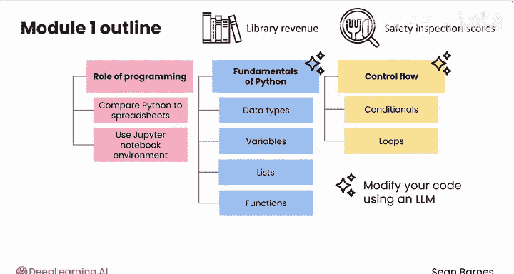
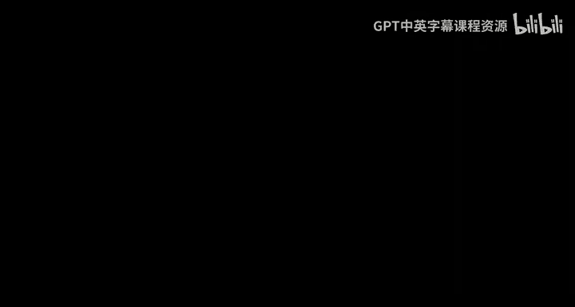

# 003：Python数据分析基础 🐍

在本课程中，我们将学习Python编程的基础知识，并探索它如何使数据分析工作流程更高效、更有效。

## 概述

欢迎来到模块1：数据分析编程基础。在本模块中，我们将探索激动人心的Python编程世界，并了解它如何提升数据分析的效率。整个模块中，我们将使用真实世界的示例进行实践，包括公共图书馆收入和餐厅安全检查分数。这种实践方法将帮助我们理解这些编程概念如何直接应用于数据分析任务。我们还将对比使用编程方法与基于电子表格的方法有何异同。

上一节我们介绍了本模块的整体目标，本节中我们来看看课程的具体安排。

## 课程内容安排

以下是本模块三个课程的核心内容简介：

*   **课程1：编程与数据分析的角色**
    我们将学习编程在数据分析中的作用，包括Python为何如此强大，以及它与电子表格的对比。我们还将立即开始使用Jupyter Notebook环境，编写和运行代码。

*   **课程2：Python基础**
    我们将学习不同的数据类型、如何将信息存储在变量中，以及如何使用列表。我们还将涵盖基本的编程工具，例如运行函数来对数据执行计算。在本课程结束时，我们将能够编写第一个Python程序来操作数据。

*   **课程3：控制流核心概念**
    我们将学习控制流这一核心概念，即决定程序如何运行的逻辑。我们将学习如何使用条件语句在代码中做出分支决策，以及如何使用循环在Python中重复执行操作。

## 关于编程方法的说明

在Python中，通常有多种方法可以完成一项任务。虽然视频中展示的通常是解决问题最直接的途径，但随着编程经验的增加，我们会发现更多的解决方案。我们还将探索使用大型语言模型来辅助修改代码的方法。

编程既充满挑战，又回报丰厚。请跟随我进入第一课，学习编程在数据分析工作流程中的角色。

## 总结

本节课中，我们一起学习了《Python数据分析》第一模块的课程概述。我们明确了本模块的学习目标，即掌握Python编程基础以服务于数据分析。我们预览了三个核心课程的内容：编程的角色、Python基础语法以及控制流概念。最后，我们了解到编程解决问题的方法具有多样性，并鼓励大家开始实践之旅。