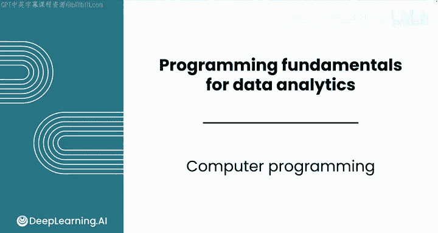
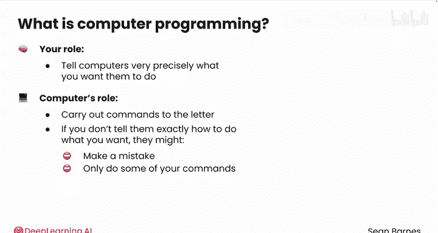
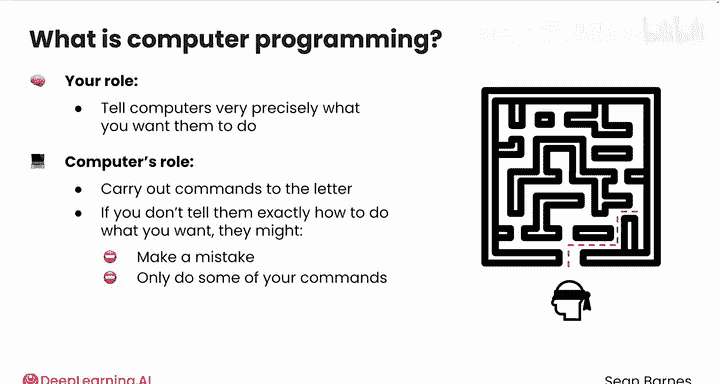
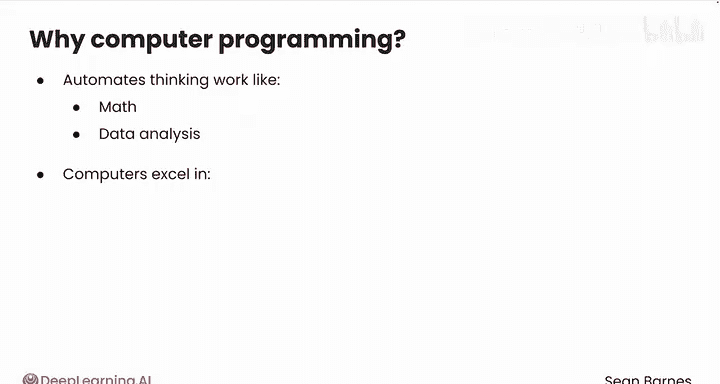
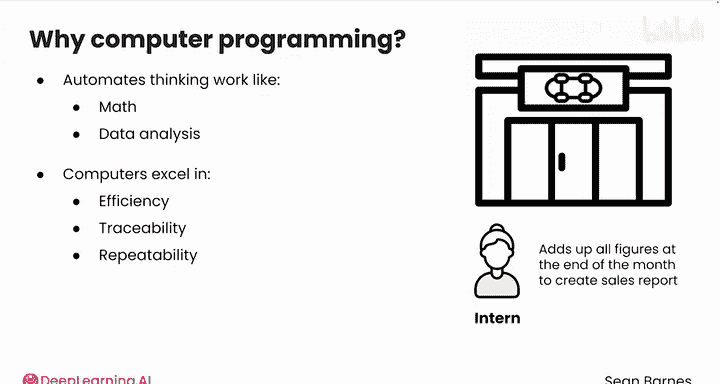
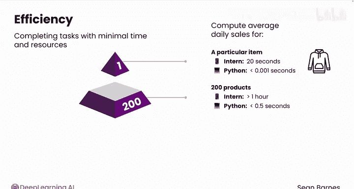
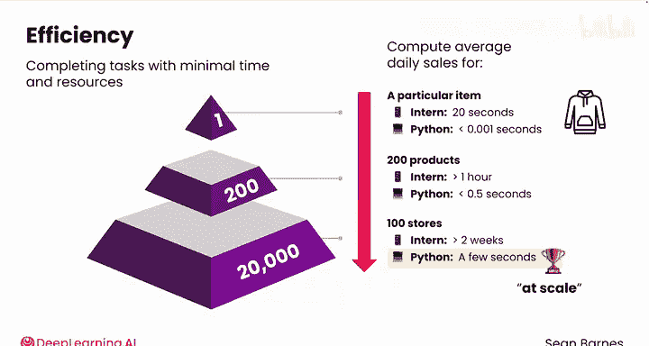
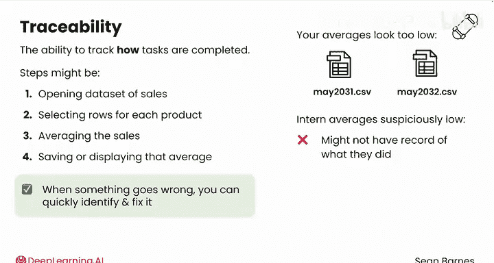
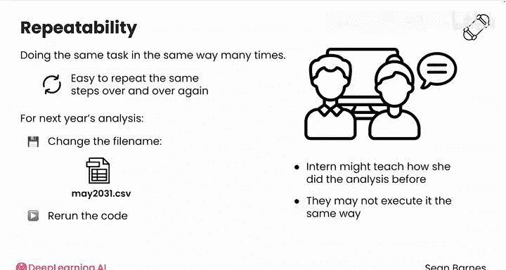
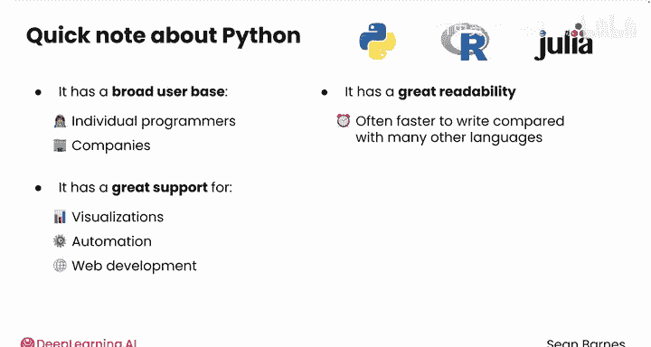

# 004：计算机编程 🖥️

在本节课中，我们将要学习计算机编程的基本概念，了解编程如何帮助我们高效、可追溯且可重复地完成数据分析任务，并探讨为什么Python是数据分析领域的首选语言。

## 什么是计算机编程？

计算机编程意味着通过一系列精确的指令，让计算机按照你的意愿执行任务。你的角色是使用计算机能理解的语言（如Python），非常精确地告诉它你想要做什么。计算机的角色则是严格地执行这些命令。

如果你没有准确地告诉计算机如何完成你的要求，它可能会出错或只执行部分指令。这有点像引导一个被蒙住眼睛的人通过障碍赛道。你需要精确地告诉他们该做什么、在哪里转弯、走多远，因为他们无法自己避开障碍。如果他们摔倒了，那就是你的责任。

## 编程在数据分析中的优势

上一节我们介绍了编程的基本概念，本节中我们来看看编程相较于其他分析工具（如人工手动计算）的优势。计算机在效率、可追溯性和可重复性方面表现出色。

假设你正在与一家滑板店合作分析其销售数据。通常，一位实习生会在月底汇总所有数据。

以下是编程带来的三大核心优势：

### 1. 效率

效率是指以最少的时间和资源完成任务。假设你需要计算某件产品（如连帽衫）的平均日销售额。

*   **人工方式**：你的实习生用手机计算这个统计数据需要20秒。
*   **编程方式**：Python完成同样的任务可能只需要不到千分之一秒。

这看起来差别不大，但如果你有200件库存产品：
*   你的实习生将花费超过一小时来计算平均日销售额。
*   Python可以在不到半秒内完成。

如果你需要计算100家门店的销售额：
*   你的实习生将花费超过两周的时间来累加数字。
*   Python可能只需要几秒钟。

你可以看到，随着任务规模（即“规模”）的扩大，Python的优势会急剧增长。速度本身就很有价值，但当你处理数百万笔销售数据时，这种优势使得分析成为可能。

### 2. 可追溯性

可追溯性是指追踪任务完成过程的能力。编程过程涉及定义完成任务所需的每个步骤。

对于滑板店的分析，这些步骤可能是：
1.  打开销售数据文件。
2.  为每个产品筛选数据行。
3.  计算销售额的平均值。
4.  保存或显示该平均值。

你对每个步骤应如何工作都有预期。因此，当出现问题时，你可以快速识别并修复它。

例如，如果你的平均值看起来太低，你可以检查第一步，发现它错误地引用了去年的数据（使用了`May_2031.csv`而不是`May_2032.csv`）。你可以快速更改文件名并重新运行代码。

相比之下，如果你的实习生计算的数字看起来可疑地低，可能需要一段时间才能找出原因。除非你当时就在旁边看着，否则你可能没有任何关于他们做了什么操作的记录。你可能不得不重新进行整个分析。

可追溯性通过创建清晰的步骤记录来节省时间并减少错误。

### 3. 可重复性

可重复性是指以相同的方式多次执行同一任务。编程语言使重复任务变得容易。它们不会感到无聊或疲倦，并且只需进行少量修改，你就可以调整代码来完成相关任务，例如计算年平均销售额或绘制销售图表。

例如，假设你在滑板店进行下一年的分析。如果你的数据格式相同，你只需在代码中将文件名更改为`May_2033.csv`并重新运行代码即可。就这么简单。

与此同时，你的实习生可能需要先教新来的同事她之前是如何进行分析的，而新同事的执行方式可能并不相同。手动流程容易因执行者的不同而产生差异和理解偏差。

## 为什么选择Python？

Python并非唯一的编程语言。在数据分析领域，你通常还会看到R或Julia等语言。

Python是数据分析师入门的绝佳语言，原因如下：

*   **广泛的用户基础**：无论是个人程序员还是使用它的公司，Python都拥有庞大的用户群，是行业标准。
*   **出色的可读性**：与许多其他语言相比，用Python编写等效程序通常更快。
*   **强大的功能支持**：Python在数据可视化、自动化、Web开发等许多领域都有出色的支持。你可以将Python技能用于多种类型的任务。
*   **优秀的技术特性**：Python拥有一些出色的技术特性，你将在后续模块中学习到。

因此，Python是数据分析领域的杰出选择。

## 总结

本节课中我们一起学习了计算机编程的核心概念。我们了解到，编程是通过精确指令指挥计算机完成任务的过程。在数据分析中，编程相较于人工方式，在**效率**、**可追溯性**和**可重复性**方面具有显著优势。最后，我们探讨了**Python**因其广泛的用户基础、出色的可读性和强大的功能支持，成为数据分析领域的首选语言。

在下一个视频中，你将看到用于处理数据的主要Python工作环境。我们下节课见。