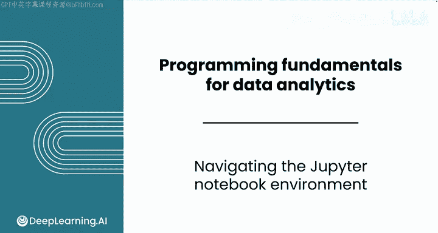
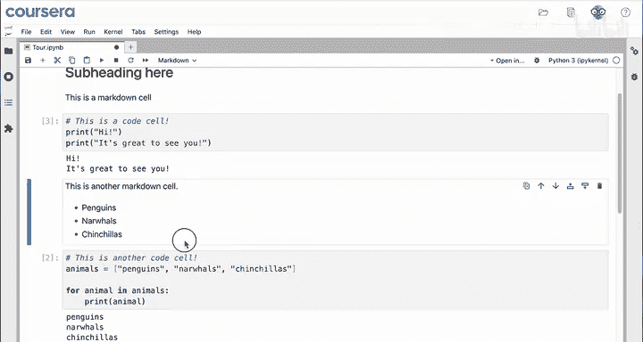
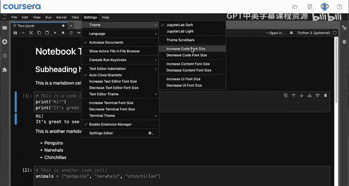
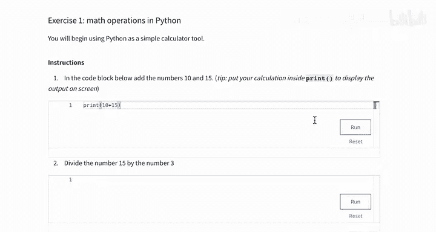

# 005：Jupyter Notebook环境导航 🧭

在本节课中，我们将学习Jupyter Notebook界面的基本操作。Jupyter Notebook是数据分析师日常使用的行业标准工具，我们将了解其核心组成部分和基本功能。

## 界面概览

这是您在Coursera平台上将使用的Jupyter Notebook界面，也是您完成本课程实验的地方。它本质上是一种特殊的文本编辑器。

您可以看到它与Google Docs的相似之处：左上角是文件名，顶部功能区有一系列选项，主区域则是您可以编辑文本和代码的地方。

## 认识单元格

Notebook本身是一个文本文档，其不同的区域被称为**单元格**。单元格允许您将Notebook划分为不同的部分。

以下是单元格的两种主要类型：

*   **文本单元格**：这类单元格允许您编写一种名为Markdown的格式化文本。双击单元格即可编辑原始的Markdown。例如，您可以在此处添加一个子标题。虽然编写Markdown不是本课程的重点，但它能让您为代码提供格式美观的上下文说明。按下 `Shift + Enter` 可以渲染或显示格式化后的Markdown。您将在本课程的所有实验中都看到Markdown。
*   **代码单元格**：这类单元格用于编写和运行代码。运行代码单元格将执行其中的代码。

## 运行代码与常用操作

运行一个代码单元格将执行其中的命令。例如，运行 `print("Hi, it's great to see you!")` 这行代码。

`Shift + Enter` 是运行代码单元格的快捷键，这是Jupyter Notebook中最重要的命令，您需要记住它。代码的输出会直接显示在刚刚运行的单元格下方。

您也可以点击工具栏上的“运行”按钮来执行代码。

以下是其他一些有用的操作：

*   如果您的代码运行时间过长需要中断，可以按下“停止”按钮。
*   如果您想从头开始，可以点击“重启”按钮，这将把所有内容重置到您运行任何代码之前的状态。
*   “+”按钮允许您添加一个新的单元格。您可以在任何练习或评分实验中添加新单元格来进行实验。

## 单元格顺序与界面设置

每个单元格侧边的数字表示您运行它们的顺序，这有助于您跟踪代码的执行进度。如果您再次运行一个单元格，这个数字会改变。

查看顶部的功能区，您不需要使用大多数选项。但有一个有用的选项是“编辑”->“清除所有单元格的输出”。有时输出会很长，您可能希望清理您的Notebook。

在设置中，如果您想感觉像个酷炫的黑客，可以切换到深色主题。在主题菜单下，您可以增大代码或Markdown文本的字体大小。

## 理解内核

请注意“内核”菜单。Notebook基本上是一个包含您给计算机命令的大文本文件，它本身并不运行这些命令。为此，您需要**内核**。

内核本质上是Notebook的引擎，它是您计算机中实际接收并运行命令的部分。您不需要担心这些内核选项，但了解内核是什么是有帮助的。

## 辅助工具：Coursera Coach

在Notebook上方，您会看到“Coursera Coach”选项，这是一个内置的LLM聊天机器人，您可以在编码时随时访问它。您也将在视频中看到它的实际应用。

例如，如果您询问“Python是什么？”，教练会给出回答。如果您关闭聊天窗口后重新打开，您的聊天历史将被保存，因此您不必担心保持会话，稍后可以随时参考。

## 课程配套资源与实践

以上所有操作都在Coursera平台内进行。本课程的下一个项目是一个练习实验，其中包含了本模块所有讲座中演示的Notebook。您可以用它们来跟随视频学习，或在之后参考代码。

许多初学者发现自己在电脑上设置Jupyter Notebook具有挑战性。目前，您将只在Coursera平台上使用Jupyter Notebook。在本课程的最后一个模块中，您将学习一些在个人电脑上设置Notebook的选项。

本课程还包括一些阅读项目，让您可以练习编码技能。这些是可选的，但我鼓励您完成它们，特别是如果您是编码新手。

每个代码块都类似于Jupyter Notebook中的一个单元格，您可以在其中编写代码并运行。完成练习并运行代码块以获得一些反馈。

## 总结

本节课中，我们一起学习了Jupyter Notebook界面的核心组成部分和基本操作，包括识别和操作文本与代码单元格、运行代码的快捷键、管理单元格输出、理解内核的作用，以及如何利用Coursera Coach辅助学习。您还了解了本课程提供的配套练习资源。接下来，让我们进入下一个视频，观看一些实际的代码示例。