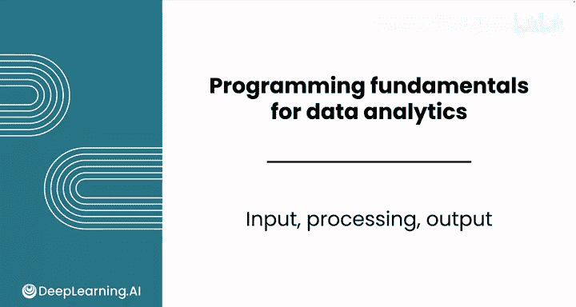
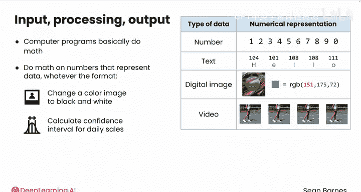
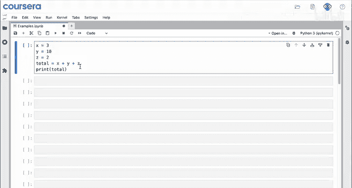
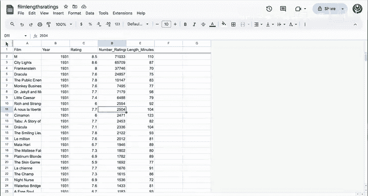
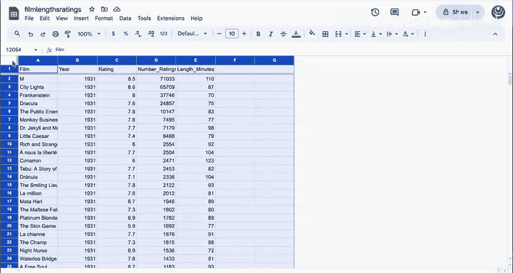
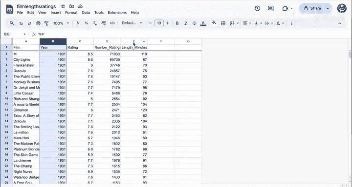
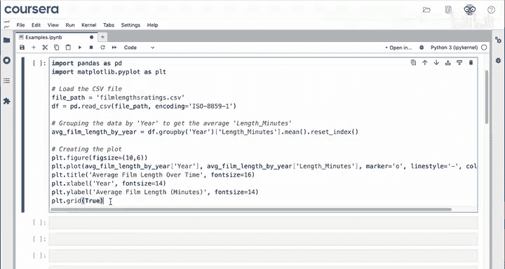
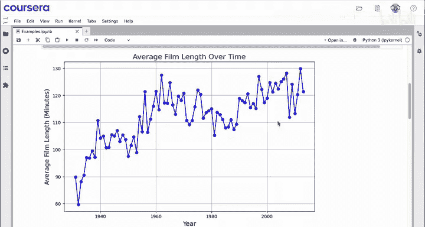
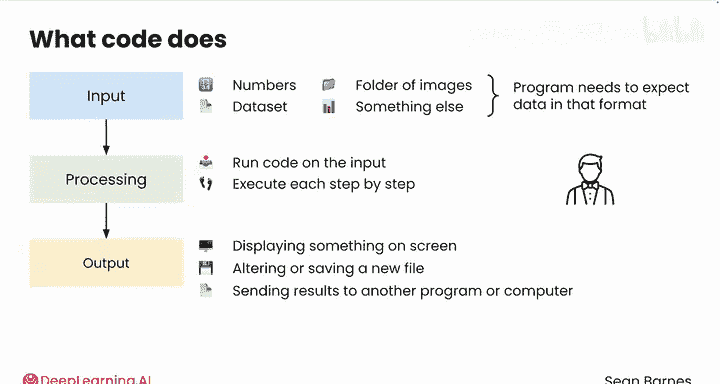

# 006：输入-处理-输出模型 🧩

在本节课中，我们将要学习编程的核心模型——输入-处理-输出模型。这个模型是理解计算机程序如何工作的基础，它将帮助我们拆解任何复杂的程序，将其简化为三个基本步骤。

## 概述：程序的神秘面纱



编程语言的功能可能显得很神秘。你可以将一个计算机程序看作是一系列**输入**、**处理**和**输出**的序列。

计算机程序本质上是在进行数学运算。值得庆幸的是，你的Python代码不会只是一堆数学符号。它看起来更像是英语和数学的混合体，这对你来说很方便。但在底层，发生的正是数学运算。


事实证明，在计算机中，**每一种类型的数据都可以用数字来表示**。
*   如果你处理的是数字，它们本身就是数字。
*   如果你处理的是文本，每个字符可以用一个数字来代表。
*   在一张数字图像中，每个像素的颜色是一个代表红、绿、蓝显示量的数字。
*   视频只是一连串的图像，加上一些额外信息，以此类推。

从根本上说，计算机所做的，就是对代表你数据的数字进行数学运算，无论数据是什么格式。数学支撑着许多复杂而精彩的操作，例如将彩色图像转换为黑白图像、计算每日滑板销售额的置信区间，或者判断一条Yelp评论是正面还是负面的。



## 拆解模型：输入、处理、输出

将上述过程分解，代码会接收某种信息，通过进行一些数学运算来处理它，然后输出新的信息。这就是**输入、处理、输出**。


上一节我们介绍了模型的基本概念，本节中我们来看看几个具体的代码示例。

### 示例一：简单的数字相加

假设你想将几个数字相加。以下是一个实现此功能的程序。

```python
# 输入：三个数字
num1 = 3
num2 = 10
num3 = 2

# 处理：将它们相加
total = num1 + num2 + num3





# 输出：显示结果
print(total)
```

*   **输入**是数字3、10和2。
*   **处理**涉及将它们相加。
*   当你运行代码时，**输出**是在屏幕上显示结果15。





### 示例二：复杂的数据处理

这是一个你将在后续模块中探索的更复杂的例子。


你可能还记得上一门课程中的这个电影数据集，它包含了不同年份的顶级电影及其时长。


以下是更复杂的代码。现在不必关注代码细节，在本课程结束时你会理解这里的每一行。它的作用是**将整个数据集作为输入**，并通过计算每年的平均电影时长来处理它。





**输出**将是一个图表，可视化展示这些数据。运行代码后，你会得到一个漂亮的折线图，显示过去80年左右电影时长的增长趋势。

## 深入理解每个组件

正如你所想象的，每个组成部分都可能变得相当复杂。

### 关于输入

输入可以直接出现在你的代码中，就像前面看到的三个数字。它也可以是一个数据集、一个图像文件夹或其他东西。你的程序需要编写成能接收那种格式的数据。

### 关于处理

处理步骤在你对输入运行代码时发生。你为计算机编写了一些命令，一旦运行这些命令，计算机就会一步一步地执行它们。处理过程可能显得很神秘，它发生在你的视野之外，就像魔术师在一阵烟雾中消失，片刻后又以不同的装束出现在电影中一样。在刚才的电影例子中，你实际上从未看到电影数据本身。你编写越多的代码，就会对这种幕后的数学运算越熟悉。

### 关于输出

输出可以是在屏幕上显示某些内容，如前面的例子所示。它也可以是修改或保存一个新文件，或者将结果发送到另一个程序或另一台计算机。有时你运行一个程序，似乎什么都没有发生。计算机正在遵循你的命令，但可能只是这些命令都不涉及在屏幕上显示内容。




## 总结与预告

本节课中我们一起学习了编程的**输入-处理-输出模型**。我们了解到，所有程序都可以归结为接收数据、处理数据并产生结果这三个核心步骤。通过简单的加法运算和复杂的电影数据分析两个例子，我们看到了这个模型在不同复杂度场景下的应用。

在你开始自己编写代码之前，还有最后一个视频。你已经看到了编程的力量，以及如何在Jupyter笔记本中运行代码来接收输入、处理并给出输出。但是，何时应该编写程序，何时又该使用电子表格呢？请观看下一个视频，了解如何做出选择。