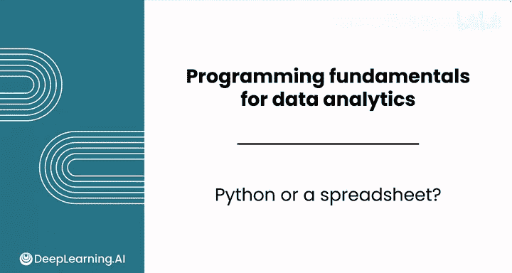
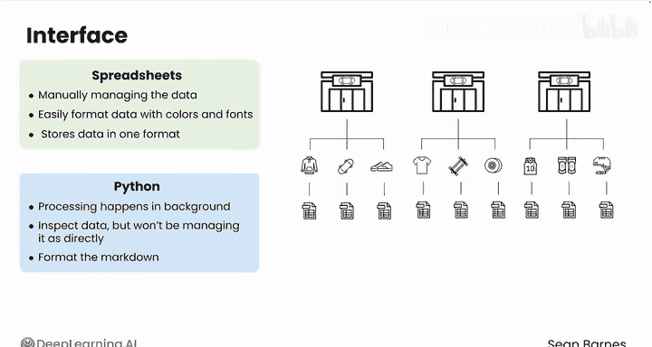
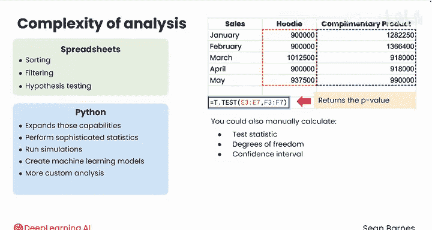
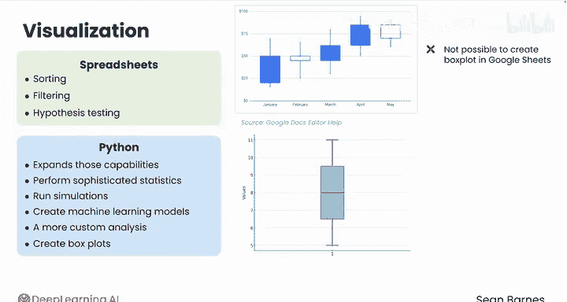
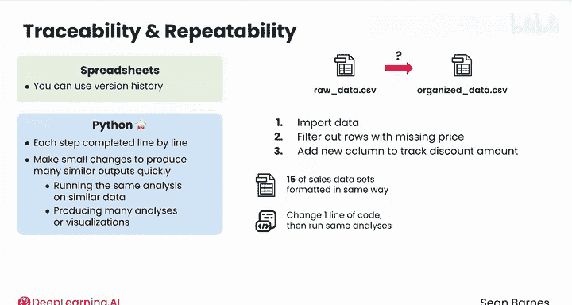
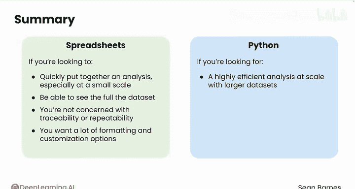

# 007：Python数据分析（第3课）｜Python与电子表格的选择

在本节课中，我们将要学习Python与电子表格（如Excel、Google Sheets）这两种数据分析工具的核心区别。我们将从界面、数据结构、分析能力、可视化、可追溯性与可重复性等多个维度进行比较，帮助你理解在何种场景下应选择何种工具。

## 🖥️ 界面与交互方式

Python与电子表格的一个主要区别在于用户界面。在电子表格中，你需要手动管理所有数据。例如，当你想复制一列数据时，必须选择该列放置的位置，并手动添加对其他单元格的引用。

```python
# 在Python中，数据处理通常在后台进行
df['new_column'] = df['existing_column'] * 2
```

而在使用Python代码时，这类处理通常在后台自动完成。你可以检查数据，但不会像在电子表格中那样直接管理每个单元格。



此外，在电子表格中，你可以轻松地用颜色和字体样式格式化数据，这有助于利益相关者探索数据。在Jupyter Notebook中，你可以使用Markdown进行格式化，但在美化笔记本外观方面的能力相对有限。不过，这两种格式都旨在共享和探索数据，而不仅仅是展示原始数据。

## 🗂️ 数据结构与建模

电子表格本质上以一种特定格式存储数据：即行和列组成的表格。然而，并非所有数据都最适合用这种方式表示。你之前学过，像文本和视频这样的非结构化数据无法整齐地放入行和列中。

另一个例子是处理具有多个层级或层次的信息。假设你拥有几家滑板店，每家店可能销售一系列品牌，而每个品牌又有不同的产品。用电子表格为这种组织结构建模会变得非常复杂，最终你需要多个工作表来模拟这些关系。

## 📈 分析能力与复杂性

电子表格为你提供了许多功能，从排序、筛选到执行假设检验。Python则在这些能力上进行了扩展，使你能够执行更复杂的统计分析、运行模拟甚至创建机器学习模型。

同样，如果你需要进行更自定义的分析，在Python中会更容易。例如，在之前的课程中，你使用Google Sheets中的T检验函数进行了假设检验。该函数返回与检验相关的P值。



```python
# 在Python中，你可以用一行代码执行T检验并获取P值、自由度等
from scipy import stats
t_stat, p_value = stats.ttest_ind(group1, group2)
```

在Python中，你可以用一行代码执行上述每项任务，并为更复杂的场景计算额外的统计量。

## 🎨 数据可视化

Python在可用复杂性方面的优势也适用于可视化。你可能记得，在Google Sheets中无法创建真正的箱线图，考虑到箱线图非常有用，这令人沮丧。

```python
# 在Python中，只需几行代码即可创建箱线图
import matplotlib.pyplot as plt
plt.boxplot([data1, data2, data3])
plt.show()
```

在Python中，你可以用几行代码创建箱线图，还可以自定义绘图的每个方面、应用独特的配色方案，并一次性创建多个绘图。



## 🔍 可追溯性与可重复性



在可追溯性和可重复性方面，Python是更优的选择。如果你想跟踪在电子表格分析中采取的步骤，可以使用版本历史记录，但功能有限。

另一方面，你的Python代码将包含你完成的每一步，一行一行清晰记录。例如，假设你有一个滑板销售的原始数据文件，以及一个包含更有序数据的第二个版本文件。但你究竟做了什么来整理数据？这就像玩“找不同”游戏。

相反，如果你有用Python Notebook清理数据的代码，你可以逐步检查每个步骤，例如，你可能会看到你导入了数据，过滤掉了价格缺失的行，然后添加了一个新列来跟踪促销商品的折扣金额。

Python的可重复性不仅限于重现过去的分析。你还可以进行微小的更改，以快速产生许多类似的输出。这种策略的一些常见用例包括：对相似数据运行相同的分析，或生成许多分析或可视化以找出最佳方案。

例如，如果你正在与一位拥有15个格式相同的销售数据集的店主合作，你只需更改导入数据的那一行代码，然后单击一下即可运行与之前相同的分析。或者，如果你有一个包含20个特征的数据集，你可以通过对同一命令进行微小调整，为每个特征构建95%的置信区间。

## ✅ 总结与选择指南



本节课中，我们一起学习了Python与电子表格在数据分析中的关键区别。为了总结所有这些差异，以下是一些选择指南：

**在以下情况下，电子表格是更好的选择：**
*   你希望快速完成分析，尤其是在小规模情况下。
*   你希望能够看到完整的数据。
*   你对可追溯性或可重复性不太关心。
*   你需要大量的格式化和自定义选项。



**在以下情况下，Python将是更强的选择：**
*   你寻求高效的大规模分析（即处理越来越大的数据集）。
*   你需要进行复杂或自定义的分析或可视化。
*   你需要一个可追溯的过程，以便轻松在不同数据集或特征上重复任务。

到目前为止，你已经了解了Python编程的基础知识，以及首先为什么要使用Python。完成本课的练习评估后，请加入下一节课，开始动手编码。我们下节课见。😊